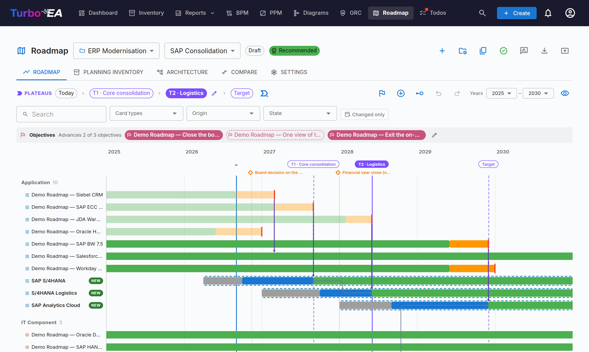
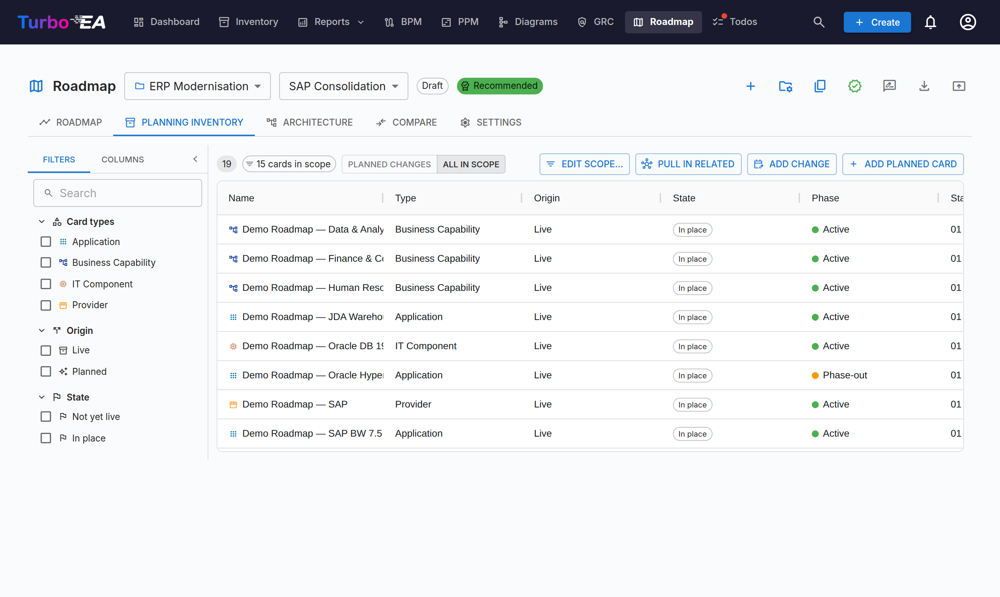
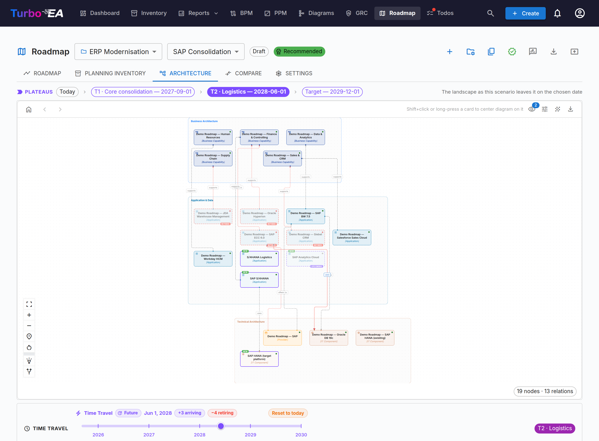
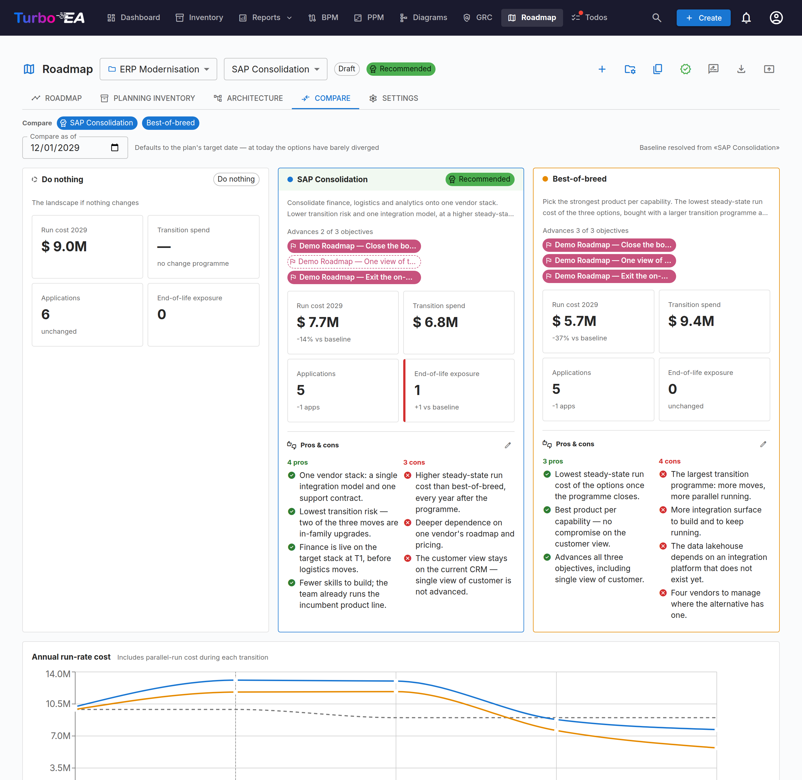
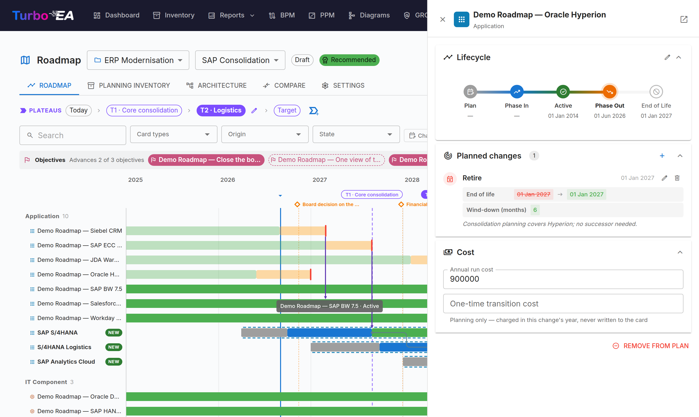
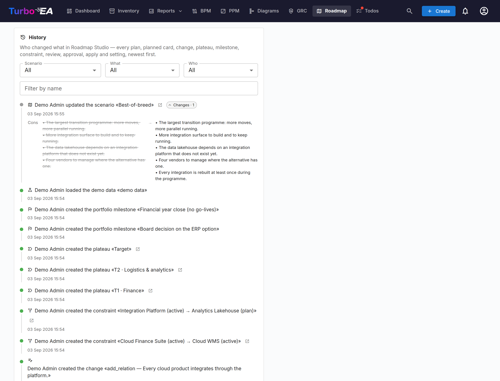
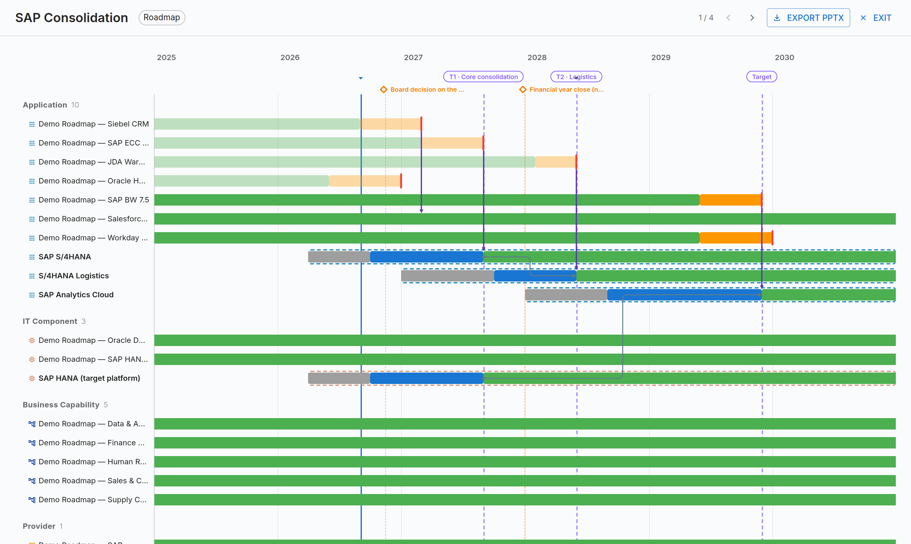

# Roadmap Studio

Toute fonction EA se voit poser les deux mêmes questions par son DSI : *à quoi
ressemblera le paysage dans trois ans*, et *que se passe-t-il si nous choisissons
autrement ?* Les présentations répondent mal à la première et pas du tout à la
seconde — elles sont périmées la semaine suivant le comité de pilotage, et deux
d'entre elles ne se comparent pas.

**Roadmap Studio** répond aux deux à partir de l'inventaire que vous tenez déjà.
Un **scénario** est un plan posé sur votre paysage vivant — retirer ceci,
remplacer cela à cette date, ajouter ces trois choses qui n'existent pas encore
— conservé comme un ensemble de changements plutôt que comme une copie de votre
graphe. Rien de ce que vous explorez ne touche votre inventaire tant qu'un plan
n'est pas approuvé et appliqué, et comme le plan est lu par rapport à ce que
l'inventaire dit aujourd'hui, il ne s'éloigne jamais silencieusement de la
réalité.

## En bref

| | |
|---|---|
| **Licence** | Commerciale — une habilitation signée est nécessaire |
| **Version minimale de Turbo EA** | 2.119.0 |
| **Permissions** | `ext.roadmap-studio.view`, `.manage`, `.apply`, `.admin` |
| **Autorisations d'accès aux données** | Cartes (lecture + écriture), événements de carte, tâches (lecture + écriture), l'annuaire des utilisateurs, les décisions |
| **Redémarrage du backend nécessaire** | Oui — l'extension embarque du code backend |
| **Où elle apparaît** | **Roadmap** dans la navigation principale · une puce sur le détail d'une carte · un panneau et une section d'export sur les décisions |

## Transformations et scénarios

Une **transformation** est le programme auquel appartient un ensemble de plans
concurrents — « Modernisation de l'ERP », par exemple — et elle nomme les
[Objectifs](../guide/reports.md) dont le programme répond. En dessous se
trouvent les **scénarios** : des réponses alternatives à la même question. L'un
d'eux peut être marqué **recommandé**, pour que la salle sache ce que
l'architecte propose avant de lire les chiffres.

Un scénario hors de toute transformation est parfaitement valable ; il n'a
simplement pas d'alternatives face auxquelles être choisi.

## L'inventaire de planification et la roadmap

La **roadmap** dessine le plan sous forme de barres datées dans des couloirs,
avec en dessous une bande de coûts montrant le coût de fonctionnement année par
année — y compris la bosse pendant un fonctionnement en parallèle, précisément le
chiffre qu'un dossier de migration a tendance à masquer.

L'**inventaire de planification** est le même plan sous forme de grille : vos
cartes vivantes plus les cartes planifiées, avec chaque changement les
concernant. Les cartes planifiées vivent dans le scénario et jamais dans votre
inventaire principal.

Un changement dont la carte cible a depuis été archivée, déplacée ou redatée
ailleurs est **signalé obsolète**, avec la raison — ainsi un plan écrit il y a
trois mois vous dit ce qui a bougé sous lui.

## Paliers et coupe d'architecture

Comme chaque changement porte une date, l'architecture à un instant donné est
simplement le scénario évalué à cette date. Nommez les moments qui comptent comme
des **paliers** — « T1 · Consolidation du cœur, T3 2027 » — et parcourez-les : la
roadmap, la vue des dépendances et les chiffres avancent ensemble.

## Comparer les scénarios

**Comparer** place chaque scénario à côté de la référence « ne rien faire » sur
le coût de fonctionnement à l'horizon, la dépense de transformation, le nombre de
cartes et l'exposition à la fin de vie, avec les **pour et contre** de chaque
plan écrits à côté de ses chiffres. Un taux d'actualisation facultatif s'applique
aux années futures.

## Là où le plan rencontre la carte

Ouvrez n'importe quelle carte de votre inventaire : une puce vous dit quels plans
la mentionnent et comment — comme quelque chose que l'on retire, comme le
successeur d'un remplacement, ou comme une carte qu'un plan place sous un nouveau
parent.

## Revue, décision et application

C'est le chemin de gouvernance, et il sépare trois choses réellement
différentes : **le conseil**, **la décision** et **l'écriture**.

### 1 · Demander une revue

**Demander une revue** nomme les personnes dont vous voulez l'avis et crée pour
chacune une véritable tâche, qui atteint leur page Tâches et leur cloche de
notification. Le sélecteur couvre tout l'annuaire — un relecteur est celui qui
peut aider sur *ce* plan-là : l'architecte sécurité pour l'un, le partenaire
finance pour l'autre.

Chaque relecteur répond dans l'application par **Approuver en tant que
relecteur**, **Demander des modifications** ou **Commenter**, avec une note. Ces
réponses sont des conseils. Elles ne décident rien, et c'est pourquoi elles
n'utilisent plus les mots « approuver » et « rejeter » du comité.

### 2 · En discuter

Toute personne pouvant lire le plan peut écrire dans sa **discussion**. Le fil
porte toute l'histoire dans l'ordre où elle s'est produite : les commentaires,
chaque réponse de revue (pas seulement la dernière), puis les soumissions et les
votes. Le comité lit la même conversation que les relecteurs, au lieu de recevoir
un verdict sans les arguments qui le sous-tendent.

### 3 · Le soumettre au comité de revue

Un **comité de revue** est un groupe nommé de personnes, rattaché à une
transformation (voir plus bas). Quand un plan en a un, **Soumettre pour
décision** l'y envoie :

- le statut devient **En attente de décision** et le contenu du plan est
  **verrouillé**, pour que tout le monde vote sur le même document ;
- chaque membre reçoit une tâche *Décider de …*, avec la notification
  d'affectation habituelle ;
- vous choisissez ici si l'approbation doit déposer une **décision** et créer les
  **initiatives** — choisi à la soumission, pour que les votants voient ce que
  leur oui va créer.

Le **contrôle d'approbation** (Admin → Paramètres, voir plus bas) peut retenir un
plan avant son comité tant que les relecteurs n'ont pas répondu.

### 4 · Le comité vote

Chaque membre vote **Approuver**, **Rejeter** ou **S'abstenir**, avec une note
facultative, et peut changer son vote tant que le tour est ouvert. La boîte de
dialogue montre le décompte, combien d'approbations manquent encore, et ce que
chaque membre a dit.

Le tour se règle dès que la **règle de décision** du comité est tranchée :

| Règle | Approuve quand | Rejette quand |
|---|---|---|
| **Majorité** (par défaut) | Plus de la moitié approuve | Assez de membres ont refusé pour rendre la majorité impossible |
| **Unanimité** | Tous les membres approuvent | Un membre rejette **ou** s'abstient |
| **Un membre quelconque** | Un membre approuve | Tous ont voté, aucun n'approuvant |

Un rejet survient dès que l'approbation est devenue arithmétiquement impossible,
et non après que tout le monde a voté sur une question déjà tranchée.

C'est **l'appartenance au comité** qui permet de voter —
`ext.roadmap-studio.apply` n'est pas requis. L'**auteur du plan peut voter** sur
son propre plan ; la boîte de dialogue le dit clairement et la décision nomme qui
a voté.

**Retirer** reprend un plan des mains du comité avant qu'il n'ait décidé.
L'auteur, la personne qui l'a soumis et tout membre peuvent le faire — un comité
qui souhaite une reprise ne devrait pas avoir à rejeter le plan pour le demander.
Les tâches des membres sont supprimées, non marquées faites, et le plan revient
en revue.

### 5 · Ce que fait l'approbation

Le vote décisif fait tout d'un coup : les scénarios concurrents de la même
transformation sont **rejetés**, le plan est **verrouillé**, les demandes en
cours sont soldées, les **initiatives** sont créées (un programme pour la
transformation, un projet par palier), et une **décision** est déposée en
brouillon dans [Livraison EA → Décisions](../guide/delivery.md), nommant le
comité, sa règle, le décompte, chaque vote avec sa note, les objectifs, les
paliers, les chiffres face au statu quo et chaque alternative rejetée. Les
signatures sont ensuite demandées aux membres qui ont voté pour.

Un plan approuvé est en lecture seule jusqu'à ce qu'un détenteur de
`ext.roadmap-studio.apply` le **rouvre**, ce qui efface l'approbation.

### 6 · L'appliquer

**Appliquer** écrit le plan dans votre inventaire vivant, sous
`ext.roadmap-studio.apply`. C'est une action distincte, souvent des mois après la
décision. Chaque écriture passe par le mécanisme de lots audité : elle apparaît
donc dans **Admin → Journal d'audit** et peut être annulée. Un utilisateur
`.manage` peut ouvrir le même plan en lecture seule pour vérifier qu'il
s'appliquerait proprement.

### Scénarios sans comité de revue

Un scénario hors transformation, ou dont la transformation n'a pas de comité,
garde le chemin plus simple : un détenteur de `ext.roadmap-studio.apply`
l'approuve directement. Une petite équipe sans organe de gouvernance à réunir
n'a pas à en inventer un.

## Comités de revue

Les comités se gèrent en un seul endroit : **Paramètres → Gouvernance → Gérer les
comités de revue** dans la page Roadmap (nécessite `ext.roadmap-studio.admin`).
Un comité a un nom, une description, jusqu'à 25 membres et une **règle de
décision**. Rattachez-le à une ou plusieurs transformations depuis l'un ou
l'autre côté.

Supprimer un comité détache les transformations qu'il examinait ; cela ne les
supprime jamais, et cela ne touche jamais au dossier de ce qu'il a décidé par le
passé.

## Paramètres et historique

L'onglet **Paramètres** de la page Roadmap (nécessite
`ext.roadmap-studio.admin`) contient :

| Paramètre | Effet |
|---|---|
| **Modèle de coûts** | Quel attribut porte le coût annuel de fonctionnement d'une carte, quels types de cartes l'indicateur compte, jusqu'où regarde l'exposition à la fin de vie, et un taux d'actualisation facultatif |
| **Contrôle d'approbation** | Si les réponses des relecteurs retiennent un plan avant son comité : jamais, tant que des modifications sont demandées, ou jusqu'à ce que tous aient répondu |
| **Comités de revue** | Ouvre la boîte de dialogue des comités |

La carte **Historique** est un journal d'activité complet — chaque plan, carte,
changement, palier, demande de revue, réponse, soumission, vote, commentaire et
décision, avec l'auteur et ce qui a changé.

## Mode présentation et le support

Le **mode présentation** fait parcourir le plan palier par palier à une salle, et
l'export PowerPoint suit exactement la séquence que vous venez de dérouler.

## Données de démonstration

Un clic dans les Paramètres charge un paysage d'exemple complet avec deux
scénarios concurrents, pour tout essayer avant de saisir vos propres données. Un
autre clic en efface toute trace.

## Permissions

| Permission | Autorise |
|---|---|
| `ext.roadmap-studio.view` | Voir les scénarios, comparaisons, paliers, la discussion et la décision |
| `ext.roadmap-studio.manage` | Créer et modifier des plans, demander une revue, soumettre pour décision, retirer |
| `ext.roadmap-studio.apply` | Appliquer un plan approuvé à l'inventaire vivant, le rouvrir, et approuver un plan sans comité de revue |
| `ext.roadmap-studio.admin` | Paramètres, comités de revue et données de démonstration |

Voter n'est pas une permission : cela découle de l'**appartenance au comité** qui
décide de ce plan, plus `ext.roadmap-studio.view` pour l'ouvrir. Toute personne
disposant de `.view` peut écrire dans la discussion.

## Si la licence expire ou l'extension est désactivée

La page Roadmap et son API disparaissent, mais **rien n'est supprimé** — les
scénarios, plans, votes et la discussion restent dans les tables propres à
l'extension. Les cartes créées par l'extension dans votre inventaire sont des
cartes ordinaires et ne sont pas affectées. Appliquer une licence renouvelée
ramène tout.

## Notes et limites

- **Un plan à la fois** part au comité au sein d'une même transformation.
- **Ni présidence ni pondération des voix.** Chaque vote compte une fois, et il
  n'y a pas de voix prépondérante.
- **Pas de rappels.** Un tour reste ouvert jusqu'à ce que la règle le tranche ou
  que quelqu'un le retire.
- **L'auteur du plan peut voter** sur son propre plan. C'est délibéré : un petit
  comité dont l'architecte ne pourrait pas voter ne pourrait rien décider, et
  chaque vote est nommé dans la décision.
- L'extension embarque du code backend : son installation ou sa mise à jour
  nécessite un redémarrage ponctuel du backend. Turbo EA affiche une bannière le
  cas échéant.
