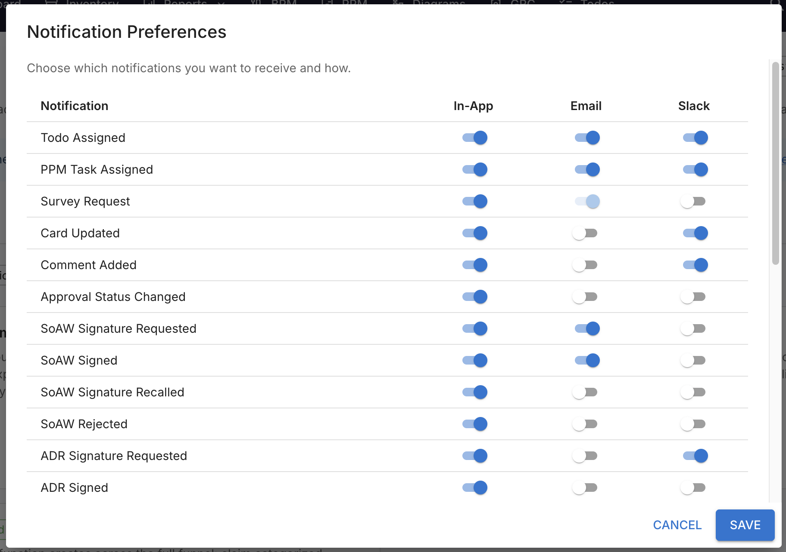

# Slack Notifications

Jeres team lever allerede i Slack. **Slack Notifications** sender den enkelte sine
Turbo EA-notifikationer som en **direkte besked i Slack** — en tildelt todo, en
beslutning der venter på vedkommendes underskrift, en risiko der er landet på
vedkommendes bord — med en knap direkte tilbage til kortet.

Alle bevarer kontrollen: i ens egne notifikationsindstillinger dukker en kolonne
**Slack** op ved siden af I appen og E-mail, hvor man præcist afkrydser, hvilke
notifikationstyper der skal nå frem den vej. **Intet er slået til som
udgangspunkt.**

## Kort fortalt

| | |
|---|---|
| **Licens** | Kommerciel — kræver en signeret licensrettighed |
| **Mindste Turbo EA-version** | 2.89.1 |
| **Rettighed** | `ext.slack-notify.admin` |
| **Tilladelser til dataadgang** | `core.notifications.channel`, `core.users.read` |
| **Genstart af backend nødvendig** | ja — indeholder backend-kode |
| **Hvor den vises** | **Admin → Indstillinger → Integrationer → Slack** · en kolonne **Slack** i alles [notifikationsindstillinger](../guide/notifications.md) |

Der kræves kun **udgående HTTPS til `slack.com`** — ingen indgående URL, intet
OAuth-callback og ingen godkendelse i Slack Marketplace. Netop derfor virker den på
selv-hostede instanser og bag en firewall.

## Opsætning

Åbn **Admin → Indstillinger → Integrationer**, og vælg underfanen **Slack**.
Panelet fører jer gennem tre nummererede trin.

### 1. Opret Slack-appen

Panelet viser et færdigt **app-manifest**. Vælg i Slack **Create New App → From a
manifest**, vælg jeres workspace, indsæt manifestet (der er en knap **Kopiér
manifest**), tryk derefter **Install to Workspace**, og kopiér **Bot User OAuth
Token** — det begynder med `xoxb-`.

Manifestet beder om fire bot-scopes og intet andet:

| Scope | Hvad det bruges til |
|---|---|
| `chat:write` | At sende den direkte besked |
| `im:write` | At åbne den direkte samtale med en person |
| `users:read` | At læse medlemsoversigten |
| `users:read.email` | At koble en Turbo EA-konto til et Slack-medlem via e-mail |

!!! warning "Lad token-rotation være slået fra"
    Manifestet slår bevidst Slacks **token-rotation** fra. Slås den til, udløber
    bot-tokenet hver 12. time, hvilket denne version ikke kan forny: leveringen
    ville standse to gange i døgnet.

### 2. Forbind workspacet

| Felt | Bemærkninger |
|---|---|
| **Bot-brugerens OAuth-token** | `xoxb-…`-tokenet. Gemmes krypteret; lad det senere stå tomt for at beholde det |
| **Navn vist i Slack-beskeder** | *Turbo EA* som standard. Bruges i beskedens knap og fodnote |
| **Lever notifikationer i Slack** | Slået til som standard — det er en pauseknap, ikke et opsætningstrin |

Tryk på **Gem**, derefter på **Test forbindelsen**; en markering bekræfter
*Connected to …*.

### 3. Tilknyt personerne

Konti tilknyttes **via e-mailadresse**, første gang nogen skal have en besked, og
resultatet gemmes i cache. Kortet **Personer** viser alle, med de problematiske
tilfælde først, og markerer, hvem der er **forbundet**, **ikke findes i Slack**
eller **endnu ikke er tjekket**.

For dem, hvis Slack-adresse afviger fra Turbo EA-e-mailen, indtastes deres
**Slack-medlems-id** (som `U01ABCDEF`), hvorefter der trykkes **Gem** — en manuel
tilknytning vinder altid over e-mail-matchet. **Send testbesked** viser, at en
tilknytning virker hele vejen igennem. Tømmes feltet, overgår personen igen til
e-mail-opslag.

Personer, som Slack ikke kender, forsøges automatisk igen én gang i døgnet, så den,
der først kommer med i Slack-workspacet efter at have fået en Turbo EA-konto,
bliver omfattet uden indgriben.

!!! note "Kun medlems-id'er gemmes"
    Udvidelsen gemmer Slack-medlems-id'er og intet andet — e-mailadresser bliver i
    Turbo EA.

## Hvad den enkelte selv styrer

Så snart udvidelsen kører, får alle en kolonne **Slack** i deres
**notifikationsindstillinger**, ved siden af I appen og E-mail.

- **Hver type er slået fra som udgangspunkt.** Ingen modtager en Slack-besked, før
  vedkommende selv har slået den type til.
- En fodnote under tabellen fortæller den enkelte, om kontoen er forbundet til
  Slack, eller om man skal bede en administrator om at oprette tilknytningen.
- Opgraderingsmeddelelsen, der kun findes i appen, leveres aldrig i Slack.

Turbo EA bestemmer, hvilke notifikationstyper der findes, og hvem der har slået dem
til; udvidelsen står alene for transporten.

## Sådan ser en besked ud

En direkte Slack-besked indeholder notifikationens **titel** med fed skrift, selve
beskedteksten, en knap **Open in Turbo EA** (med det navn, I har konfigureret), der
fører til det pågældende kort eller den pågældende side, samt en lille fodnote med
appens navn og notifikationstypen.

Leveringen er strengt envejs — fra Turbo EA til Slack — og altid som personlig
direkte besked. Der postes aldrig noget i en kanal.

## Overvåg leveringen

Kortet **Leveringslog** viser, hvor mange beskeder der **venter**, er **sendt** og
er **mislykkedes**, samt de 50 nyeste loglinjer.

Beskeder sættes i kø og sendes på få sekunder. Hvis Slack begrænser hastigheden
eller returnerer en fejl, forsøger udvidelsen igen med voksende ventetid og opgiver
efter seks forsøg; permanente fejl — et tilbagekaldt token, en slettet bruger, et
manglende scope — stopper med det samme i stedet for at forsøge forgæves. Leverede
linjer ryddes efter 14 dage.

En kø, der ikke rykker sig, har præcis to årsager, og panelet nævner den, der gør
sig gældende:

- **Der er ikke gemt et bot-token** — indsæt tokenet, og gem.
- **Leveringen er slået fra** — slå *Lever notifikationer i Slack* til igen.

**Prøv de mislykkede igen** sætter alt det, der blev opgivet, i kø på ny og tjekker
igen de personer, Slack ikke kendte. Det er vejen tilbage efter et nedbrud eller en
tokenudskiftning.

## Rettigheder

| Rettighed | Tillader |
|---|---|
| `ext.slack-notify.admin` | At konfigurere workspace-forbindelsen, tilknytte personer, sende testbeskeder, læse leveringsloggen og gentage mislykkede forsøg |

Underfanen er skjult for alle andre. **Slutbrugere behøver ingen ekstra rettighed**
— de sætter blot flueben i deres egne notifikationsindstillinger.

## Hvis licensen udløber, eller udvidelsen deaktiveres

Leveringen sættes på pause, og kolonnen **Slack** forsvinder fra dialogen, men
**alle indstillinger og tilvalg bevares**. En fornyet licens genoptager leveringen.
Det samme gælder kontakten *Lever notifikationer i Slack*, som sætter leveringen på
pause uden at afinstallere noget: beskeder i kø venter blot.

Bot-tokenet gemmes krypteret og er undtaget fra arbejdsområdeoverførsel.

## Begrænsninger

- **Kun direkte beskeder** — der postes ikke i kanaler.
- **Ingen interaktive knapper.** Handlinger som *Markér som fuldført* eller
  *Godkend* direkte fra Slack findes ikke i denne version; beskeden linker i stedet
  tilbage til Turbo EA.
- **Ingen samlebeskeder** — hver notifikation er sin egen besked frem for et samlet
  resumé.
- **Slå ikke Slacks token-rotation til** (se advarslen ovenfor).
