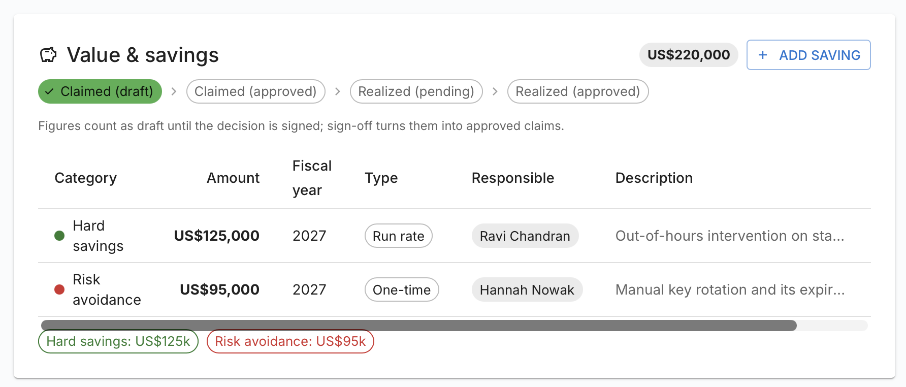
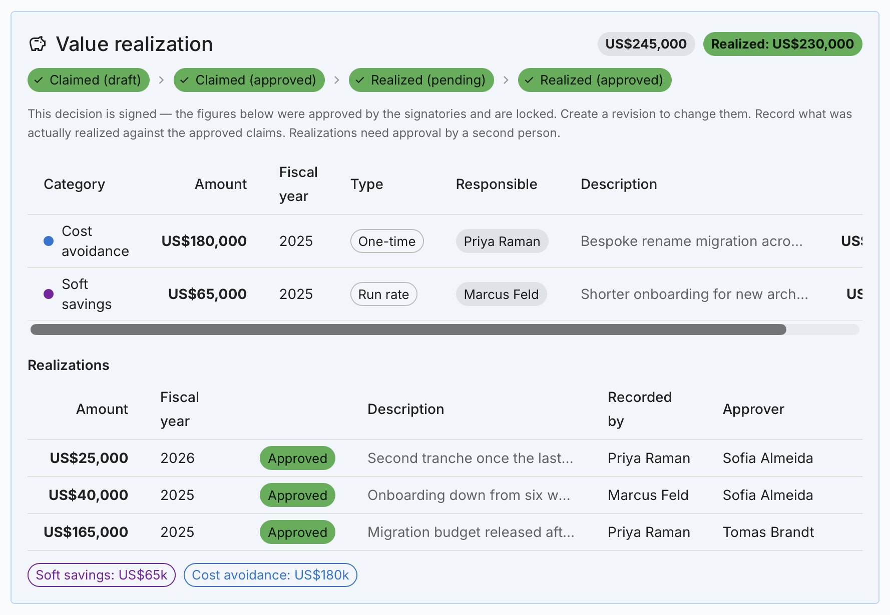
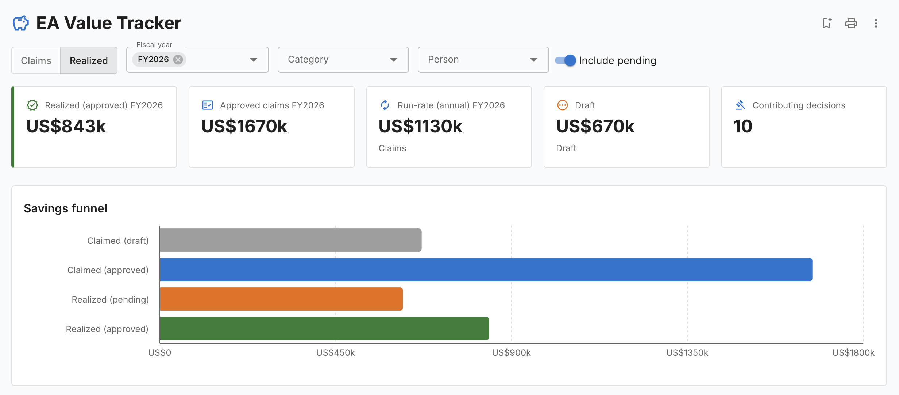
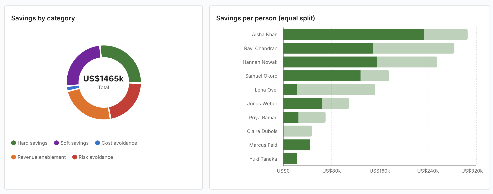
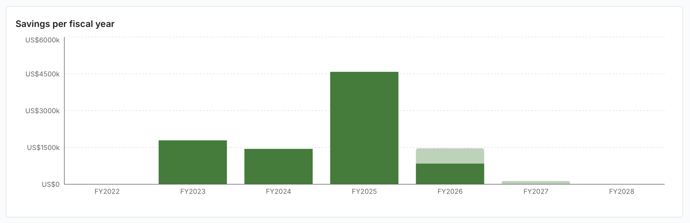

# EA Value Tracker

تواجه كل وظيفة للبنية المؤسسية عاجلًا أو آجلًا السؤال نفسه من المدير المالي أو مدير
تقنية المعلومات: *ما قيمة البنية المؤسسية بالنسبة إلينا فعلًا؟* لا تجيب خرائط
الطريق ولا المخططات عن ذلك — بل تجيب الأرقام.

تحوّل إضافة **EA Value Tracker** [قرارات البنية المؤسسية](../guide/delivery.md) في
Turbo EA إلى سجل مالي قابل للتدقيق للقيمة التي تصنعها ممارستكم. فالقيمة تُعلَن حيث
تنشأ — على القرار نفسه — وتُجمَّد عند التوقيع، ثم تُطابَق لاحقًا بما تحقق فعليًا
باعتماد مبدأ الأربع أعين. وتجمع لوحة المعلومات كل ذلك، فيصبح الجواب في مراجعة
الميزانية تقريرًا واحدًا لا بحثًا محمومًا في جداول البيانات.

## لمحة سريعة

| | |
|---|---|
| **الترخيص** | تجارية — يلزم حق ترخيص موقّع |
| **الحد الأدنى لإصدار Turbo EA** | 2.14.0 |
| **الصلاحيات** | `ext.value-savings.record`، `ext.value-savings.approve` |
| **تصاريح الوصول إلى البيانات** | لا شيء |
| **هل تلزم إعادة تشغيل الواجهة الخلفية** | نعم — تتضمن شيفرة للواجهة الخلفية |
| **أين تظهر** | لوحة **القيمة والوفورات** على القرارات · سجل **تحقيق القيمة** أسفل كتلة التواقيع · أربعة أعمدة في جداول القرارات · **التقارير → EA Value Tracker** |

## دورة الحياة

تمر القيمة بأربع مراحل تُعرض على هيئة سلسلة في كل قرار:

**مُعلَن (مسودة)** › **مُعلَن (معتمد)** › **محقَّق (قيد الاعتماد)** ›
**محقَّق (معتمد)**

1. أثناء صياغة القرار يُرفق المهندسون **وفورات مُعلَنة**.
2. **التوقيع يجمّدها.** فالأرقام التي اعتمدها الموقّعون تصير إعلانات معتمدة ولا يعود
   بالإمكان تحريرها.
3. بعد التنفيذ يقوم أحدهم **بتسجيل ما تحقق فعلًا** مقابل كل إعلان.
4. ويقوم **شخص ثانٍ باعتماد** التحقق — فمن يسجّل لا يمكنه أبدًا اعتماد أرقامه هو.

## إعلان القيمة على قرار

افتحوا مسودة قرار (**تسليم البنية المؤسسية → القرارات**) وانزلوا إلى **القيمة
والوفورات**، مباشرة بعد التبعات.

اضغطوا **إضافة وفر** واملؤوا مربع الحوار:

| الحقل | ملاحظات |
|---|---|
| **الفئة** | **وفورات مباشرة**، **وفورات غير مباشرة**، **تجنّب التكاليف**، **تمكين الإيرادات** أو **تجنّب المخاطر** |
| **المبلغ** | بعملة مساحة العمل. ويجب أن يكون أكبر من صفر |
| **السنة المالية** | مشتقة من بداية السنة المالية في [الإعدادات العامة](../admin/settings.md) |
| **النوع** | **لمرة واحدة** أو **متكرر** |
| **المسؤول** | شخص أو أكثر يتحملون مسؤولية الرقم |
| **الوصف** | نص حر اختياري |

أضيفوا من الإعلانات بقدر ما يبرره القرار. ويظهر إجمالي جارٍ بجوار عنوان اللوحة،
وتحته وسم لكل فئة.

!!! note "«متكرر» وصف إعلامي"
    يبقى البند الموسوم **متكرر** ضمن السنة المالية التي حددتموها له، ولا يُمدَّد
    تلقائيًا إلى السنوات اللاحقة أبدًا. وإنما وُجد هذا التمييز ليفرّق القارئ بين
    وفر سنوي متكرر وآخر لمرة واحدة، ولتتمكن لوحة المعلومات من عرض المبلغ السنوي
    المتكرر على حدة.

ويتطلب تحرير الإعلانات صلاحية `adr.manage` المعتادة.

## ما يحدث عند التوقيع

حين يوقّع الموقّعون القرار، تجمّد Turbo EA القرار بأكمله — بما في ذلك إعلاناته.
فيختفي المحرر من متن الوثيقة، ثم:

- تتحول الإعلانات إلى **مُعلَن (معتمد)** وتصبح للقراءة فقط؛
- يظهر سجل **تحقيق القيمة** **أسفل كتلة التواقيع**؛
- ويظهر في ترويسة القرار زر **تحقيق القيمة** ووسما **مُعلَن** و**محقَّق**، إلى
  جانب «تكرار» و«مراجعة جديدة».

ولتغيير رقم معتمد، أنشئوا **مراجعة جديدة** للقرار. وهذا مقصود: فالأرقام التي اعتمدها
الموقّعون تبقى تمامًا كما اعتمدوها.

## تسجيل القيمة المحققة واعتمادها

**التسجيل.** يرى كل من يملك `ext.value-savings.record` زر **تسجيل** على كل إعلان
معتمد لم يُسجَّل له تحقق بعد. ويطلب مربع الحوار **المبلغ** الفعلي و**السنة
المالية** و**مُعتمِدًا** ووصفًا اختياريًا.

ويجب أن يكون المُعتمِد **شخصًا غير الذي سجّل** — وهي قاعدة الأربع أعين التي يفرضها
الخادم لا النموذج وحده. وعند الحفظ يُنشأ الصف بحالة **قيد الاعتماد**، وتُولَّد مهمة
للمُعتمِد («اعتماد القيمة المحققة: …») مرتبطة بالقرار، مع إشعار الإسناد المعتاد.

**الاعتماد.** يفتح الشخص المعيَّن — الذي يلزمه أيضًا `ext.value-savings.approve` —
القرارَ ويضغط **اعتماد** أو **رفض** على الصف قيد الاعتماد. فتُنجَز المهمة ويتحول
الرقم إلى **محقَّق (معتمد)**. وتُحفظ الصفوف المرفوضة لأغراض التدقيق.

**التصحيحات.**

- لا يجوز إلا لمن اتخذ القرار أن يعكسه لاحقًا أو أن يضغط **سحب القرار** لإعادة الصف
  إلى حالة الانتظار (فتُفتح المهمة من جديد).
- ولا يجوز إلا لمن سجّل أن يحذف صفه هو، وذلك ما دام الصف قيد الاعتماد. أما
  المُعتمِدون فيرفضون بدل أن يحذفوا.
- ولتصحيح رقم اعتُمد فعلًا، سجّلوا **بندًا تصحيحيًا جديدًا** بدل تعديل السجل
  التاريخي.

## لوحة المعلومات

يجمع **التقارير → EA Value Tracker** كل شيء.

**شريط الأدوات**

- **مُعلَن** / **محقَّق** — أساس التقرير كله: القيمة *المعلَنة* على القرارات أو
  القيمة *المحققة* فعلًا.
- **السنة المالية** — السنة الجارية محددة مسبقًا؛ ألغوا التحديد بالكامل لعرض جميع
  السنوات.
- مرشّحا **الفئة** و**الشخص**.
- **تضمين المسودات** أو **تضمين ما هو قيد الاعتماد**.

**المؤشرات الرئيسية** — محقَّق (معتمد)، والإعلانات المعتمدة، والمتكرر (سنويًا)،
والمسودة، وعدد القرارات المساهِمة.

ويعرض **قمع الوفورات** المراحل الأربع جنبًا إلى جنب، فتتضح على الفور الفجوة بين ما
وُعد به وما تحقق.

**الوفورات حسب الفئة** رسم حلقي يتوسطه الإجمالي. أما **الوفورات لكل شخص (قسمة
بالتساوي)** فتنسب إلى كل من *N* أشخاص مسؤولين عن بند واحد *المبلغ ÷ N*، حتى لا
تُحتسب أي قيمة مرتين.

تغطي **الوفورات حسب السنة المالية** نافذة ثابتة تمتد من أربع سنوات مضت إلى سنتين
مقبلتين، وتتجاهل عن قصد مرشّح السنة المالية كي يبقى الاتجاه العام مقروءًا دائمًا.

ويكتمل المشهد بجدولين: **التوزيع حسب الشخص**، و**القرارات المساهِمة** — أي السجل
الكامل مع رابط **فتح** لكل قرار.

ويمكن حفظ التقرير ومشاركته وطباعته وتصديره إلى XLSX وPPTX شأنه شأن أي تقرير في
النواة، فيصلح للإدراج مباشرة في ملف اللجنة التوجيهية.

## في جداول القرارات

تُضاف أربعة أعمدة إلى جدول القرارات المشترك، في **تسليم البنية المؤسسية →
القرارات** وفي **الحوكمة والمخاطر والامتثال → الحوكمة → القرارات** على السواء:

| العمود | ما يعرضه |
|---|---|
| **الوفورات المُعلَنة** | إجمالي ما أُعلن على ذلك القرار |
| **محقَّق** | إجمالي عمليات التحقق المعتمدة |
| **مُعتمِد الوفورات** | من اعتمد عمليات التحقق |
| **مرحلة الوفورات** | أبعد مرحلة تم بلوغها |

وتتصرف هذه الأعمدة كأعمدة أصلية — فالفرز والتصفية السريعة والسمة تعمل جميعها —
ويمكن إخفاؤها أو تثبيتها من محدِّد الأعمدة.

## الصلاحيات

| الصلاحية | تتيح |
|---|---|
| `adr.view` (النواة) | رؤية اللوحات والأعمدة ولوحة المعلومات |
| `adr.manage` (النواة) | إضافة الإعلانات وتحريرها وحذفها على قرار غير موقّع |
| `ext.value-savings.record` | تسجيل تحقّق مقابل إعلان معتمد |
| `ext.value-savings.approve` | اعتماد تحقّق أو رفضه — **وأن تكون** الشخص المعيَّن مُعتمِدًا له |

امنحوا صلاحيتي الإضافة في **الإدارة → المستخدمون والأدوار**. ولاحظوا أن
`ext.value-savings.approve` وحدها لا تكفي: إذ يتحقق الخادم أيضًا من أنكم المُعتمِد
المعيَّن في ذلك الصف بالذات.

## إذا انتهى الترخيص أو عُطِّلت الإضافة

تختفي اللوحات والأعمدة ولوحة المعلومات، لكن **لا يُحذف شيء**. فالإعلانات مخزّنة في
القرار نفسه وتنتقل مع أي نقل لمساحة العمل، بينما تبقى عمليات التحقق في جداول
الإضافة الخاصة. ويعيد ترخيصٌ مُجدَّد كل شيء.

## ملاحظات وحدود

- الوفورات **غير** مُدرجة عمدًا في تصدير القرار إلى Word: فذلك التصدير هو وثيقة
  القرار لا السجل المالي.
- تُسجَّل عمليات التحقق مقابل إعلان معتمد، ولذا يجب أن يكون القرار موقّعًا قبل أن
  يمكن تحقيق قيمة مقابله.
- تتضمن الإضافة شيفرة للواجهة الخلفية، ولذا يتطلب تثبيتها أو تحديثها إعادة تشغيل
  الواجهة الخلفية مرة واحدة. وتعرض Turbo EA تنبيهًا حينئذ.
