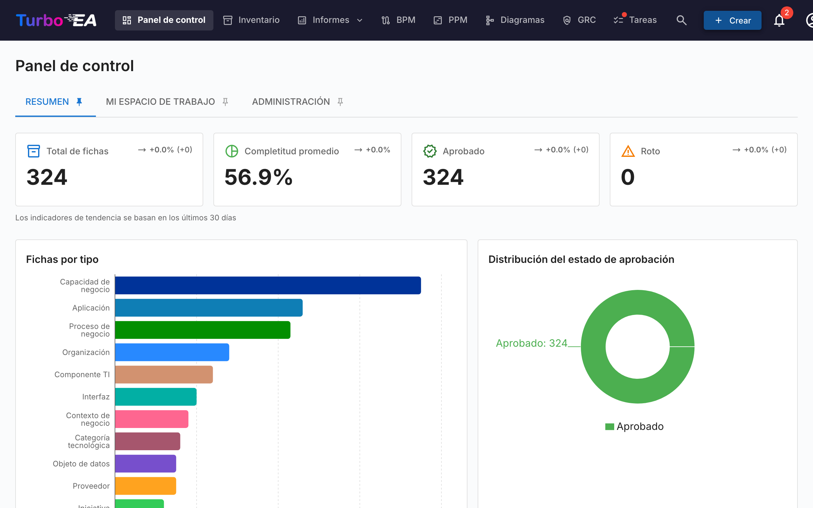

# Acceso a la Plataforma

### Inicio de Sesión

Al acceder a la plataforma, se muestra la pantalla de inicio de sesión donde debe ingresar su correo electrónico y contraseña.

**Pasos para iniciar sesión:**

1. Abra su navegador web e ingrese la URL de la plataforma
2. En el campo **Correo electrónico**, escriba su dirección de correo registrada
3. En el campo **Contraseña**, escriba su contraseña
4. Haga clic en el botón **Iniciar Sesión**

**Nota importante:** El primer usuario que se registre en la plataforma recibirá automáticamente el rol de **Administrador**, lo que le permite configurar todo el sistema.

### Inicio de Sesión con SSO (Single Sign-On)

Si su organización ha configurado SSO, aparecerá un botón **Iniciar sesión con [Proveedor]** en la página de inicio de sesión debajo del formulario de contraseña. La etiqueta del botón muestra el nombre del proveedor configurado (por ejemplo, "Iniciar sesión con Microsoft", "Iniciar sesión con Okta", "Iniciar sesión con SSO").

**Pasos para iniciar sesión con SSO:**

1. Abra su navegador web e ingrese la URL de la plataforma
2. Haga clic en el botón **Iniciar sesión con [Proveedor]**
3. Será redirigido a la página de inicio de sesión de su proveedor de identidad (por ejemplo, Microsoft Entra ID, Google Workspace, Okta o el proveedor OIDC de su organización)
4. Autentíquese con sus credenciales corporativas
5. Después de la autenticación exitosa, será redirigido de vuelta a Turbo EA e iniciará sesión automáticamente

**Notas:**
- Si su cuenta aún no existe en Turbo EA, se creará automáticamente en el primer inicio de sesión con SSO (si el auto-registro está habilitado) o se vinculará a una invitación previamente creada
- Si un administrador ya lo ha invitado por correo electrónico, su inicio de sesión con SSO se vinculará a esa cuenta y heredará el rol preasignado
- Los usuarios de SSO pueden tener una contraseña local como respaldo, si lo configura el administrador

### Registro de Nuevos Usuarios

Si es la primera vez que accede a la plataforma, puede registrarse haciendo clic en "Registrarse". Los administradores también pueden invitar usuarios desde el panel de administración (consulte [Usuarios y Roles](../admin/users.md)).

### Cambio de Idioma

La plataforma soporta múltiples idiomas. Para cambiar el idioma:

1. Haga clic en su icono de perfil (esquina superior derecha)
2. Seleccione **Idioma**
3. Elija el idioma deseado (Español, English, Français, Deutsch, Italiano, Português, Chinese)
