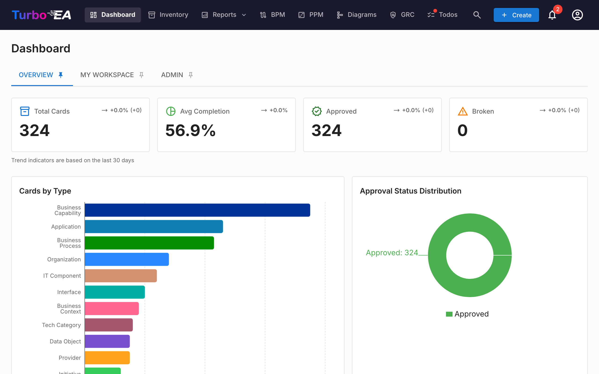

# 访问平台

## 登录

访问平台时，系统会显示登录界面，您需要输入电子邮箱地址和密码。

**登录步骤：**

1. 打开浏览器并输入平台 URL
2. 在**电子邮箱**字段中输入您注册的电子邮箱地址
3. 在**密码**字段中输入您的密码
4. 点击**登录**按钮

**重要提示：** 第一个在平台上注册的用户将自动获得**管理员**角色，可以配置整个系统。

## 使用 SSO（单点登录）登录

如果您的组织已配置 SSO，登录页面密码表单下方会显示一个**使用 [提供商] 登录**按钮。按钮标签显示配置的提供商名称（例如「使用 Microsoft 登录」、「使用 Okta 登录」、「使用 SSO 登录」）。

**使用 SSO 登录步骤：**

1. 打开浏览器并输入平台 URL
2. 点击**使用 [提供商] 登录**按钮
3. 您将被重定向到身份提供商的登录页面（例如 Microsoft Entra ID、Google Workspace、Okta 或您组织的 OIDC 提供商）
4. 使用您的企业凭据进行身份验证
5. 身份验证成功后，您将被重定向回 Turbo EA 并自动登录

**注意事项：**

- 如果您的账户在 Turbo EA 中尚不存在，首次 SSO 登录时将自动创建（如果启用了自助注册）或匹配到预先创建的邀请
- 如果管理员已通过电子邮件邀请您，您的 SSO 登录将链接到该账户，并且您将继承预分配的角色
- SSO 用户仍然可以设置本地密码作为备用方案（如果管理员已配置）

## 注册新用户

如果您是首次访问平台，可以点击「注册」创建账户。管理员也可以从管理面板邀请用户（参见[用户与角色](../admin/users.md)）。

## 切换语言

平台支持七种语言。要切换语言：

1. 点击您的个人头像（右上角）
2. 选择**语言**
3. 选择所需的语言：
   - English
   - Español
   - Français
   - Deutsch
   - Italiano
   - Português
   - 中文 (Chinese)
