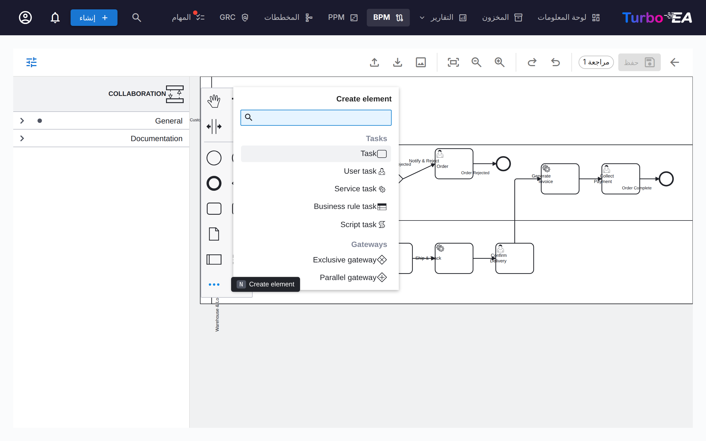
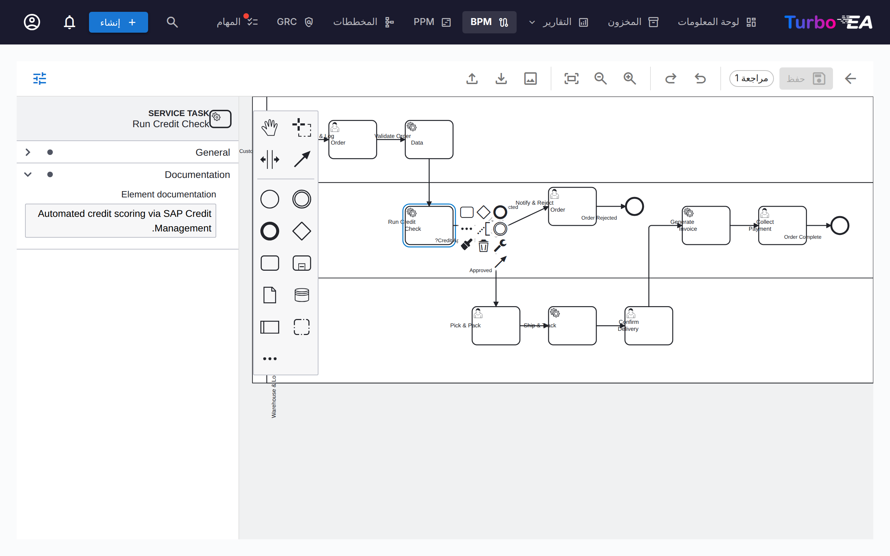
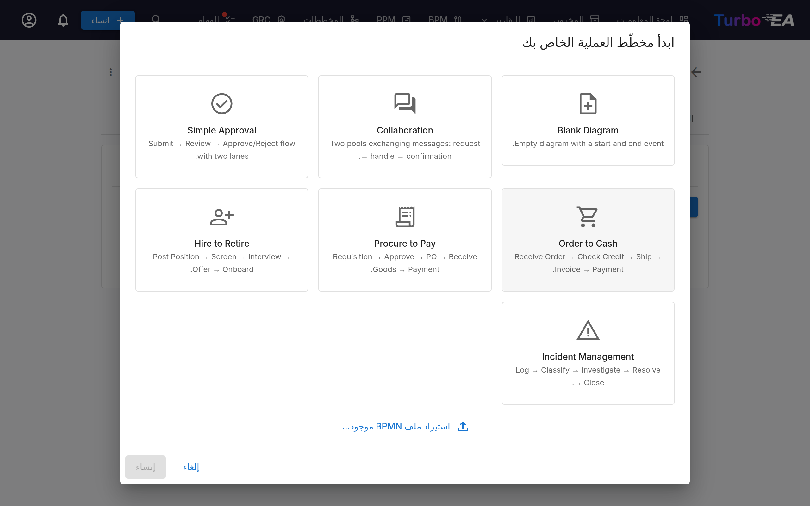
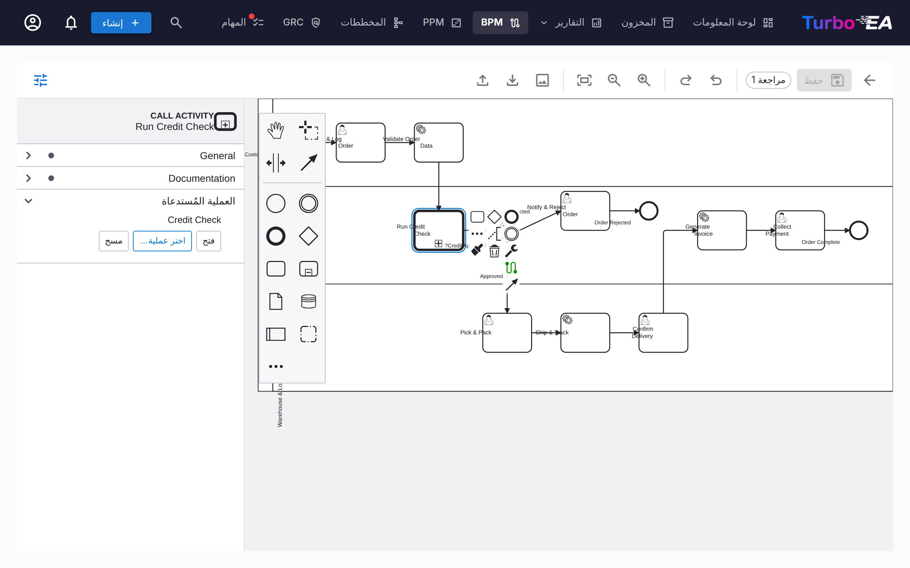

# إدارة عمليات الأعمال (BPM)

تتيح وحدة **BPM** توثيق **عمليات الأعمال** الخاصة بالمنظمة ونمذجتها وتحليلها. وهي تجمع بين مخططات BPMN 2.0 المرئية وتقييمات النضج وإعداد التقارير.

!!! note
    يمكن للمسؤول تفعيل وحدة BPM أو تعطيلها من [الإعدادات](../admin/settings.md). وعند التعطيل، يتم إخفاء التنقّل والميزات الخاصة بـ BPM.

## مستكشف العمليات

ينظّم **مستكشف العمليات** العمليات ضمن ثلاث فئات رئيسية:

- **عمليات الإدارة** — التخطيط والحوكمة والتحكّم
- **عمليات الأعمال الأساسية** — الأنشطة الأساسية المنشئة للقيمة
- **عمليات الدعم** — الأنشطة التي تدعم عمليات الأعمال الأساسية

**عوامل التصفية:** النوع، النضج (Initial / Defined / Managed / Optimized)، مستوى الأتمتة، المخاطرة (Low / Medium / High / Critical)، العمق (L1 / L2 / L3).

تعرض البطاقات التي تحتوي على مخطط BPMN منشور **أيقونة تدفّق** — انقر عليها لفتح المخطط بملء الشاشة دون مغادرة المستكشف (أو للانتقال من هناك إلى محرّر التدفّق الكامل).

**تخطيط الأعمدة:** يتضمّن شريط الأدوات أداة **اختيار الأعمدة** — عمود واحد أو عمودان أو ثلاثة — لتوسيع بطاقات العمليات أو إظهار قدر أكبر من الصف على الشاشة. ولا يُمدّ أي صف على عدد من الأعمدة يفوق عدد عملياته، ويُحفظ الاختيار بين الزيارات. وينتقل الاختيار كذلك إلى المستويات المتداخلة بعمود أقل لكل مستوى، فلا تعود العمليات العميقة تنضغط إلى شرائح ضيقة.

**النشر:** يمكن نشر مستكشف العمليات بوصفه [بوابة ويب](../admin/web-portals.md) للقراءة فقط، ليتمكّن من لا يملكون حساب Turbo EA — الموظفون الجدد والمدققون والشركاء — من تصفّح بيت العمليات وفتح كل مخطط BPMN منشور.

## لوحة معلومات BPM

توفّر **لوحة معلومات BPM** عرضًا تنفيذيًا لحالة العمليات:

| المؤشّر | الوصف |
|-----------|-------------|
| **إجمالي العمليات** | إجمالي عدد عمليات الأعمال المُوثَّقة |
| **تغطية المخططات** | النسبة المئوية للعمليات التي يرتبط بها مخطط BPMN |
| **مخاطرة عالية** | عدد العمليات ذات مستوى المخاطرة العالي |
| **مخاطرة حرجة** | عدد العمليات ذات مستوى المخاطرة الحرج |

تعرض المخططات التوزيع بحسب نوع العملية ومستوى النضج ومستوى الأتمتة. ويساعد جدول **العمليات الأعلى مخاطرةً** في تحديد أولويات الاستثمارات.

## محرّر تدفّق العمليات

يمكن أن تحتوي كل بطاقة عملية أعمال على **مخطط تدفّق عمليات بصيغة BPMN 2.0**. يستخدم المحرّر [bpmn-js](https://bpmn.io/) ويوفّر:

- **النمذجة المرئية** — السحب والإفلات لعناصر BPMN من اللوحة: المهام والأحداث والبوابات والمسارات والأحواض والعمليات الفرعية. يفتح المدخل **…** أسفل اللوحة قائمة **Create element** قابلة للبحث تصل إلى جميع أنواع عناصر BPMN — أحداث الرسالة والمؤقّت والإشارة والخطأ والتصعيد، والمعاملات، والعمليات الفرعية للأحداث، وأنشطة الاستدعاء، ومهام الإرسال/الاستقبال، وكائنات البيانات ومخازن البيانات (الاختصار `N`). ويفتح المدخل **+** في لوحة سياق الشكل المحدّد قائمة **Append element** المقابلة (الاختصار `A`)
- **القوالب التمهيدية** — اختر من بين 7 قوالب BPMN مُعدّة مسبقًا لأنماط العمليات الشائعة، بما فيها قالب **تعاون** بحوضين وتدفقات رسائل (أو ابدأ من لوحة فارغة)
- **استخراج العناصر** — عند حفظ مخطط، يستخرج النظام تلقائيًا جميع المهام والأحداث والبوابات والمسارات وكائنات البيانات وتدفقات الرسائل لأغراض التحليل. تحتفظ الأحداث بنوعها — فحدث البداية من نوع *رسالة* يُدرج بوصفه كذلك مع اسم الرسالة التي يستقبلها — وتحمل مهام الإرسال/الاستقبال الرسالة المتبادلة. تُدرج العناصر المستخرجة وفق **ترتيب سير العملية** — متتبعةً تدفقات التسلسل والرسائل في المخطط بدءًا من حدث البداية — لا مجمّعةً حسب نوع العنصر. وتبقى خطوات الحلقة مجتمعةً، ويُدرج محتوى العملية الفرعية أسفلها مباشرةً، وتأتي كائنات البيانات ومخازنها في النهاية
- **ألوان العناصر** — حدّد عنصرًا واحدًا أو أكثر واستخدم زر دلو الطلاء في لوحة السياق لتطبيق لون. تُحفظ الألوان داخل ملف BPMN نفسه، لذلك تظهر أيضًا في العارض للقراءة فقط وفي عمليات التصدير والطباعة
- **لوحة الخصائص** — تحرّر اللوحة على اليمين (أظهرها أو أخفِها بزر المنزلقات في شريط الأدوات) ما لا يمكن للشكل إظهاره: اسم العنصر ووثائقه، و**الرسالة** أو **الإشارة** أو **الخطأ** أو **التصعيد** الذي يشير إليه الحدث، وشرط تدفق التسلسل، وعلامات التعدّد. تظهر الوثائق المُدخلة هنا في متصفّح العمليات وفي العارض للقراءة فقط

### الأحواض وتدفقات الرسائل

تُنمذَج العملية التي تشمل أطرافًا عدّة — عميل والشركة، قسمان، نظام شريك — بوصفها **تعاونًا**: حوض لكل طرف، تربط بينها **تدفقات الرسائل**. أضف حوضًا ثانيًا من اللوحة (أو ابدأ من قالب **التعاون**)، ثم ارسم تدفق رسالة بين الحوضين بأداة الربط العامة، أو من مهمة إرسال أو حدث نهاية رسالة أو حدث إرسال رسالة في أحد الحوضين إلى مهمة استقبال أو حدث رسالة في الآخر. سمِّ الرسالة في لوحة الخصائص لتُقرأ بالطريقة نفسها في كل مكان.

### ربط العناصر

يمكن **ربط عناصر BPMN ببطاقات هندسة المؤسسة**. على سبيل المثال، اربط مهمة في مخطط العملية بالتطبيق الذي يدعمها. وهذا ينشئ اتصالًا قابلًا للتتبّع بين نموذج العملية ومشهد هندستك:

- كل مهمة وحدث وبوابة مسمّاة في التدفّق المنشور هي صف في جدول **خطوات العملية وعناصرها** أسفل المخطط (للمسودة الجدول نفسه تحت **الربط المسبق للعناصر**، ويُطبَّق عند اعتماد المسودة)
- انقر خلية **التطبيق** أو **كائن البيانات** أو **المكوّن التقني** لخطوة ما واختر البطاقة — يتصفّح المنتقي المخزون، فلا يُكتب شيء يدويًا
- يُخزَّن الربط على الخطوة وينشئ علاقة بين العملية والبطاقة، فيظهر في تدفّق العملية وفي تبويب «العلاقات» للبطاقة على حدّ سواء
- يربط عمود **يستدعي** **نشاط الاستدعاء** بالعملية التي يستدعيها — انظر أدناه

### استدعاء عملية أخرى

في BPMN بنية واحدة فقط تعني «هذه الخطوة عملية أخرى»: **نشاط الاستدعاء** (call activity)، وهو مهمة بحدّ سميك تستدعي عملية معرَّفة بشكل مستقل — لها مخططها ومالكها ودورة حياتها الخاصة، وتُعاد عادةً من عدة مواضع. أما **العملية الفرعية** المضمَّنة فتجمع الخطوات أيضًا لكنها تخصّ المخطط الذي رُسمت فيه؛ وقاعدة Method & Style بسيطة: إذا كانت العملية موجودة بشكل مستقل فاستخدم نشاط استدعاء.

في Turbo EA يشير نشاط الاستدعاء إلى بطاقة **عملية أعمال**، ولا تُدخل أبدًا معرّف عملية يدويًا:

- **عند وضع نشاط استدعاء يُسأل عن العملية التي يستدعيها.** أضف واحدًا من قائمة «إنشاء عنصر» فيُفتح منتقٍ على عمليات الأعمال في المخزون — اختر العملية المُستدعاة، أو ألغِ لربطها لاحقًا
- تعرض **لوحة الخصائص** مجموعة **العملية المُستدعاة** على كل نشاط استدعاء، مع **اختر عملية…** و**فتح** (للتعمّق في تدفّق العملية المُستدعاة) و**مسح**
- تحمل **قائمة السياق** لنشاط الاستدعاء المحدَّد مدخل **ربط عملية**، لحالة طيّ اللوحة
- يحتوي **جدول الخطوات** للتدفّق المنشور (وجدول الربط المسبق للمسودة) على الربط نفسه في عمود **يستدعي**، والشريحة هناك تتعمّق في تبويب «تدفّق العملية» للعملية المُستدعاة

يؤدي نشر تدفّق يحتوي نشاط استدعاء مربوطًا إلى إنشاء علاقة **يستدعي** بين العمليتين — يعرض تبويب «العلاقات» للعملية المُستدعاة *يُستدعى بواسطة*، وترسم عرض التبعيات مخطط الاستدعاءات. يحتفظ المخطط المستورد من أداة أخرى بمرجع العملية الخاص بتلك الأداة؛ ويعرضه جدول الخطوات كتلميح (*يشير إلى Process_X*) حتى تختار العملية المطابقة في Turbo EA.

### تدفقات الرسائل

تُدرج تدفقات الرسائل في المخطط المنشور أسفل جدول العناصر، ويُظهر كل منها ما يربطه — مهمة أو حدثًا أو حوضًا كاملًا في كل طرف. اربط تدفق الرسالة ببطاقة **الواجهة** التي تنقله. وكما هو الحال مع روابط المؤسسات على الخطوات، هذا للعلم فقط: لا تُنشأ أي علاقة بين البطاقات.

### ربط المؤسّسات

يربط عمود *المؤسّسة* في جدول الخطوات الخطوات ببطاقات المؤسّسات، إلى جانب التطبيق / كائن البيانات / المكوّن التقني. وخلافًا لتلك الروابط أحادية القيمة، يمكن ربط الخطوة الواحدة بعدة **مؤسّسات** — اخترها واحدة تلو الأخرى وأزلها كلًّا على حدة. روابط الخطوات معلوماتية فقط — فهي توثّق المؤسّسات المشارِكة في الخطوة دون إنشاء أي علاقة بين البطاقات؛ وتُدار علاقات «عملية الأعمال ↔ المؤسّسة» بشكل منفصل في تبويب العلاقات على البطاقة. تبقى أسماء المسارات نصًا حرًا خالصًا من المخطط وغير مرتبطة ببطاقات المؤسّسات. وتجمع **مصفوفة العملية × المؤسّسة** في تقارير BPM هذه الروابط عبر جميع العمليات.

### سير عمل الموافقة

تتبع مخططات سير العمليات سير موافقة خاضعًا للتحكم في الإصدارات:

| الحالة | الوصف |
|--------|-------|
| **مسودة** | قيد التحرير، لم تُقدَّم للمراجعة بعد |
| **قيد الانتظار** | مُقدَّمة للاعتماد، بانتظار المراجعة |
| **منشورة** | معتمدة وظاهرة بوصفها الإصدار الحالي |
| **مؤرشفة** | إصدار سبق نشره، حلَّ محله اعتماد أحدث |
| **مسحوبة** | إصدار سبق نشره، أُلغي نشره عن قصد |

يؤدي تقديم مسودة إلى إنشاء لقطة إصدار. يمكن للمعتمِدين اعتماد التقديم (نشره) أو رفضه.

#### من يمكنه الاعتماد

يتطلب اعتماد مراجعة مُقدَّمة أو رفضها صلاحية **اعتماد أو رفض إصدارات مخططات BPMN المُقدَّمة**، أو دور صاحب المصلحة **مالك العملية** على العملية نفسها. ولا تكفي إمكانية تحرير المسودات.

!!! warning "تغيَّر في الإصدار 2.43.0"
    كانت الإصدارات السابقة تقبل هنا صلاحية تحرير BPM العامة، فكان بإمكان أي عضو اعتماد أي مخطط عملية — بما في ذلك مراجعة قدَّمها بنفسه قبل لحظات. إذا كان الاعتماد في نظامك يتم اليوم بواسطة أشخاص لا يملكون سوى حقوق تحرير BPM، فامنحهم صلاحية **اعتماد أو رفض إصدارات مخططات BPMN المُقدَّمة** من الإدارة ← الأدوار، أو عيِّنهم **مالك العملية** على العمليات التي يعتمدونها.

#### سحب إصدار منشور

يمكن التراجع عن اعتماد مُنح بالخطأ دون حذف العملية. ويتطلب السحب صلاحية **سحب (إلغاء نشر) إصدار مخطط BPMN منشور**، وهي **غير ممنوحة لأي دور افتراضيًا** — يمنحها المسؤول من الإدارة ← الأدوار، أو لدور صاحب المصلحة **مالك العملية** من الإدارة ← النموذج الفوقي.

بعد منح الصلاحية، يظهر على الإصدار المنشور زر **سحب**. يتطلب السحب سببًا مكتوبًا، ثم:

- تنتقل المراجعة إلى **مسحوبة** — فلا تُحذف أبدًا ولا تُعاد إلى حالة المسودة؛
- يبقى الاعتماد الأصلي مسجَّلًا: يعرض تبويب *المؤرشفة* رقم المراجعة ومَن اعتمدها ومتى، إلى جانب مَن سحبها ولماذا؛
- يُسجَّل السحب مع سببه في تبويب **السجل** الخاص بالبطاقة؛
- **تُفتح نسخة منها كمسودة جديدة** برقم المراجعة التالي، لتتمكن من تصحيح المخطط وإعادته عبر التقديم ← الاعتماد؛
- تبقى العملية بلا مخطط *معتمد* إلى أن تُعتمد تلك المسودة؛
- تبقى خطوات العملية المستخرجة وروابطها بالبطاقات دون تغيير.

الإبقاء على المراجعة المسحوبة وتحرير نسخة منها أمر مقصود: فالمخطط الذي وقّع عليه المعتمِد يظل قابلًا للاسترجاع، وهو ما يتوقعه نظام الجودة، ومع ذلك تحصل على نسخة عمل فورًا.

يمكن استئناف أي إصدار مؤرشف أو مسحوب في أي وقت عبر **إنشاء مسودة جديدة من هذا** في تبويب *المؤرشفة*، فيُستنسخ إلى مسودة برقم المراجعة التالي.

## تقييمات العمليات

تدعم بطاقات عمليات الأعمال **التقييمات** التي تُقيّم العملية وفق:

- **الكفاءة** — مدى جودة استخدام العملية للموارد
- **الفعالية** — مدى جودة تحقيق العملية لأهدافها
- **الامتثال** — مدى استيفاء العملية للمتطلبات التنظيمية

تُغذّي بيانات التقييم تقارير BPM.

## تقارير BPM

تتوفّر ثلاثة تقارير متخصّصة من لوحة معلومات BPM:

- **تقرير النضج** — توزيع العمليات بحسب مستوى النضج، والاتجاهات عبر الزمن
- **تقرير المخاطر** — نظرة عامة على تقييم المخاطر، مع إبراز العمليات التي تحتاج إلى اهتمام
- **تقرير الأتمتة** — تحليل مستويات الأتمتة عبر مشهد العمليات
- **مصفوفة العملية × المؤسّسة** — أي المؤسّسات تنفّذ خطوات في أي العمليات، مع تصفية حسب المؤسّسة وعرض تفصيلي للخطوات لكل عملية (بناءً على روابط الخطوات المعلوماتية؛ لا تُحتسب علاقات البطاقات)
