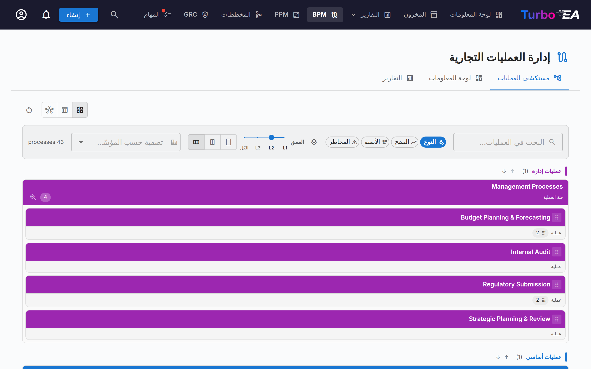
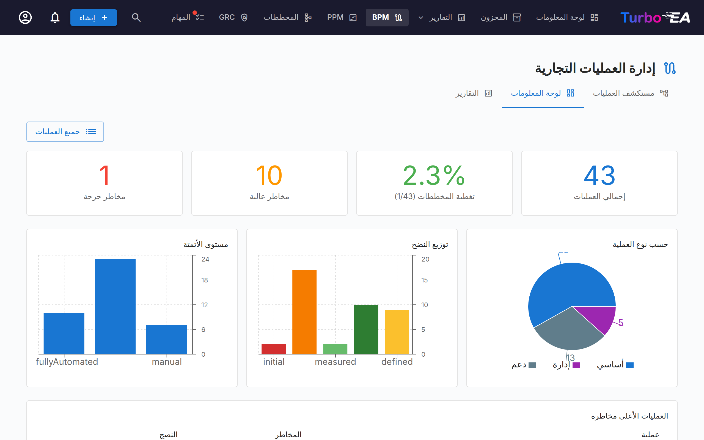
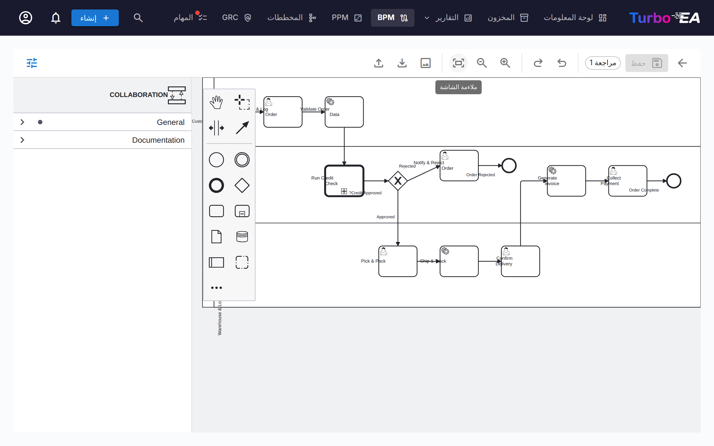

# إدارة عمليات الأعمال (BPM)

تتيح وحدة **BPM** توثيق **عمليات الأعمال** الخاصة بالمنظمة ونمذجتها وتحليلها. وهي تجمع بين مخططات BPMN 2.0 المرئية وتقييمات النضج وإعداد التقارير.

!!! note
    يمكن للمسؤول تفعيل وحدة BPM أو تعطيلها من [الإعدادات](../admin/settings.md). وعند التعطيل، يتم إخفاء التنقّل والميزات الخاصة بـ BPM.

## مستكشف العمليات

ينظّم **مستكشف العمليات** العمليات ضمن ثلاث فئات رئيسية:

- **عمليات الإدارة** — التخطيط والحوكمة والتحكّم
- **عمليات الأعمال الأساسية** — الأنشطة الأساسية المنشئة للقيمة
- **عمليات الدعم** — الأنشطة التي تدعم عمليات الأعمال الأساسية

**عوامل التصفية:** النوع، النضج (Initial / Defined / Managed / Optimized)، مستوى الأتمتة، المخاطرة (Low / Medium / High / Critical)، العمق (L1 / L2 / L3).

تعرض البطاقات التي تحتوي على مخطط BPMN منشور **أيقونة تدفّق** — انقر عليها لفتح المخطط بملء الشاشة دون مغادرة المستكشف (أو للانتقال من هناك إلى محرّر التدفّق الكامل).

## لوحة معلومات BPM

توفّر **لوحة معلومات BPM** عرضًا تنفيذيًا لحالة العمليات:

| المؤشّر | الوصف |
|-----------|-------------|
| **إجمالي العمليات** | إجمالي عدد عمليات الأعمال المُوثَّقة |
| **تغطية المخططات** | النسبة المئوية للعمليات التي يرتبط بها مخطط BPMN |
| **مخاطرة عالية** | عدد العمليات ذات مستوى المخاطرة العالي |
| **مخاطرة حرجة** | عدد العمليات ذات مستوى المخاطرة الحرج |

تعرض المخططات التوزيع بحسب نوع العملية ومستوى النضج ومستوى الأتمتة. ويساعد جدول **العمليات الأعلى مخاطرةً** في تحديد أولويات الاستثمارات.

## محرّر تدفّق العمليات

يمكن أن تحتوي كل بطاقة عملية أعمال على **مخطط تدفّق عمليات بصيغة BPMN 2.0**. يستخدم المحرّر [bpmn-js](https://bpmn.io/) ويوفّر:

- **النمذجة المرئية** — السحب والإفلات لعناصر BPMN: المهام والأحداث والبوابات والمسارات والعمليات الفرعية
- **القوالب التمهيدية** — اختر من بين 6 قوالب BPMN مُعدّة مسبقًا لأنماط العمليات الشائعة (أو ابدأ من لوحة فارغة)
- **استخراج العناصر** — عند حفظ مخطط، يستخرج النظام تلقائيًا جميع المهام والأحداث والبوابات والمسارات لأغراض التحليل
- **ألوان العناصر** — حدّد عنصرًا واحدًا أو أكثر واستخدم زر دلو الطلاء في لوحة السياق لتطبيق لون. تُحفظ الألوان داخل ملف BPMN نفسه، لذلك تظهر أيضًا في العارض للقراءة فقط وفي عمليات التصدير والطباعة

### ربط العناصر

يمكن **ربط عناصر BPMN ببطاقات هندسة المؤسسة**. على سبيل المثال، اربط مهمة في مخطط العملية بالتطبيق الذي يدعمها. وهذا ينشئ اتصالًا قابلًا للتتبّع بين نموذج العملية ومشهد هندستك:

- حدّد أي مهمة أو حدث أو بوابة في مخطط BPMN
- تعرض لوحة **رابط العناصر** البطاقات المطابقة (تطبيق، كائن بيانات، مكوّن تقني، مؤسّسة)
- اربط العنصر ببطاقة — يُخزَّن الاتصال ويصبح مرئيًا في كل من تدفّق العملية وعلاقات البطاقة

### ربط المؤسّسات

يربط عمود *المؤسّسة* في جدول الخطوات الخطوات ببطاقات المؤسّسات، إلى جانب التطبيق / كائن البيانات / المكوّن التقني. وخلافًا لتلك الروابط أحادية القيمة، يمكن ربط الخطوة الواحدة بعدة **مؤسّسات** — اخترها واحدة تلو الأخرى وأزلها كلًّا على حدة. روابط الخطوات معلوماتية فقط — فهي توثّق المؤسّسات المشارِكة في الخطوة دون إنشاء أي علاقة بين البطاقات؛ وتُدار علاقات «عملية الأعمال ↔ المؤسّسة» بشكل منفصل في تبويب العلاقات على البطاقة. تبقى أسماء المسارات نصًا حرًا خالصًا من المخطط وغير مرتبطة ببطاقات المؤسّسات. وتجمع **مصفوفة العملية × المؤسّسة** في تقارير BPM هذه الروابط عبر جميع العمليات.

### سير عمل الموافقة

تتبع مخططات سير العمليات سير موافقة خاضعًا للتحكم في الإصدارات:

| الحالة | الوصف |
|--------|-------|
| **مسودة** | قيد التحرير، لم تُقدَّم للمراجعة بعد |
| **قيد الانتظار** | مُقدَّمة للاعتماد، بانتظار المراجعة |
| **منشورة** | معتمدة وظاهرة بوصفها الإصدار الحالي |
| **مؤرشفة** | إصدار سبق نشره، حلَّ محله اعتماد أحدث |
| **مسحوبة** | إصدار سبق نشره، أُلغي نشره عن قصد |

يؤدي تقديم مسودة إلى إنشاء لقطة إصدار. يمكن للمعتمِدين اعتماد التقديم (نشره) أو رفضه.

#### من يمكنه الاعتماد

يتطلب اعتماد مراجعة مُقدَّمة أو رفضها صلاحية **اعتماد أو رفض إصدارات مخططات BPMN المُقدَّمة**، أو دور صاحب المصلحة **مالك العملية** على العملية نفسها. ولا تكفي إمكانية تحرير المسودات.

!!! warning "تغيَّر في الإصدار 2.43.0"
    كانت الإصدارات السابقة تقبل هنا صلاحية تحرير BPM العامة، فكان بإمكان أي عضو اعتماد أي مخطط عملية — بما في ذلك مراجعة قدَّمها بنفسه قبل لحظات. إذا كان الاعتماد في نظامك يتم اليوم بواسطة أشخاص لا يملكون سوى حقوق تحرير BPM، فامنحهم صلاحية **اعتماد أو رفض إصدارات مخططات BPMN المُقدَّمة** من الإدارة ← الأدوار، أو عيِّنهم **مالك العملية** على العمليات التي يعتمدونها.

#### سحب إصدار منشور

يمكن التراجع عن اعتماد مُنح بالخطأ دون حذف العملية. ويتطلب السحب صلاحية **سحب (إلغاء نشر) إصدار مخطط BPMN منشور**، وهي **غير ممنوحة لأي دور افتراضيًا** — يمنحها المسؤول من الإدارة ← الأدوار، أو لدور صاحب المصلحة **مالك العملية** من الإدارة ← النموذج الفوقي.

بعد منح الصلاحية، يظهر على الإصدار المنشور زر **سحب**. يتطلب السحب سببًا مكتوبًا، ثم:

- تنتقل المراجعة إلى **مسحوبة** — فلا تُحذف أبدًا ولا تُعاد إلى حالة المسودة؛
- يبقى الاعتماد الأصلي مسجَّلًا: يعرض تبويب *المؤرشفة* رقم المراجعة ومَن اعتمدها ومتى، إلى جانب مَن سحبها ولماذا؛
- يُسجَّل السحب مع سببه في تبويب **السجل** الخاص بالبطاقة؛
- **تُفتح نسخة منها كمسودة جديدة** برقم المراجعة التالي، لتتمكن من تصحيح المخطط وإعادته عبر التقديم ← الاعتماد؛
- تبقى العملية بلا مخطط *معتمد* إلى أن تُعتمد تلك المسودة؛
- تبقى خطوات العملية المستخرجة وروابطها بالبطاقات دون تغيير.

الإبقاء على المراجعة المسحوبة وتحرير نسخة منها أمر مقصود: فالمخطط الذي وقّع عليه المعتمِد يظل قابلًا للاسترجاع، وهو ما يتوقعه نظام الجودة، ومع ذلك تحصل على نسخة عمل فورًا.

يمكن استئناف أي إصدار مؤرشف أو مسحوب في أي وقت عبر **إنشاء مسودة جديدة من هذا** في تبويب *المؤرشفة*، فيُستنسخ إلى مسودة برقم المراجعة التالي.

## تقييمات العمليات

تدعم بطاقات عمليات الأعمال **التقييمات** التي تُقيّم العملية وفق:

- **الكفاءة** — مدى جودة استخدام العملية للموارد
- **الفعالية** — مدى جودة تحقيق العملية لأهدافها
- **الامتثال** — مدى استيفاء العملية للمتطلبات التنظيمية

تُغذّي بيانات التقييم تقارير BPM.

## تقارير BPM

تتوفّر ثلاثة تقارير متخصّصة من لوحة معلومات BPM:

- **تقرير النضج** — توزيع العمليات بحسب مستوى النضج، والاتجاهات عبر الزمن
- **تقرير المخاطر** — نظرة عامة على تقييم المخاطر، مع إبراز العمليات التي تحتاج إلى اهتمام
- **تقرير الأتمتة** — تحليل مستويات الأتمتة عبر مشهد العمليات
- **مصفوفة العملية × المؤسّسة** — أي المؤسّسات تنفّذ خطوات في أي العمليات، مع تصفية حسب المؤسّسة وعرض تفصيلي للخطوات لكل عملية (بناءً على روابط الخطوات المعلوماتية؛ لا تُحتسب علاقات البطاقات)
