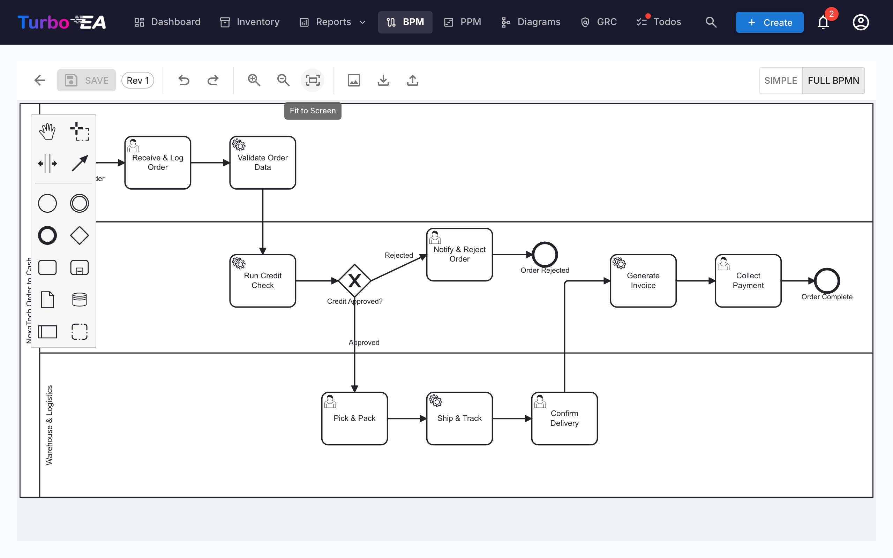

# Forretningsprocesstyring (BPM)

**BPM**-modulet gør det muligt at dokumentere, modellere og analysere organisationens **forretningsprocesser**. Det kombinerer visuelle BPMN 2.0-diagrammer med modenhedsvurderinger og rapportering.

!!! note
    BPM-modulet kan slås til eller fra af en administrator i [Indstillinger](../admin/settings.md). Når det er slået fra, skjules BPM-navigation og -funktioner.

## Procesnavigator

**Procesnavigatoren** organiserer processer i tre hovedkategorier:

- **Ledelsesprocesser** — Planlægning, styring og kontrol
- **Kerneforretningsprocesser** — Primære værdiskabende aktiviteter
- **Støtteprocesser** — Aktiviteter der understøtter kerneforretningen

**Filtre:** Type, Modenhed (Initial / Defineret / Styret / Optimeret), Automatiseringsniveau, Risiko (Lav / Middel / Høj / Kritisk), Dybde (L1 / L2 / L3).

Kort med et publiceret BPMN-diagram viser et **flow-ikon** — klik på det for at åbne diagrammet i fuld skærm uden at forlade navigatoren (eller for at springe derfra til den fulde flow-editor).

## BPM-dashboard

**BPM-dashboardet** giver et ledelsesoverblik over processtatus:

| Indikator | Beskrivelse |
|-----------|-------------|
| **Antal processer** | Samlet antal dokumenterede forretningsprocesser |
| **Diagramdækning** | Procentdel af processer med et tilknyttet BPMN-diagram |
| **Høj risiko** | Antal processer med højt risikoniveau |
| **Kritisk risiko** | Antal processer med kritisk risikoniveau |

Diagrammer viser fordeling efter procestype, modenhedsniveau og automatiseringsniveau. En tabel med **øverste risikoprocesser** hjælper med at prioritere investeringer.

## Procesflow-editor

Hvert forretningsproceskort kan have et **BPMN 2.0-procesflowdiagram**. Editoren bruger [bpmn-js](https://bpmn.io/) og tilbyder:

- **Visuel modellering** — Træk og slip BPMN-elementer: opgaver, hændelser, gateways, baner og underprocesser
- **Skabeloner** — Vælg blandt 6 forudbyggede BPMN-skabeloner til almindelige procesmønstre (eller start fra et blankt lærred)
- **Element­udtrækning** — Når du gemmer et diagram, udtrækker systemet automatisk alle opgaver, hændelser, gateways og baner til analyse

### Element-linking

BPMN-elementer kan **linkes til EA-kort**. For eksempel kan du linke en opgave i dit procesdiagram til den applikation, der understøtter den. Det skaber en sporbar forbindelse mellem din procesmodel og dit arkitekturlandskab:

- Vælg en opgave, hændelse eller gateway i BPMN-diagrammet
- Panelet **Element Linker** viser matchende kort (Application, Data Object, IT Component)
- Link elementet til et kort — forbindelsen gemmes og er synlig i både procesflowet og kortets relationer

### Godkendelses­arbejdsproces

Procesflow-diagrammer følger en versionskontrolleret godkendelses­arbejdsproces:

| Status | Beskrivelse |
|--------|-------------|
| **Kladde** | Under redigering, endnu ikke indsendt til gennemgang |
| **Afventer** | Indsendt til godkendelse, afventer gennemgang |
| **Udgivet** | Godkendt og synlig som den aktuelle version |
| **Arkiveret** | Tidligere udgivet version, gemt af historiske grunde |

Indsendelse af en kladde opretter et øjebliksbillede af versionen. Godkendere kan godkende (udgive) eller afvise (med kommentarer) indsendelsen.

## Procesvurderinger

Forretningsproceskort understøtter **vurderinger**, der scorer processen på:

- **Effektivitet** — Hvor godt processen bruger ressourcer
- **Virkning** — Hvor godt processen opnår sine mål
- **Compliance** — Hvor godt processen opfylder regulatoriske krav

Vurderingsdata indgår i BPM-rapporterne.

## BPM-rapporter

Tre specialiserede rapporter er tilgængelige fra BPM-dashboardet:

- **Modenhedsrapport** — Fordeling af processer efter modenhedsniveau, tendenser over tid
- **Risikorapport** — Risikovurderings­overblik, der fremhæver processer, der kræver opmærksomhed
- **Automatiseringsrapport** — Analyse af automatiseringsniveauer på tværs af proceslandskabet
