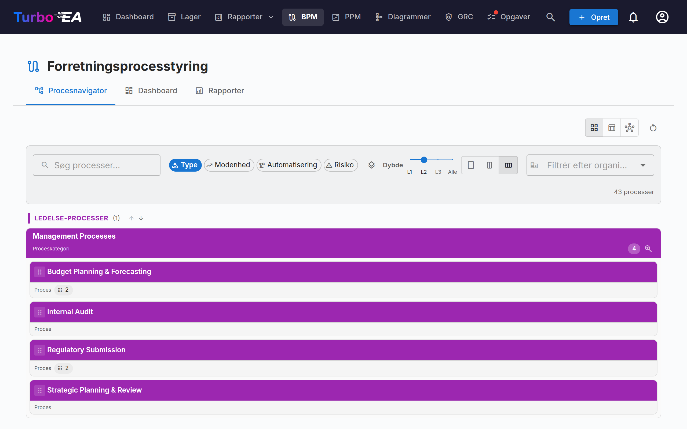
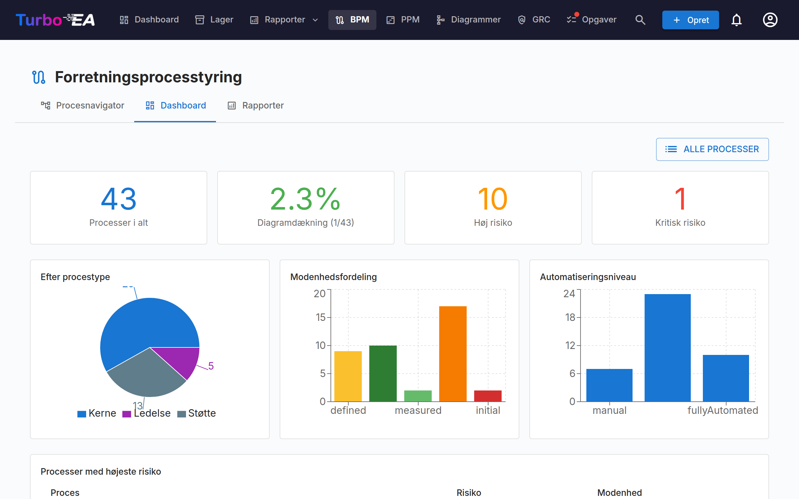
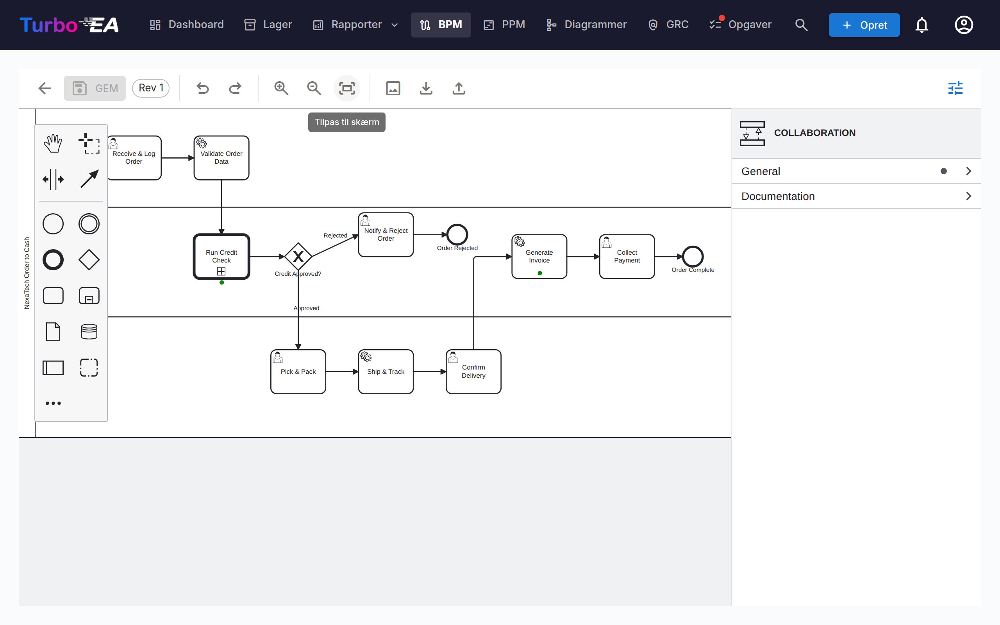

# Forretningsprocesstyring (BPM)

**BPM**-modulet gør det muligt at dokumentere, modellere og analysere organisationens **forretningsprocesser**. Det kombinerer visuelle BPMN 2.0-diagrammer med modenhedsvurderinger og rapportering.

!!! note
    BPM-modulet kan slås til eller fra af en administrator i [Indstillinger](../admin/settings.md). Når det er slået fra, skjules BPM-navigation og -funktioner.

## Procesnavigator

**Procesnavigatoren** organiserer processer i tre hovedkategorier:

- **Ledelsesprocesser** — Planlægning, styring og kontrol
- **Kerneforretningsprocesser** — Primære værdiskabende aktiviteter
- **Støtteprocesser** — Aktiviteter der understøtter kerneforretningen

**Filtre:** Type, Modenhed (Initial / Defineret / Styret / Optimeret), Automatiseringsniveau, Risiko (Lav / Middel / Høj / Kritisk), Dybde (L1 / L2 / L3).

Kort med et publiceret BPMN-diagram viser et **flow-ikon** — klik på det for at åbne diagrammet i fuld skærm uden at forlade navigatoren (eller for at springe derfra til den fulde flow-editor).

## BPM-dashboard

**BPM-dashboardet** giver et ledelsesoverblik over processtatus:

| Indikator | Beskrivelse |
|-----------|-------------|
| **Antal processer** | Samlet antal dokumenterede forretningsprocesser |
| **Diagramdækning** | Procentdel af processer med et tilknyttet BPMN-diagram |
| **Høj risiko** | Antal processer med højt risikoniveau |
| **Kritisk risiko** | Antal processer med kritisk risikoniveau |

Diagrammer viser fordeling efter procestype, modenhedsniveau og automatiseringsniveau. En tabel med **øverste risikoprocesser** hjælper med at prioritere investeringer.

## Procesflow-editor

Hvert forretningsproceskort kan have et **BPMN 2.0-procesflowdiagram**. Editoren bruger [bpmn-js](https://bpmn.io/) og tilbyder:

- **Visuel modellering** — Træk og slip BPMN-elementer: opgaver, hændelser, gateways, baner og underprocesser
- **Skabeloner** — Vælg blandt 6 forudbyggede BPMN-skabeloner til almindelige procesmønstre (eller start fra et blankt lærred)
- **Element­udtrækning** — Når du gemmer et diagram, udtrækker systemet automatisk alle opgaver, hændelser, gateways og baner til analyse
- **Elementfarver** — Markér et eller flere elementer, og brug malerbøtte-knappen i kontekstpanelet for at give dem en farve. Farverne gemmes i selve BPMN-filen, så de vises også i den skrivebeskyttede fremviser, i eksporter og på udskrifter

### Element-linking

BPMN-elementer kan **linkes til EA-kort**. For eksempel kan du linke en opgave i dit procesdiagram til den applikation, der understøtter den. Det skaber en sporbar forbindelse mellem din procesmodel og dit arkitekturlandskab:

- Vælg en opgave, hændelse eller gateway i BPMN-diagrammet
- Panelet **Element Linker** viser matchende kort (Application, Data Object, IT Component, Organization)
- Link elementet til et kort — forbindelsen gemmes og er synlig i både procesflowet og kortets relationer

### Link organisationer

Kolonnen *Organisation* i trintabellen linker trin til organisationskort, lige ved siden af Application / Data Object / IT Component. I modsætning til disse enkeltværdi-links kan et trin linkes til **flere** organisationer — vælg dem én ad gangen, og fjern dem enkeltvis. Trinlinks er kun informative — de dokumenterer, hvilke organisationer der er involveret i et trin, uden at oprette nogen relation mellem kortene; relationer mellem Forretningsproces og Organisation håndteres separat på kortets Relationer-fane. Banenavne forbliver ren fri tekst fra diagrammet og er ikke forbundet med organisationskort. **Proces × Organisation-matrixen** i BPM-rapporterne aggregerer disse links på tværs af alle processer.

### Godkendelses­arbejdsproces

Procesflowdiagrammer følger en versionsstyret godkendelsesproces:

| Status | Beskrivelse |
|--------|-------------|
| **Kladde** | Under redigering, endnu ikke sendt til gennemgang |
| **Afventer** | Indsendt til godkendelse, afventer gennemgang |
| **Publiceret** | Godkendt og synlig som den aktuelle version |
| **Arkiveret** | Tidligere publiceret version, afløst af en nyere godkendelse |
| **Tilbagetrukket** | Tidligere publiceret version, bevidst afpubliceret |

Når en kladde indsendes, oprettes et versionsøjebliksbillede. Godkendere kan godkende (publicere) eller afvise indsendelsen.

#### Hvem kan godkende

At godkende eller afvise en indsendt revision kræver tilladelsen **Godkend eller afvis indsendte BPMN-flowversioner** eller interessentrollen **Procesejer** på selve processen. Det er ikke nok at kunne redigere kladder.

!!! warning "Ændret i 2.43.0"
    Tidligere udgaver accepterede den generelle BPM-redigeringstilladelse her, så ethvert medlem kunne godkende ethvert procesflow — også en revision, de selv havde indsendt et øjeblik forinden. Hvis der i din installation i dag godkendes af personer, som kun har BPM-redigeringsrettigheder, så tildel dem enten **Godkend eller afvis indsendte BPMN-flowversioner** under Administration → Roller, eller udpeg dem som **Procesejer** på de processer, de godkender.

#### Træk en publiceret version tilbage

En godkendelse givet ved en fejl kan omgøres uden at slette processen. Tilbagetrækning kræver tilladelsen **Træk en publiceret BPMN-flowversion tilbage (afpublicer)**, som **ingen rolle har som standard** — en administrator tildeler den under Administration → Roller eller på interessentrollen **Procesejer** under Administration → Metamodel.

Når tilladelsen er givet, får den publicerede version en **Træk tilbage**-knap. Tilbagetrækning kræver en skriftlig begrundelse og derefter:

- flyttes revisionen til **Tilbagetrukket** — den slettes aldrig og sendes aldrig tilbage til kladde;
- bevares den oprindelige godkendelse: fanen *Arkiveret* viser revisionen, hvem der godkendte den og hvornår, ved siden af hvem der trak den tilbage og hvorfor;
- registreres tilbagetrækningen med sin begrundelse på kortets fane **Historik**;
- **åbnes en kopi som en ny kladde** med det næste revisionsnummer, så du kan rette diagrammet og sende det gennem indsend → godkend igen;
- står processen uden *godkendt* flow, indtil den kladde er godkendt;
- forbliver de udtrukne procestrin og deres kortlinks urørte.

At bevare den tilbagetrukne revision og redigere en kopi er bevidst: præcis det diagram, en godkender skrev under på, kan stadig hentes frem, hvilket er, hvad et kvalitetssystem forventer — og du får alligevel straks en arbejdskopi.

Enhver arkiveret eller tilbagetrukket version kan tages op igen når som helst med **Opret ny kladde ud fra denne** på fanen *Arkiveret*, som kloner den til en kladde med det næste revisionsnummer.

## Procesvurderinger

Forretningsproceskort understøtter **vurderinger**, der scorer processen på:

- **Effektivitet** — Hvor godt processen bruger ressourcer
- **Virkning** — Hvor godt processen opnår sine mål
- **Compliance** — Hvor godt processen opfylder regulatoriske krav

Vurderingsdata indgår i BPM-rapporterne.

## BPM-rapporter

Tre specialiserede rapporter er tilgængelige fra BPM-dashboardet:

- **Modenhedsrapport** — Fordeling af processer efter modenhedsniveau, tendenser over tid
- **Risikorapport** — Risikovurderings­overblik, der fremhæver processer, der kræver opmærksomhed
- **Automatiseringsrapport** — Analyse af automatiseringsniveauer på tværs af proceslandskabet
- **Proces × Organisation-matrix** — Hvilke organisationer udfører trin i hvilke processer, med filtrering pr. organisation og trin-drill-down pr. proces (baseret på de informative trinlinks; kortrelationer indgår ikke)
