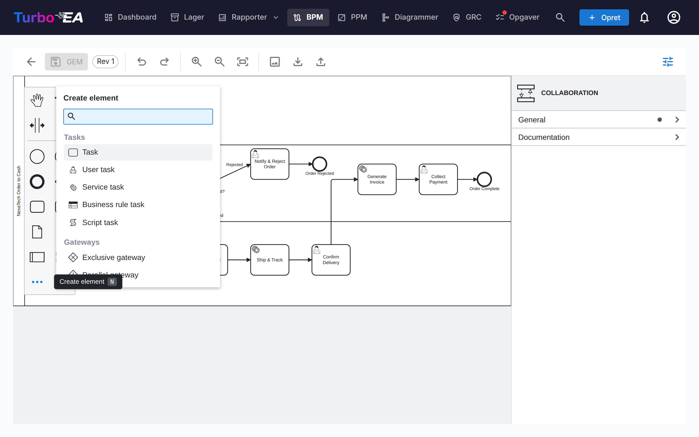
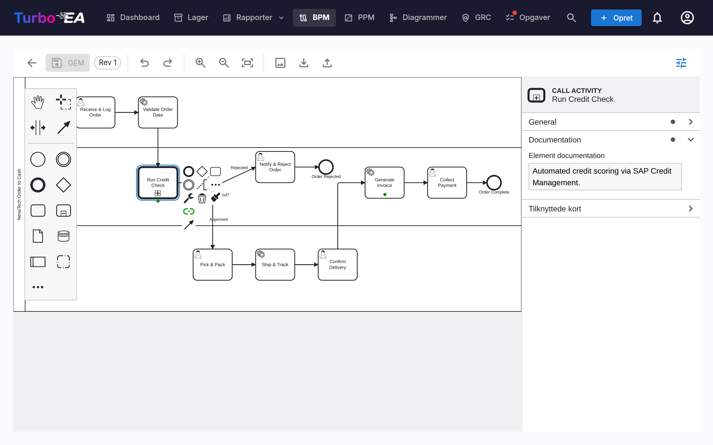
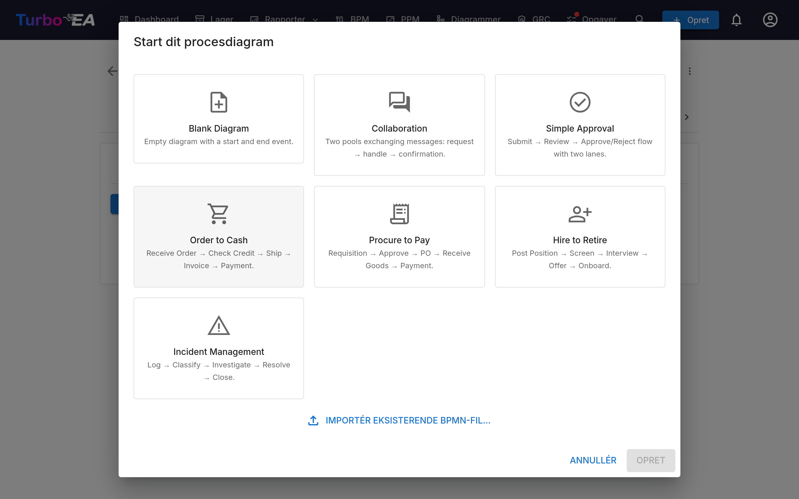
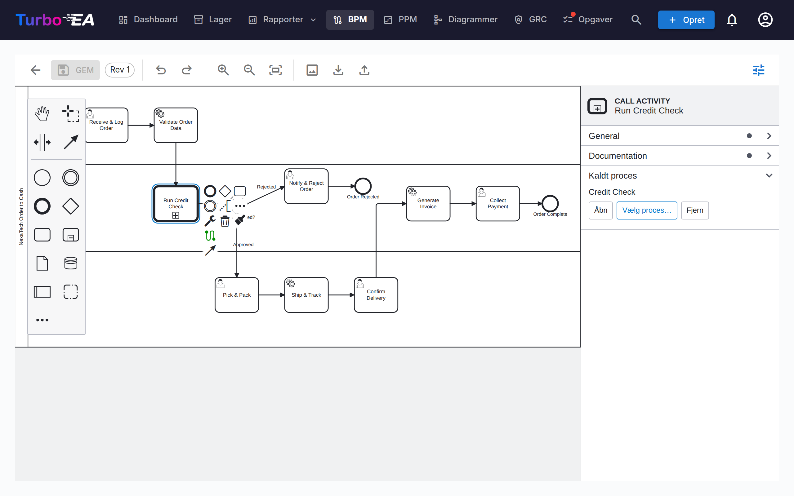

# Forretningsprocesstyring (BPM)

**BPM**-modulet gør det muligt at dokumentere, modellere og analysere organisationens **forretningsprocesser**. Det kombinerer visuelle BPMN 2.0-diagrammer med modenhedsvurderinger og rapportering.

!!! note
    BPM-modulet kan slås til eller fra af en administrator i [Indstillinger](../admin/settings.md). Når det er slået fra, skjules BPM-navigation og -funktioner.

## Procesnavigator

**Procesnavigatoren** organiserer processer i tre hovedkategorier:

- **Ledelsesprocesser** — Planlægning, styring og kontrol
- **Kerneforretningsprocesser** — Primære værdiskabende aktiviteter
- **Støtteprocesser** — Aktiviteter der understøtter kerneforretningen

**Filtre:** Type, Modenhed (Initial / Defineret / Styret / Optimeret), Automatiseringsniveau, Risiko (Lav / Middel / Høj / Kritisk), Dybde (L1 / L2 / L3).

Kort med et publiceret BPMN-diagram viser et **flow-ikon** — klik på det for at åbne diagrammet i fuld skærm uden at forlade navigatoren (eller for at springe derfra til den fulde flow-editor).

**Kolonnelayout:** værktøjslinjen har en **kolonnevælger** — én, to eller tre kolonner — så du kan gøre proceskortene bredere eller få mere af en række på skærmen. En række strækkes aldrig over flere kolonner, end den har processer, og valget huskes mellem besøg. Valget forplanter sig også til de indlejrede niveauer, én kolonne færre pr. niveau, så dybe processer ikke længere klemmes sammen til smalle striber.

**Offentliggørelse:** Procesnavigatoren kan offentliggøres som en skrivebeskyttet [webportal](../admin/web-portals.md), så folk uden en Turbo EA-konto — nye medarbejdere, revisorer, partnere — kan gennemse proceshuset og åbne hvert offentliggjort BPMN-flow.

## BPM-dashboard

**BPM-dashboardet** giver et ledelsesoverblik over processtatus:

| Indikator | Beskrivelse |
|-----------|-------------|
| **Antal processer** | Samlet antal dokumenterede forretningsprocesser |
| **Diagramdækning** | Procentdel af processer med et tilknyttet BPMN-diagram |
| **Høj risiko** | Antal processer med højt risikoniveau |
| **Kritisk risiko** | Antal processer med kritisk risikoniveau |

Diagrammer viser fordeling efter procestype, modenhedsniveau og automatiseringsniveau. En tabel med **øverste risikoprocesser** hjælper med at prioritere investeringer.

## Procesflow-editor

Hvert forretningsproceskort kan have et **BPMN 2.0-procesflowdiagram**. Editoren bruger [bpmn-js](https://bpmn.io/) og tilbyder:

- **Visuel modellering** — Træk og slip BPMN-elementer fra paletten: opgaver, hændelser, gateways, baner, pools og underprocesser. Punktet **…** nederst i paletten åbner en søgbar **Create element**-menu, der når alle BPMN-elementtyper — besked-, timer-, signal-, fejl- og eskaleringshændelser, transaktioner, hændelsesunderprocesser, kaldeaktiviteter, sende-/modtageopgaver, dataobjekter og datalagre (genvej `N`). Punktet **+** i kontekstpanelet for en markeret figur åbner den tilsvarende **Append element**-menu (genvej `A`)
- **Skabeloner** — Vælg blandt 7 forudbyggede BPMN-skabeloner til almindelige procesmønstre, herunder en **Samarbejds**-skabelon med to pools og beskedflows (eller start fra et blankt lærred)
- **Element­udtrækning** — Når du gemmer et diagram, udtrækker systemet automatisk alle opgaver, hændelser, gateways, baner, dataobjekter og beskedflows til analyse. Hændelser beholder deres art — en *besked*-starthændelse vises som en sådan med navnet på den besked, den modtager — og sende-/modtageopgaver bærer den besked, de udveksler. De udtrukne elementer vises i **procesforløbets rækkefølge** — langs diagrammets sekvens- og beskedforløb med start i starthændelsen — og ikke grupperet efter elementtype. Trin i en løkke holdes samlet, indholdet af en underproces vises lige under den, og dataobjekter og datalagre kommer til sidst
- **Elementfarver** — Markér et eller flere elementer, og brug malerbøtte-knappen i kontekstpanelet for at give dem en farve. Farverne gemmes i selve BPMN-filen, så de vises også i den skrivebeskyttede fremviser, i eksporter og på udskrifter
- **Egenskabspanel** — Panelet til højre (vis eller skjul det med skyderknappen i værktøjslinjen) redigerer det, en figur ikke kan vise: elementets navn og dokumentation, den **besked**, det **signal**, den **fejl** eller den **eskalering**, en hændelse henviser til, betingelsen på et sekvensflow og multi-instans-markører. Dokumentation indtastet her vises i procesnavigatoren og i den skrivebeskyttede fremviser

### Pools og beskedflows

En proces, der spænder over flere parter — en kunde og virksomheden, to afdelinger, et partnersystem — modelleres som et **samarbejde**: én pool pr. part, forbundet med **beskedflows**. Tilføj en anden pool fra paletten (eller start fra **Samarbejds**-skabelonen), og tegn så et beskedflow mellem de to pools med det globale forbindelsesværktøj, eller fra en sendeopgave, en beskedsluthændelse eller en beskedkasthændelse i den ene pool til en modtageopgave eller beskedhændelse i den anden. Navngiv beskeden i egenskabspanelet, så den læses ens overalt.

### Element-linking

BPMN-elementer kan **linkes til EA-kort**. For eksempel kan du linke en opgave i dit procesdiagram til den applikation, der understøtter den. Det skaber en sporbar forbindelse mellem din procesmodel og dit arkitekturlandskab:

- Hver navngiven opgave, hændelse og gateway i det udgivne flow er en række i tabellen **Procestrin og elementer** under diagrammet (et udkast har samme tabel under **Forhåndslink elementer**, som anvendes, når udkastet godkendes)
- Klik på cellen **Application**, **Data Object** eller **IT Component** for et trin og vælg kortet — vælgeren gennemser inventaret, så intet indtastes i hånden
- Linket gemmes på trinnet og opretter en relation mellem processen og kortet, så det er synligt i både procesflowet og kortets fane Relationer
- Kolonnen **Forretningsproces** forbinder et trin med den proces, det giver videre til — se nedenfor

### Tilknyt et trin til en proces

Et trin giver ofte videre til en proces, der findes i sin egen ret — en med eget diagram, egen ejer og egen livscyklus, som typisk genbruges flere steder. Ethvert trin kan sige det: en opgave, en underproces, en hændelse eller en gateway peger på et **Forretningsproces**-kort, og du indtaster aldrig et proces-id i hånden:

- **Egenskabspanelet** viser en gruppe **Tilknyttet proces** på hvert trin med **Vælg proces…**, **Åbn** (som borer ned i den tilknyttede proces' flow) og **Fjern**
- **Kontekstmenuen** for et valgt trin har punktet **Tilknyt proces**, til når panelet er foldet sammen
- **Trintabellen** for det udgivne flow (og forhåndslink-tabellen for et udkast) har samme link i kolonnen **Forretningsproces**, og chippen dér borer ned i den tilknyttede proces' fane Procesflow. Dataobjekter og datalagre er ikke trin, så deres rækker viser en tankestreg

BPMN har én konstruktion, der *er* en anden proces: **kaldeaktiviteten** (call activity), en opgave med tyk kant, der kalder en selvstændigt defineret proces. En indlejret **underproces** grupperer også trin, men hører til det diagram, den er tegnet i; reglen fra Method & Style er enkel: findes processen selvstændigt, så brug en kaldeaktivitet. Turbo EA behandler den som det oprindelige tilfælde — **når du placerer en kaldeaktivitet, bliver du spurgt, hvilken proces den kalder**, og tilknytningen gemmes i BPMN's eget *kaldte element*, som andre værktøjer kan læse. Ethvert andet trin gemmer i stedet tilknytningen som en Turbo EA-attribut i diagrammet.

Udgivelse af et flow med et tilknyttet trin opretter en **kalder**-relation mellem de to processer — den tilknyttede proces' fane Relationer viser *kaldes af*, og afhængighedsvisningen tegner kaldgrafen. Et diagram importeret fra et andet værktøj beholder værktøjets egen procesreference; trintabellen viser den som et hint (*refererer til Process_X*), indtil du vælger den tilsvarende proces i Turbo EA.

### Beskedflows

Det udgivne diagrams beskedflows vises under elementtabellen; hvert viser, hvad det forbinder — en opgave, en hændelse eller en hel pool i hver ende. Knyt et beskedflow til det **Interface**-kort, der bærer det. Ligesom organisationslinks på trin er dette kun til orientering: der oprettes ingen relation mellem kort.

### Link organisationer

Kolonnen *Organisation* i trintabellen linker trin til organisationskort, lige ved siden af Application / Data Object / IT Component. I modsætning til disse enkeltværdi-links kan et trin linkes til **flere** organisationer — vælg dem én ad gangen, og fjern dem enkeltvis. Trinlinks er kun informative — de dokumenterer, hvilke organisationer der er involveret i et trin, uden at oprette nogen relation mellem kortene; relationer mellem Forretningsproces og Organisation håndteres separat på kortets Relationer-fane. Banenavne forbliver ren fri tekst fra diagrammet og er ikke forbundet med organisationskort. **Proces × Organisation-matrixen** i BPM-rapporterne aggregerer disse links på tværs af alle processer.

### Godkendelses­arbejdsproces

Procesflowdiagrammer følger en versionsstyret godkendelsesproces:

| Status | Beskrivelse |
|--------|-------------|
| **Kladde** | Under redigering, endnu ikke sendt til gennemgang |
| **Afventer** | Indsendt til godkendelse, afventer gennemgang |
| **Publiceret** | Godkendt og synlig som den aktuelle version |
| **Arkiveret** | Tidligere publiceret version, afløst af en nyere godkendelse |
| **Tilbagetrukket** | Tidligere publiceret version, bevidst afpubliceret |

Når en kladde indsendes, oprettes et versionsøjebliksbillede. Godkendere kan godkende (publicere) eller afvise indsendelsen.

#### Hvem kan godkende

At godkende eller afvise en indsendt revision kræver tilladelsen **Godkend eller afvis indsendte BPMN-flowversioner** eller interessentrollen **Procesejer** på selve processen. Det er ikke nok at kunne redigere kladder.

!!! warning "Ændret i 2.43.0"
    Tidligere udgaver accepterede den generelle BPM-redigeringstilladelse her, så ethvert medlem kunne godkende ethvert procesflow — også en revision, de selv havde indsendt et øjeblik forinden. Hvis der i din installation i dag godkendes af personer, som kun har BPM-redigeringsrettigheder, så tildel dem enten **Godkend eller afvis indsendte BPMN-flowversioner** under Administration → Roller, eller udpeg dem som **Procesejer** på de processer, de godkender.

#### Træk en publiceret version tilbage

En godkendelse givet ved en fejl kan omgøres uden at slette processen. Tilbagetrækning kræver tilladelsen **Træk en publiceret BPMN-flowversion tilbage (afpublicer)**, som **ingen rolle har som standard** — en administrator tildeler den under Administration → Roller eller på interessentrollen **Procesejer** under Administration → Metamodel.

Når tilladelsen er givet, får den publicerede version en **Træk tilbage**-knap. Tilbagetrækning kræver en skriftlig begrundelse og derefter:

- flyttes revisionen til **Tilbagetrukket** — den slettes aldrig og sendes aldrig tilbage til kladde;
- bevares den oprindelige godkendelse: fanen *Arkiveret* viser revisionen, hvem der godkendte den og hvornår, ved siden af hvem der trak den tilbage og hvorfor;
- registreres tilbagetrækningen med sin begrundelse på kortets fane **Historik**;
- **åbnes en kopi som en ny kladde** med det næste revisionsnummer, så du kan rette diagrammet og sende det gennem indsend → godkend igen;
- står processen uden *godkendt* flow, indtil den kladde er godkendt;
- forbliver de udtrukne procestrin og deres kortlinks urørte.

At bevare den tilbagetrukne revision og redigere en kopi er bevidst: præcis det diagram, en godkender skrev under på, kan stadig hentes frem, hvilket er, hvad et kvalitetssystem forventer — og du får alligevel straks en arbejdskopi.

Enhver arkiveret eller tilbagetrukket version kan tages op igen når som helst med **Opret ny kladde ud fra denne** på fanen *Arkiveret*, som kloner den til en kladde med det næste revisionsnummer.

## Procesvurderinger

Forretningsproceskort understøtter **vurderinger**, der scorer processen på:

- **Effektivitet** — Hvor godt processen bruger ressourcer
- **Virkning** — Hvor godt processen opnår sine mål
- **Compliance** — Hvor godt processen opfylder regulatoriske krav

Vurderingsdata indgår i BPM-rapporterne.

## BPM-rapporter

Tre specialiserede rapporter er tilgængelige fra BPM-dashboardet:

- **Modenhedsrapport** — Fordeling af processer efter modenhedsniveau, tendenser over tid
- **Risikorapport** — Risikovurderings­overblik, der fremhæver processer, der kræver opmærksomhed
- **Automatiseringsrapport** — Analyse af automatiseringsniveauer på tværs af proceslandskabet
- **Proces × Organisation-matrix** — Hvilke organisationer udfører trin i hvilke processer, med filtrering pr. organisation og trin-drill-down pr. proces (baseret på de informative trinlinks; kortrelationer indgår ikke)
