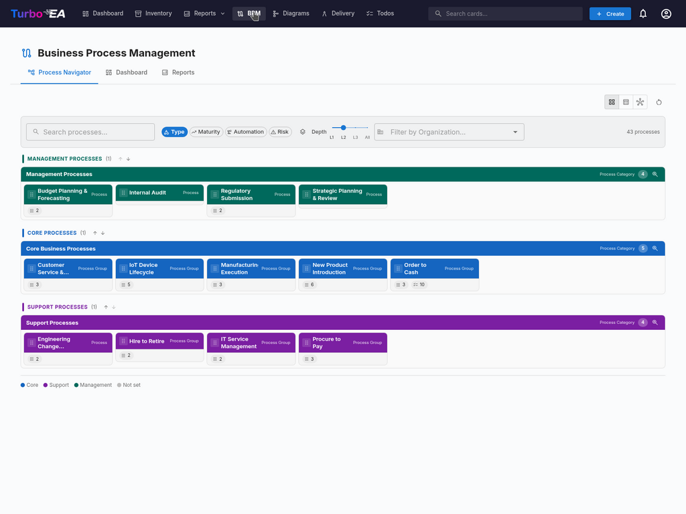
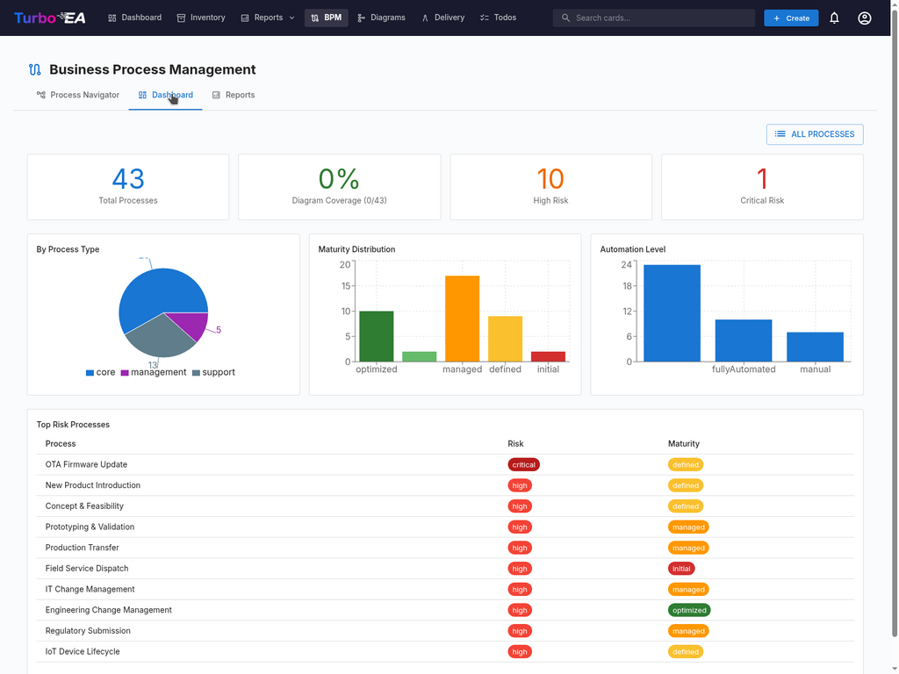

# Geschäftsprozessmanagement (BPM)

Das **BPM**-Modul ermöglicht die Dokumentation, Modellierung und Analyse der **Geschäftsprozesse** einer Organisation. Es kombiniert visuelle BPMN 2.0 Diagramme mit Reifegradbeurteilungen und Berichtswesen.

!!! note
    Das BPM-Modul kann von einem Administrator in den [Einstellungen](../admin/settings.md) aktiviert oder deaktiviert werden. Wenn deaktiviert, sind BPM-Navigation und -Funktionen ausgeblendet.

## Prozessnavigator

Der **Prozessnavigator** organisiert Prozesse in drei Hauptkategorien:

- **Managementprozesse** — Planung, Governance und Steuerung
- **Kerngeschäftsprozesse** — Primäre wertschöpfende Aktivitäten
- **Unterstützungsprozesse** — Aktivitäten, die den Kerngeschäftsbetrieb unterstützen

**Filter:** Typ, Reifegrad (Initial / Definiert / Gesteuert / Optimiert), Automatisierungsgrad, Risiko (Niedrig / Mittel / Hoch / Kritisch), Tiefe (L1 / L2 / L3).

## BPM-Dashboard

Das **BPM-Dashboard** bietet eine Führungsübersicht über den Prozessstatus:

| Indikator | Beschreibung |
|-----------|-------------|
| **Gesamtprozesse** | Gesamtzahl der dokumentierten Geschäftsprozesse |
| **Diagrammabdeckung** | Prozentsatz der Prozesse mit einem zugehörigen BPMN-Diagramm |
| **Hohes Risiko** | Anzahl der Prozesse mit hohem Risikoniveau |
| **Kritisches Risiko** | Anzahl der Prozesse mit kritischem Risikoniveau |

Diagramme zeigen die Verteilung nach Prozesstyp, Reifegrad und Automatisierungsgrad. Eine **Top-Risikoprozesse**-Tabelle hilft bei der Priorisierung von Investitionen.

## Prozessfluss-Editor

Jede Geschäftsprozess-Karte kann ein **BPMN 2.0 Prozessflussdiagramm** haben. Der Editor verwendet [bpmn-js](https://bpmn.io/) und bietet:

- **Visuelle Modellierung** — BPMN-Elemente per Drag & Drop: Aufgaben, Ereignisse, Gateways, Bahnen und Teilprozesse
- **Startervorlagen** — Wählen Sie aus 6 vorgefertigten BPMN-Vorlagen für gängige Prozessmuster (oder beginnen Sie mit einer leeren Zeichenfläche)
- **Elementextraktion** — Wenn Sie ein Diagramm speichern, extrahiert das System automatisch alle Aufgaben, Ereignisse, Gateways und Bahnen zur Analyse

### Elementverknüpfung

BPMN-Elemente können mit **EA-Karten verknüpft** werden. Verknüpfen Sie beispielsweise eine Aufgabe in Ihrem Prozessdiagramm mit der Anwendung, die sie unterstützt. Dies schafft eine nachvollziehbare Verbindung zwischen Ihrem Prozessmodell und Ihrer Architekturlandschaft:

- Wählen Sie eine beliebige Aufgabe, ein Ereignis oder ein Gateway im BPMN-Diagramm
- Das **Elementverknüpfungs**-Panel zeigt passende Karten (Anwendung, Datenobjekt, IT-Komponente)
- Verknüpfen Sie das Element mit einer Karte — die Verbindung wird gespeichert und ist sowohl im Prozessfluss als auch in den Beziehungen der Karte sichtbar

### Genehmigungsworkflow

Prozessflussdiagramme folgen einem versionsgesteuerten Genehmigungsworkflow:

| Status | Beschreibung |
|--------|-------------|
| **Entwurf** | Wird bearbeitet, noch nicht zur Überprüfung eingereicht |
| **Ausstehend** | Zur Genehmigung eingereicht, wartet auf Überprüfung |
| **Veröffentlicht** | Genehmigt und als aktuelle Version sichtbar |
| **Archiviert** | Zuvor veröffentlichte Version, für die Historie aufbewahrt |

Das Einreichen eines Entwurfs erstellt einen Versions-Schnappschuss. Genehmiger können die Einreichung genehmigen (veröffentlichen) oder ablehnen (mit Kommentaren).

## Prozessbeurteilungen

Geschäftsprozess-Karten unterstützen **Beurteilungen**, die den Prozess in folgenden Bereichen bewerten:

- **Effizienz** — Wie gut der Prozess Ressourcen nutzt
- **Effektivität** — Wie gut der Prozess seine Ziele erreicht
- **Compliance** — Wie gut der Prozess regulatorische Anforderungen erfüllt

Beurteilungsdaten fließen in die BPM-Berichte ein.

## BPM-Berichte

Drei spezialisierte Berichte sind über das BPM-Dashboard verfügbar:

- **Reifegradbericht** — Verteilung der Prozesse nach Reifegrad, Trends über die Zeit
- **Risikobericht** — Risikobewertungsübersicht, Hervorhebung von Prozessen, die Aufmerksamkeit erfordern
- **Automatisierungsbericht** — Analyse der Automatisierungsgrade in der Prozesslandschaft
