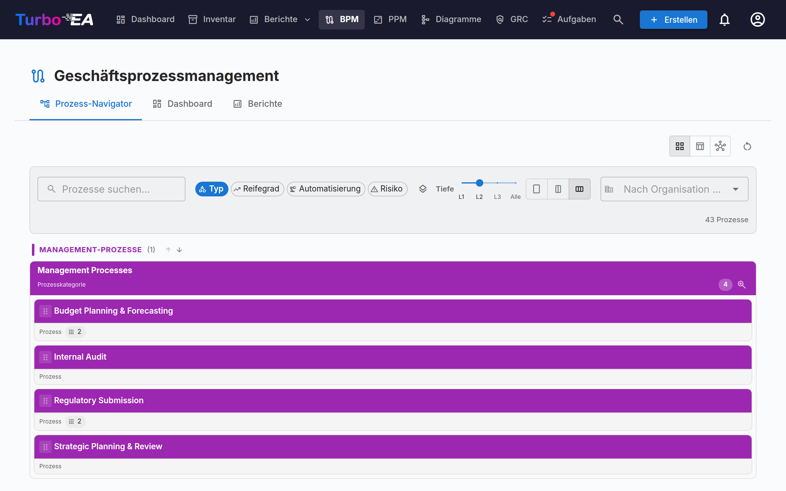
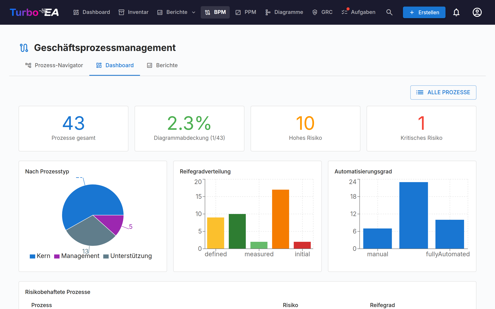
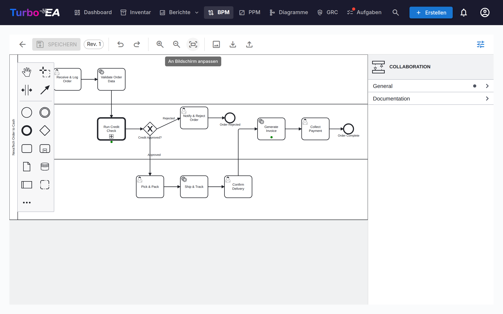
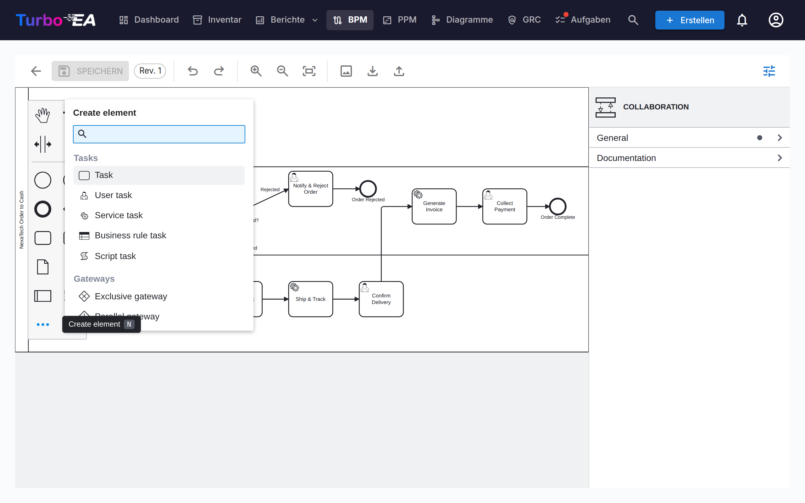
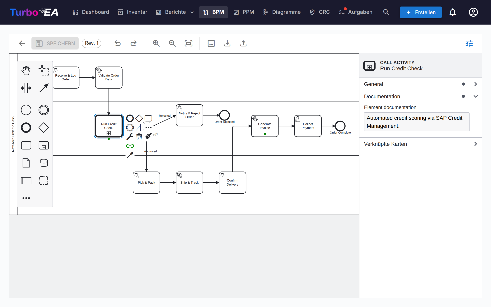
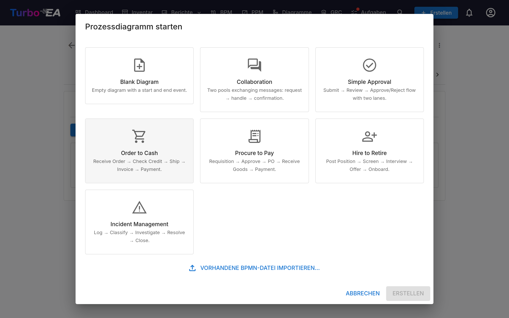

# Geschäftsprozessmanagement (BPM)

Das **BPM**-Modul ermöglicht die Dokumentation, Modellierung und Analyse der **Geschäftsprozesse** einer Organisation. Es kombiniert visuelle BPMN 2.0 Diagramme mit Reifegradbeurteilungen und Berichtswesen.

!!! note
    Das BPM-Modul kann von einem Administrator in den [Einstellungen](../admin/settings.md) aktiviert oder deaktiviert werden. Wenn deaktiviert, sind BPM-Navigation und -Funktionen ausgeblendet.

## Prozessnavigator

Der **Prozessnavigator** organisiert Prozesse in drei Hauptkategorien:

- **Managementprozesse** — Planung, Governance und Steuerung
- **Kerngeschäftsprozesse** — Primäre wertschöpfende Aktivitäten
- **Unterstützungsprozesse** — Aktivitäten, die den Kerngeschäftsbetrieb unterstützen

**Filter:** Typ, Reifegrad (Initial / Definiert / Gesteuert / Optimiert), Automatisierungsgrad, Risiko (Niedrig / Mittel / Hoch / Kritisch), Tiefe (L1 / L2 / L3).

Karten mit einem veröffentlichten BPMN-Diagramm zeigen ein **Ablaufsymbol** — klicken Sie darauf, um das Diagramm im Vollbild zu öffnen, ohne den Navigator zu verlassen (oder von dort zum vollständigen Ablauf-Editor zu springen).

**Spaltenlayout:** Die Werkzeugleiste enthält eine **Spaltenauswahl** — eine, zwei oder drei Spalten —, mit der Sie die Prozesskarten verbreitern oder mehr einer Zeile auf den Bildschirm bringen. Eine Zeile wird nie über mehr Spalten gestreckt, als sie Prozesse enthält, und die Auswahl bleibt zwischen Besuchen erhalten. Die Auswahl wirkt auch auf die verschachtelten Ebenen — jeweils eine Spalte weniger pro Ebene —, sodass tiefe Prozesse beim Aufklappen nicht mehr zu schmalen Streifen zusammengedrückt werden.

**Veröffentlichung:** Der Prozessnavigator kann als schreibgeschütztes [Web-Portal](../admin/web-portals.md) veröffentlicht werden, sodass Personen ohne Turbo-EA-Konto — neue Mitarbeitende, Prüfer, Partner — das Prozesshaus durchsuchen und jeden veröffentlichten BPMN-Ablauf öffnen können.

## BPM-Dashboard

Das **BPM-Dashboard** bietet eine Führungsübersicht über den Prozessstatus:

| Indikator | Beschreibung |
|-----------|-------------|
| **Gesamtprozesse** | Gesamtzahl der dokumentierten Geschäftsprozesse |
| **Diagrammabdeckung** | Prozentsatz der Prozesse mit einem zugehörigen BPMN-Diagramm |
| **Hohes Risiko** | Anzahl der Prozesse mit hohem Risikoniveau |
| **Kritisches Risiko** | Anzahl der Prozesse mit kritischem Risikoniveau |

Diagramme zeigen die Verteilung nach Prozesstyp, Reifegrad und Automatisierungsgrad. Eine **Top-Risikoprozesse**-Tabelle hilft bei der Priorisierung von Investitionen.

## Prozessfluss-Editor

Jede Geschäftsprozess-Karte kann ein **BPMN 2.0 Prozessflussdiagramm** haben. Der Editor verwendet [bpmn-js](https://bpmn.io/) und bietet:

- **Visuelle Modellierung** — BPMN-Elemente per Drag & Drop aus der Palette: Aufgaben, Ereignisse, Gateways, Bahnen, Pools und Teilprozesse. Der Eintrag **…** am unteren Ende der Palette öffnet ein durchsuchbares Menü **Create element**, das jeden BPMN-Elementtyp erreicht — Nachrichten-, Timer-, Signal-, Fehler- und Eskalationsereignisse, Transaktionen, Ereignis-Teilprozesse, Aufrufaktivitäten, Sende-/Empfangsaufgaben, Datenobjekte und Datenspeicher (Tastenkürzel `N`). Der Eintrag **+** im Kontextmenü einer ausgewählten Form öffnet das passende Menü **Append element** (Tastenkürzel `A`)
- **Startervorlagen** — Wählen Sie aus 7 vorgefertigten BPMN-Vorlagen für gängige Prozessmuster, darunter eine **Kollaborations**-Vorlage mit zwei Pools und Nachrichtenflüssen (oder beginnen Sie mit einer leeren Zeichenfläche)
- **Elementextraktion** — Wenn Sie ein Diagramm speichern, extrahiert das System automatisch alle Aufgaben, Ereignisse, Gateways, Bahnen, Datenobjekte und Nachrichtenflüsse zur Analyse. Ereignisse behalten ihre Art — ein *Nachrichten*-Startereignis wird als solches aufgeführt, mit dem Namen der empfangenen Nachricht — und Sende-/Empfangsaufgaben tragen die ausgetauschte Nachricht. Die extrahierten Elemente werden in der **Reihenfolge des Prozessablaufs** aufgelistet — entlang der Sequenz- und Nachrichtenflüsse des Diagramms, beginnend beim Startereignis — und nicht nach Elementtyp gruppiert. Schritte innerhalb einer Schleife bleiben zusammen, der Inhalt eines Teilprozesses wird direkt darunter aufgeführt, und Datenobjekte sowie Datenspeicher stehen am Ende
- **Elementfarben** — Wählen Sie ein oder mehrere Elemente aus und verwenden Sie die Farbeimer-Schaltfläche im Kontextmenü, um eine Farbe zuzuweisen. Farben werden in der BPMN-Datei selbst gespeichert und erscheinen daher auch im schreibgeschützten Viewer, in Exporten und Ausdrucken
- **Eigenschaftenpanel** — Das Panel rechts (ein-/ausblenden über die Schieberegler-Schaltfläche in der Werkzeugleiste) bearbeitet, was eine Form nicht zeigen kann: Name und Dokumentation des Elements, die **Nachricht**, das **Signal**, den **Fehler** oder die **Eskalation**, auf die sich ein Ereignis bezieht, die Bedingung eines Sequenzflusses und Mehrfachinstanz-Markierungen. Hier eingegebene Dokumentation erscheint im Prozessnavigator und im schreibgeschützten Viewer

### Pools und Nachrichtenflüsse

Ein Prozess, der mehrere Parteien umfasst — ein Kunde und das Unternehmen, zwei Abteilungen, ein Partnersystem — wird als **Kollaboration** modelliert: ein Pool pro Partei, verbunden durch **Nachrichtenflüsse**. Fügen Sie einen zweiten Pool aus der Palette hinzu (oder starten Sie mit der **Kollaborations**-Vorlage) und zeichnen Sie dann mit dem globalen Verbindungswerkzeug einen Nachrichtenfluss zwischen den beiden Pools — oder von einer Sendeaufgabe, einem Nachrichten-Endereignis oder einem sendenden Nachrichtenereignis im einen Pool zu einer Empfangsaufgabe oder einem Nachrichtenereignis im anderen. Benennen Sie die Nachricht im Eigenschaftenpanel, damit sie überall gleich heißt.

### Elementverknüpfung

BPMN-Elemente können mit **EA-Karten verknüpft** werden. Verknüpfen Sie beispielsweise eine Aufgabe in Ihrem Prozessdiagramm mit der Anwendung, die sie unterstützt. Dies schafft eine nachvollziehbare Verbindung zwischen Ihrem Prozessmodell und Ihrer Architekturlandschaft:

- Wählen Sie eine beliebige Aufgabe, ein Ereignis oder ein Gateway im BPMN-Diagramm
- Das **Elementverknüpfungs**-Panel zeigt passende Karten (Anwendung, Datenobjekt, IT-Komponente, Organisation)
- Verknüpfen Sie das Element mit einer Karte — die Verbindung wird gespeichert und ist sowohl im Prozessfluss als auch in den Beziehungen der Karte sichtbar

### Nachrichtenflüsse

Die Nachrichtenflüsse des veröffentlichten Diagramms werden unter der Elementtabelle aufgelistet; jeder zeigt, was er verbindet — eine Aufgabe, ein Ereignis oder einen ganzen Pool an beiden Enden. Verknüpfen Sie einen Nachrichtenfluss mit der **Schnittstellen**-Karte, die ihn überträgt. Wie die Organisationsverknüpfungen an Schritten ist dies nur informativ: Es wird keine Beziehung zwischen Karten angelegt.

### Organisationen verknüpfen

Die Spalte *Organisation* in der Schritttabelle verknüpft Schritte mit Organisationskarten, direkt neben Anwendung / Datenobjekt / IT-Komponente. Anders als diese Einzelverknüpfungen kann ein Schritt mit **mehreren** Organisationen verknüpft werden — wählen Sie sie einzeln aus und entfernen Sie sie einzeln. Schrittverknüpfungen sind rein informativ — sie dokumentieren, welche Organisationen an einem Schritt beteiligt sind, ohne eine Beziehung zwischen den Karten zu erzeugen; Beziehungen zwischen Geschäftsprozess und Organisation werden separat im Reiter „Beziehungen“ der Karte gepflegt. Lane-Namen bleiben reiner Freitext aus dem Diagramm und sind nicht mit Organisationskarten verbunden. Die **Prozess-×-Organisation-Matrix** in den BPM-Berichten aggregiert diese Verknüpfungen über alle Prozesse hinweg.

### Genehmigungsworkflow

Prozessablaufdiagramme folgen einem versionierten Genehmigungsworkflow:

| Status | Beschreibung |
|--------|--------------|
| **Entwurf** | In Bearbeitung, noch nicht zur Prüfung eingereicht |
| **Ausstehend** | Zur Genehmigung eingereicht, Prüfung ausstehend |
| **Veröffentlicht** | Freigegeben und als aktuelle Version sichtbar |
| **Archiviert** | Zuvor veröffentlichte Version, durch eine neuere Freigabe ersetzt |
| **Zurückgezogen** | Zuvor veröffentlichte Version, bewusst zurückgezogen |

Beim Einreichen eines Entwurfs wird ein Versionsstand erzeugt. Genehmigende können die Einreichung freigeben (veröffentlichen) oder ablehnen.

#### Wer freigeben darf

Das Freigeben oder Ablehnen einer eingereichten Revision erfordert die Berechtigung **Eingereichte BPMN-Ablaufversionen freigeben oder ablehnen** oder die Stakeholder-Rolle **Prozessverantwortlicher** auf dem Prozess selbst. Das Bearbeiten von Entwürfen genügt nicht.

!!! warning "Geändert in 2.43.0"
    Frühere Versionen akzeptierten hier die allgemeine BPM-Bearbeitungsberechtigung, sodass jedes Mitglied jeden Prozessablauf freigeben konnte — auch eine Revision, die es kurz zuvor selbst eingereicht hatte. Wenn in Ihrer Installation heute Personen mit reinen BPM-Bearbeitungsrechten freigeben, erteilen Sie ihnen entweder unter Administration → Rollen die Berechtigung **Eingereichte BPMN-Ablaufversionen freigeben oder ablehnen** oder weisen Sie sie den betreffenden Prozessen als **Prozessverantwortlicher** zu.

#### Eine veröffentlichte Version zurückziehen

Eine versehentlich erteilte Freigabe lässt sich rückgängig machen, ohne den Prozess zu löschen. Dafür ist die Berechtigung **Veröffentlichte BPMN-Ablaufversion zurückziehen** erforderlich, die **standardmäßig keine Rolle besitzt** — sie wird unter Administration → Rollen vergeben oder für die Stakeholder-Rolle **Prozessverantwortlicher** unter Administration → Metamodell.

Sobald die Berechtigung erteilt ist, erhält die veröffentlichte Version eine Schaltfläche **Zurückziehen**. Das Zurückziehen verlangt eine schriftliche Begründung und bewirkt dann:

- Die Revision wechselt zu **Zurückgezogen** — sie wird niemals gelöscht und nie in den Entwurfsstatus zurückgesetzt.
- Die ursprüngliche Freigabe bleibt dokumentiert: der Reiter *Archiviert* zeigt die Revision, wer sie freigegeben hat und wann, zusammen mit dem Zurückziehenden und der Begründung.
- Das Zurückziehen wird mit seiner Begründung im Reiter **Verlauf** der Karte festgehalten.
- Eine Kopie wird **als neuer Entwurf** mit der nächsten Revisionsnummer geöffnet, damit Sie das Diagramm korrigieren und erneut über Einreichen → Freigeben laufen lassen können.
- Der Prozess hat keinen *freigegebenen* Ablauf, bis dieser Entwurf freigegeben ist.
- Die extrahierten Prozessschritte und ihre Kartenverknüpfungen bleiben unverändert.

Dass die zurückgezogene Revision erhalten bleibt und nur eine Kopie bearbeitet wird, ist Absicht: So bleibt genau das Diagramm abrufbar, das eine freigebende Person unterzeichnet hat — was ein Qualitätssystem erwartet — und Sie erhalten trotzdem sofort eine Arbeitskopie.

Jede archivierte oder zurückgezogene Version lässt sich jederzeit über **Neuen Entwurf hieraus erstellen** im Reiter *Archiviert* wieder aufgreifen; sie wird dann als neuer Entwurf mit der nächsten Revisionsnummer geklont.

## Prozessbeurteilungen

Geschäftsprozess-Karten unterstützen **Beurteilungen**, die den Prozess in folgenden Bereichen bewerten:

- **Effizienz** — Wie gut der Prozess Ressourcen nutzt
- **Effektivität** — Wie gut der Prozess seine Ziele erreicht
- **Compliance** — Wie gut der Prozess regulatorische Anforderungen erfüllt

Beurteilungsdaten fließen in die BPM-Berichte ein.

## BPM-Berichte

Drei spezialisierte Berichte sind über das BPM-Dashboard verfügbar:

- **Reifegradbericht** — Verteilung der Prozesse nach Reifegrad, Trends über die Zeit
- **Risikobericht** — Risikobewertungsübersicht, Hervorhebung von Prozessen, die Aufmerksamkeit erfordern
- **Automatisierungsbericht** — Analyse der Automatisierungsgrade in der Prozesslandschaft
- **Prozess-×-Organisation-Matrix** — Welche Organisationen Schritte in welchen Prozessen ausführen, mit Filterung pro Organisation und Schritt-Drill-down pro Prozess (auf Basis der informativen Schrittverknüpfungen; Kartenbeziehungen sind nicht enthalten)
