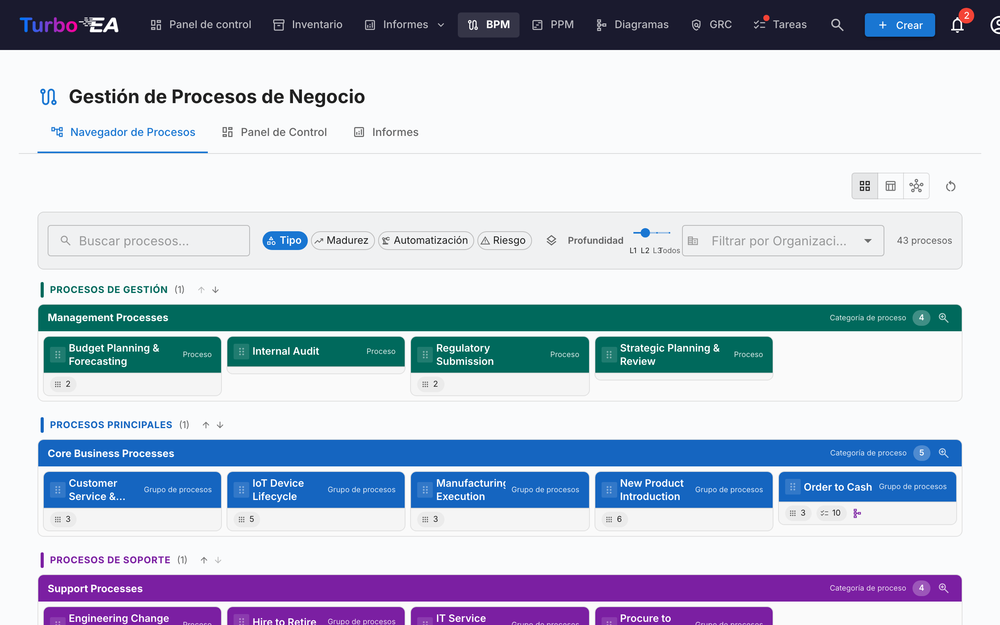
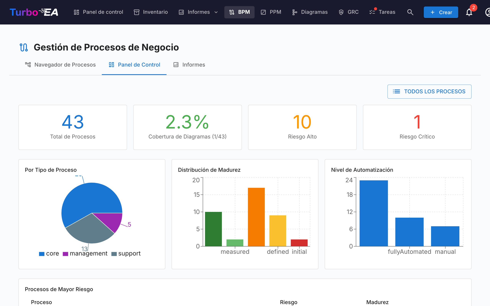

# Gestión de Procesos de Negocio (BPM)

El módulo **BPM** permite documentar, modelar y analizar los **procesos de negocio** de la organización. Combina diagramas visuales BPMN 2.0 con evaluaciones de madurez e informes.

!!! note
    El módulo BPM puede ser habilitado o deshabilitado por un administrador en [Configuración](../admin/settings.es.md). Cuando está deshabilitado, la navegación y las funcionalidades de BPM se ocultan.

## Navegador de Procesos

El **Navegador de Procesos** organiza los procesos en tres categorías principales:

- **Procesos de Gestión** — Planificación, gobernanza y control
- **Procesos de Negocio Principal** — Actividades primarias de creación de valor
- **Procesos de Soporte** — Actividades que apoyan las operaciones del negocio principal

**Filtros:** Tipo, Madurez (Inicial / Definido / Gestionado / Optimizado), Nivel de automatización, Riesgo (Bajo / Medio / Alto / Crítico), Profundidad (L1 / L2 / L3).

## Panel de Control BPM

El **Panel de Control BPM** ofrece una visión ejecutiva del estado de los procesos:

| Indicador | Descripción |
|-----------|-------------|
| **Total de Procesos** | Número total de procesos de negocio documentados |
| **Cobertura de Diagramas** | Porcentaje de procesos con un diagrama BPMN asociado |
| **Riesgo Alto** | Número de procesos con nivel de riesgo alto |
| **Riesgo Crítico** | Número de procesos con nivel de riesgo crítico |

Los gráficos muestran la distribución por tipo de proceso, nivel de madurez y nivel de automatización. Una tabla de **procesos con mayor riesgo** ayuda a priorizar las inversiones.

## Editor de Flujo de Proceso

Cada ficha de Proceso de Negocio puede tener un **diagrama de flujo de proceso BPMN 2.0**. El editor utiliza [bpmn-js](https://bpmn.io/) y proporciona:

- **Modelado visual** — Arrastre y suelte elementos BPMN: tareas, eventos, compuertas, carriles y subprocesos
- **Plantillas de inicio** — Elija entre 6 plantillas BPMN predefinidas para patrones de proceso comunes (o comience desde un lienzo en blanco)
- **Extracción de elementos** — Al guardar un diagrama, el sistema extrae automáticamente todas las tareas, eventos, compuertas y carriles para su análisis

### Vinculación de Elementos

Los elementos BPMN pueden ser **vinculados a fichas de EA**. Por ejemplo, vincule una tarea en su diagrama de proceso a la Aplicación que la soporta. Esto crea una conexión trazable entre su modelo de proceso y su panorama de arquitectura:

- Seleccione cualquier tarea, evento o compuerta en el diagrama BPMN
- El panel de **Vinculador de Elementos** muestra fichas coincidentes (Aplicación, Objeto de Datos, Componente TI)
- Vincule el elemento a una ficha — la conexión se almacena y es visible tanto en el flujo de proceso como en las relaciones de la ficha

### Flujo de Aprobación

Los diagramas de flujo de proceso siguen un flujo de aprobación con control de versiones:

| Estado | Descripción |
|--------|-------------|
| **Borrador** | En edición, aún no enviado para revisión |
| **Pendiente** | Enviado para aprobación, en espera de revisión |
| **Publicado** | Aprobado y visible como la versión actual |
| **Archivado** | Versión publicada anteriormente, conservada para el historial |

Al enviar un borrador se crea una instantánea de versión. Los aprobadores pueden aprobar (publicar) o rechazar (con comentarios) el envío.

## Evaluaciones de Proceso

Las fichas de Proceso de Negocio soportan **evaluaciones** que califican el proceso en:

- **Eficiencia** — Qué tan bien el proceso utiliza los recursos
- **Efectividad** — Qué tan bien el proceso logra sus objetivos
- **Cumplimiento** — Qué tan bien el proceso cumple con los requisitos regulatorios

Los datos de las evaluaciones alimentan los Informes BPM.

## Informes BPM

Tres informes especializados están disponibles desde el Panel de Control BPM:

- **Informe de Madurez** — Distribución de procesos por nivel de madurez, tendencias a lo largo del tiempo
- **Informe de Riesgos** — Vista general de la evaluación de riesgos, destacando los procesos que necesitan atención
- **Informe de Automatización** — Análisis de los niveles de automatización en todo el panorama de procesos
