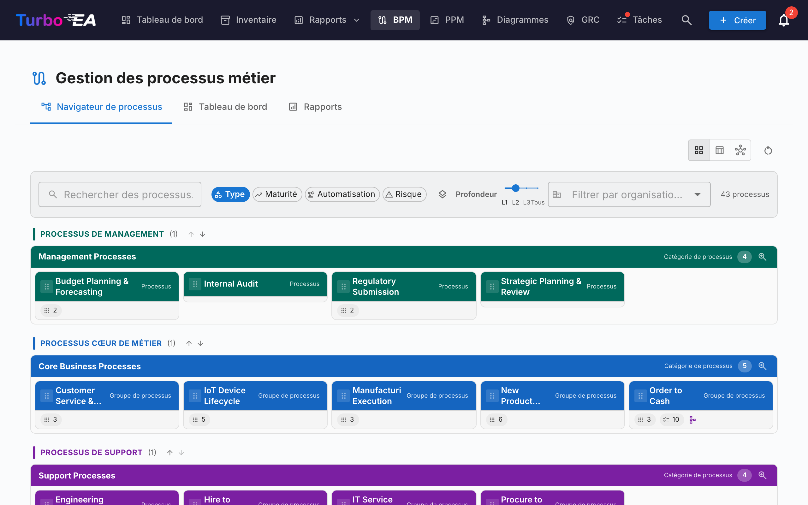
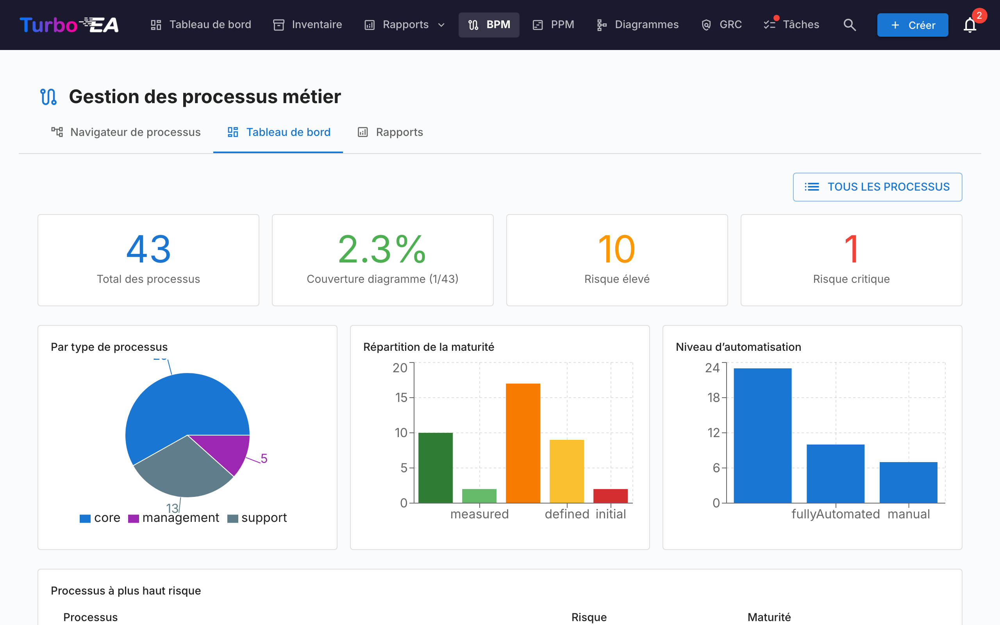
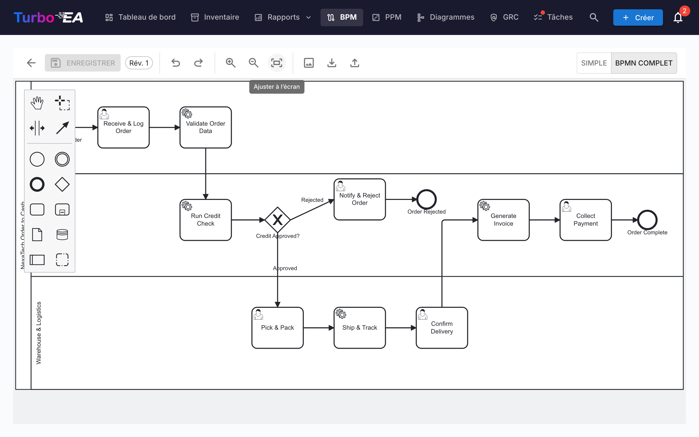

# Gestion des processus métier (BPM)

Le module **BPM** permet de documenter, modéliser et analyser les **processus métier** de l'organisation. Il combine des diagrammes visuels BPMN 2.0 avec des évaluations de maturité et des rapports.

!!! note
    Le module BPM peut être activé ou désactivé par un administrateur dans les [Paramètres](../admin/settings.md). Lorsqu'il est désactivé, la navigation et les fonctionnalités BPM sont masquées.

## Navigateur de processus

Le **Navigateur de processus** organise les processus en trois catégories principales :

- **Processus de management** -- Planification, gouvernance et contrôle
- **Processus métier principaux** -- Activités principales de création de valeur
- **Processus de support** -- Activités qui soutiennent les opérations métier principales

**Filtres :** Type, Maturité (Initial / Défini / Géré / Optimisé), Niveau d'automatisation, Risque (Faible / Moyen / Élevé / Critique), Profondeur (L1 / L2 / L3).

Les cartes disposant d'un diagramme BPMN publié affichent une **icône de flux** — cliquez dessus pour ouvrir le diagramme en plein écran sans quitter le navigateur (ou pour accéder de là à l'éditeur de flux complet).

## Tableau de bord BPM

Le **Tableau de bord BPM** fournit une vue exécutive de l'état des processus :

| Indicateur | Description |
|------------|-------------|
| **Total des processus** | Nombre total de processus métier documentés |
| **Couverture des diagrammes** | Pourcentage de processus avec un diagramme BPMN associé |
| **Risque élevé** | Nombre de processus avec un niveau de risque élevé |
| **Risque critique** | Nombre de processus avec un niveau de risque critique |

Les graphiques montrent la répartition par type de processus, niveau de maturité et niveau d'automatisation. Un tableau des **processus à risque élevé** aide à prioriser les investissements.

## Éditeur de flux de processus

Chaque fiche Processus Métier peut avoir un **diagramme de flux de processus BPMN 2.0**. L'éditeur utilise [bpmn-js]( et offre :)

- **Modélisation visuelle** -- Glisser-déposer des éléments BPMN : tâches, événements, passerelles, couloirs et sous-processus
- **Modèles de démarrage** -- Choisir parmi 6 modèles BPMN préconstruits pour des schémas de processus courants (ou commencer à partir d'un canevas vierge)
- **Extraction d'éléments** -- Lorsque vous sauvegardez un diagramme, le système extrait automatiquement toutes les tâches, événements, passerelles et couloirs pour analyse

### Liaison d'éléments

Les éléments BPMN peuvent être **liés à des fiches EA**. Par exemple, lier une tâche dans votre diagramme de processus à l'Application qui la supporte. Cela crée une connexion traçable entre votre modèle de processus et votre paysage d'architecture :

- Sélectionnez n'importe quelle tâche, événement ou passerelle dans le diagramme BPMN
- Le panneau **Liaison d'éléments** affiche les fiches correspondantes (Application, Objet de Données, Composant IT)
- Liez l'élément à une fiche -- la connexion est stockée et visible à la fois dans le flux de processus et dans les relations de la fiche

### Workflow d'approbation

Les diagrammes de flux de processus suivent un workflow d'approbation avec contrôle de version :

| Statut | Description |
|--------|-------------|
| **Brouillon** | En cours d'édition, pas encore soumis pour examen |
| **En attente** | Soumis pour approbation, en attente d'examen |
| **Publié** | Approuvé et visible comme version actuelle |
| **Archivé** | Version précédemment publiée, conservée pour l'historique |

Soumettre un brouillon crée un instantané de version. Les approbateurs peuvent approuver (publier) ou rejeter (avec commentaires) la soumission.

## Évaluations de processus

Les fiches Processus Métier prennent en charge des **évaluations** qui notent le processus sur :

- **Efficience** -- Dans quelle mesure le processus utilise les ressources
- **Efficacité** -- Dans quelle mesure le processus atteint ses objectifs
- **Conformité** -- Dans quelle mesure le processus respecte les exigences réglementaires

Les données d'évaluation alimentent les rapports BPM.

## Rapports BPM

Trois rapports spécialisés sont disponibles depuis le tableau de bord BPM :

- **Rapport de maturité** -- Répartition des processus par niveau de maturité, tendances dans le temps
- **Rapport de risque** -- Vue d'ensemble de l'évaluation des risques, mettant en évidence les processus qui nécessitent une attention
- **Rapport d'automatisation** -- Analyse des niveaux d'automatisation dans le paysage des processus
