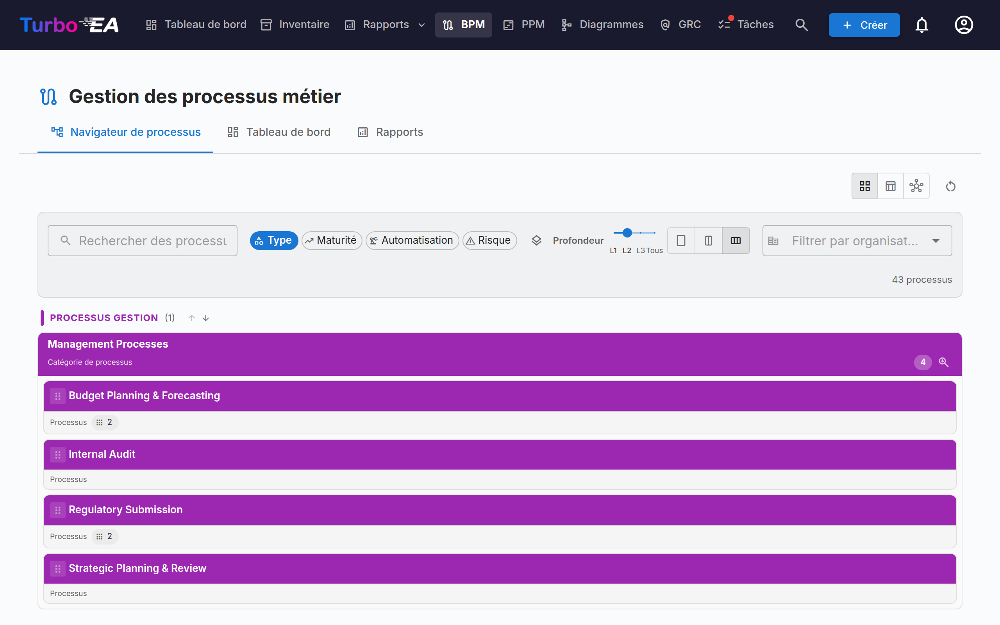
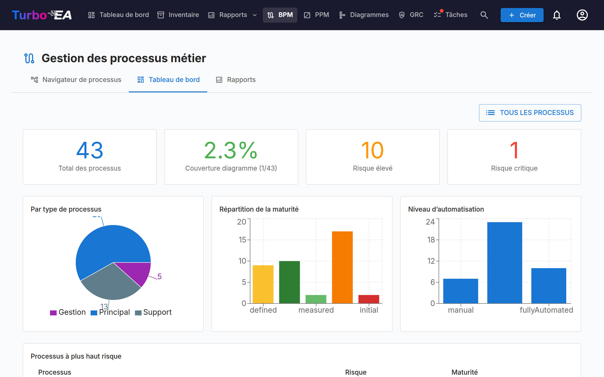
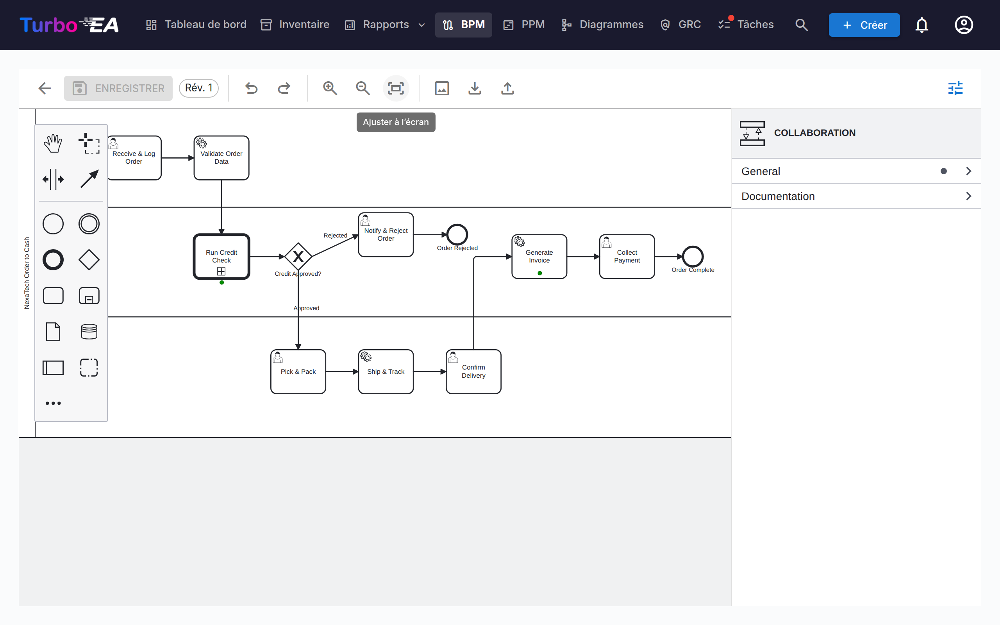
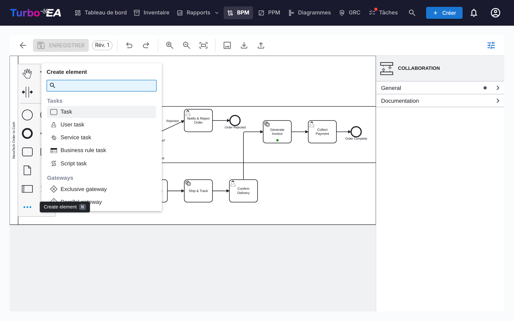
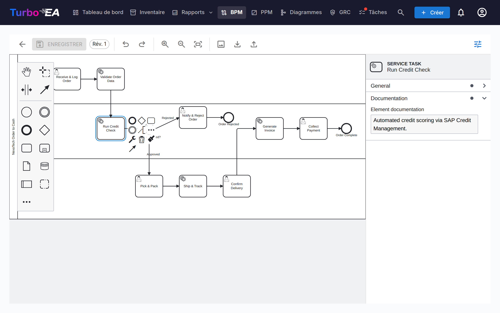
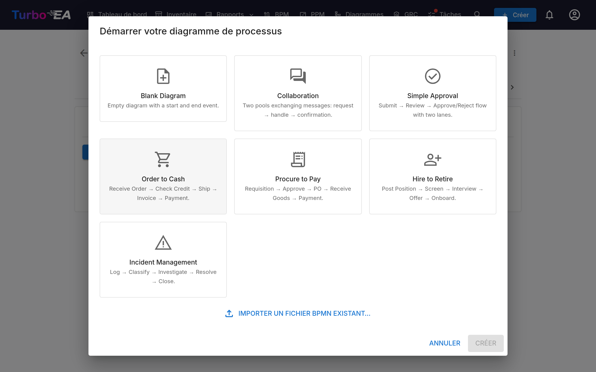
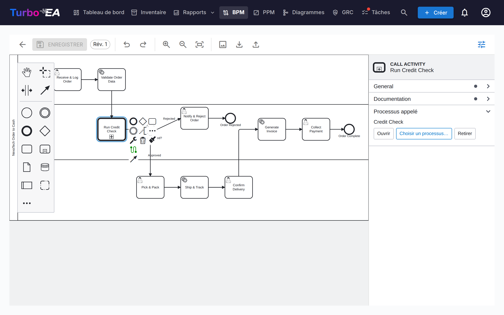

# Gestion des processus métier (BPM)

Le module **BPM** permet de documenter, modéliser et analyser les **processus métier** de l'organisation. Il combine des diagrammes visuels BPMN 2.0 avec des évaluations de maturité et des rapports.

!!! note
    Le module BPM peut être activé ou désactivé par un administrateur dans les [Paramètres](../admin/settings.md). Lorsqu'il est désactivé, la navigation et les fonctionnalités BPM sont masquées.

## Navigateur de processus

Le **Navigateur de processus** organise les processus en trois catégories principales :

- **Processus de management** -- Planification, gouvernance et contrôle
- **Processus métier principaux** -- Activités principales de création de valeur
- **Processus de support** -- Activités qui soutiennent les opérations métier principales

**Filtres :** Type, Maturité (Initial / Défini / Géré / Optimisé), Niveau d'automatisation, Risque (Faible / Moyen / Élevé / Critique), Profondeur (L1 / L2 / L3).

Les fiches disposant d'un diagramme BPMN publié affichent une **icône de flux** — cliquez dessus pour ouvrir le diagramme en plein écran sans quitter le navigateur (ou pour accéder de là à l'éditeur de flux complet).

**Disposition en colonnes :** la barre d'outils propose un **sélecteur de colonnes** — une, deux ou trois colonnes — pour élargir les fiches de processus ou faire tenir davantage d'une ligne à l'écran. Une ligne n'est jamais étirée sur plus de colonnes qu'elle ne compte de processus, et le choix est mémorisé d'une visite à l'autre. Le choix se propage aussi aux niveaux imbriqués, une colonne de moins par niveau, de sorte que les processus profonds ne sont plus réduits à de fines bandes.

**Publication :** le Navigateur de processus peut être publié comme [portail web](../admin/web-portals.md) en lecture seule, afin que des personnes sans compte Turbo EA — nouveaux arrivants, auditeurs, partenaires — puissent parcourir la maison des processus et ouvrir chaque flux BPMN publié.

## Tableau de bord BPM

Le **Tableau de bord BPM** fournit une vue exécutive de l'état des processus :

| Indicateur | Description |
|------------|-------------|
| **Total des processus** | Nombre total de processus métier documentés |
| **Couverture des diagrammes** | Pourcentage de processus avec un diagramme BPMN associé |
| **Risque élevé** | Nombre de processus avec un niveau de risque élevé |
| **Risque critique** | Nombre de processus avec un niveau de risque critique |

Les graphiques montrent la répartition par type de processus, niveau de maturité et niveau d'automatisation. Un tableau des **processus à risque élevé** aide à prioriser les investissements.

## Éditeur de flux de processus

Chaque fiche Processus Métier peut avoir un **diagramme de flux de processus BPMN 2.0**. L'éditeur utilise [bpmn-js](https://bpmn.io/) et offre :

- **Modélisation visuelle** -- Glisser-déposer des éléments BPMN depuis la palette : tâches, événements, passerelles, couloirs, pools et sous-processus. L'entrée **…** en bas de la palette ouvre un menu **Create element** avec recherche qui donne accès à tous les types d'éléments BPMN -- événements de message, minuterie, signal, erreur et escalade, transactions, sous-processus événementiels, activités d'appel, tâches d'envoi/réception, objets et magasins de données (raccourci `N`). L'entrée **+** de la palette contextuelle d'une forme sélectionnée ouvre le menu **Append element** correspondant (raccourci `A`)
- **Modèles de démarrage** -- Choisir parmi 7 modèles BPMN préconstruits pour des schémas de processus courants, dont un modèle **Collaboration** à deux pools avec flux de messages (ou commencer à partir d'un canevas vierge)
- **Extraction d'éléments** -- Lorsque vous sauvegardez un diagramme, le système extrait automatiquement toutes les tâches, événements, passerelles, couloirs, objets de données et flux de messages pour analyse. Les événements conservent leur nature -- un événement de début de type *message* est listé comme tel, avec le nom du message reçu -- et les tâches d'envoi/réception portent le message échangé. Les éléments extraits sont listés dans l'**ordre du déroulement du processus** -- en suivant les flux de séquence et de message du diagramme, à partir de l'événement de début -- et non regroupés par type d'élément. Les étapes d'une boucle restent groupées, le contenu d'un sous-processus est listé juste en dessous de celui-ci, et les objets et magasins de données viennent en dernier
- **Couleurs des éléments** -- Sélectionnez un ou plusieurs éléments et utilisez le bouton pot de peinture de la palette contextuelle pour appliquer une couleur. Les couleurs sont enregistrées dans le fichier BPMN lui-même : elles apparaissent donc aussi dans la visionneuse en lecture seule, les exports et les impressions
- **Panneau des propriétés** -- Le panneau de droite (afficher/masquer avec le bouton curseurs de la barre d'outils) édite ce qu'une forme ne peut pas montrer : le nom et la documentation de l'élément, le **message**, le **signal**, l'**erreur** ou l'**escalade** auquel un événement fait référence, la condition d'un flux de séquence et les marqueurs multi-instance. La documentation saisie ici est affichée dans le navigateur de processus et dans la visionneuse en lecture seule

### Pools et flux de messages

Un processus qui implique plusieurs parties -- un client et l'entreprise, deux services, un système partenaire -- se modélise comme une **collaboration** : un pool par partie, reliés par des **flux de messages**. Ajoutez un second pool depuis la palette (ou partez du modèle **Collaboration**), puis tracez un flux de message entre les deux pools avec l'outil de connexion global, ou depuis une tâche d'envoi, un événement de fin de message ou un événement de message émetteur d'un pool vers une tâche de réception ou un événement de message de l'autre. Nommez le message dans le panneau des propriétés pour qu'il se lise de la même façon partout.

### Flux de messages

Les flux de messages du diagramme publié sont listés sous le tableau des éléments ; chacun indique ce qu'il relie -- une tâche, un événement ou un pool entier à chaque extrémité. Liez un flux de message à la fiche **Interface** qui le transporte. Comme les liens d'organisation sur les étapes, c'est informatif uniquement : aucune relation n'est créée entre les fiches.

### Liaison d'éléments

Les éléments BPMN peuvent être **liés à des fiches EA**. Par exemple, lier une tâche dans votre diagramme de processus à l'Application qui la supporte. Cela crée une connexion traçable entre votre modèle de processus et votre paysage d'architecture :

- Chaque tâche, événement et passerelle nommés du flux publié est une ligne du tableau **Étapes et éléments du processus** sous le diagramme (un brouillon a le même tableau sous **Pré-lier les éléments**, appliqué à l'approbation du brouillon)
- Cliquez sur la cellule **Application**, **Objet de données** ou **Composant IT** d'une étape et choisissez la fiche -- le sélecteur parcourt l'inventaire, rien n'est saisi à la main
- Le lien est enregistré sur l'étape et crée une relation entre le processus et la fiche, visible à la fois dans le flux de processus et dans l'onglet Relations de la fiche
- La colonne **Appelle** lie une **activité d'appel** au processus qu'elle invoque -- voir ci-dessous

### Appeler un autre processus

BPMN n'a qu'un seul construct pour « cette étape est un autre processus » : l'**activité d'appel** (call activity), une tâche au bord épais qui invoque un processus défini de façon autonome -- avec son propre diagramme, son propre responsable et son propre cycle de vie, généralement réutilisé à plusieurs endroits. Un **sous-processus** intégré regroupe aussi des étapes, mais il appartient au diagramme où il est dessiné ; la règle de Method & Style est simple : si le processus existe indépendamment, utilisez une activité d'appel.

Dans Turbo EA, une activité d'appel pointe vers une fiche **Processus métier**, et vous ne saisissez jamais un identifiant de processus à la main :

- **Placer une activité d'appel demande quel processus elle appelle.** Ajoutez-en une depuis le menu Créer un élément et un sélecteur s'ouvre sur les processus métier de l'inventaire -- choisissez le processus appelé, ou annulez pour le lier plus tard
- **Le panneau des propriétés** affiche un groupe **Processus appelé** sur chaque activité d'appel, avec **Choisir un processus…**, **Ouvrir** (qui descend dans le flux du processus appelé) et **Retirer**
- **Le menu contextuel** d'une activité d'appel sélectionnée porte une entrée **Lier un processus**, pour quand le panneau est replié
- **Le tableau des étapes** du flux publié (et le tableau de pré-liaison d'un brouillon) porte le même lien dans sa colonne **Appelle**, et la puce qui s'y trouve descend dans l'onglet Flux de processus du processus appelé

Publier un flux contenant une activité d'appel liée crée une relation **appelle** entre les deux processus -- l'onglet Relations du processus appelé indique *est appelé par*, et la vue des dépendances dessine le graphe d'appels. Un diagramme importé d'un autre outil conserve la référence de processus propre à cet outil ; le tableau des étapes l'affiche comme indice (*référence Process_X*) jusqu'à ce que vous choisissiez le processus correspondant dans Turbo EA.

### Lier des organisations

La colonne *Organisation* du tableau des étapes lie les étapes à des fiches Organisation, juste à côté d'Application / Objet de Données / Composant IT. Contrairement à ces liens à valeur unique, une étape peut être liée à **plusieurs** organisations — choisissez-les une à une et supprimez-les individuellement. Les liens d'étapes sont purement informatifs — ils documentent quelles organisations sont impliquées dans une étape sans créer de relation entre les fiches ; les relations Processus Métier ↔ Organisation se gèrent séparément dans l'onglet Relations de la fiche. Les noms de couloirs restent du simple texte libre issu du diagramme et ne sont pas connectés aux fiches Organisation. La **matrice Processus × Organisation** des rapports BPM agrège ces liens sur l'ensemble des processus.

### Workflow d'approbation

Les diagrammes de flux de processus suivent un workflow d'approbation versionné :

| Statut | Description |
|--------|-------------|
| **Brouillon** | En cours de modification, pas encore soumis |
| **En attente** | Soumis pour approbation, en attente de revue |
| **Publié** | Approuvé et visible comme version courante |
| **Archivé** | Version publiée précédemment, remplacée par une approbation plus récente |
| **Retiré** | Version publiée précédemment, dépubliée volontairement |

Soumettre un brouillon crée un instantané de version. Les approbateurs peuvent approuver (publier) ou rejeter la soumission.

#### Qui peut approuver

Approuver ou rejeter une révision soumise exige la permission **Approuver ou rejeter les versions de flux BPMN soumises**, ou le rôle de partie prenante **Propriétaire du processus** sur le processus lui-même. Pouvoir modifier des brouillons ne suffit pas.

!!! warning "Modifié dans la version 2.43.0"
    Les versions antérieures acceptaient ici la permission générale de modification BPM : n'importe quel membre pouvait donc approuver n'importe quel flux de processus — y compris une révision qu'il venait lui-même de soumettre. Si, dans votre instance, des personnes approuvent aujourd'hui avec de simples droits de modification BPM, accordez-leur la permission **Approuver ou rejeter les versions de flux BPMN soumises** dans Administration → Rôles, ou désignez-les comme **Propriétaire du processus** sur les processus qu'elles valident.

#### Retirer une version publiée

Une approbation donnée par erreur peut être annulée sans supprimer le processus. Le retrait exige la permission **Retirer (dépublier) une version de flux BPMN publiée**, qu'**aucun rôle ne détient par défaut** — un administrateur l'accorde dans Administration → Rôles, ou sur le rôle de partie prenante **Propriétaire du processus** dans Administration → Métamodèle.

Une fois la permission accordée, la version publiée affiche un bouton **Retirer**. Le retrait demande un motif écrit, puis :

- fait passer la révision à **Retiré** — elle n'est jamais supprimée, ni renvoyée à l'état de brouillon ;
- conserve l'approbation d'origine : l'onglet *Archivé* affiche la révision, qui l'a approuvée et quand, à côté de qui l'a retirée et pourquoi ;
- enregistre le retrait, avec son motif, dans l'onglet **Historique** de la fiche ;
- **ouvre une copie en nouveau brouillon** au numéro de révision suivant, pour que vous puissiez corriger le diagramme et le repasser par soumission → approbation ;
- laisse le processus sans flux *approuvé* jusqu'à ce que ce brouillon soit approuvé ;
- laisse intactes les étapes de processus extraites et leurs liens vers les fiches.

Conserver la révision retirée et modifier une copie est délibéré : le diagramme exact qu'un approbateur a validé reste consultable, ce qu'attend un système qualité, tout en vous donnant immédiatement une copie de travail.

Toute version archivée ou retirée peut être reprise à tout moment via **Créer un nouveau brouillon à partir de celle-ci** dans l'onglet *Archivé*, qui la clone en brouillon à la révision suivante.

## Évaluations de processus

Les fiches Processus Métier prennent en charge des **évaluations** qui notent le processus sur :

- **Efficience** -- Dans quelle mesure le processus utilise les ressources
- **Efficacité** -- Dans quelle mesure le processus atteint ses objectifs
- **Conformité** -- Dans quelle mesure le processus respecte les exigences réglementaires

Les données d'évaluation alimentent les rapports BPM.

## Rapports BPM

Trois rapports spécialisés sont disponibles depuis le tableau de bord BPM :

- **Rapport de maturité** -- Répartition des processus par niveau de maturité, tendances dans le temps
- **Rapport de risque** -- Vue d'ensemble de l'évaluation des risques, mettant en évidence les processus qui nécessitent une attention
- **Rapport d'automatisation** -- Analyse des niveaux d'automatisation dans le paysage des processus
- **Matrice Processus × Organisation** -- Quelles organisations exécutent des étapes dans quels processus, avec filtrage par organisation et exploration des étapes par processus (à partir des liens d'étapes informatifs ; les relations entre fiches ne sont pas incluses)
