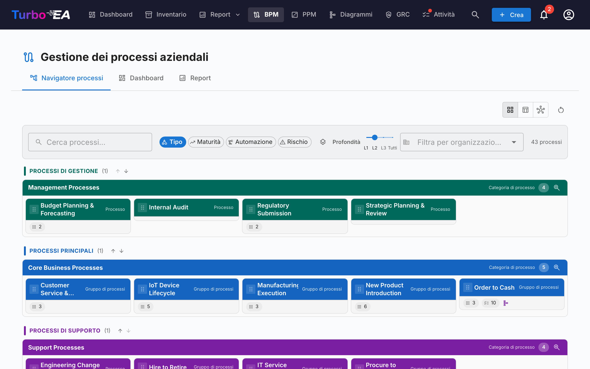
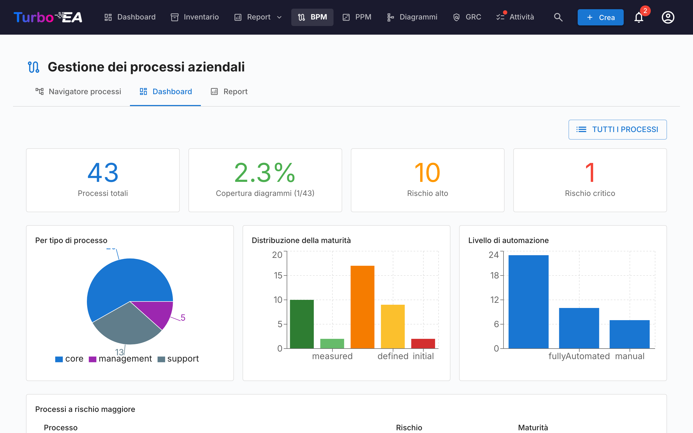
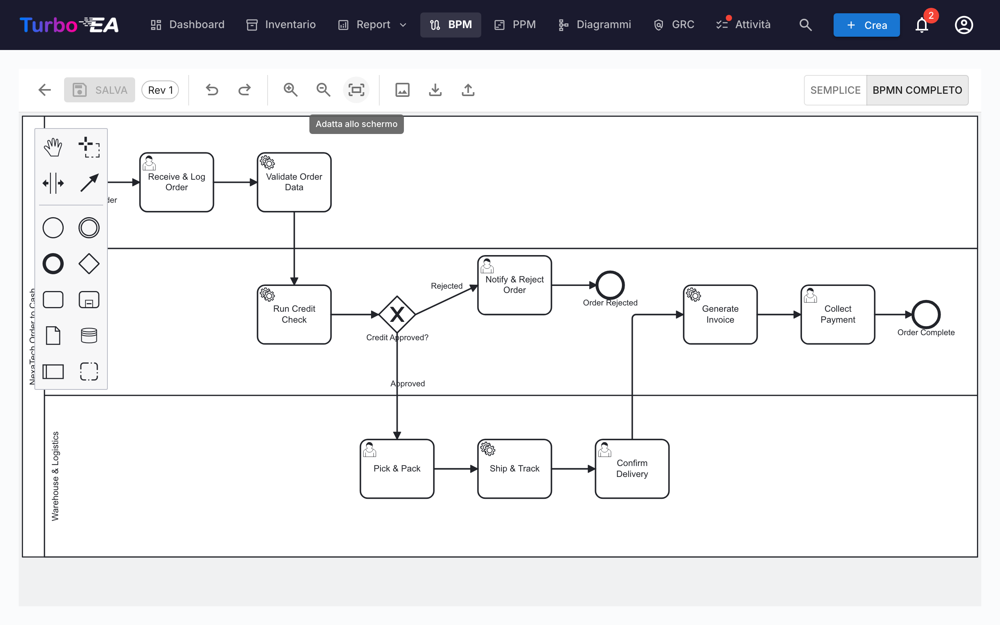

# Business Process Management (BPM)

Il modulo **BPM** consente di documentare, modellare e analizzare i **processi aziendali** dell'organizzazione. Combina diagrammi BPMN 2.0 visivi con valutazioni della maturità e reportistica.

!!! note
    Il modulo BPM può essere abilitato o disabilitato da un amministratore nelle [Impostazioni](../admin/settings.md). Quando disabilitato, la navigazione e le funzionalità BPM sono nascoste.

## Navigatore dei processi

Il **Navigatore dei processi** organizza i processi in tre categorie principali:

- **Processi di gestione** — Pianificazione, governance e controllo
- **Processi aziendali core** — Attività primarie di creazione del valore
- **Processi di supporto** — Attività che supportano le operazioni aziendali core

**Filtri:** Tipo, Maturità (Initial / Defined / Managed / Optimized), Livello di automazione, Rischio (Low / Medium / High / Critical), Profondità (L1 / L2 / L3).

Le schede con un diagramma BPMN pubblicato mostrano un'**icona di flusso**: fai clic su di essa per aprire il diagramma a schermo intero senza lasciare il navigatore (o per passare da lì all'editor di flusso completo).

## Dashboard BPM

La **Dashboard BPM** fornisce una vista esecutiva dello stato dei processi:

| Indicatore | Descrizione |
|------------|-------------|
| **Processi totali** | Numero totale di processi aziendali documentati |
| **Copertura diagrammi** | Percentuale di processi con un diagramma BPMN associato |
| **Rischio alto** | Numero di processi con livello di rischio alto |
| **Rischio critico** | Numero di processi con livello di rischio critico |

I grafici mostrano la distribuzione per tipo di processo, livello di maturità e livello di automazione. Una tabella dei **processi a maggior rischio** aiuta a prioritizzare gli investimenti.

## Editor del flusso di processo

Ogni card Business Process può avere un **diagramma del flusso di processo BPMN 2.0**. L'editor utilizza [bpmn-js]( e fornisce:)

- **Modellazione visiva** — Trascinate elementi BPMN: attività, eventi, gateway, corsie e sotto-processi
- **Template iniziali** — Scegliete tra 6 template BPMN predefiniti per i pattern di processo comuni (o iniziate da una tela bianca)
- **Estrazione degli elementi** — Quando salvate un diagramma, il sistema estrae automaticamente tutte le attività, gli eventi, i gateway e le corsie per l'analisi

### Collegamento degli elementi

Gli elementi BPMN possono essere **collegati alle card EA**. Ad esempio, collegate un'attività nel vostro diagramma di processo all'Application che la supporta. Questo crea una connessione tracciabile tra il vostro modello di processo e il panorama architetturale:

- Selezionate qualsiasi attività, evento o gateway nel diagramma BPMN
- Il pannello **Element Linker** mostra le card corrispondenti (Application, Data Object, IT Component)
- Collegate l'elemento a una card — la connessione è memorizzata e visibile sia nel flusso di processo che nelle relazioni della card

### Workflow di approvazione

I diagrammi del flusso di processo seguono un workflow di approvazione con controllo delle versioni:

| Stato | Descrizione |
|-------|-------------|
| **Draft** | In fase di modifica, non ancora inviato per la revisione |
| **Pending** | Inviato per l'approvazione, in attesa di revisione |
| **Published** | Approvato e visibile come versione corrente |
| **Archived** | Versione precedentemente pubblicata, conservata per la cronologia |

L'invio di una bozza crea uno snapshot della versione. I revisori possono approvare (pubblicare) o rifiutare (con commenti) l'invio.

## Valutazioni dei processi

Le card Business Process supportano **valutazioni** che assegnano un punteggio al processo su:

- **Efficienza** — Quanto bene il processo utilizza le risorse
- **Efficacia** — Quanto bene il processo raggiunge i suoi obiettivi
- **Conformità** — Quanto bene il processo soddisfa i requisiti normativi

I dati delle valutazioni alimentano i Report BPM.

## Report BPM

Tre report specializzati sono disponibili dalla Dashboard BPM:

- **Report Maturità** — Distribuzione dei processi per livello di maturità, tendenze nel tempo
- **Report Rischio** — Panoramica della valutazione del rischio, evidenziando i processi che necessitano attenzione
- **Report Automazione** — Analisi dei livelli di automazione nel panorama dei processi
