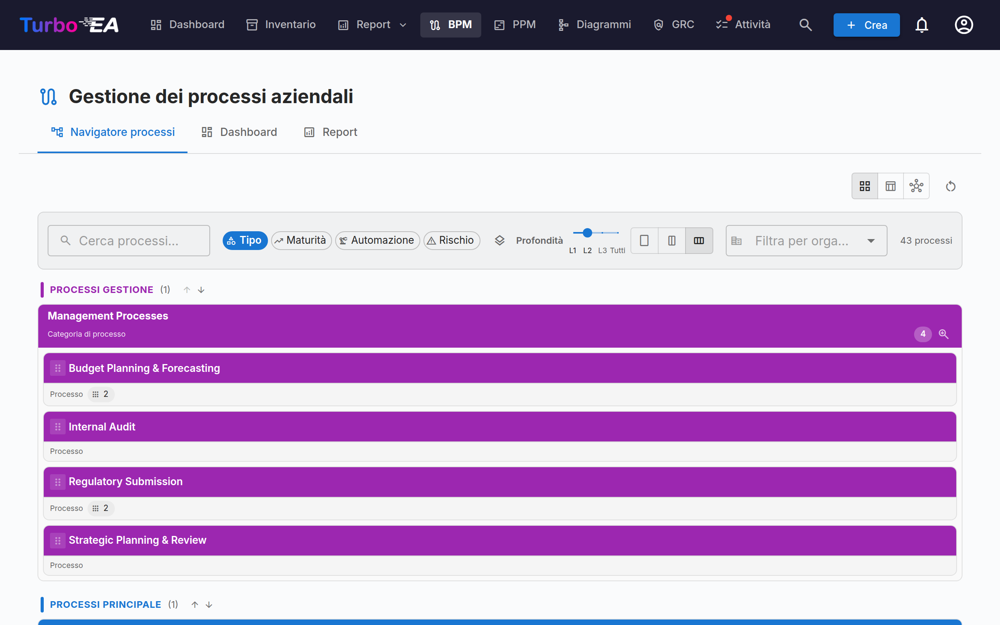
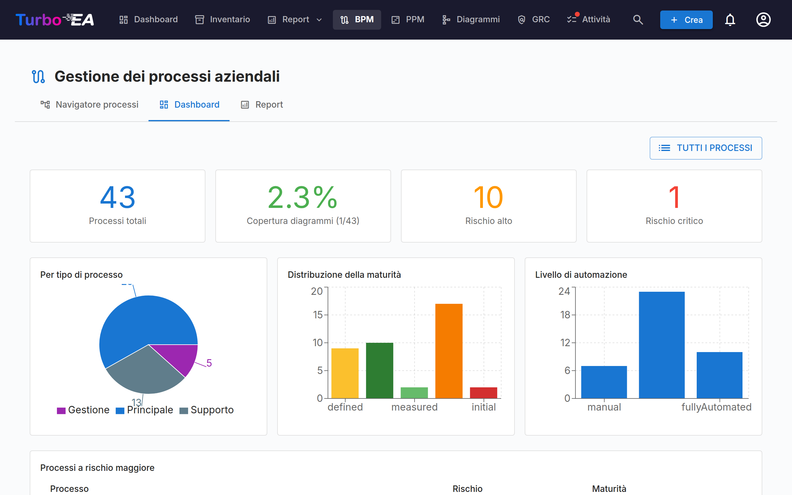
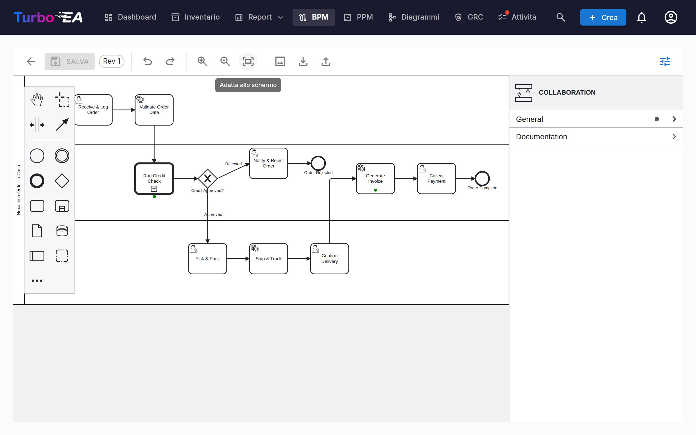

# Business Process Management (BPM)

Il modulo **BPM** consente di documentare, modellare e analizzare i **processi aziendali** dell'organizzazione. Combina diagrammi BPMN 2.0 visivi con valutazioni della maturità e reportistica.

!!! note
    Il modulo BPM può essere abilitato o disabilitato da un amministratore nelle [Impostazioni](../admin/settings.md). Quando disabilitato, la navigazione e le funzionalità BPM sono nascoste.

## Navigatore dei processi

Il **Navigatore dei processi** organizza i processi in tre categorie principali:

- **Processi di gestione** — Pianificazione, governance e controllo
- **Processi aziendali core** — Attività primarie di creazione del valore
- **Processi di supporto** — Attività che supportano le operazioni aziendali core

**Filtri:** Tipo, Maturità (Initial / Defined / Managed / Optimized), Livello di automazione, Rischio (Low / Medium / High / Critical), Profondità (L1 / L2 / L3).

Le schede con un diagramma BPMN pubblicato mostrano un'**icona di flusso**: fai clic su di essa per aprire il diagramma a schermo intero senza lasciare il navigatore (o per passare da lì all'editor di flusso completo).

## Dashboard BPM

La **Dashboard BPM** fornisce una vista esecutiva dello stato dei processi:

| Indicatore | Descrizione |
|------------|-------------|
| **Processi totali** | Numero totale di processi aziendali documentati |
| **Copertura diagrammi** | Percentuale di processi con un diagramma BPMN associato |
| **Rischio alto** | Numero di processi con livello di rischio alto |
| **Rischio critico** | Numero di processi con livello di rischio critico |

I grafici mostrano la distribuzione per tipo di processo, livello di maturità e livello di automazione. Una tabella dei **processi a maggior rischio** aiuta a prioritizzare gli investimenti.

## Editor del flusso di processo

Ogni card Business Process può avere un **diagramma del flusso di processo BPMN 2.0**. L'editor utilizza [bpmn-js]( e fornisce:)

- **Modellazione visiva** — Trascinate elementi BPMN: attività, eventi, gateway, corsie e sotto-processi
- **Template iniziali** — Scegliete tra 6 template BPMN predefiniti per i pattern di processo comuni (o iniziate da una tela bianca)
- **Estrazione degli elementi** — Quando salvate un diagramma, il sistema estrae automaticamente tutte le attività, gli eventi, i gateway e le corsie per l'analisi
- **Colori degli elementi** — Selezionate uno o più elementi e usate il pulsante con il secchiello di vernice nel pannello contestuale per applicare un colore. I colori vengono salvati nel file BPMN stesso, quindi compaiono anche nel visualizzatore di sola lettura, nelle esportazioni e nelle stampe

### Collegamento degli elementi

Gli elementi BPMN possono essere **collegati alle card EA**. Ad esempio, collegate un'attività nel vostro diagramma di processo all'Application che la supporta. Questo crea una connessione tracciabile tra il vostro modello di processo e il panorama architetturale:

- Selezionate qualsiasi attività, evento o gateway nel diagramma BPMN
- Il pannello **Element Linker** mostra le card corrispondenti (Application, Data Object, IT Component, Organization)
- Collegate l'elemento a una card — la connessione è memorizzata e visibile sia nel flusso di processo che nelle relazioni della card

### Collegare le organizzazioni

La colonna *Organizzazione* della tabella dei passaggi collega i passaggi alle card Organization, accanto ad Application / Data Object / IT Component. A differenza di quei collegamenti a valore singolo, un passaggio può essere collegato a **più** organizzazioni — sceglietele una alla volta e rimuovetele singolarmente. I collegamenti dei passaggi sono puramente informativi — documentano quali organizzazioni sono coinvolte in un passaggio senza creare alcuna relazione tra le card; le relazioni Business Process ↔ Organization si gestiscono separatamente nella scheda Relazioni della card. I nomi delle corsie restano semplice testo libero del diagramma e non sono collegati alle card Organization. La **Matrice Processo × Organizzazione** nei Report BPM aggrega questi collegamenti su tutti i processi.

### Workflow di approvazione

I diagrammi di flusso di processo seguono un workflow di approvazione con versionamento:

| Stato | Descrizione |
|-------|-------------|
| **Bozza** | In modifica, non ancora inviata per la revisione |
| **In attesa** | Inviata per l'approvazione, in attesa di revisione |
| **Pubblicata** | Approvata e visibile come versione corrente |
| **Archiviata** | Versione pubblicata in precedenza, sostituita da un'approvazione più recente |
| **Ritirata** | Versione pubblicata in precedenza, ritirata intenzionalmente |

L'invio di una bozza crea uno snapshot di versione. Gli approvatori possono approvare (pubblicare) o rifiutare l'invio.

#### Chi può approvare

Approvare o rifiutare una revisione inviata richiede il permesso **Approva o rifiuta le versioni di flusso BPMN inviate**, oppure il ruolo di stakeholder **Responsabile del processo** sul processo stesso. Poter modificare le bozze non basta.

!!! warning "Modificato nella versione 2.43.0"
    Le versioni precedenti accettavano qui il permesso generale di modifica BPM, per cui qualsiasi membro poteva approvare qualsiasi flusso di processo, inclusa una revisione appena inviata da lui stesso. Se nella vostra istanza approvano oggi persone con i soli diritti di modifica BPM, concedete loro il permesso **Approva o rifiuta le versioni di flusso BPMN inviate** in Amministrazione → Ruoli, oppure assegnatele come **Responsabile del processo** sui processi che convalidano.

#### Ritirare una versione pubblicata

Un'approvazione data per errore può essere annullata senza eliminare il processo. La funzione è **disattivata per impostazione predefinita**; un amministratore la abilita da Pubblicazione controllata dei processi nelle [Impostazioni](../admin/settings.md).

Una volta abilitata e concesso il permesso, la versione pubblicata mostra un pulsante **Ritira**. Il ritiro richiede una motivazione scritta e quindi:

- porta la revisione a **Ritirata**: non viene mai eliminata né riportata a bozza;
- mantiene a registro l'approvazione originale: chi ha approvato e quando restano visibili;
- registra chi ha ritirato, quando e perché, nella cronologia delle versioni e nella scheda **Cronologia** della card;
- lascia il processo **senza flusso approvato** finché non viene inviata e approvata una nuova revisione;
- lascia intatti i passi di processo estratti e i loro collegamenti alle card.

Le versioni archiviate non vengono ripristinate automaticamente. Ripubblicare una revisione più vecchia è a sua volta un'approvazione: createne una nuova bozza, inviatela e fatela approvare.

## Valutazioni dei processi

Le card Business Process supportano **valutazioni** che assegnano un punteggio al processo su:

- **Efficienza** — Quanto bene il processo utilizza le risorse
- **Efficacia** — Quanto bene il processo raggiunge i suoi obiettivi
- **Conformità** — Quanto bene il processo soddisfa i requisiti normativi

I dati delle valutazioni alimentano i Report BPM.

## Report BPM

Tre report specializzati sono disponibili dalla Dashboard BPM:

- **Report Maturità** — Distribuzione dei processi per livello di maturità, tendenze nel tempo
- **Report Rischio** — Panoramica della valutazione del rischio, evidenziando i processi che necessitano attenzione
- **Report Automazione** — Analisi dei livelli di automazione nel panorama dei processi
- **Matrice Processo × Organizzazione** — Quali organizzazioni eseguono passaggi in quali processi, con filtro per organizzazione e drill-down dei passaggi per processo (in base ai collegamenti informativi dei passaggi; le relazioni tra card non sono incluse)
