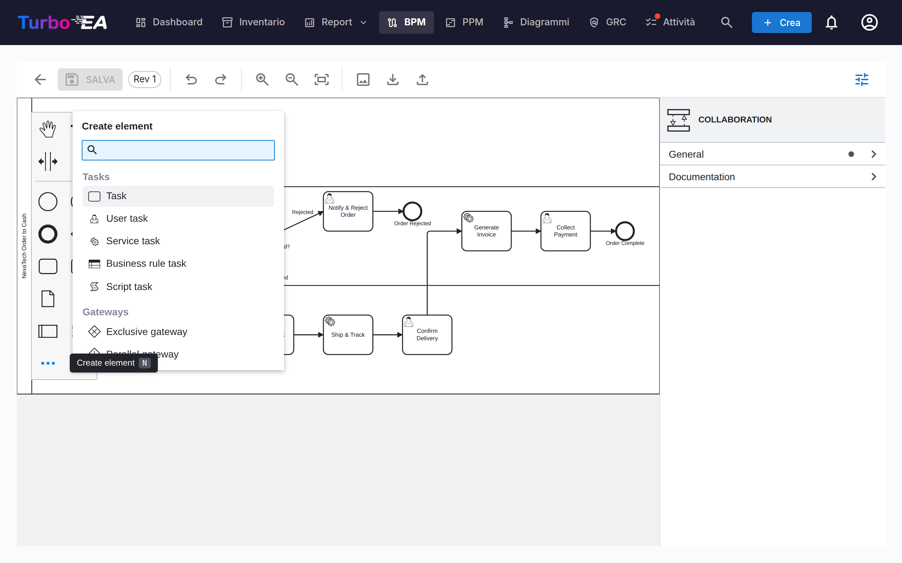
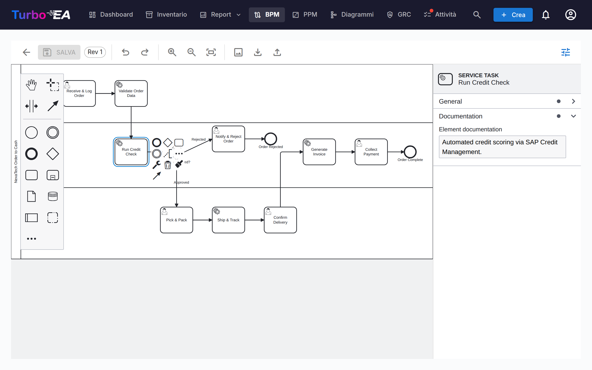
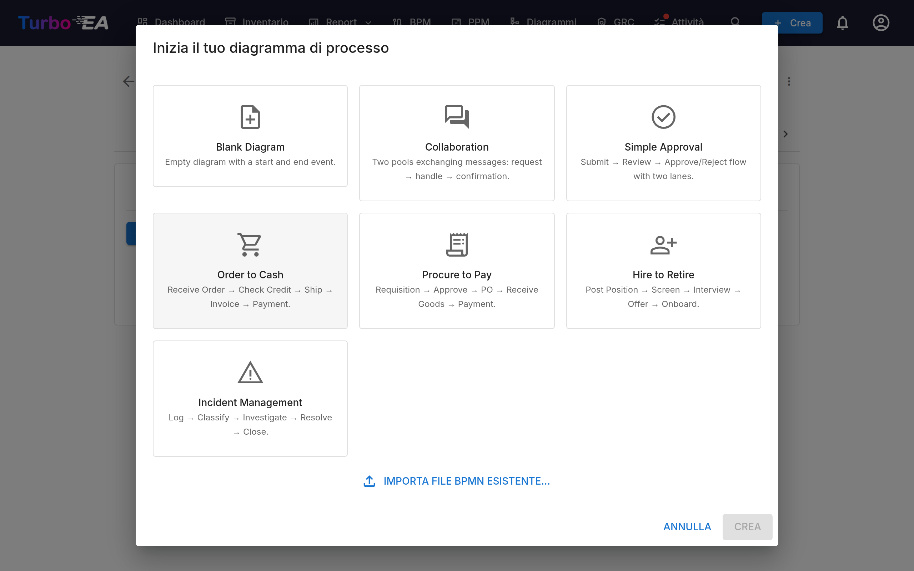
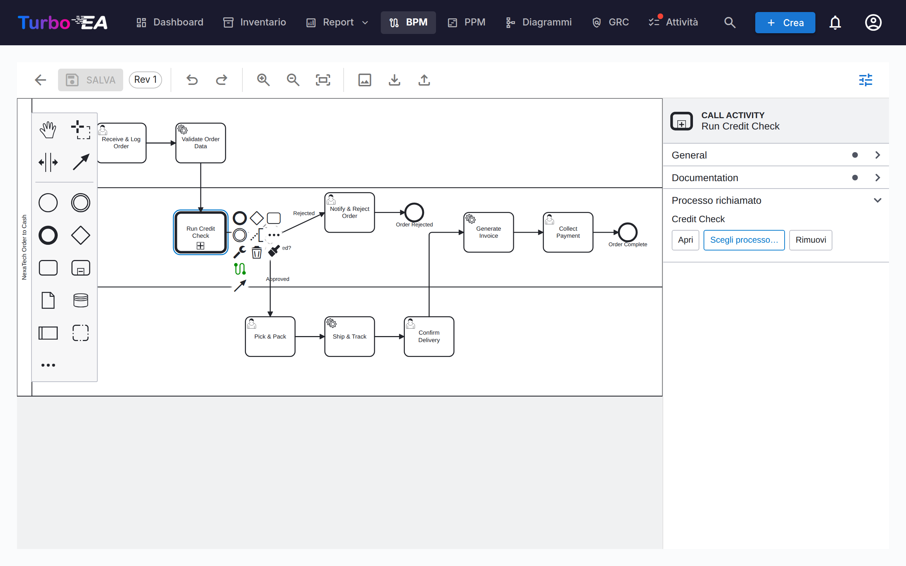

# Business Process Management (BPM)

Il modulo **BPM** consente di documentare, modellare e analizzare i **processi aziendali** dell'organizzazione. Combina diagrammi BPMN 2.0 visivi con valutazioni della maturità e reportistica.

!!! note
    Il modulo BPM può essere abilitato o disabilitato da un amministratore nelle [Impostazioni](../admin/settings.md). Quando disabilitato, la navigazione e le funzionalità BPM sono nascoste.

## Navigatore dei processi

Il **Navigatore dei processi** organizza i processi in tre categorie principali:

- **Processi di gestione** — Pianificazione, governance e controllo
- **Processi aziendali core** — Attività primarie di creazione del valore
- **Processi di supporto** — Attività che supportano le operazioni aziendali core

**Filtri:** Tipo, Maturità (Initial / Defined / Managed / Optimized), Livello di automazione, Rischio (Low / Medium / High / Critical), Profondità (L1 / L2 / L3).

Le schede con un diagramma BPMN pubblicato mostrano un'**icona di flusso**: fai clic su di essa per aprire il diagramma a schermo intero senza lasciare il navigatore (o per passare da lì all'editor di flusso completo).

**Disposizione in colonne:** la barra degli strumenti offre un **selettore di colonne** — una, due o tre — per allargare le schede di processo o far entrare più righe nello schermo. Una riga non viene mai distesa su più colonne di quanti processi contenga e la scelta viene ricordata tra una visita e l'altra. La scelta si propaga anche ai livelli annidati, una colonna in meno per livello, così i processi più profondi non vengono più compressi in strisce sottili.

**Pubblicazione:** il Navigatore di processi può essere pubblicato come [portale web](../admin/web-portals.md) in sola lettura, così chi non ha un account Turbo EA — nuovi assunti, revisori, partner — può esplorare la casa dei processi e aprire ogni flusso BPMN pubblicato.

## Dashboard BPM

La **Dashboard BPM** fornisce una vista esecutiva dello stato dei processi:

| Indicatore | Descrizione |
|------------|-------------|
| **Processi totali** | Numero totale di processi aziendali documentati |
| **Copertura diagrammi** | Percentuale di processi con un diagramma BPMN associato |
| **Rischio alto** | Numero di processi con livello di rischio alto |
| **Rischio critico** | Numero di processi con livello di rischio critico |

I grafici mostrano la distribuzione per tipo di processo, livello di maturità e livello di automazione. Una tabella dei **processi a maggior rischio** aiuta a prioritizzare gli investimenti.

## Editor del flusso di processo

Ogni card Business Process può avere un **diagramma del flusso di processo BPMN 2.0**. L'editor utilizza [bpmn-js](https://bpmn.io/) e fornisce:

- **Modellazione visiva** — Trascinate elementi BPMN dalla palette: attività, eventi, gateway, corsie, pool e sotto-processi. La voce **…** in fondo alla palette apre un menu **Create element** con ricerca che raggiunge ogni tipo di elemento BPMN — eventi di messaggio, timer, segnale, errore ed escalation, transazioni, sotto-processi di evento, attività di chiamata, attività di invio/ricezione, oggetti e archivi dati (scorciatoia `N`). La voce **+** nel pannello contestuale di una forma selezionata apre il corrispondente menu **Append element** (scorciatoia `A`)
- **Template iniziali** — Scegliete tra 7 template BPMN predefiniti per i pattern di processo comuni, compreso un template **Collaborazione** a due pool con flussi di messaggi (o iniziate da una tela bianca)
- **Estrazione degli elementi** — Quando salvate un diagramma, il sistema estrae automaticamente tutte le attività, gli eventi, i gateway, le corsie, gli oggetti dati e i flussi di messaggi per l'analisi. Gli eventi conservano il proprio tipo — un evento di inizio di tipo *messaggio* è elencato come tale, con il nome del messaggio ricevuto — e le attività di invio/ricezione riportano il messaggio scambiato. Gli elementi estratti sono elencati nell'**ordine del flusso di processo** — seguendo i flussi di sequenza e di messaggio del diagramma, a partire dall'evento di inizio — e non raggruppati per tipo di elemento. I passaggi di un ciclo restano uniti, il contenuto di un sotto-processo è elencato subito sotto di esso, e oggetti e archivi dati vengono per ultimi
- **Colori degli elementi** — Selezionate uno o più elementi e usate il pulsante con il secchiello di vernice nel pannello contestuale per applicare un colore. I colori vengono salvati nel file BPMN stesso, quindi compaiono anche nel visualizzatore di sola lettura, nelle esportazioni e nelle stampe
- **Pannello proprietà** — Il pannello a destra (mostratelo o nascondetelo con il pulsante a cursori della barra degli strumenti) modifica ciò che una forma non può mostrare: nome e documentazione dell'elemento, il **messaggio**, il **segnale**, l'**errore** o l'**escalation** a cui un evento fa riferimento, la condizione di un flusso di sequenza e i marcatori multi-istanza. La documentazione inserita qui compare nel navigatore dei processi e nel visualizzatore di sola lettura

### Pool e flussi di messaggi

Un processo che coinvolge più parti — un cliente e l'azienda, due reparti, un sistema partner — si modella come **collaborazione**: un pool per parte, collegati da **flussi di messaggi**. Aggiungete un secondo pool dalla palette (o partite dal template **Collaborazione**), quindi tracciate un flusso di messaggio tra i due pool con lo strumento di connessione globale, oppure da un'attività di invio, un evento di fine messaggio o un evento di invio messaggio in un pool verso un'attività di ricezione o un evento di messaggio nell'altro. Date un nome al messaggio nel pannello proprietà, così si legge allo stesso modo ovunque.

### Flussi di messaggi

I flussi di messaggi del diagramma pubblicato sono elencati sotto la tabella degli elementi; ciascuno mostra cosa collega — un'attività, un evento o un intero pool a ciascuna estremità. Collegate un flusso di messaggio alla card **Interfaccia** che lo trasporta. Come i collegamenti alle organizzazioni sui passaggi, è solo informativo: non viene creata alcuna relazione tra card.

### Collegamento degli elementi

Gli elementi BPMN possono essere **collegati alle card EA**. Ad esempio, collegate un'attività nel vostro diagramma di processo all'Application che la supporta. Questo crea una connessione tracciabile tra il vostro modello di processo e il panorama architetturale:

- Ogni attività, evento e gateway con nome del flusso pubblicato è una riga della tabella **Passi ed elementi del processo** sotto il diagramma (una bozza ha la stessa tabella sotto **Pre-collega elementi**, applicata all'approvazione della bozza)
- Fate clic sulla cella **Application**, **Data Object** o **IT Component** di un passo e scegliete la card — il selettore scorre l'inventario, nulla viene digitato a mano
- Il collegamento è memorizzato sul passo e crea una relazione tra il processo e la card, visibile sia nel flusso di processo sia nella scheda Relazioni della card
- La colonna **Processo aziendale** collega un passo al processo a cui passa il testimone — vedi sotto

### Collegare un passo a un processo

Un passo spesso passa il testimone a un processo che esiste di per sé — con il proprio diagramma, il proprio responsabile e il proprio ciclo di vita, di norma riutilizzato da più punti. Ogni passo può dirlo: un'attività, un sottoprocesso, un evento o un gateway punta a una card **Processo aziendale**, e non si inserisce mai un identificativo di processo a mano:

- **Il pannello delle proprietà** mostra un gruppo **Processo collegato** su ogni passo, con **Scegli processo…**, **Apri** (che scende nel flusso del processo collegato) e **Rimuovi**
- **Il menu contestuale** di un passo selezionato porta una voce **Collega processo**, per quando il pannello è chiuso
- **La tabella dei passi** del flusso pubblicato (e la tabella di pre-collegamento di una bozza) ha lo stesso collegamento nella colonna **Processo aziendale**, e il chip che vi si trova scende nella scheda Flusso di processo del processo collegato. Gli oggetti e gli archivi dati non sono passi, quindi le loro righe mostrano un trattino

BPMN ha un costrutto che *è* un altro processo: l'**attività di chiamata** (call activity), un'attività con bordo spesso che richiama un processo definito in modo autonomo. Un **sottoprocesso** incorporato raggruppa anch'esso dei passi, ma appartiene al diagramma in cui è disegnato; la regola di Method & Style è semplice: se il processo esiste in modo indipendente, usate un'attività di chiamata. Turbo EA la tratta come il caso nativo: **posizionare un'attività di chiamata chiede quale processo richiama**, e il collegamento viene memorizzato nell'*elemento richiamato* proprio di BPMN, che gli altri strumenti sanno leggere. Ogni altro passo memorizza invece il collegamento come attributo Turbo EA nel diagramma.

Pubblicare un flusso che contiene un passo collegato crea una relazione **richiama** tra i due processi — la scheda Relazioni del processo collegato riporta *è richiamato da*, e la vista delle dipendenze disegna il grafo delle chiamate. Un diagramma importato da un altro strumento conserva il riferimento di processo proprio di quello strumento; la tabella dei passi lo mostra come suggerimento (*riferimento a Process_X*) finché non scegliete il processo corrispondente in Turbo EA.

### Collegare le organizzazioni

La colonna *Organizzazione* della tabella dei passaggi collega i passaggi alle card Organization, accanto ad Application / Data Object / IT Component. A differenza di quei collegamenti a valore singolo, un passaggio può essere collegato a **più** organizzazioni — sceglietele una alla volta e rimuovetele singolarmente. I collegamenti dei passaggi sono puramente informativi — documentano quali organizzazioni sono coinvolte in un passaggio senza creare alcuna relazione tra le card; le relazioni Business Process ↔ Organization si gestiscono separatamente nella scheda Relazioni della card. I nomi delle corsie restano semplice testo libero del diagramma e non sono collegati alle card Organization. La **Matrice Processo × Organizzazione** nei Report BPM aggrega questi collegamenti su tutti i processi.

### Workflow di approvazione

I diagrammi di flusso di processo seguono un workflow di approvazione con versionamento:

| Stato | Descrizione |
|-------|-------------|
| **Bozza** | In modifica, non ancora inviata per la revisione |
| **In attesa** | Inviata per l'approvazione, in attesa di revisione |
| **Pubblicata** | Approvata e visibile come versione corrente |
| **Archiviata** | Versione pubblicata in precedenza, sostituita da un'approvazione più recente |
| **Ritirata** | Versione pubblicata in precedenza, ritirata intenzionalmente |

L'invio di una bozza crea uno snapshot di versione. Gli approvatori possono approvare (pubblicare) o rifiutare l'invio.

#### Chi può approvare

Approvare o rifiutare una revisione inviata richiede il permesso **Approva o rifiuta le versioni di flusso BPMN inviate**, oppure il ruolo di stakeholder **Responsabile del processo** sul processo stesso. Poter modificare le bozze non basta.

!!! warning "Modificato nella versione 2.43.0"
    Le versioni precedenti accettavano qui il permesso generale di modifica BPM, per cui qualsiasi membro poteva approvare qualsiasi flusso di processo, inclusa una revisione appena inviata da lui stesso. Se nella vostra istanza approvano oggi persone con i soli diritti di modifica BPM, concedete loro il permesso **Approva o rifiuta le versioni di flusso BPMN inviate** in Amministrazione → Ruoli, oppure assegnatele come **Responsabile del processo** sui processi che convalidano.

#### Ritirare una versione pubblicata

Un'approvazione data per errore può essere annullata senza eliminare il processo. Il ritiro richiede il permesso **Ritira (annulla la pubblicazione di) una versione di flusso BPMN pubblicata**, che **nessun ruolo possiede per impostazione predefinita**: un amministratore lo assegna in Amministrazione → Ruoli, oppure al ruolo di stakeholder **Responsabile del processo** in Amministrazione → Metamodello.

Una volta concesso il permesso, la versione pubblicata mostra un pulsante **Ritira**. Il ritiro richiede una motivazione scritta e quindi:

- porta la revisione a **Ritirata**: non viene mai eliminata né riportata a bozza;
- mantiene a registro l'approvazione originale: la scheda *Archiviate* mostra la revisione, chi l'ha approvata e quando, accanto a chi l'ha ritirata e perché;
- registra il ritiro, con la sua motivazione, nella scheda **Cronologia** della card;
- **apre una copia come nuova bozza** al numero di revisione successivo, così potete correggere il diagramma e rifarlo passare da invio → approvazione;
- lascia il processo senza flusso *approvato* finché quella bozza non viene approvata;
- lascia intatti i passi di processo estratti e i loro collegamenti alle card.

Conservare la revisione ritirata e modificarne una copia è voluto: il diagramma esatto che un approvatore ha firmato resta recuperabile, come si aspetta un sistema qualità, e voi ottenete comunque subito una copia di lavoro.

Qualsiasi versione archiviata o ritirata può essere ripresa in qualsiasi momento con **Crea una nuova bozza da questa** nella scheda *Archiviate*, che la clona in una bozza alla revisione successiva.

## Valutazioni dei processi

Le card Business Process supportano **valutazioni** che assegnano un punteggio al processo su:

- **Efficienza** — Quanto bene il processo utilizza le risorse
- **Efficacia** — Quanto bene il processo raggiunge i suoi obiettivi
- **Conformità** — Quanto bene il processo soddisfa i requisiti normativi

I dati delle valutazioni alimentano i Report BPM.

## Report BPM

Tre report specializzati sono disponibili dalla Dashboard BPM:

- **Report Maturità** — Distribuzione dei processi per livello di maturità, tendenze nel tempo
- **Report Rischio** — Panoramica della valutazione del rischio, evidenziando i processi che necessitano attenzione
- **Report Automazione** — Analisi dei livelli di automazione nel panorama dei processi
- **Matrice Processo × Organizzazione** — Quali organizzazioni eseguono passaggi in quali processi, con filtro per organizzazione e drill-down dei passaggi per processo (in base ai collegamenti informativi dei passaggi; le relazioni tra card non sono incluse)
