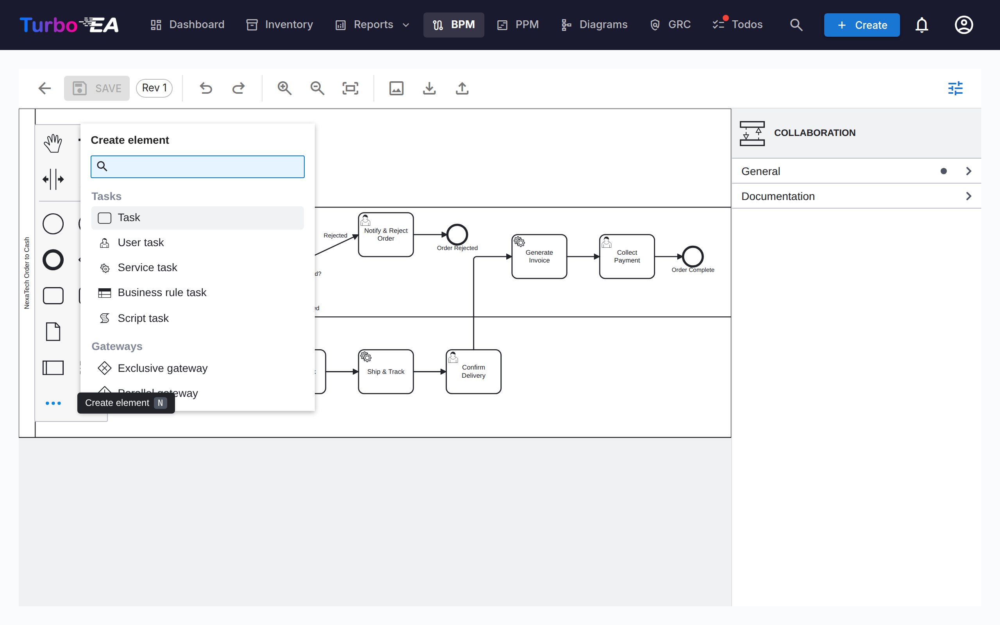
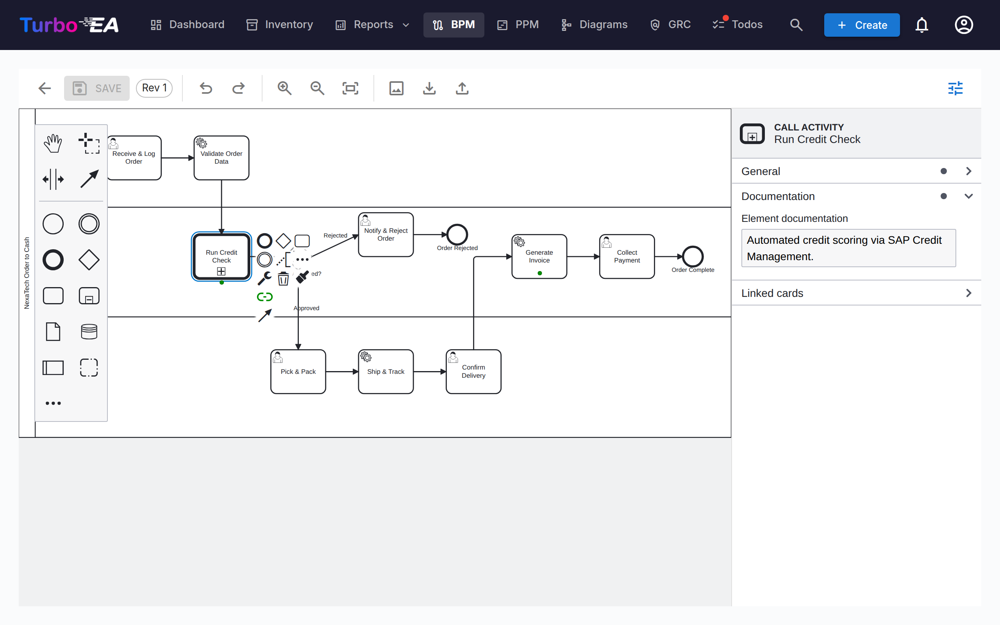
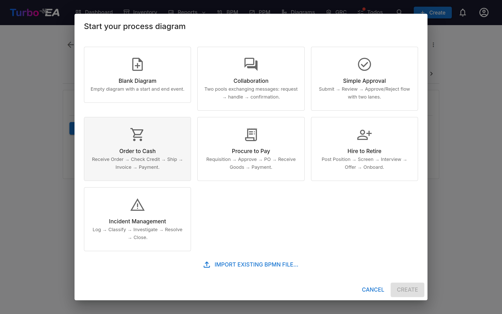
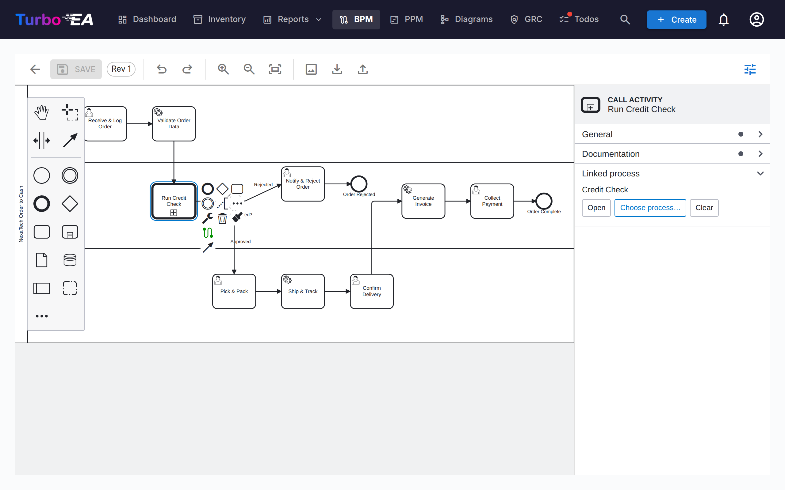

# Business Process Management (BPM)

The **BPM** module allows documenting, modeling, and analyzing the organization's **business processes**. It combines visual BPMN 2.0 diagrams with maturity assessments and reporting.

!!! note
    The BPM module can be enabled or disabled by an administrator in [Settings](../admin/settings.md). When disabled, BPM navigation and features are hidden.

## Process Navigator

The **Process Navigator** organizes processes into three main categories:

- **Management Processes** — Planning, governance, and control
- **Core Business Processes** — Primary value-creating activities
- **Support Processes** — Activities that support core business operations

**Filters:** Type, Maturity (Initial / Defined / Managed / Optimized), Automation level, Risk (Low / Medium / High / Critical), Depth (L1 / L2 / L3).

Cards with a published BPMN diagram show a **flow icon** — click it to open the diagram full-screen without leaving the navigator (or jump from there to the full flow editor).

**Column layout:** the toolbar carries a **column picker** — one, two or three columns — so you can widen the process cards or fit more of a row on screen. A row never stretches across more columns than it has processes, and the choice is remembered between visits. The choice cascades into the nested levels too, one column fewer per level, so drilling down no longer squeezes deep processes into slivers.

**Publishing it:** the Process Navigator can be published as a read-only [web portal](../admin/web-portals.md), so people without a Turbo EA account — new joiners, auditors, partners — can browse the process house and open each published BPMN flow.

## BPM Dashboard

The **BPM Dashboard** provides an executive view of process status:

| Indicator | Description |
|-----------|-------------|
| **Total Processes** | Total number of documented business processes |
| **Diagram Coverage** | Percentage of processes with an associated BPMN diagram |
| **High Risk** | Number of processes with high risk level |
| **Critical Risk** | Number of processes with critical risk level |

Charts show distribution by process type, maturity level, and automation level. A **top risk processes** table helps prioritize investments.

## Process Flow Editor

Each Business Process card can have a **BPMN 2.0 process flow diagram**. The editor uses [bpmn-js](https://bpmn.io/) and provides:

- **Visual modeling** — Drag and drop BPMN elements from the palette: tasks, events, gateways, lanes, pools and sub-processes. The **…** entry at the bottom of the palette opens a searchable **Create element** menu that reaches every BPMN element type — message, timer, signal, error and escalation events, transactions, event sub-processes, call activities, send/receive tasks, data objects and data stores (shortcut `N`). The **+** entry on a selected shape's context pad opens the matching **Append element** menu (shortcut `A`)
- **Starter templates** — Choose from 7 pre-built BPMN templates for common process patterns, including a two-pool **Collaboration** template with message flows (or start from a blank canvas)
- **Element extraction** — When you save a diagram, the system automatically extracts all tasks, events, gateways, lanes, data objects and message flows for analysis. Events keep their kind — a *message* start event is listed as one, with the name of the message it receives — and send/receive tasks carry the message they exchange. Extracted elements are listed in **process-flow order** — following the sequence and message flows of the diagram, starting from the start event — rather than grouped by element type. Steps inside a loop are kept together, a sub-process's contents are listed directly beneath it, and data objects and data stores come last
- **Element colors** — Select one or more elements and use the paint bucket button on the context pad to apply a color. Colors are stored in the BPMN file itself, so they also appear in the read-only viewer, exports, and printouts
- **Properties panel** — The panel on the right (toggle it with the sliders button in the toolbar) edits what a shape cannot show: the element's name and documentation, the **Message**, **Signal**, **Error** or **Escalation** an event refers to, a sequence flow's condition, and multi-instance markers. Documentation entered here is shown in the process navigator and the read-only viewer

### Pools and message flows

A process that spans several parties — a customer and the company, two departments, a partner system — is modelled as a **collaboration**: one pool per party, connected by **message flows**. Add a second pool from the palette (or start from the **Collaboration** template), then draw a message flow between the two pools with the global connect tool, or from a send task, a message end event or a message throw event in one pool to a receive task or message event in the other. Name the message in the properties panel so it reads the same wherever it appears.

### Element Linking

BPMN elements can be **linked to EA cards**. For example, link a task in your process diagram to the Application that supports it. This creates a traceable connection between your process model and your architecture landscape:

- Every named task, event and gateway of the published flow is a row of the **Process Steps & Elements** table below the diagram (a draft has the same table under **Pre-link Elements**, applied when the draft is approved)
- Click the **Application**, **Data Object** or **IT Component** cell of a step and pick the card — the picker browses the inventory, so nothing is typed by hand
- The link is stored on the step and creates a relation between the process and the card, so it is visible in both the process flow and the card's Relations tab
- The **Business Process** column links a step to the process it hands over to — see below

### Linking a step to a process

A step often hands over to a process that exists in its own right — one with its own diagram, owner and lifecycle, typically reused from several places. Any step can say so: a task, a sub-process, an event or a gateway links to a **Business Process** card, and you never enter a process id by hand:

- **The properties panel** shows a **Linked process** group on every step, with **Choose process…**, **Open** (which drills down into the linked process's flow) and **Clear**
- **The context pad** of a selected step carries a **Link process** entry, for when the panel is collapsed
- **The steps table** of the published flow (and the pre-link table of a draft) has the same link in its **Business Process** column, and the chip there drills down into the linked process's Process Flow tab. Data objects and data stores are not steps, so their rows show a dash

BPMN has one construct that *is* another process: the **call activity**, a task drawn with a thick border that invokes a process defined on its own. An embedded **sub-process** is the other way to group steps, but it belongs to the diagram it is drawn in; the Method & Style rule is simple: if the process exists independently, use a call activity. Turbo EA treats it as the native case — **placing a call activity asks which process it calls**, and the link is stored in BPMN's own *called element*, so other tools read it. Every other step stores the link as a Turbo EA attribute in the diagram instead.

Publishing a flow that contains a linked step creates a **calls** relation between the two processes — the linked process's Relations tab reads *is called by*, and the Dependencies view draws the call graph. A diagram imported from another tool keeps that tool's own process reference; the steps table shows it as a hint (*references Process_X*) until you pick the matching process in Turbo EA.

### Message flows

The message flows of the published diagram are listed under the elements table, each showing what it connects — a task, an event or a whole pool on either end. Link a message flow to the **Interface** card that carries it. Like organization links on steps, this is informative only: no relation is created between cards.

### Linking Organizations

The *Organization* column in the step table links steps to Organization cards, right next to Application / Data Object / IT Component. Unlike those single-value links, a step can be linked to **several** organizations — pick them one at a time and remove them individually. Step links are informative only — they document which organizations are involved in a step without creating any relation between the cards; Business Process ↔ Organization relations are managed separately on the card's Relations tab. Lane names remain plain free text from the diagram and are not connected to Organization cards. The **Process × Organization Matrix** in BPM Reports aggregates these links across all processes.

### Approval Workflow

Process flow diagrams follow a version-controlled approval workflow:

| Status | Description |
|--------|-------------|
| **Draft** | Being edited, not yet submitted for review |
| **Pending** | Submitted for approval, awaiting review |
| **Published** | Approved and visible as the current version |
| **Archived** | Previously published version, superseded by a newer approval |
| **Withdrawn** | Previously published version, unpublished on purpose |

Submitting a draft creates a version snapshot. Approvers can approve (publish) or reject the submission.

#### Who can approve

Approving or rejecting a submitted revision needs the **Approve or reject submitted BPMN flow versions** permission, or the **Process Owner** stakeholder role on the process itself. Being able to edit drafts is not enough.

!!! warning "Changed in 2.43.0"
    Earlier releases accepted the general BPM edit permission here, so any member could approve any process flow — including a revision they had submitted themselves a moment earlier. If people in your instance approve flows today with only BPM edit rights, either grant them **Approve or reject submitted BPMN flow versions** in Admin → Roles, or assign them as **Process Owner** on the processes they sign off.

#### Withdrawing a published version

An approval given by mistake can be undone without deleting the process. Withdrawing requires the **Withdraw (unpublish) a published BPMN flow version** permission, which **no role holds by default** — an administrator grants it in Admin → Roles, or on the **Process Owner** stakeholder role in Admin → Metamodel.

Once the permission is granted, the published version gains a **Withdraw** button. Withdrawing asks for a written reason, and then:

- moves the revision to **Withdrawn** — it is never deleted, and never sent back to draft
- keeps the original approval on record: the Archived tab shows the revision, who approved it and when, alongside who withdrew it and why
- records the withdrawal, with its reason, in the card's **History** tab
- **opens a copy as a new draft** at the next revision number, so you can correct the diagram and put it back through submit → approve
- leaves the process with no *approved* flow until that draft is approved
- leaves the extracted process steps and their card links untouched

Keeping the withdrawn revision and editing a copy is deliberate: it means the exact diagram an approver signed off stays retrievable, which is what a quality system expects, while you still get a working copy immediately.

Any archived or withdrawn version can be picked up again at any time with **Create new draft from this** on the Archived tab, which clones it to a fresh draft at the next revision.

## Process Assessments

Business Process cards support **assessments** that score the process on:

- **Efficiency** — How well the process uses resources
- **Effectiveness** — How well the process achieves its goals
- **Compliance** — How well the process meets regulatory requirements

Assessment data feeds into the BPM Reports.

## BPM Reports

Three specialized reports are available from the BPM Dashboard:

- **Maturity Report** — Distribution of processes by maturity level, trends over time
- **Risk Report** — Risk assessment overview, highlighting processes that need attention
- **Automation Report** — Analysis of automation levels across the process landscape
- **Process × Organization Matrix** — Which organizations execute steps in which processes, with per-organization filtering and a per-process step drill-down (built from the informative step links; card relations are not included)
