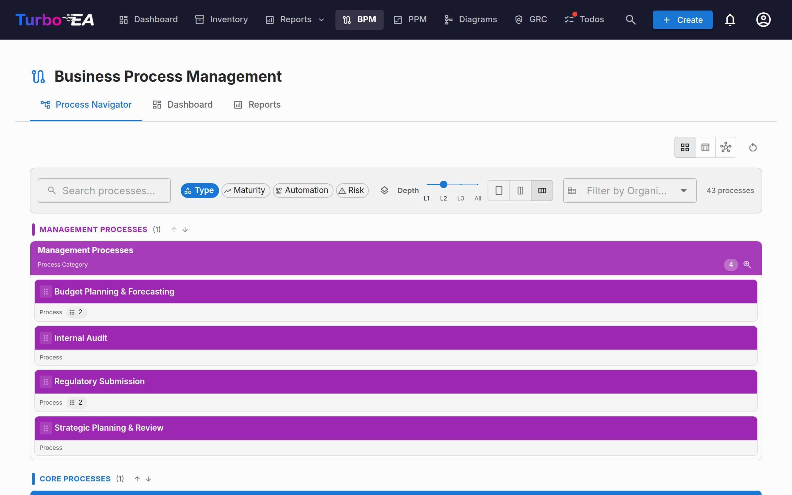
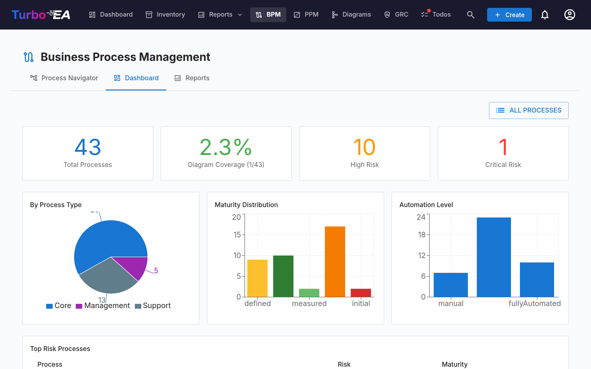
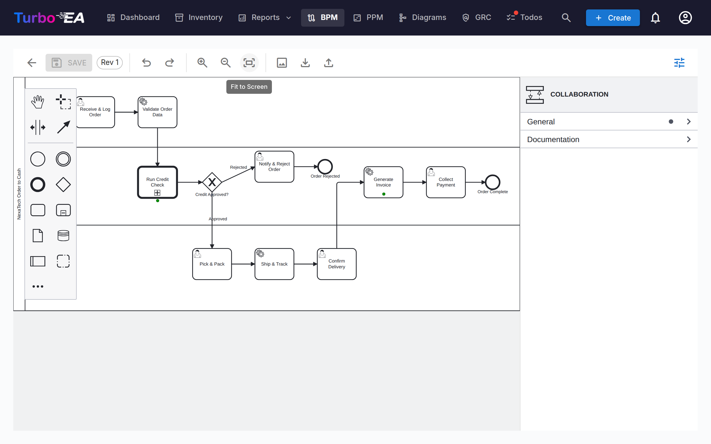

# Business Process Management (BPM)

The **BPM** module allows documenting, modeling, and analyzing the organization's **business processes**. It combines visual BPMN 2.0 diagrams with maturity assessments and reporting.

!!! note
    The BPM module can be enabled or disabled by an administrator in [Settings](../admin/settings.md). When disabled, BPM navigation and features are hidden.

## Process Navigator

The **Process Navigator** organizes processes into three main categories:

- **Management Processes** — Planning, governance, and control
- **Core Business Processes** — Primary value-creating activities
- **Support Processes** — Activities that support core business operations

**Filters:** Type, Maturity (Initial / Defined / Managed / Optimized), Automation level, Risk (Low / Medium / High / Critical), Depth (L1 / L2 / L3).

Cards with a published BPMN diagram show a **flow icon** — click it to open the diagram full-screen without leaving the navigator (or jump from there to the full flow editor).

## BPM Dashboard

The **BPM Dashboard** provides an executive view of process status:

| Indicator | Description |
|-----------|-------------|
| **Total Processes** | Total number of documented business processes |
| **Diagram Coverage** | Percentage of processes with an associated BPMN diagram |
| **High Risk** | Number of processes with high risk level |
| **Critical Risk** | Number of processes with critical risk level |

Charts show distribution by process type, maturity level, and automation level. A **top risk processes** table helps prioritize investments.

## Process Flow Editor

Each Business Process card can have a **BPMN 2.0 process flow diagram**. The editor uses [bpmn-js](https://bpmn.io/) and provides:

- **Visual modeling** — Drag and drop BPMN elements: tasks, events, gateways, lanes, and sub-processes
- **Starter templates** — Choose from 6 pre-built BPMN templates for common process patterns (or start from a blank canvas)
- **Element extraction** — When you save a diagram, the system automatically extracts all tasks, events, gateways, and lanes for analysis
- **Element colors** — Select one or more elements and use the paint bucket button on the context pad to apply a color. Colors are stored in the BPMN file itself, so they also appear in the read-only viewer, exports, and printouts

### Element Linking

BPMN elements can be **linked to EA cards**. For example, link a task in your process diagram to the Application that supports it. This creates a traceable connection between your process model and your architecture landscape:

- Select any task, event, or gateway in the BPMN diagram
- The **Element Linker** panel shows matching cards (Application, Data Object, IT Component, Organization)
- Link the element to a card — the connection is stored and visible in both the process flow and the card's relations

### Linking Organizations

The *Organization* column in the step table links steps to Organization cards, right next to Application / Data Object / IT Component. Unlike those single-value links, a step can be linked to **several** organizations — pick them one at a time and remove them individually. Step links are informative only — they document which organizations are involved in a step without creating any relation between the cards; Business Process ↔ Organization relations are managed separately on the card's Relations tab. Lane names remain plain free text from the diagram and are not connected to Organization cards. The **Process × Organization Matrix** in BPM Reports aggregates these links across all processes.

### Approval Workflow

Process flow diagrams follow a version-controlled approval workflow:

| Status | Description |
|--------|-------------|
| **Draft** | Being edited, not yet submitted for review |
| **Pending** | Submitted for approval, awaiting review |
| **Published** | Approved and visible as the current version |
| **Archived** | Previously published version, superseded by a newer approval |
| **Withdrawn** | Previously published version, unpublished on purpose |

Submitting a draft creates a version snapshot. Approvers can approve (publish) or reject the submission.

#### Who can approve

Approving or rejecting a submitted revision needs the **Approve or reject submitted BPMN flow versions** permission, or the **Process Owner** stakeholder role on the process itself. Being able to edit drafts is not enough.

!!! warning "Changed in 2.43.0"
    Earlier releases accepted the general BPM edit permission here, so any member could approve any process flow — including a revision they had submitted themselves a moment earlier. If people in your instance approve flows today with only BPM edit rights, either grant them **Approve or reject submitted BPMN flow versions** in Admin → Roles, or assign them as **Process Owner** on the processes they sign off.

#### Withdrawing a published version

An approval given by mistake can be undone without deleting the process. Withdrawing requires the **Withdraw (unpublish) a published BPMN flow version** permission, which **no role holds by default** — an administrator grants it in Admin → Roles, or on the **Process Owner** stakeholder role in Admin → Metamodel.

Once the permission is granted, the published version gains a **Withdraw** button. Withdrawing asks for a written reason, and then:

- moves the revision to **Withdrawn** — it is never deleted, and never sent back to draft
- keeps the original approval on record: the Archived tab shows the revision, who approved it and when, alongside who withdrew it and why
- records the withdrawal, with its reason, in the card's **History** tab
- **opens a copy as a new draft** at the next revision number, so you can correct the diagram and put it back through submit → approve
- leaves the process with no *approved* flow until that draft is approved
- leaves the extracted process steps and their card links untouched

Keeping the withdrawn revision and editing a copy is deliberate: it means the exact diagram an approver signed off stays retrievable, which is what a quality system expects, while you still get a working copy immediately.

Any archived or withdrawn version can be picked up again at any time with **Create new draft from this** on the Archived tab, which clones it to a fresh draft at the next revision.

## Process Assessments

Business Process cards support **assessments** that score the process on:

- **Efficiency** — How well the process uses resources
- **Effectiveness** — How well the process achieves its goals
- **Compliance** — How well the process meets regulatory requirements

Assessment data feeds into the BPM Reports.

## BPM Reports

Three specialized reports are available from the BPM Dashboard:

- **Maturity Report** — Distribution of processes by maturity level, trends over time
- **Risk Report** — Risk assessment overview, highlighting processes that need attention
- **Automation Report** — Analysis of automation levels across the process landscape
- **Process × Organization Matrix** — Which organizations execute steps in which processes, with per-organization filtering and a per-process step drill-down (built from the informative step links; card relations are not included)
