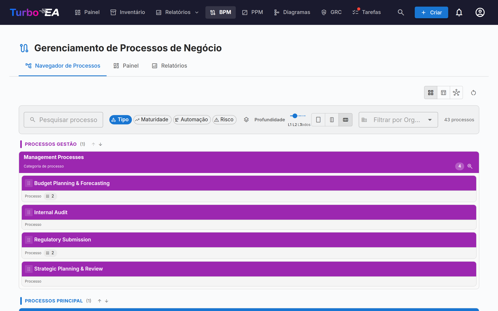
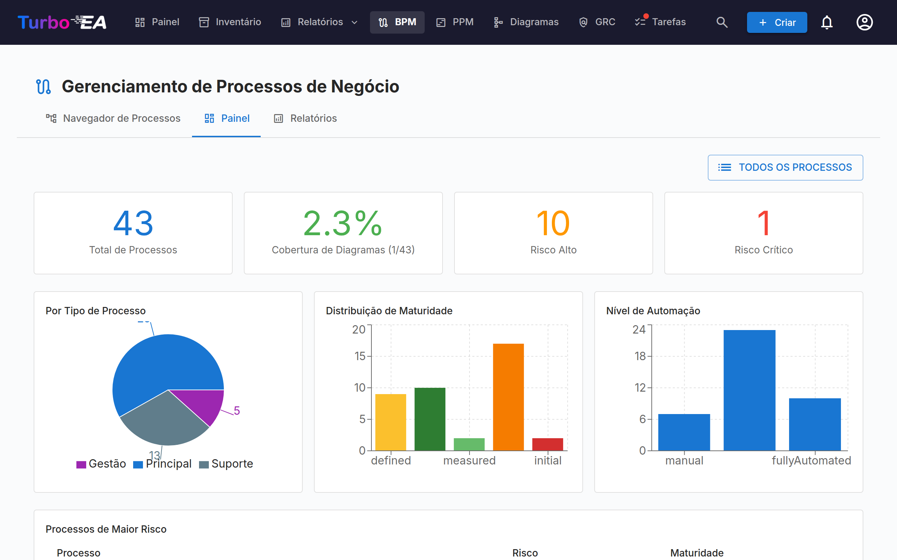
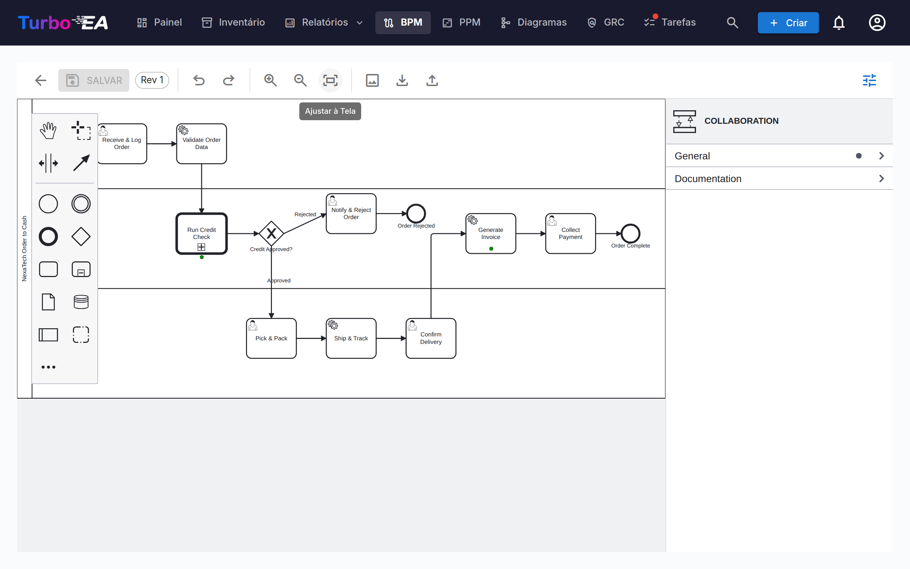

# Gestão de Processos de Negócio (BPM)

O módulo **BPM** permite documentar, modelar e analisar os **processos de negócio** da organização. Ele combina diagramas visuais BPMN 2.0 com avaliações de maturidade e relatórios.

!!! note
    O módulo BPM pode ser habilitado ou desabilitado por um administrador em [Configurações](../admin/settings.md). Quando desabilitado, a navegação e os recursos de BPM ficam ocultos.

## Navegador de Processos

O **Navegador de Processos** organiza processos em três categorias principais:

- **Processos de Gestão** — Planejamento, governança e controle
- **Processos Core de Negócio** — Atividades primárias de criação de valor
- **Processos de Suporte** — Atividades que suportam as operações core de negócio

**Filtros:** Tipo, Maturidade (Inicial / Definido / Gerenciado / Otimizado), Nível de automação, Risco (Baixo / Médio / Alto / Crítico), Profundidade (L1 / L2 / L3).

Os cartões com um diagrama BPMN publicado exibem um **ícone de fluxo** — clique nele para abrir o diagrama em tela cheia sem sair do navegador (ou para ir dali para o editor de fluxo completo).

## Painel BPM

O **Painel BPM** fornece uma visão executiva do status dos processos:

| Indicador | Descrição |
|-----------|-----------|
| **Total de Processos** | Número total de processos de negócio documentados |
| **Cobertura de Diagramas** | Porcentagem de processos com um diagrama BPMN associado |
| **Alto Risco** | Número de processos com nível de risco alto |
| **Risco Crítico** | Número de processos com nível de risco crítico |

Gráficos mostram a distribuição por tipo de processo, nível de maturidade e nível de automação. Uma tabela de **processos de maior risco** ajuda a priorizar investimentos.

## Editor de Fluxo de Processo

Cada card de Processo de Negócio pode ter um **diagrama de fluxo de processo BPMN 2.0**. O editor usa [bpmn-js](https://bpmn.io/) e oferece:

- **Modelagem visual** — Arraste e solte elementos BPMN: tarefas, eventos, gateways, raias e sub-processos
- **Templates iniciais** — Escolha entre 6 templates BPMN pré-construídos para padrões comuns de processo (ou comece de uma tela em branco)
- **Extração de elementos** — Quando você salva um diagrama, o sistema extrai automaticamente todas as tarefas, eventos, gateways e raias para análise
- **Cores dos elementos** — Selecione um ou mais elementos e use o botão de balde de tinta no painel de contexto para aplicar uma cor. As cores são gravadas no próprio arquivo BPMN, portanto também aparecem no visualizador somente leitura, nas exportações e nas impressões

### Vinculação de Elementos

Elementos BPMN podem ser **vinculados a cards de EA**. Por exemplo, vincule uma tarefa no seu diagrama de processo à Aplicação que a suporta. Isso cria uma conexão rastreável entre seu modelo de processo e seu cenário de arquitetura:

- Selecione qualquer tarefa, evento ou gateway no diagrama BPMN
- O painel **Vinculador de Elementos** mostra cards correspondentes (Aplicação, Objeto de Dados, Componente de TI, Organização)
- Vincule o elemento a um card — a conexão é armazenada e visível tanto no fluxo de processo quanto nos relacionamentos do card

### Vincular Organizações

A coluna *Organização* da tabela de etapas vincula as etapas a cards de Organização, ao lado de Aplicação / Objeto de Dados / Componente de TI. Diferentemente desses vínculos de valor único, uma etapa pode ser vinculada a **várias** organizações — escolha-as uma a uma e remova-as individualmente. Os vínculos de etapas são apenas informativos — documentam quais organizações participam de uma etapa sem criar nenhuma relação entre os cards; as relações Processo de Negócio ↔ Organização são gerenciadas separadamente na aba Relações do card. Os nomes das raias continuam sendo texto livre do diagrama e não estão conectados a cards de Organização. A **Matriz Processo × Organização** nos Relatórios de BPM agrega esses vínculos em todos os processos.

### Fluxo de Aprovação

Os diagramas de fluxo de processo seguem um fluxo de aprovação com controlo de versões:

| Estado | Descrição |
|--------|-----------|
| **Rascunho** | Em edição, ainda não submetido para revisão |
| **Pendente** | Submetido para aprovação, a aguardar revisão |
| **Publicado** | Aprovado e visível como versão atual |
| **Arquivado** | Versão publicada anteriormente, substituída por uma aprovação mais recente |
| **Retirado** | Versão publicada anteriormente, despublicada intencionalmente |

Submeter um rascunho cria um instantâneo de versão. Os aprovadores podem aprovar (publicar) ou rejeitar a submissão.

#### Quem pode aprovar

Aprovar ou rejeitar uma revisão submetida exige a permissão **Aprovar ou rejeitar versões de fluxo BPMN submetidas**, ou o papel de parte interessada **Responsável do processo** no próprio processo. Poder editar rascunhos não é suficiente.

!!! warning "Alterado na versão 2.43.0"
    As versões anteriores aceitavam aqui a permissão geral de edição de BPM, pelo que qualquer membro podia aprovar qualquer fluxo de processo — incluindo uma revisão que ele próprio acabara de submeter. Se na sua instância existem pessoas que aprovam hoje apenas com direitos de edição de BPM, conceda-lhes a permissão **Aprovar ou rejeitar versões de fluxo BPMN submetidas** em Administração → Perfis, ou atribua-lhes o papel de **Responsável do processo** nos processos que validam.

#### Retirar uma versão publicada

Uma aprovação dada por engano pode ser anulada sem eliminar o processo. A retirada exige a permissão **Retirar (despublicar) uma versão de fluxo BPMN publicada**, que **nenhum perfil possui por predefinição** — um administrador concede-a em Administração → Perfis, ou no papel de parte interessada **Responsável do processo** em Administração → Metamodelo.

Depois de concedida a permissão, a versão publicada passa a mostrar um botão **Retirar**. A retirada pede um motivo escrito e, em seguida:

- passa a revisão a **Retirado** — nunca é eliminada nem devolvida a rascunho;
- mantém a aprovação original registada: o separador *Arquivado* mostra a revisão, quem a aprovou e quando, a par de quem a retirou e porquê;
- regista a retirada, com o seu motivo, no separador **Histórico** do cartão;
- **abre uma cópia como novo rascunho** no número de revisão seguinte, para que possa corrigir o diagrama e voltar a passá-lo por submissão → aprovação;
- deixa o processo sem fluxo *aprovado* até que esse rascunho seja aprovado;
- deixa intactos os passos de processo extraídos e as suas ligações a cartões.

Manter a revisão retirada e editar uma cópia é deliberado: o diagrama exato que um aprovador assinou continua recuperável, que é o que um sistema de qualidade espera, e mesmo assim obtém logo uma cópia de trabalho.

Qualquer versão arquivada ou retirada pode ser retomada a qualquer momento com **Criar novo rascunho a partir deste** no separador *Arquivado*, que a clona como rascunho na revisão seguinte.

## Avaliações de Processo

Cards de Processo de Negócio suportam **avaliações** que pontuam o processo em:

- **Eficiência** — Quão bem o processo utiliza recursos
- **Eficácia** — Quão bem o processo atinge seus objetivos
- **Conformidade** — Quão bem o processo atende aos requisitos regulatórios

Dados de avaliação alimentam os Relatórios de BPM.

## Relatórios de BPM

Três relatórios especializados estão disponíveis a partir do Painel BPM:

- **Relatório de Maturidade** — Distribuição de processos por nível de maturidade, tendências ao longo do tempo
- **Relatório de Risco** — Visão geral da avaliação de risco, destacando processos que precisam de atenção
- **Relatório de Automação** — Análise dos níveis de automação em todo o cenário de processos
- **Matriz Processo × Organização** — Quais organizações executam etapas em quais processos, com filtragem por organização e detalhamento de etapas por processo (com base nos vínculos informativos de etapas; as relações entre cards não são incluídas)
