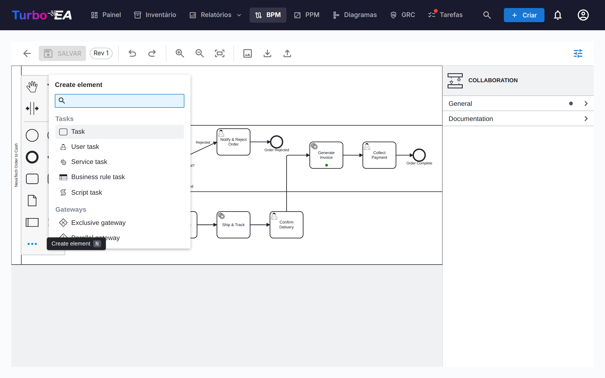
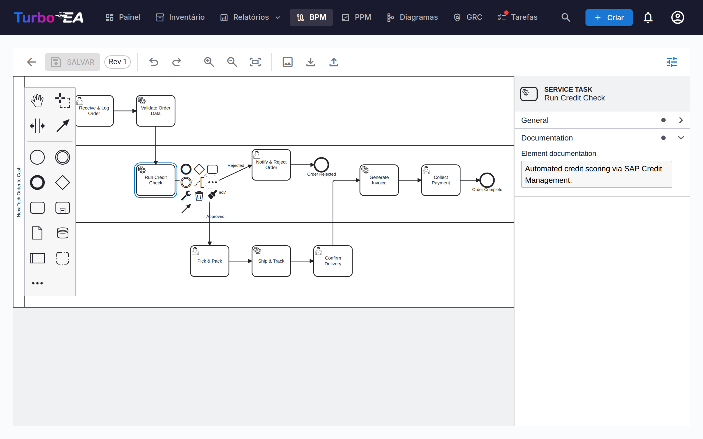
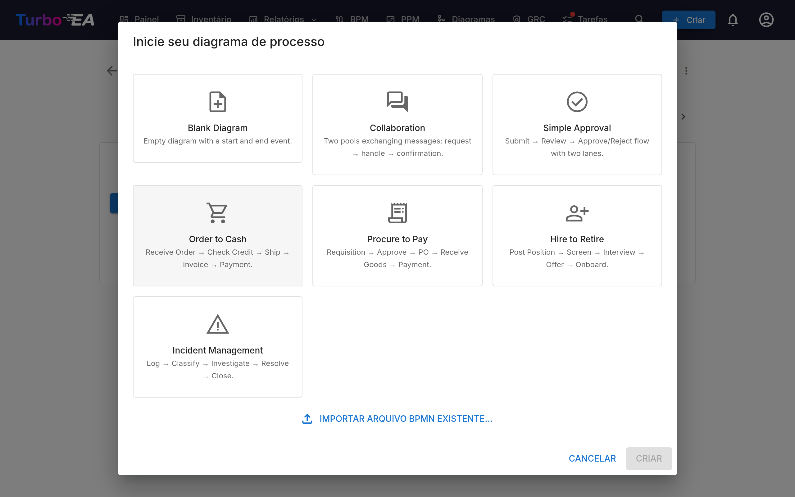
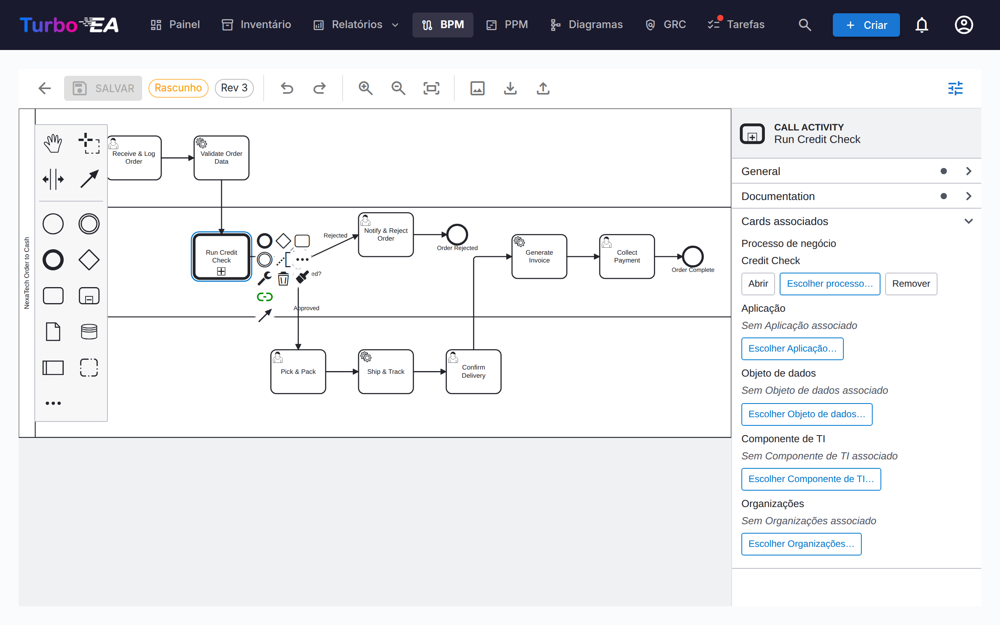

# Gestão de Processos de Negócio (BPM)

O módulo **BPM** permite documentar, modelar e analisar os **processos de negócio** da organização. Ele combina diagramas visuais BPMN 2.0 com avaliações de maturidade e relatórios.

!!! note
    O módulo BPM pode ser habilitado ou desabilitado por um administrador em [Configurações](../admin/settings.md). Quando desabilitado, a navegação e os recursos de BPM ficam ocultos.

## Navegador de Processos

O **Navegador de Processos** organiza processos em três categorias principais:

- **Processos de Gestão** — Planejamento, governança e controle
- **Processos Core de Negócio** — Atividades primárias de criação de valor
- **Processos de Suporte** — Atividades que suportam as operações core de negócio

**Filtros:** Tipo, Maturidade (Inicial / Definido / Gerenciado / Otimizado), Nível de automação, Risco (Baixo / Médio / Alto / Crítico), Profundidade (L1 / L2 / L3).

Os cartões com um diagrama BPMN publicado exibem um **ícone de fluxo** — clique nele para abrir o diagrama em tela cheia sem sair do navegador (ou para ir dali para o editor de fluxo completo).

**Disposição em colunas:** a barra de ferramentas inclui um **seletor de colunas** — uma, duas ou três — para alargar os cartões de processo ou encaixar mais de uma linha no ecrã. Uma linha nunca é esticada por mais colunas do que os processos que contém, e a escolha é memorizada entre visitas. A escolha também se propaga aos níveis aninhados, menos uma coluna por nível, de modo que os processos mais profundos deixam de ser espremidos em faixas estreitas.

**Publicação:** o Navegador de Processos pode ser publicado como um [portal web](../admin/web-portals.md) só de leitura, para que pessoas sem conta Turbo EA — novos colaboradores, auditores, parceiros — possam percorrer a casa de processos e abrir cada fluxo BPMN publicado.

## Painel BPM

O **Painel BPM** fornece uma visão executiva do status dos processos:

| Indicador | Descrição |
|-----------|-----------|
| **Total de Processos** | Número total de processos de negócio documentados |
| **Cobertura de Diagramas** | Porcentagem de processos com um diagrama BPMN associado |
| **Alto Risco** | Número de processos com nível de risco alto |
| **Risco Crítico** | Número de processos com nível de risco crítico |

Gráficos mostram a distribuição por tipo de processo, nível de maturidade e nível de automação. Uma tabela de **processos de maior risco** ajuda a priorizar investimentos.

## Editor de Fluxo de Processo

Cada card de Processo de Negócio pode ter um **diagrama de fluxo de processo BPMN 2.0**. O editor usa [bpmn-js](https://bpmn.io/) e oferece:

- **Modelagem visual** — Arraste e solte elementos BPMN da paleta: tarefas, eventos, gateways, raias, pools e subprocessos. A entrada **…** no fim da paleta abre um menu **Create element** pesquisável que alcança todos os tipos de elementos BPMN — eventos de mensagem, temporizador, sinal, erro e escalonamento, transações, subprocessos de evento, atividades de chamada, tarefas de envio/recebimento, objetos e armazéns de dados (atalho `N`). A entrada **+** no painel de contexto de uma forma selecionada abre o menu **Append element** correspondente (atalho `A`)
- **Templates iniciais** — Escolha entre 7 templates BPMN pré-construídos para padrões comuns de processo, incluindo um template de **Colaboração** com dois pools e fluxos de mensagens (ou comece de uma tela em branco)
- **Extração de elementos** — Quando você salva um diagrama, o sistema extrai automaticamente todas as tarefas, eventos, gateways, raias, objetos de dados e fluxos de mensagens para análise. Os eventos mantêm seu tipo — um evento de início de *mensagem* é listado como tal, com o nome da mensagem recebida — e as tarefas de envio/recebimento carregam a mensagem trocada. Os elementos extraídos são listados na **ordem do fluxo do processo** — seguindo os fluxos de sequência e de mensagem do diagrama, a partir do evento de início — e não agrupados por tipo de elemento. As etapas de um laço permanecem juntas, o conteúdo de um subprocesso é listado logo abaixo dele, e objetos e armazéns de dados vêm por último
- **Cores dos elementos** — Selecione um ou mais elementos e use o botão de balde de tinta no painel de contexto para aplicar uma cor. As cores são gravadas no próprio arquivo BPMN, portanto também aparecem no visualizador somente leitura, nas exportações e nas impressões
- **Painel de propriedades** — O painel à direita (mostre ou oculte com o botão de controles deslizantes da barra de ferramentas) edita o que uma forma não consegue mostrar: o nome e a documentação do elemento, a **mensagem**, o **sinal**, o **erro** ou o **escalonamento** ao qual um evento se refere, a condição de um fluxo de sequência e os marcadores de múltiplas instâncias. A documentação inserida aqui aparece no navegador de processos e no visualizador somente leitura

### Pools e fluxos de mensagens

Um processo que envolve várias partes — um cliente e a empresa, dois departamentos, um sistema parceiro — é modelado como uma **colaboração**: um pool por parte, ligados por **fluxos de mensagens**. Adicione um segundo pool a partir da paleta (ou comece pelo template **Colaboração**) e depois trace um fluxo de mensagem entre os dois pools com a ferramenta de conexão global, ou de uma tarefa de envio, um evento de fim de mensagem ou um evento de lançamento de mensagem em um pool até uma tarefa de recebimento ou um evento de mensagem no outro. Nomeie a mensagem no painel de propriedades para que ela se leia da mesma forma em todo lugar.

### Vinculação de Elementos

Elementos BPMN podem ser **vinculados a cards de EA**. Por exemplo, vincule uma tarefa no seu diagrama de processo à Aplicação que a suporta. Isso cria uma conexão rastreável entre seu modelo de processo e seu cenário de arquitetura:

- Cada tarefa, evento e gateway com nome do fluxo publicado é uma linha da tabela **Passos e elementos do processo** abaixo do diagrama (um rascunho tem a mesma tabela em **Pré-vincular elementos**, aplicada quando o rascunho é aprovado)
- Clique na célula **Aplicação**, **Objeto de dados** ou **Componente de TI** de um passo e escolha o card — o seletor percorre o inventário, nada é digitado à mão
- O vínculo é guardado no passo e cria uma relação entre o processo e o card, visível tanto no fluxo de processo quanto na aba Relações do card
- A coluna **Processo de negócio** vincula um passo ao processo para o qual ele transita — veja abaixo
- Os mesmos cinco vínculos estão disponíveis **no editor** enquanto um rascunho está aberto: um grupo **Cards associados** no painel de propriedades e uma entrada **Associar cards** no menu de contexto que abre a lista

### Vincular um passo a um processo

Um passo muitas vezes transita para um processo que existe por si só — com seu próprio diagrama, seu próprio responsável e seu próprio ciclo de vida, normalmente reutilizado a partir de vários lugares. Qualquer passo pode indicá-lo: uma tarefa, um subprocesso, um evento ou um gateway aponta para um card de **Processo de negócio**, e nunca se digita um identificador de processo à mão:

- **O painel de propriedades** mostra um grupo **Cards associados** em cada passo, uma linha por vínculo — Processo de negócio, Aplicação, Objeto de dados, Componente de TI, Organizações — cada uma com **Escolher**, **Abrir** (que desce ao card associado) e **Remover**
- **O menu de contexto** de um passo selecionado traz uma entrada **Associar cards** com os mesmos cinco, para quando o painel está recolhido. Um objeto ou repositório de dados oferece apenas o vínculo de Objeto de dados, como na tabela
- **A tabela de passos** do fluxo publicado (e a tabela de pré-vinculação de um rascunho) tem o mesmo vínculo na coluna **Processo de negócio**, e o chip ali desce à aba Fluxo de processo do processo associado. Objetos e repositórios de dados não são passos, portanto suas linhas mostram um traço

O BPMN tem um construto que *é* outro processo: a **atividade de chamada** (call activity), uma tarefa com borda grossa que invoca um processo definido de forma independente. Um **subprocesso** embutido também agrupa passos, mas pertence ao diagrama em que é desenhado; a regra do Method & Style é simples: se o processo existe de forma independente, use uma atividade de chamada. O Turbo EA a trata como o caso nativo: **colocar uma atividade de chamada pergunta qual processo ela invoca**, e o vínculo é guardado no *elemento invocado* próprio do BPMN, que outras ferramentas sabem ler. Qualquer outro passo guarda o vínculo como um atributo do Turbo EA no diagrama.

Publicar um fluxo que contém um passo vinculado cria uma relação **invoca** entre os dois processos — a aba Relações do processo associado mostra *é invocado por*, e a visão de dependências desenha o grafo de chamadas. Um diagrama importado de outra ferramenta mantém a referência de processo própria daquela ferramenta; a tabela de passos a mostra como dica (*referencia Process_X*) até que você escolha o processo correspondente no Turbo EA.

### Um único conjunto de vínculos

O editor e as tabelas mostram os mesmos vínculos, por isso um passo lê-se da mesma forma em qualquer lado:

- Dentro de um **rascunho** vale o que definir lá — no editor ou na tabela **Pré-vincular elementos**, são o mesmo armazenamento — e a referência de processo do diagrama é o recurso para um passo sobre o qual nada disse. Remover um vínculo remove-o, também na publicação.
- Um fluxo **publicado** continua aprovado enquanto os seus vínculos são editados na sua tabela de elementos: são metadados sobre um diagrama já assinado, não um motivo para o aprovar de novo.
- Um rascunho **criado a partir da versão publicada** parte dos vínculos que o processo tem nesse momento. Um rascunho já aberto mantém os seus, para que a edição de outra pessoa não altere o diagrama em que está a trabalhar.

### Fluxos de mensagens

Os fluxos de mensagens do diagrama publicado são listados abaixo da tabela de elementos; cada um mostra o que conecta — uma tarefa, um evento ou um pool inteiro em cada ponta. Vincule um fluxo de mensagem ao card de **Interface** que o transporta. Assim como os vínculos de organização nas etapas, isso é apenas informativo: nenhuma relação é criada entre cards.

### Vincular Organizações

A coluna *Organização* da tabela de etapas vincula as etapas a cards de Organização, ao lado de Aplicação / Objeto de Dados / Componente de TI. Diferentemente desses vínculos de valor único, uma etapa pode ser vinculada a **várias** organizações — escolha-as uma a uma e remova-as individualmente. Os vínculos de etapas são apenas informativos — documentam quais organizações participam de uma etapa sem criar nenhuma relação entre os cards; as relações Processo de Negócio ↔ Organização são gerenciadas separadamente na aba Relações do card. Os nomes das raias continuam sendo texto livre do diagrama e não estão conectados a cards de Organização. A **Matriz Processo × Organização** nos Relatórios de BPM agrega esses vínculos em todos os processos.

### Fluxo de Aprovação

Os diagramas de fluxo de processo seguem um fluxo de aprovação com controlo de versões:

| Estado | Descrição |
|--------|-----------|
| **Rascunho** | Em edição, ainda não submetido para revisão |
| **Pendente** | Submetido para aprovação, a aguardar revisão |
| **Publicado** | Aprovado e visível como versão atual |
| **Arquivado** | Versão publicada anteriormente, substituída por uma aprovação mais recente |
| **Retirado** | Versão publicada anteriormente, despublicada intencionalmente |

Submeter um rascunho cria um instantâneo de versão. Os aprovadores podem aprovar (publicar) ou rejeitar a submissão.

#### Quem pode aprovar

Aprovar ou rejeitar uma revisão submetida exige a permissão **Aprovar ou rejeitar versões de fluxo BPMN submetidas**, ou o papel de parte interessada **Responsável do processo** no próprio processo. Poder editar rascunhos não é suficiente.

!!! warning "Alterado na versão 2.43.0"
    As versões anteriores aceitavam aqui a permissão geral de edição de BPM, pelo que qualquer membro podia aprovar qualquer fluxo de processo — incluindo uma revisão que ele próprio acabara de submeter. Se na sua instância existem pessoas que aprovam hoje apenas com direitos de edição de BPM, conceda-lhes a permissão **Aprovar ou rejeitar versões de fluxo BPMN submetidas** em Administração → Perfis, ou atribua-lhes o papel de **Responsável do processo** nos processos que validam.

#### Retirar uma versão publicada

Uma aprovação dada por engano pode ser anulada sem eliminar o processo. A retirada exige a permissão **Retirar (despublicar) uma versão de fluxo BPMN publicada**, que **nenhum perfil possui por predefinição** — um administrador concede-a em Administração → Perfis, ou no papel de parte interessada **Responsável do processo** em Administração → Metamodelo.

Depois de concedida a permissão, a versão publicada passa a mostrar um botão **Retirar**. A retirada pede um motivo escrito e, em seguida:

- passa a revisão a **Retirado** — nunca é eliminada nem devolvida a rascunho;
- mantém a aprovação original registada: o separador *Arquivado* mostra a revisão, quem a aprovou e quando, a par de quem a retirou e porquê;
- regista a retirada, com o seu motivo, no separador **Histórico** do cartão;
- **abre uma cópia como novo rascunho** no número de revisão seguinte, para que possa corrigir o diagrama e voltar a passá-lo por submissão → aprovação;
- deixa o processo sem fluxo *aprovado* até que esse rascunho seja aprovado;
- deixa intactos os passos de processo extraídos e as suas ligações a cartões.

Manter a revisão retirada e editar uma cópia é deliberado: o diagrama exato que um aprovador assinou continua recuperável, que é o que um sistema de qualidade espera, e mesmo assim obtém logo uma cópia de trabalho.

Qualquer versão arquivada ou retirada pode ser retomada a qualquer momento com **Criar novo rascunho a partir deste** no separador *Arquivado*, que a clona como rascunho na revisão seguinte.

## Avaliações de Processo

Cards de Processo de Negócio suportam **avaliações** que pontuam o processo em:

- **Eficiência** — Quão bem o processo utiliza recursos
- **Eficácia** — Quão bem o processo atinge seus objetivos
- **Conformidade** — Quão bem o processo atende aos requisitos regulatórios

Dados de avaliação alimentam os Relatórios de BPM.

## Relatórios de BPM

Três relatórios especializados estão disponíveis a partir do Painel BPM:

- **Relatório de Maturidade** — Distribuição de processos por nível de maturidade, tendências ao longo do tempo
- **Relatório de Risco** — Visão geral da avaliação de risco, destacando processos que precisam de atenção
- **Relatório de Automação** — Análise dos níveis de automação em todo o cenário de processos
- **Matriz Processo × Organização** — Quais organizações executam etapas em quais processos, com filtragem por organização e detalhamento de etapas por processo (com base nos vínculos informativos de etapas; as relações entre cards não são incluídas)
