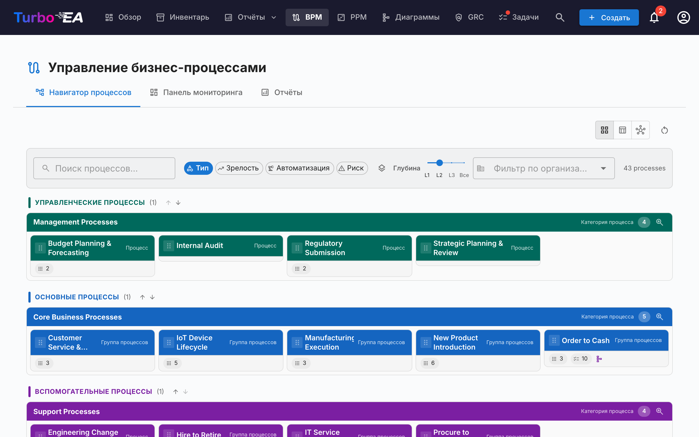
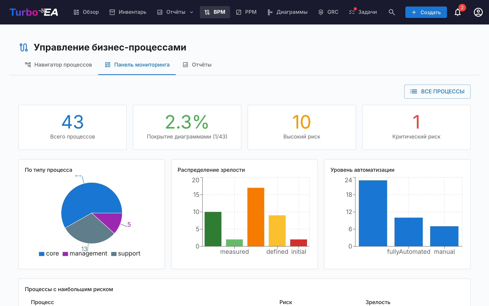
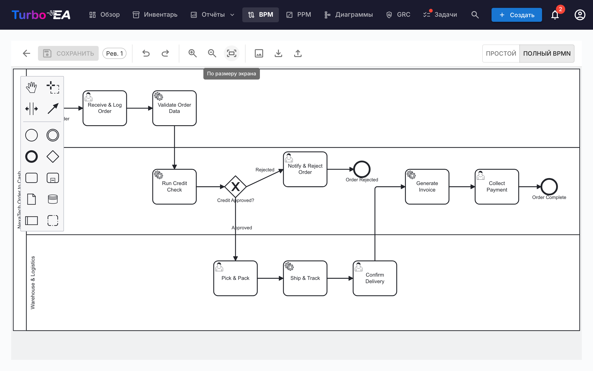

# Управление бизнес-процессами (BPM)

Модуль **BPM** позволяет документировать, моделировать и анализировать **бизнес-процессы** организации. Он сочетает визуальные диаграммы BPMN 2.0 с оценками зрелости и отчётностью.

!!! note
    Модуль BPM может быть включён или отключён администратором в [Настройках](../admin/settings.md). При отключении навигация и функции BPM скрыты.

## Навигатор процессов

**Навигатор процессов** организует процессы в три основные категории:

- **Процессы управления** — планирование, руководство и контроль
- **Основные бизнес-процессы** — основная деятельность по созданию ценности
- **Поддерживающие процессы** — деятельность, поддерживающая основные бизнес-операции

**Фильтры:** Тип, Зрелость (Начальный / Определённый / Управляемый / Оптимизированный), Уровень автоматизации, Риск (Низкий / Средний / Высокий / Критический), Глубина (L1 / L2 / L3).

Карточки с опубликованной BPMN-диаграммой показывают **значок потока** — щёлкните по нему, чтобы открыть диаграмму на весь экран, не покидая навигатор (или перейти оттуда к полноценному редактору потока).

## Панель мониторинга BPM

**Панель мониторинга BPM** предоставляет сводный обзор состояния процессов:

| Показатель | Описание |
|------------|----------|
| **Всего процессов** | Общее количество задокументированных бизнес-процессов |
| **Покрытие диаграммами** | Процент процессов, имеющих связанную BPMN-диаграмму |
| **Высокий риск** | Количество процессов с высоким уровнем риска |
| **Критический риск** | Количество процессов с критическим уровнем риска |

Графики показывают распределение по типу процесса, уровню зрелости и уровню автоматизации. Таблица **наиболее рискованных процессов** помогает расставить приоритеты инвестиций.

## Редактор процессных потоков

Каждая карточка «Бизнес-процесс» может иметь **диаграмму процессного потока BPMN 2.0**. Редактор использует [bpmn-js](https://bpmn.io/) и предоставляет:

- **Визуальное моделирование** — перетаскивание элементов BPMN: задачи, события, шлюзы, дорожки и подпроцессы
- **Стартовые шаблоны** — выберите один из 6 готовых шаблонов BPMN для типичных паттернов процессов (или начните с чистого холста)
- **Извлечение элементов** — при сохранении диаграммы система автоматически извлекает все задачи, события, шлюзы и дорожки для анализа

### Привязка элементов

Элементы BPMN можно **привязать к карточкам корпоративной архитектуры**. Например, привяжите задачу в диаграмме процесса к Приложению, которое её поддерживает. Это создаёт прослеживаемую связь между моделью процесса и ландшафтом архитектуры:

- Выберите любую задачу, событие или шлюз в BPMN-диаграмме
- Панель **Привязка элементов** показывает подходящие карточки (Приложение, Объект данных, ИТ-компонент, Организация)
- Привяжите элемент к карточке — связь сохраняется и видна как в процессном потоке, так и в связях карточки

### Привязка организаций

Столбец *Организация* в таблице шагов привязывает шаги к карточкам организаций — рядом с Приложением / Объектом данных / ИТ-компонентом. В отличие от этих одиночных связей, шаг можно привязать к **нескольким** организациям — выбирайте их по одной и удаляйте по отдельности. Привязки шагов носят исключительно информационный характер — они документируют, какие организации участвуют в шаге, не создавая связи между карточками; связи «Бизнес-процесс ↔ Организация» управляются отдельно на вкладке «Связи» карточки. Названия дорожек остаются обычным свободным текстом из диаграммы и не связаны с карточками организаций. **Матрица «Процесс × Организация»** в отчётах BPM агрегирует эти привязки по всем процессам.

### Процесс утверждения

Диаграммы процессных потоков следуют рабочему процессу утверждения с контролем версий:

| Статус | Описание |
|--------|----------|
| **Черновик** | Редактируется, ещё не отправлена на проверку |
| **На рассмотрении** | Отправлена на утверждение, ожидает проверки |
| **Опубликовано** | Утверждена и видна как текущая версия |
| **Архив** | Ранее опубликованная версия, сохранена для истории |

Отправка черновика создаёт снимок версии. Утверждающие могут одобрить (опубликовать) или отклонить (с комментариями) отправку.

## Оценки процессов

Карточки «Бизнес-процесс» поддерживают **оценки** процесса по следующим критериям:

- **Эффективность** — насколько хорошо процесс использует ресурсы
- **Результативность** — насколько хорошо процесс достигает своих целей
- **Соответствие** — насколько хорошо процесс соответствует нормативным требованиям

Данные оценок поступают в отчёты BPM.

## Отчёты BPM

Три специализированных отчёта доступны с панели мониторинга BPM:

- **Отчёт по зрелости** — распределение процессов по уровню зрелости, тенденции во времени
- **Отчёт по рискам** — обзор оценки рисков, выделение процессов, требующих внимания
- **Отчёт по автоматизации** — анализ уровней автоматизации по ландшафту процессов
- **Матрица «Процесс × Организация»** — какие организации выполняют шаги в каких процессах, с фильтрацией по организациям и детализацией шагов по процессу (на основе информационных привязок шагов; связи между карточками не учитываются)
