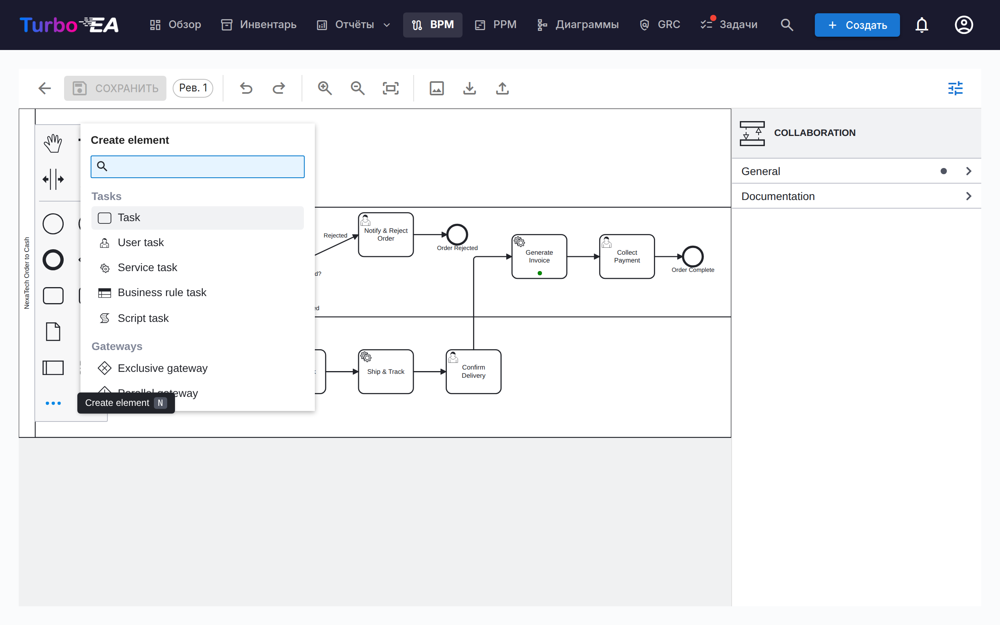
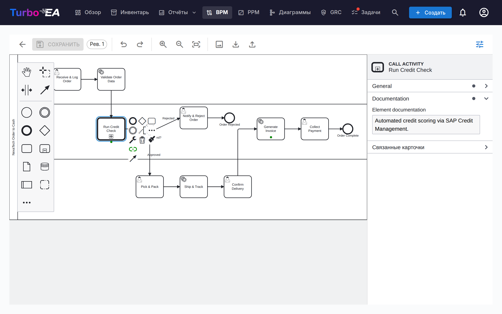
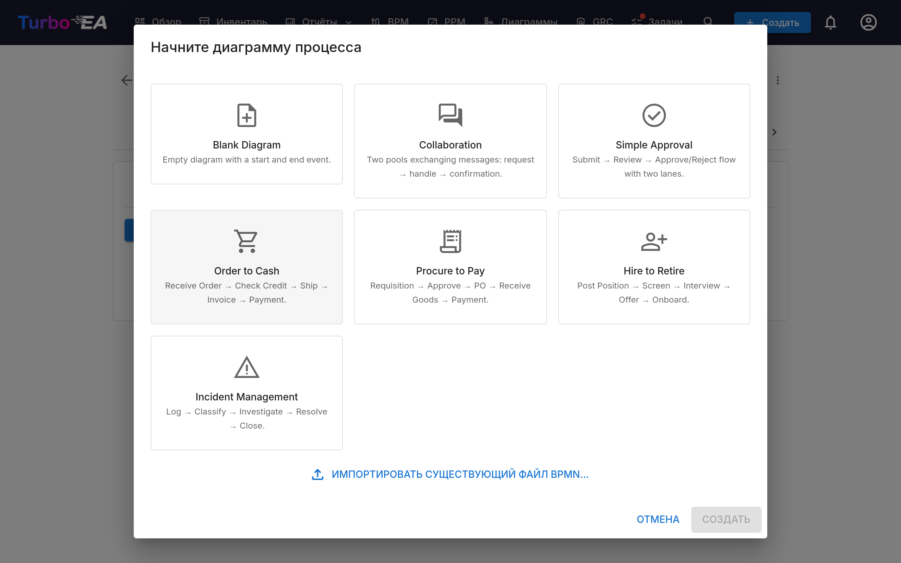
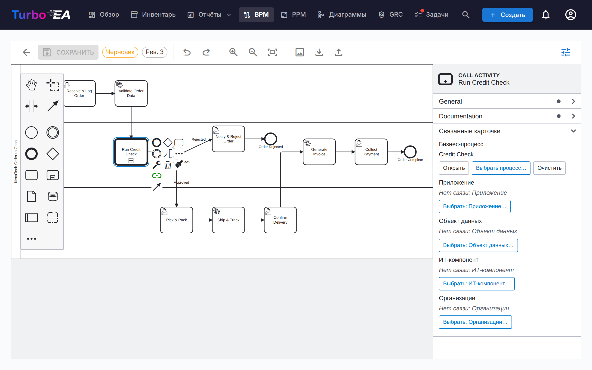

# Управление бизнес-процессами (BPM)

Модуль **BPM** позволяет документировать, моделировать и анализировать **бизнес-процессы** организации. Он сочетает визуальные диаграммы BPMN 2.0 с оценками зрелости и отчётностью.

!!! note
    Модуль BPM может быть включён или отключён администратором в [Настройках](../admin/settings.md). При отключении навигация и функции BPM скрыты.

## Навигатор процессов

**Навигатор процессов** организует процессы в три основные категории:

- **Процессы управления** — планирование, руководство и контроль
- **Основные бизнес-процессы** — основная деятельность по созданию ценности
- **Поддерживающие процессы** — деятельность, поддерживающая основные бизнес-операции

**Фильтры:** Тип, Зрелость (Начальный / Определённый / Управляемый / Оптимизированный), Уровень автоматизации, Риск (Низкий / Средний / Высокий / Критический), Глубина (L1 / L2 / L3).

Карточки с опубликованной BPMN-диаграммой показывают **значок потока** — щёлкните по нему, чтобы открыть диаграмму на весь экран, не покидая навигатор (или перейти оттуда к полноценному редактору потока).

**Раскладка по столбцам:** на панели инструментов есть **переключатель столбцов** — один, два или три, — позволяющий расширить карточки процессов или уместить на экране больше строки. Строка никогда не растягивается на большее число столбцов, чем в ней процессов, а выбор сохраняется между посещениями. Выбор распространяется и на вложенные уровни — на один столбец меньше на каждом уровне, — поэтому при раскрытии глубокие процессы больше не сжимаются в узкие полоски.

**Публикация:** навигатор процессов можно опубликовать как [веб-портал](../admin/web-portals.md) только для чтения, чтобы люди без учётной записи Turbo EA — новые сотрудники, аудиторы, партнёры — могли просматривать дом процессов и открывать каждую опубликованную схему BPMN.

## Панель мониторинга BPM

**Панель мониторинга BPM** предоставляет сводный обзор состояния процессов:

| Показатель | Описание |
|------------|----------|
| **Всего процессов** | Общее количество задокументированных бизнес-процессов |
| **Покрытие диаграммами** | Процент процессов, имеющих связанную BPMN-диаграмму |
| **Высокий риск** | Количество процессов с высоким уровнем риска |
| **Критический риск** | Количество процессов с критическим уровнем риска |

Графики показывают распределение по типу процесса, уровню зрелости и уровню автоматизации. Таблица **наиболее рискованных процессов** помогает расставить приоритеты инвестиций.

## Редактор процессных потоков

Каждая карточка «Бизнес-процесс» может иметь **диаграмму процессного потока BPMN 2.0**. Редактор использует [bpmn-js](https://bpmn.io/) и предоставляет:

- **Визуальное моделирование** — перетаскивание элементов BPMN из палитры: задачи, события, шлюзы, дорожки, пулы и подпроцессы. Пункт **…** внизу палитры открывает меню **Create element** с поиском, из которого доступны все типы элементов BPMN — события сообщения, таймера, сигнала, ошибки и эскалации, транзакции, событийные подпроцессы, вызываемые активности, задачи отправки/получения, объекты и хранилища данных (клавиша `N`). Пункт **+** на контекстной панели выбранной фигуры открывает соответствующее меню **Append element** (клавиша `A`)
- **Стартовые шаблоны** — выберите один из 7 готовых шаблонов BPMN для типичных паттернов процессов, включая шаблон **Коллаборация** с двумя пулами и потоками сообщений (или начните с чистого холста)
- **Извлечение элементов** — при сохранении диаграммы система автоматически извлекает все задачи, события, шлюзы, дорожки, объекты данных и потоки сообщений для анализа. События сохраняют свой вид — стартовое событие *сообщения* перечисляется как таковое, с именем получаемого сообщения, — а задачи отправки/получения несут обмениваемое сообщение. Извлечённые элементы перечисляются **в порядке хода процесса** — по потокам управления и сообщений диаграммы, начиная со стартового события, — а не группируются по типу элемента. Шаги внутри цикла остаются вместе, содержимое подпроцесса перечисляется непосредственно под ним, а объекты и хранилища данных идут последними
- **Цвета элементов** — выделите один или несколько элементов и нажмите кнопку с заливкой на контекстной панели, чтобы задать цвет. Цвета сохраняются в самом файле BPMN, поэтому отображаются и в режиме просмотра, и при экспорте, и при печати
- **Панель свойств** — панель справа (показать или скрыть кнопкой с ползунками на панели инструментов) редактирует то, что фигура показать не может: имя и документацию элемента, **сообщение**, **сигнал**, **ошибку** или **эскалацию**, на которые ссылается событие, условие потока управления и маркеры множественных экземпляров. Введённая здесь документация отображается в навигаторе процессов и в режиме просмотра

### Пулы и потоки сообщений

Процесс с несколькими участниками — клиент и компания, два подразделения, партнёрская система — моделируется как **коллаборация**: по одному пулу на участника, соединённых **потоками сообщений**. Добавьте второй пул из палитры (или начните с шаблона **Коллаборация**), затем проведите поток сообщений между пулами инструментом глобального соединения или от задачи отправки, конечного события сообщения либо генерирующего события сообщения в одном пуле к задаче получения или событию сообщения в другом. Задайте имя сообщения в панели свойств, чтобы оно читалось одинаково везде.

### Привязка элементов

Элементы BPMN можно **привязать к карточкам корпоративной архитектуры**. Например, привяжите задачу в диаграмме процесса к Приложению, которое её поддерживает. Это создаёт прослеживаемую связь между моделью процесса и ландшафтом архитектуры:

- Каждая именованная задача, событие и шлюз опубликованного потока — это строка таблицы **Шаги и элементы процесса** под диаграммой (у черновика та же таблица находится в разделе **Предварительная привязка элементов** и применяется при утверждении черновика)
- Нажмите на ячейку **Приложение**, **Объект данных** или **ИТ-компонент** шага и выберите карточку — селектор просматривает инвентарь, ничего не вводится вручную
- Связь сохраняется на шаге и создаёт отношение между процессом и карточкой, поэтому видна и в процессном потоке, и на вкладке «Связи» карточки
- Столбец **Бизнес-процесс** связывает шаг с процессом, которому он передаёт управление — см. ниже

### Связывание шага с процессом

Шаг часто передаёт управление процессу, существующему самостоятельно — со своей диаграммой, своим владельцем и своим жизненным циклом, который обычно переиспользуется из нескольких мест. Об этом может сообщить любой шаг: задача, подпроцесс, событие или шлюз указывает на карточку **Бизнес-процесса**, и вам никогда не нужно вводить идентификатор процесса вручную:

- **Панель свойств** показывает на каждом шаге группу **Связанный процесс** с кнопками **Выбрать процесс…**, **Открыть** (переход в поток связанного процесса) и **Очистить**
- **Контекстное меню** выбранного шага содержит пункт **Привязать процесс** — на случай, если панель свёрнута
- **Таблица шагов** опубликованного потока (и таблица предварительной привязки черновика) содержит ту же связь в столбце **Бизнес-процесс**, а чип в ней ведёт на вкладку «Процессный поток» связанного процесса. Объекты и хранилища данных шагами не являются, поэтому в их строках стоит прочерк

В BPMN есть конструкция, которая *сама* является другим процессом: **действие вызова** (call activity), задача с толстой рамкой, вызывающая процесс, определённый самостоятельно. Встроенный **подпроцесс** тоже группирует шаги, но принадлежит диаграмме, в которой нарисован; правило Method & Style простое: если процесс существует независимо, используйте действие вызова. Turbo EA считает его штатным случаем: **при размещении действия вызова спрашивается, какой процесс оно вызывает**, а связь хранится в собственном *вызываемом элементе* BPMN, который читают и другие инструменты. Любой другой шаг хранит связь как атрибут Turbo EA в диаграмме.

Публикация потока со связанным шагом создаёт отношение **вызывает** между двумя процессами — на вкладке «Связи» связанного процесса отображается *вызывается*, а представление зависимостей рисует граф вызовов. Диаграмма, импортированная из другого инструмента, сохраняет собственную ссылку на процесс этого инструмента; таблица шагов показывает её как подсказку (*ссылается на Process_X*), пока вы не выберете соответствующий процесс в Turbo EA.

### Потоки сообщений

Потоки сообщений опубликованной диаграммы перечислены под таблицей элементов; каждый показывает, что он соединяет — задачу, событие или целый пул с каждой стороны. Свяжите поток сообщений с карточкой **Интерфейс**, который его передаёт. Как и привязка организаций к шагам, это только для информации: связь между карточками не создаётся.

### Привязка организаций

Столбец *Организация* в таблице шагов привязывает шаги к карточкам организаций — рядом с Приложением / Объектом данных / ИТ-компонентом. В отличие от этих одиночных связей, шаг можно привязать к **нескольким** организациям — выбирайте их по одной и удаляйте по отдельности. Привязки шагов носят исключительно информационный характер — они документируют, какие организации участвуют в шаге, не создавая связи между карточками; связи «Бизнес-процесс ↔ Организация» управляются отдельно на вкладке «Связи» карточки. Названия дорожек остаются обычным свободным текстом из диаграммы и не связаны с карточками организаций. **Матрица «Процесс × Организация»** в отчётах BPM агрегирует эти привязки по всем процессам.

### Процесс утверждения

Схемы процессов проходят через процесс утверждения с контролем версий:

| Статус | Описание |
|--------|----------|
| **Черновик** | Редактируется, ещё не отправлен на рассмотрение |
| **На рассмотрении** | Отправлен на утверждение, ожидает проверки |
| **Опубликовано** | Утверждено и отображается как текущая версия |
| **В архиве** | Ранее опубликованная версия, заменённая более новым утверждением |
| **Отозвано** | Ранее опубликованная версия, намеренно снятая с публикации |

Отправка черновика создаёт снимок версии. Утверждающие могут утвердить (опубликовать) или отклонить отправленную редакцию.

#### Кто может утверждать

Для утверждения или отклонения поданной редакции требуется разрешение **Утверждать или отклонять поданные версии схем BPMN** либо роль заинтересованного лица **Владелец процесса** на самом процессе. Права на редактирование черновиков недостаточно.

!!! warning "Изменено в версии 2.43.0"
    В более ранних версиях здесь принималось общее разрешение на редактирование BPM, поэтому любой участник мог утвердить любую схему процесса — в том числе редакцию, которую сам подал мгновением ранее. Если в вашей установке утверждения сейчас выполняют люди, обладающие лишь правами редактирования BPM, выдайте им разрешение **Утверждать или отклонять поданные версии схем BPMN** в разделе Администрирование → Роли либо назначьте их **Владельцем процесса** на соответствующих процессах.

#### Отзыв опубликованной версии

Утверждение, выданное по ошибке, можно отменить, не удаляя процесс. Для отзыва требуется разрешение **Отозвать (снять с публикации) опубликованную версию схемы BPMN**, которого **по умолчанию нет ни у одной роли** — администратор выдаёт его в разделе Администрирование → Роли либо роли заинтересованного лица **Владелец процесса** в разделе Администрирование → Метамодель.

После выдачи разрешения у опубликованной версии появляется кнопка **Отозвать**. Отзыв требует письменного обоснования, после чего:

- редакция переходит в статус **Отозвано** — она никогда не удаляется и не возвращается в черновик;
- исходное утверждение сохраняется: вкладка «В архиве» показывает номер редакции, кто и когда её утвердил, рядом с тем, кто и почему её отозвал;
- отзыв вместе с причиной фиксируется на вкладке **История** карточки;
- **её копия открывается как новый черновик** со следующим номером редакции, чтобы вы могли исправить схему и снова провести её через подачу → утверждение;
- у процесса не остаётся *утверждённой* схемы, пока этот черновик не будет утверждён;
- извлечённые шаги процесса и их связи с карточками остаются нетронутыми.

Сохранять отозванную редакцию и править копию — сознательное решение: именно та схема, которую подписал утверждающий, остаётся доступной, чего и требует система качества, а рабочая копия у вас появляется сразу.

Любую заархивированную или отозванную версию можно в любой момент снова взять в работу командой **Создать новый черновик на его основе** на вкладке «В архиве» — она клонируется в черновик со следующим номером редакции.

## Оценки процессов

Карточки «Бизнес-процесс» поддерживают **оценки** процесса по следующим критериям:

- **Эффективность** — насколько хорошо процесс использует ресурсы
- **Результативность** — насколько хорошо процесс достигает своих целей
- **Соответствие** — насколько хорошо процесс соответствует нормативным требованиям

Данные оценок поступают в отчёты BPM.

## Отчёты BPM

Три специализированных отчёта доступны с панели мониторинга BPM:

- **Отчёт по зрелости** — распределение процессов по уровню зрелости, тенденции во времени
- **Отчёт по рискам** — обзор оценки рисков, выделение процессов, требующих внимания
- **Отчёт по автоматизации** — анализ уровней автоматизации по ландшафту процессов
- **Матрица «Процесс × Организация»** — какие организации выполняют шаги в каких процессах, с фильтрацией по организациям и детализацией шагов по процессу (на основе информационных привязок шагов; связи между карточками не учитываются)
