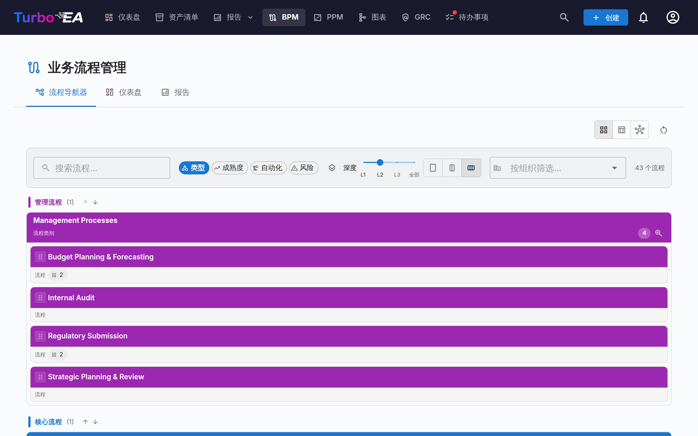
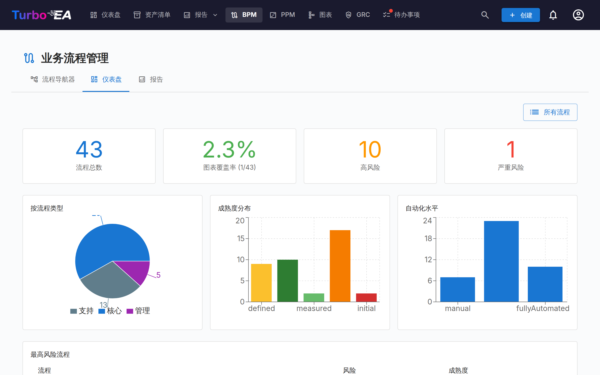
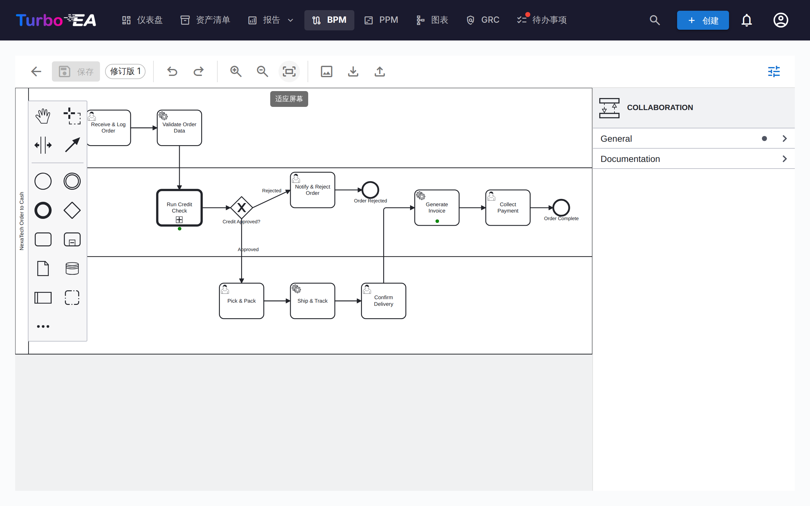
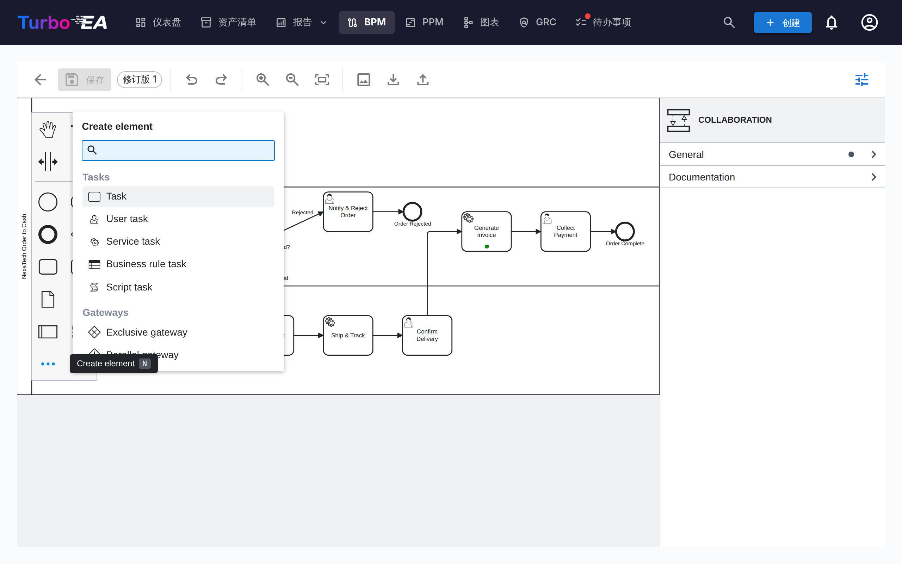
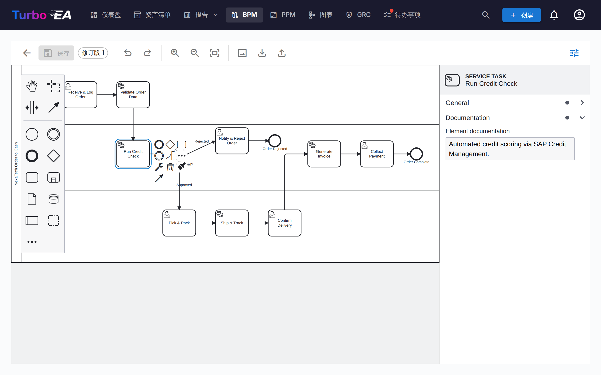
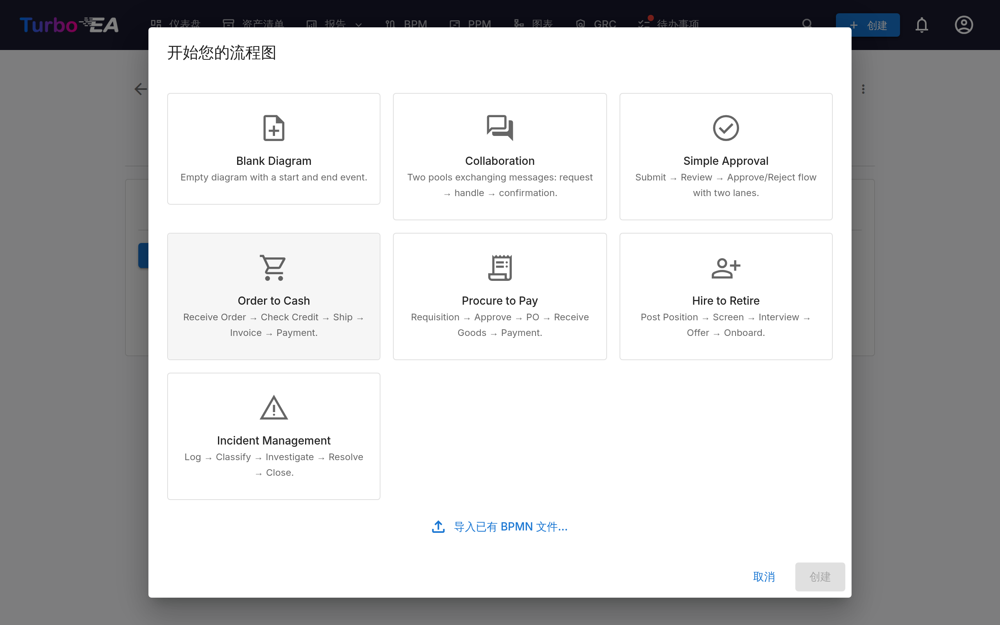
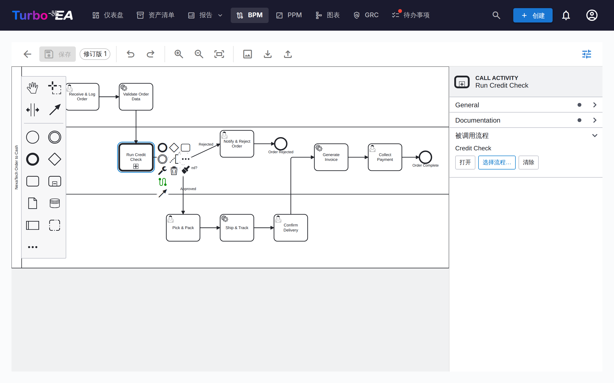

# 业务流程管理（BPM）

**BPM** 模块允许记录、建模和分析组织的**业务流程**。它将可视化 BPMN 2.0 图表与成熟度评估和报告相结合。

!!! note
    BPM 模块可以由管理员在[设置](../admin/settings.md)中启用或禁用。禁用后，BPM 导航和功能将被隐藏。

## 流程导航器

**流程导航器**将流程组织为三个主要类别：

- **管理流程** —— 规划、治理和控制
- **核心业务流程** —— 主要的价值创造活动
- **支持流程** —— 支持核心业务运营的活动

**筛选条件：** 类型、成熟度（初始 / 已定义 / 已管理 / 已优化）、自动化水平、风险（低 / 中 / 高 / 关键）、深度（L1 / L2 / L3）。

带有已发布 BPMN 图的卡片会显示一个**流程图标**——点击它即可在导航器中全屏打开该图（或由此跳转到完整的流程编辑器）。

**列布局：** 工具栏提供**列数选择器**——一列、两列或三列——可用于加宽流程卡片，或在屏幕上容纳更多同一行的内容。任何一行都不会被拉伸到超过其流程数量的列数，且该选择会在下次访问时保留。 该选择同样会传递到嵌套层级，每深一层少一列，因此向下展开时深层流程不会再被挤成窄条。

**发布：**流程导航器可以发布为只读[网页门户](../admin/web-portals.md)，让没有 Turbo EA 账户的人——新员工、审计人员、合作伙伴——浏览流程之家并打开每个已发布的 BPMN 流程图。

## BPM 仪表盘

**BPM 仪表盘**提供流程状态的管理层视图：

| 指标 | 描述 |
|------|------|
| **流程总数** | 已记录的业务流程总数 |
| **图表覆盖率** | 具有关联 BPMN 图表的流程百分比 |
| **高风险** | 高风险等级的流程数量 |
| **关键风险** | 关键风险等级的流程数量 |

图表显示按流程类型、成熟度水平和自动化水平的分布。**高风险流程排行**表格有助于确定投资优先级。

## 流程编辑器

每个业务流程卡片可以有一个 **BPMN 2.0 流程图**。编辑器使用 [bpmn-js](https://bpmn.io/) 并提供：

- **可视化建模** —— 从调色板拖放 BPMN 元素：任务、事件、网关、泳道、泳池和子流程。调色板底部的 **…** 入口打开可搜索的 **Create element** 菜单，可以创建所有 BPMN 元素类型 —— 消息、定时器、信号、错误和升级事件、事务、事件子流程、调用活动、发送/接收任务、数据对象和数据存储（快捷键 `N`）。选中形状的上下文面板中的 **+** 入口打开对应的 **Append element** 菜单（快捷键 `A`）
- **入门模板** —— 从 7 个预构建的 BPMN 模板中选择常见流程模式，其中包括带消息流的双泳池**协作**模板（或从空白画布开始）
- **元素提取** —— 保存图表时，系统自动提取所有任务、事件、网关、泳道、数据对象和消息流用于分析。事件保留其类型 —— *消息*开始事件会作为消息事件列出，并带有所接收消息的名称 —— 发送/接收任务则带有所交换的消息。提取的元素按**流程执行顺序**列出 —— 从开始事件出发，沿着图中的顺序流和消息流 —— 而不是按元素类型分组。循环内的步骤保持在一起，子流程的内容紧随其后列出，数据对象和数据存储排在最后
- **元素颜色** —— 选中一个或多个元素，使用上下文面板中的油漆桶按钮即可应用颜色。颜色保存在 BPMN 文件本身中，因此在只读查看器、导出文件和打印输出中同样可见
- **属性面板** —— 右侧面板（用工具栏中的滑块按钮显示或隐藏）编辑形状无法展示的内容：元素的名称和文档、事件所引用的**消息**、**信号**、**错误**或**升级**、顺序流的条件以及多实例标记。此处输入的文档会显示在流程导航器和只读查看器中

### 泳池与消息流

涉及多方的流程 —— 客户与公司、两个部门、合作伙伴系统 —— 建模为**协作**：每一方一个泳池，通过**消息流**相连。从调色板添加第二个泳池（或从**协作**模板开始），然后用全局连接工具在两个泳池之间绘制消息流，或者从一个泳池中的发送任务、消息结束事件或消息抛出事件连到另一个泳池中的接收任务或消息事件。在属性面板中为消息命名，使它在各处显示一致。

### 元素链接

BPMN 元素可以**链接到 EA 卡片**。例如，将流程图中的任务链接到支持它的应用程序。这在流程模型和架构之间创建了可追溯的连接：

- 已发布流程中每个有名称的任务、事件和网关都是图表下方**流程步骤与元素**表格中的一行（草稿在**预链接元素**下有同样的表格，批准草稿时应用）
- 点击某个步骤的**应用程序**、**数据对象**或 **IT 组件**单元格并选择卡片 —— 选择器会浏览清单，无需手动输入任何内容
- 链接保存在步骤上，并在流程与卡片之间创建关系，因此在流程图和卡片的「关系」标签页中都可见
- **调用**列将**调用活动**链接到它所调用的流程 —— 见下文

### 调用另一个流程

BPMN 中「此步骤是另一个流程」只有一种表达方式：**调用活动**（call activity），一个带粗边框的任务，用于调用独立定义的流程 —— 该流程有自己的图表、负责人和生命周期，通常在多处复用。内嵌**子流程**也能对步骤分组，但它属于所在的图表；Method & Style 的规则很简单：若流程独立存在，就使用调用活动。

在 Turbo EA 中，调用活动指向一张**业务流程**卡片，您永远不必手动输入流程 ID：

- **放置调用活动时会询问它调用哪个流程。**从「创建元素」菜单添加一个调用活动，选择器会在清单的业务流程中打开 —— 选择被调用的流程，或取消以便稍后链接
- **属性面板**在每个调用活动上显示**被调用流程**分组，包含**选择流程…**、**打开**（下钻到被调用流程的流程图）和**清除**
- 选中调用活动的**上下文菜单**带有**关联流程**项，便于在面板折叠时使用
- 已发布流程的**步骤表格**（以及草稿的预链接表格）在**调用**列中有同样的链接，点击那里的标签会下钻到被调用流程的「流程图」标签页

发布包含已链接调用活动的流程会在两个流程之间创建「调用」关系 —— 被调用流程的「关系」标签页显示*被调用*，依赖视图会绘制调用图。从其他工具导入的图表会保留该工具自身的流程引用；步骤表格将其显示为提示（*引用 Process_X*），直到您在 Turbo EA 中选择对应的流程。

### 消息流

已发布图表的消息流列在元素表格下方，每条都显示其连接的对象 —— 两端各是一个任务、一个事件或整个泳池。将消息流关联到承载它的**接口**卡片。与步骤上的组织链接一样，这仅供参考：不会在卡片之间创建关系。

### 链接组织

步骤表中的*组织*列可将步骤链接到组织卡片，与应用程序 / 数据对象 / IT 组件并列。与那些单值链接不同，一个步骤可以链接**多个**组织 —— 逐个选择并可单独移除。步骤链接仅供参考 —— 它记录哪些组织参与某个步骤，但不会在卡片之间创建任何关系；业务流程 ↔ 组织关系需在卡片的「关系」选项卡中单独管理。泳道名称仍是图表中的纯自由文本，与组织卡片没有关联。 BPM 报告中的**流程 × 组织矩阵**会汇总所有流程中的这些链接。

### 审批工作流

流程图遵循带版本控制的审批工作流：

| 状态 | 说明 |
|------|------|
| **草稿** | 正在编辑，尚未提交审核 |
| **待审批** | 已提交审批，等待审核 |
| **已发布** | 已审批，作为当前版本可见 |
| **已归档** | 先前发布的版本，被更新的审批取代 |
| **已撤回** | 先前发布的版本，被有意取消发布 |

提交草稿会生成一个版本快照。审批人可以批准（发布）或驳回该提交。

#### 谁可以审批

批准或驳回已提交的版本需要「审批或驳回已提交的 BPMN 流程版本」权限，或在该流程上担任「流程负责人」利益相关者角色。仅能编辑草稿是不够的。

!!! warning "2.43.0 版变更"
    早期版本在此处接受通用的 BPM 编辑权限，因此任何成员都可以审批任何流程图——包括自己刚刚提交的版本。如果贵实例中目前由仅拥有 BPM 编辑权限的人员进行审批，请在管理 → 角色中为其授予「审批或驳回已提交的 BPMN 流程版本」权限，或将其指定为相应流程的「流程负责人」。

#### 撤回已发布的版本

误批的审批可以撤销，无需删除整个流程。撤回需要「撤回（取消发布）已发布的 BPMN 流程版本」权限，**默认没有任何角色拥有该权限**——请由管理员在管理 → 角色中授予，或在管理 → 元模型中授予「流程负责人」利益相关者角色。

获得该权限后，已发布的版本会出现「撤回」按钮。撤回时需要填写书面理由，然后：

- 版本状态变为**已撤回**——绝不会被删除，也不会退回草稿；
- 原有审批记录保留：「已归档」选项卡会显示该版本号、审批人和审批时间，以及撤回人和撤回理由；
- 撤回操作连同理由记录在卡片的**历史**选项卡中；
- **以其副本创建一个新草稿**，版本号顺延，方便您修正图示后重新走提交 → 审批流程；
- 在该草稿获批之前，流程没有*已审批*的流程图；
- 已提取的流程步骤及其卡片关联保持不变。

保留被撤回的版本、只编辑副本是有意为之：审批人签署的那份图示始终可追溯，这正是质量体系的要求，同时您也能立即获得可编辑的工作副本。

任何已归档或已撤回的版本都可随时通过「已归档」选项卡的**基于此创建新草稿**重新启用，系统会将其克隆为顺延版本号的新草稿。

## 流程评估

业务流程卡片支持**评估**，从以下方面为流程评分：

- **效率** —— 流程使用资源的效果
- **有效性** —— 流程实现目标的效果
- **合规性** —— 流程满足监管要求的程度

评估数据反映在 BPM 报告中。

## BPM 报告

BPM 仪表盘提供三个专业报告：

- **成熟度报告** —— 按成熟度水平的流程分布，随时间的趋势
- **风险报告** —— 风险评估概览，突出需要关注的流程
- **自动化报告** —— 流程架构中自动化水平的分析
- **流程 × 组织矩阵** —— 哪些组织在哪些流程中执行步骤，支持按组织筛选和按流程展开步骤明细（基于参考性步骤链接；不包含卡片关系）
