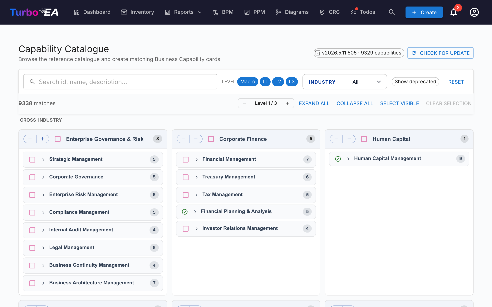

# Kompetencekatalog

Turbo EA leveres med **[Reference­katalog for forretningskompetencer](https://catalog.turbo-ea.org)** — et kurateret, åbent katalog over forretningskompetencer vedligeholdt på [github.com/vincentmakes/turbo-ea-capabilities](https://github.com/vincentmakes/turbo-ea-capabilities). Siden Kompetencekatalog lader dig gennemse denne reference og oprette tilsvarende `BusinessCapability`-kort i bulk i stedet for at indtaste dem ét ad gangen.

## Åbning af siden

Klik på brugerikonet i øverste højre hjørne af appen og derefter på **Capability Catalogue**. Siden er tilgængelig for alle med tilladelsen `inventory.view`.

## Hvad du ser

- **Sidehoved** — den aktive katalogversion, antallet af kompetencer den indeholder, og (for administratorer) kontroller til at tjekke for og hente opdateringer.
- **Filterlinje** — fuldtekstsøgning på tværs af id, navn, beskrivelse og aliasser, plus niveau-chips (Macro → L1 → L4), et multi-valg for branche og en "Vis udfasede"-til/fra-knap. Bliver fastgjort lige under topnavigationen, når du ruller.
- **Handlingslinje** — tællere for match, den globale niveau-stepper (udvid/fold alle L1'er ét niveau ad gangen), udvid/fold alle, vælg synlige, ryd valg. Fastgjort sammen med filterlinjen, så kontrollerne forbliver tilgængelige selv dybt inde i et L1-undertræ.
- **L1-gitter** — ét kort pr. kompetence på øverste niveau, **grupperet under brancheoverskrifter**. **Cross-Industry**-kompetencer fastgøres øverst; andre brancher følger alfabetisk; kompetencer uden branchetag falder ind i en **General**-gruppe til sidst. L1-navnet ligger i en lyseblå overskriftsstribe; underordnede kompetencer er listet nedenunder, indrykket med en svag lodret skinne for at angive dybde — samme hierarki-idiom som bruges andre steder i appen, så siden ikke bærer sin egen visuelle identitet. Navne ombrydes til flere linjer i stedet for at blive afkortet. Hvert L1-sidehoved eksponerer også sin egen `−` / `+`-stepperpille: `+` åbner næste niveau af efterkommere for den ene L1, `−` lukker det dybeste åbne niveau. De to knapper er altid synlige (den inaktive retning er deaktiveret), handlingen er afgrænset til den ene L1 — andre grene forbliver uændrede — og den globale niveau-stepper øverst på siden påvirkes ikke.
- **Tilbage-til-top-knap** — når du har rullet forbi sidehovedet, vises en cirkulær flydende pil i nederste højre hjørne. Klik på den for at glide tilbage til toppen af siden. Den glider automatisk op for at give plads til den fastgjorte linje **Opret N kompetencer**, når du har kompetencer valgt, så de to aldrig overlapper.

## Valg af kompetencer

Marker afkrydsningsfeltet ved siden af en kompetence for at føje den til valget. Valget kaskaderer ned i undertræet i begge retninger, men berører aldrig forfædre:

- **At markere** en uvalgt kompetence tilføjer den plus alle valgbare efterkommere.
- **At afmarkere** en valgt kompetence fjerner den plus alle valgbare efterkommere.

Når du derfor afmarkerer et enkelt barn, fjernes kun det barn og det, der ligger under — dets forælder og søskende forbliver valgt. Afmarkering af en forælder fjerner hele undertræet i én handling. For at samle et udvalg som "L1 + et par blade" vælges L1 (som seeder hele undertræet), og derefter afmarkeres de L2/L3-kompetencer, du ikke ønsker — L1 forbliver valgt, og dens afkrydsningsfelt forbliver markeret.

Siden tilpasser sig automatisk app'ens lyse/mørke tema — mørk tilstand gengiver det samme neutrale layout på `#1e1e1e`-papir med løftet-lavendel-tekst og accenter.

Kompetencer, der **allerede findes** i dit lager, vises med et **grønt fluebensikon** i stedet for et afkrydsningsfelt. De kan ikke vælges — du kan aldrig oprette den samme Business Capability to gange via kataloget. Matchning foretrækker stemplet `attributes.catalogueId` efterladt af en tidligere import (så det grønne flueben overlever ændringer af visningsnavn) og falder tilbage til en case-uafhængig visningsnavn-matchning for kort, du har oprettet i hånden.

## Masseoprettelse af kort

Når du har valgt en eller flere kompetencer, vises en fastgjort **Opret N kompetencer**-knap nederst på siden. Den bruger den almindelige tilladelse `inventory.create` — hvis din rolle ikke tillader kortoprettelse, er knappen deaktiveret.

Ved bekræftelse vil Turbo EA:

- Oprette ét `BusinessCapability`-kort pr. valgt katalogpost.
- **Bevare kataloghierarkiet** automatisk — når både forælderen og barnet er valgt (eller forælderen allerede findes lokalt), forbindes det nye barnekorts `parent_id` til det rigtige kort.
- **Springe eksisterende match over** uden at gøre opmærksom på det. Resultatdialogen viser, hvor mange der blev oprettet, og hvor mange der blev sprunget over.
- Stemple hvert nyt korts `attributes` med `catalogueId`, `catalogueVersion`, `catalogueImportedAt` og `capabilityLevel`, så du kan spore, hvor det kom fra.

Det er sikkert at køre den samme import igen — den er idempotent.

**Tovejs-linking.** Hierarkiet repareres i begge retninger, så den rækkefølge, du importerer i, er ligegyldig:

- Hvis du kun vælger et barn, hvis katalog-**forælder allerede findes** som et kort, podes det nye barn automatisk på den eksisterende forælder.
- Hvis du kun vælger en forælder, hvis katalog-**børn allerede findes** som kort, om-tildeles disse børn som underordnede til det nye kort — uanset hvor de aktuelt befinder sig (topniveau eller hånd-indlejret under et andet kort). Kataloget er sandhedskilden for hierarki ved import; hvis du foretrækker en anden forælder for et specifikt kort, redigerer du det efter importen. Resultatdialogen rapporterer, hvor mange kort der blev gen-linket sammen med antallet af oprettede og sprungne kort.

## Makrokompetencer (niveau 0)

Over L1- / L2- / L3- / L4-lagene leverer kataloget et ekstra **Macro**-lag — et lille sæt af forretningsniveau-grupperinger, der rammer hele L1-familier. Eksempler omfatter *Customer Engagement* (rammer Sales, Marketing, Service L1'er) eller *Talent & Workforce* (rammer HR L1'er).

Makroer er førsteklasses katalogposter:

- De lander i dit lager som `BusinessCapability`-kort med `attributes.capabilityLevel = "Macro"` og et `catalogueId` med præfikset `MC-` (f.eks. `MC-10`).
- De ligger **over** deres L1-børn — hierarkidybdegrænsen lempes fra 5 til 6 for at give plads til det ekstra lag (`Macro → L1 → L2 → L3 → L4 → L5`).
- Når du importerer en makro, om-tildeles eventuelle eksisterende L1-børn, der er markeret som tilhørende den makro, automatisk under det nye kort — samme tovejs-linking, der gælder mellem L1 og lavere lag.
- **Makroer matcher aldrig eksisterende kort efter navn** — kun efter `catalogueId`. Dette undgår utilsigtede kollisioner med kundenavngivne kompetencegrupper, der tilfældigvis deler en etiket med en katalogmakro.

Makroer kan vælges fra katalogsiden ligesom L1'er — marker afkrydsningsfeltet, og undertræet vælges tilsvarende.

## Detaljevisning

Klik på et kompetencenavn for at åbne en detaljedialog, der viser brødkrummer, beskrivelse, branche, aliasser, referencer og en fuldt udvidet visning af undertræet. Eksisterende match i undertræet er markeret med et grønt flueben.

## Opdatering af kataloget (administratorer)

Kataloget leveres **medfølgende** som en Python-afhængighed, så siden virker offline / i lukkede miljøer. Administratorer (`admin.metamodel`) kan hente en nyere version efter behov:

1. Klik på **Check for update**. Turbo EA forespørger PyPI's JSON-API på `https://pypi.org/pypi/turbo-ea-capabilities/json` og fortæller dig, om en nyere udgivet version er tilgængelig. PyPI er sandhedskilden ved udgivelsestidspunktet, så et wheel, der gik live for få minutter siden, opdages straks.
2. Hvis ja, klik på den **Fetch v…**-knap, der vises. Turbo EA downloader det seneste wheel fra PyPI, udtrækker katalogpayloaden fra det og gemmer det som en serversideoverstyring, der træder i kraft øjeblikkeligt for alle brugere.

Den aktive katalogversion vises altid i sidehovedets chip. Overstyringen foretrækkes kun frem for den medfølgende pakke, når dens version er strengt højere — så en Turbo EA-opgradering, der leverer et nyere medfølgende katalog, vil fortsat fungere som forventet.

PyPI-indeks-URL'en kan konfigureres via miljøvariablen `CAPABILITY_CATALOGUE_PYPI_URL` til lukkede miljøer eller private spejle.
