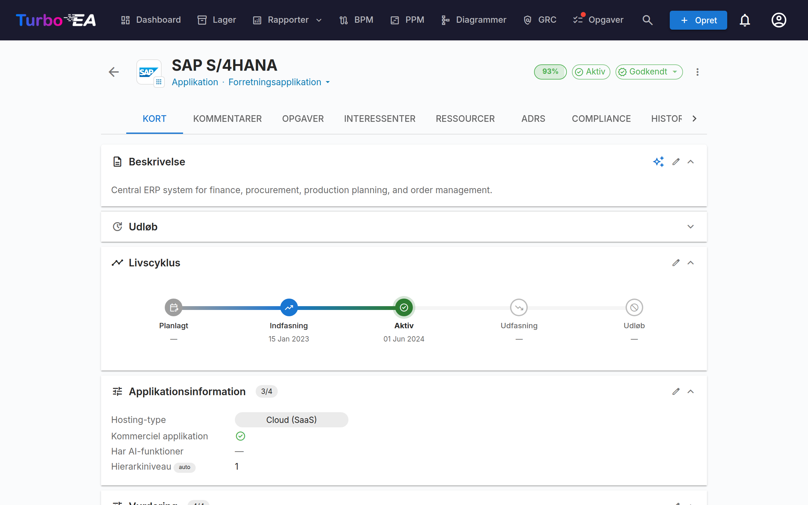
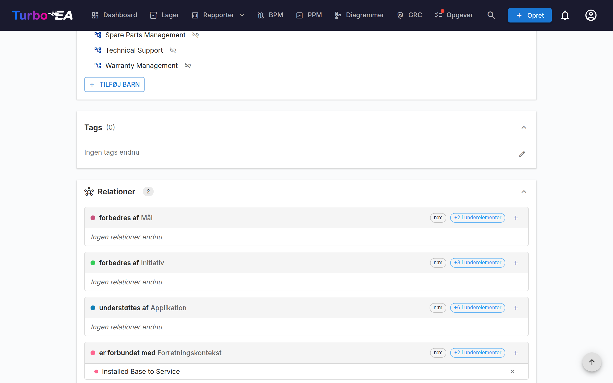
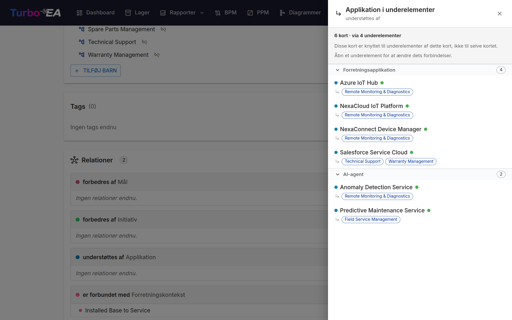
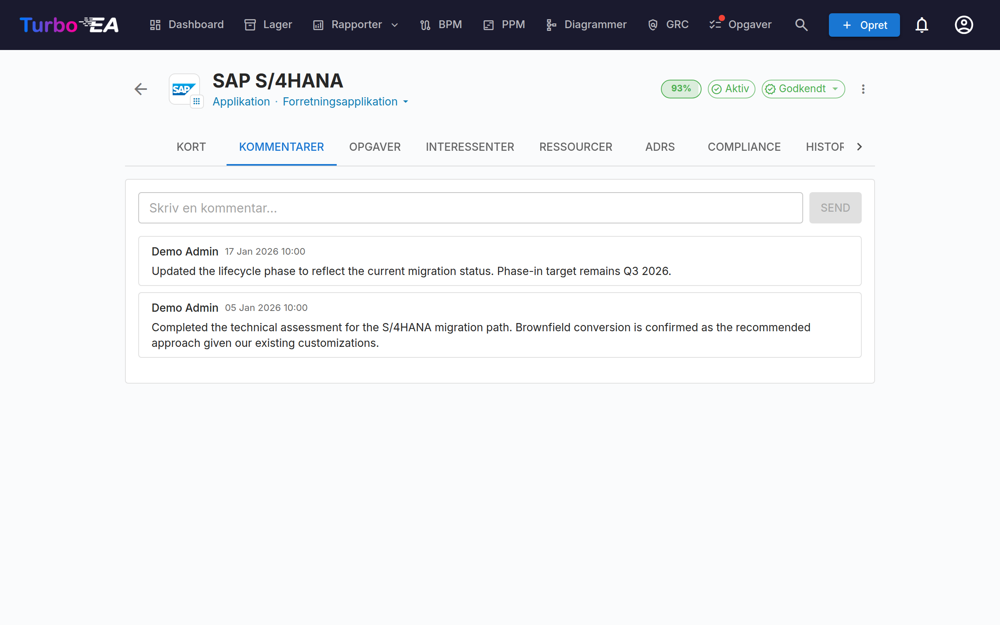
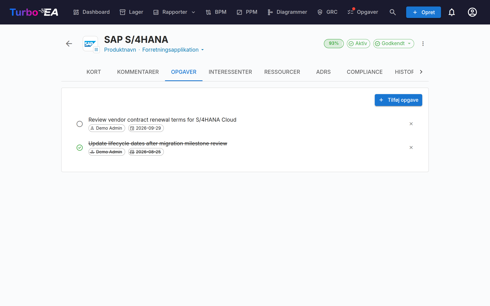
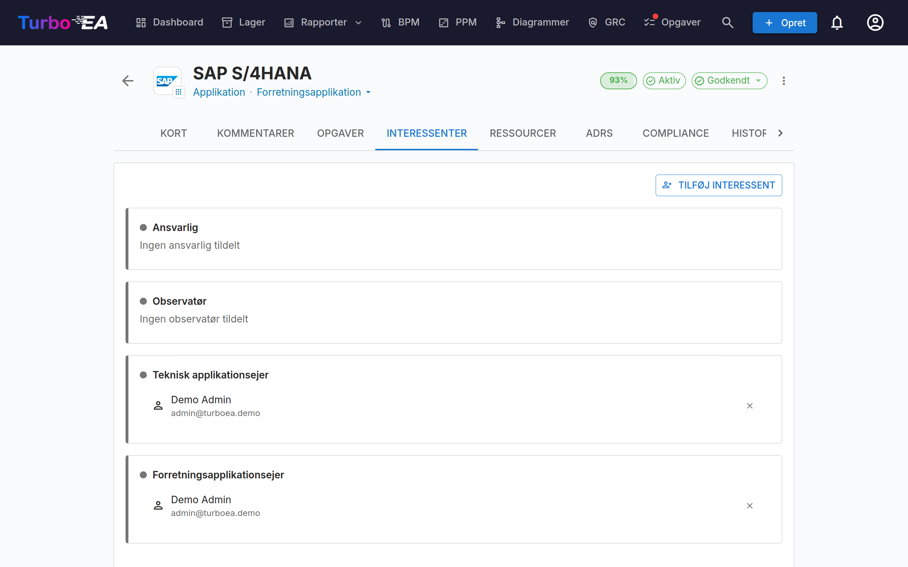
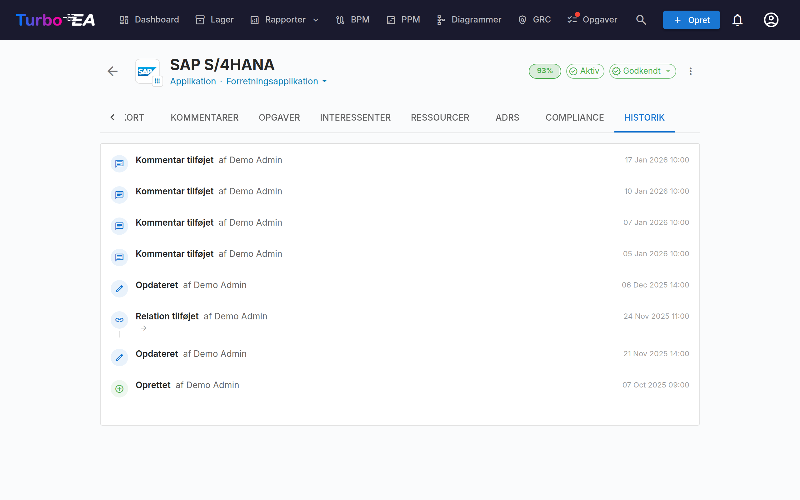

# Kortdetaljer

Når du klikker på et kort i lageret, åbnes **detaljevisningen**, hvor du kan se og redigere alle oplysninger om komponenten.

## Kortets sidehoved

Toppen af kortet viser:

- **Type-ikon og etikette** — Farvekodet korttype-indikator
- **Kortnavn** — Redigerbar inline
- **Undertype** — Sekundær klassifikation (hvis relevant)
- **Godkendelsesstatus-badge** — Draft, Approved, Broken eller Rejected
- **AI suggest-knap** — Klik for at generere en beskrivelse med AI (synlig når AI er aktiveret for denne korttype, og brugeren har redigeringstilladelse)
- **Datakvalitets­ring** — Visuel indikator for informationsfuldstændighed (0–100%)
- **Handlingsmenu** — Arkivér, slet og godkendelseshandlinger. Indeholder også en ét-klik **Observe this card**-skifter (når korttypen definerer en Observer-rolle), så enhver bruger med læseadgang kan følge kortet uden at skulle gå gennem Stakeholders-fanen.

### Eget logo

Kort af en type, der tillader det, kan have deres eget **logo** i stedet for
det generiske typeikon — så et Application-kort for SAP, Kafka eller Jira viser
produktets eget mærke. Genkendelige logoer gør en fortegnelse langt hurtigere
at skimme, især for dem, der læser den frem for at vedligeholde den.

Hold musen over ikonet øverst til venstre på kortet og klik for at **uploade**,
**erstatte** eller **fjerne** billedet. Typeikonet forsvinder ikke: det flytter
ned som et lille mærke i hjørnet af logoet, så man stadig kan se med det samme,
hvilken slags kort man har foran sig.

- **Tilladte formater** — PNG, JPEG, WebP eller GIF på op til 1 MB. SVG
  accepteres ikke, da formatet kan indeholde scripts.
- **Hvor det vises** — i kortets overskrift, i den valgfri **Logo**-kolonne i
  [Inventory](inventory.md) og i enhver offentliggjort webportal bygget på den
  korttype.
- **Uden logo** — kortet falder tilbage til sit typeikon præcis som før.

Logoer er tilgængelige for de korttyper, en administrator har slået dem til
for; fra start er det Application og IT Component. Se
[Metamodel](../admin/metamodel.md).

Klik på logoet og vælg **Vælg et brandikon…** for at hente det fra et indbygget
sæt på flere tusinde brandmærker — søg efter produktet på navn og vælg det; der
skal ingen billedfil til. **Upload** bruger din egen fil i stedet. En
AI-assistent forbundet via [MCP](../admin/mcp.md) kan sætte logoer på samme måde
i stor skala, og er et produkt ikke i sættet, henter den selv mærket.

Den samme menu findes i **Logo**-kolonnen i [Inventory](inventory.md) — hold
musen over en logo-celle og klik — så et netop importeret landskab kan få
mærker uden at åbne hvert enkelt kort. Det er ét kort ad gangen med vilje: et
logo tilbydes hverken til udfyld-nedad eller Mass Edit.

### Godkendelses­arbejdsproces

Kort kan gå gennem en godkendelses­cyklus:

| Status | Betydning |
|--------|-----------|
| **Draft** | Standardtilstand, endnu ikke gennemgået |
| **Approved** | Gennemgået og accepteret af en ansvarlig part |
| **Broken** | Var godkendt, men er blevet redigeret siden — kræver gen-gennemgang |
| **Rejected** | Gennemgået og afvist, kræver rettelser |

Når et godkendt kort redigeres, ændres dets status automatisk til **Broken** for at angive, at det kræver gen-gennemgang.

## Detalje-fane (hoved)

Detalje-fanen er organiseret i **sektioner**, der kan omarrangeres og konfigureres af en administrator pr. korttype (se [Kortlayout-editor](../admin/metamodel.md#card-layout-editor)).

### Beskrivelses-sektion

- **Description** — Rich text-beskrivelse af komponenten. Understøtter AI-forslagsfunktionen til automatisk generering
- **Yderligere beskrivelsesfelter** — Nogle korttyper inkluderer ekstra felter i beskrivelses-sektionen (f.eks. alias, ekstern ID)

### Livscyklus-sektion

Livscyklus-modellen sporer en komponent gennem fem faser:

| Fase | Beskrivelse |
|------|-------------|
| **Plan** | Under overvejelse, endnu ikke startet |
| **Phase In** | Bliver implementeret eller udrullet |
| **Active** | Aktuelt operationel |
| **Phase Out** | Bliver afviklet |
| **End of Life** | Ikke længere i brug eller understøttet |

Hver fase har en **datovælger**, så du kan registrere, hvornår komponenten er trådt eller vil træde ind i den fase. En visuel tidslinje-bjælke viser komponentens position i sin livscyklus.

### Brugerdefinerede egenskabs-sektioner

Afhængigt af korttypen vil du se yderligere sektioner med **brugerdefinerede felter** konfigureret i metamodellen. Felttyper inkluderer:

- **Text** — Friform tekstindtastning
- **Multi-line Text** — Friform tekstindtastning, der bevarer linjeskift, gengivet som et auto-voksende tekstområde
- **Number** — Numerisk værdi
- **Cost** — Numerisk værdi vist med platformens konfigurerede valuta
- **Boolean** — On/off-skifter
- **Date** — Datovælger
- **URL** — Klikbart link (valideret for http/https/mailto)
- **Single select** — Dropdown med foruddefinerede muligheder
- **Multiple select** — Multi-valg med chip-visning

Felter markeret som **calculated** viser et badge og kan ikke redigeres manuelt — deres værdier beregnes af [admin-definerede formler](../admin/calculations.md).

### Hierarki-sektion

For korttyper der understøtter hierarki (f.eks. Organization, Business Capability, Application):

- **Parent** — Kortets forælder i hierarkiet (klik for at navigere)
- **Children** — Liste over barnekort (klik på et for at navigere)
- **Hierarki-brødkrumme** — Viser den fulde sti fra rod til aktuelt kort

### Relations-sektion

Viser alle forbindelser til andre kort, grupperet efter relations­type. For hver relation:

- **Relateret kortnavn** — Klik for at navigere til det relaterede kort
- **Relations­type** — Forbindelsens karakter (f.eks. "uses", "runs on", "depends on")
- **Tilføj relation** — Klik på **+** for at åbne dialogen for den relation. Den viser matchende kort, mens du skriver (de bedste match først, flere hentes, når du ruller), og skjuler dem, der allerede er tilknyttet, med en billedtekst der viser hvor mange. Et klik på et kort tilknytter det med det samme, og det vises som en chip øverst — klik på chippens **×** for at fortryde den tilføjelse. Dialogen forbliver åben, så du kan tilføje så mange du vil, og på telefon åbner den i fuld skærm. Relationer uden deres eget afsnit nås fra knappen **Tilføj relation** nederst i afsnittet
- **Sortering** — Relaterede kort vises alfabetisk efter navn
- **Fjern relation** — Klik på slet-ikonet for at fjerne en relation
- **Gruppér efter undertype** — Når en relationssektion har mange relaterede kort, grupperes de automatisk i sammenklappelige undertype-grupper (hver med et antal), med en afsluttende **Ingen undertype**-gruppe til uklassificerede kort. Brug gruppe/liste-knappen i sektionsoverskriften for at skifte mellem den grupperede og den flade visning.
- **Kort forbundet til underelementer** — Når et kort har underelementer, viser hver relationsgruppe en **+N i underelementer**-chip, der tæller de kort, som er forbundet længere nede i hierarkiet — for eksempel de applikationer, der er knyttet til en kapabilitets underkapabiliteter. Et klik åbner en skrivebeskyttet liste, hvor hver række angiver det underelement, der indeholder forbindelsen (et kort, der nås via flere underelementer, vises én gang med dem alle angivet). Tællingen omfatter kun kort, der ikke allerede står i gruppen ovenfor. Åbn det underelement, der ejer forbindelsen, for at ændre den. Listen er inddelt i sammenklappelige undertype-afsnit, så undertypen nævnes én gang pr. afsnit i stedet for på hver række. Inden for et afsnit vises kort, hvis livscyklusfase kræver opmærksomhed, først (slutning på levetid, derefter udfasning), og hvert korts fase vises som en farvet prik ved siden af navnet — hold musen over den for at se fasens navn.

### Afhængighedssektion

En [Layered Dependency View](reports.md) af kortet og alt, hvad der ligger ét hop væk, grupperet i de fire arkitekturlag. Shift-klik på et kort for at centrere visningen på ny og gennemgå landskabet uden at forlade siden.

Ikonet **åbn i ny fane** i værktøjslinjen åbner den fulde [afhængighedsrapport](reports.md) i en ny fane, centreret om det kort, visningen er centreret om i det øjeblik — altså det kort, du har navigeret til, ikke nødvendigvis det, du startede fra. Brug det, når du har brug for det, rapporten tilføjer omkring det samme billede: tidsrejse, overgangsmarkeringerne, tabelvisningen og at gemme visningen som en rapport.

### Tags-sektion

Anvend tags fra de konfigurerede [tag-grupper](../admin/tags.md). Afhængigt af gruppe-tilstanden kan du vælge ét tag (single select) eller flere tags (multi select).

### Resources-fane

**Resources**-fanen konsoliderer al understøttende materiale for et kort:

- **Filvedhæftninger** — Upload og administrer filer (PDF, DOCX, XLSX, billeder, op til 10 MB). Når du uploader, skal du vælge en **dokumentkategori** fra: Architecture, Security, Compliance, Operations, Meeting Notes, Design eller Other. Kategorien vises som en chip ved siden af hver fil.
- **Dokumentlinks** — URL-baserede dokumentreferencer. Når du tilføjer et link, skal du vælge en **linktype** fra: Documentation, Security, Compliance, Architecture, Operations, Support eller Other. Linktypen vises som en chip ved siden af hvert link, og ikonet skifter baseret på den valgte type.
- **Diagrams** — Link eksisterende [diagrammer](diagrams.md) til dette kort. Linkede diagrammer vises som miniature-forhåndsvisninger, som du kan klikke på for at åbne i diagramredaktøren. Brug knappen **Link Diagram** til at søge efter og vedhæfte et eksisterende diagram, eller klik på afkoblingsikonet for at fjerne tilknytningen.

### EOL-sektion

Hvis kortet er linket til et [endoflife.date](https://endoflife.date/)-produkt (via [EOL-administration](../admin/eol.md)):

- **Produktnavn og version**
- **Support-status** — Farvekodet: Supported, Approaching EOL, End of Life
- **Nøgle-datoer** — Udgivelsesdato, aktiv support slut, sikkerheds-support slut, EOL-dato

## Kommentarer-fane

- **Tilføj kommentarer** — Efterlad noter, spørgsmål eller beslutninger om komponenten
- **Trådede svar** — Svar på specifikke kommentarer for at oprette samtaletråde
- **Tidsstempler** — Se hvornår hver kommentar blev sendt og af hvem

## Todos-fane

- **Opret todos** — Tilføj opgaver linket til dette specifikke kort
- **Tildel** — Sæt en ansvarlig person for hver opgave
- **Forfaldsdato** — Sæt frister
- **Status** — Skift mellem Open og Done
- **Tilbagevendende** — Slå **Gentag** til, så en opgave gentages efter en tidsplan (hver N dage, uger, måneder eller år); når den fuldføres, oprettes den næste forekomst automatisk

## Stakeholders-fane

Interessenter er personer med en specifik **rolle** på dette kort. De tilgængelige roller afhænger af korttypen (konfigureret i [metamodellen](../admin/metamodel.md)). Almindelige roller inkluderer:

- **Application Owner** — Ansvarlig for forretningsbeslutninger
- **Technical Owner** — Ansvarlig for tekniske beslutninger
- **Brugerdefinerede roller** — Yderligere roller som defineret af din administrator

Interessenttildelinger påvirker **tilladelser**: en brugers effektive tilladelser på et kort er kombinationen af deres app-niveau-rolle og enhver interessentrolle, de har på det kort.

Når en rolle har en **farve** angivet i metamodellen, markeres dens gruppe med den, så du med et enkelt blik kan skelne en ejer fra en observatør.

### Søgning og invitation

Vælg en interessent via den **søgbare autocomplete** — begynd at skrive, og dropdownen filtrerer på både navn og e-mail (e-mail vises som den sekundære linje, så to brugere med samme navn kan skelnes med et øjekast).

Hvis den e-mail, du skriver, ikke matcher en eksisterende bruger, vises muligheden **"Invite «email» as a new user"** i slutningen af dropdownen. Vælger du den, udvides en inline mini-formular lige inde i vælgeren — vælg en rolle (Member eller Viewer som standard), rediger eventuelt visningsnavnet, og indsend. Den nye bruger inviteres via standard-invitations-e-mailen **og** tildeles den valgte interessentrolle på kortet i én enkelt handling, så du aldrig behøver at forlade kortet for at onboarde en bidragsyder.

Invitations-stien kræver tilladelsen **`users.invite`**, en delegeret form af `admin.users`, som administratorer kan give til betroede medlemmer. En privilegie-eskalerings-vagt forhindrer ikke-administratorer i at invitere brugere ind i admin-roller — rolle-dropdownen filtrerer stille til roller, som indbyderen har lov til at delegere.

## History-fane

Viser det **komplette audit-spor** over ændringer foretaget på kortet: **hvem** der foretog ændringen, **hvornår** den blev foretaget, og **hvad** der blev ændret (tidligere værdi vs. ny værdi). Dette giver fuld sporbarhed over alle ændringer over tid.

Alt, der flytter kortets **Ændret**-dato, vises her — en manuel redigering, et regnearksimport, en platformsmigrering eller ServiceNow-synkronisering, en tag-ændring, en masseredigering eller en hierarkiflytning, der trak dette kort med. Systemvedligeholdelse ændrer ingen af delene: genberegning af datakvalitetsscorer, genkørsel af beregnede felter og udfyldning af hierarkiniveauer eller kort-id'er lader både historikken og **Ændret**-datoen være i fred.

## ADRs-fane

Hvert kort har en **ADRs**-fane, der viser de [arkitekturbeslutninger](delivery.md), som er tilknyttet kortet, med reference, titel, status, alle tilknyttede kort og tidspunktet for seneste ændring. Klik på en række for at åbne beslutningen.

Hvis du må administrere ADR-tilknytninger, tilbyder fanen desuden **Tilknyt ADR** til at vedhæfte en eksisterende beslutning og **Opret ADR** til at oprette en ny, der på forhånd er tilknyttet dette kort, samt en frakoblingshandling på hver række. På kort uden tilknyttede beslutninger er fanen skjult, medmindre du har den tilladelse, så brugere med skrivebeskyttet adgang aldrig ser en tom fane.

## Risks-fane (GRC aktiveret, når til stede)

Når [GRC-modulet](grc.md) er aktiveret **og** kortet har mindst én linket risiko, vises en **Risks**-fane, der viser hver risiko linket til kortet med en ét-klik-vej tilbage til [Risikoregistret](risks.md). Fanen er auto-skjult, når ingen risiko er linket, så kort uden GRC-aktivitet ikke bærer en tom fane.

## Compliance-fane (GRC aktiveret, når til stede)

Når [GRC-modulet](grc.md) er aktiveret **og** kortet har mindst ét linket compliance-fund, vises en **Compliance**-fane, der viser hvert fund, der aktuelt er linket til kortet. De samme Acknowledge / Accept / **Create risk** / **Open risk**-handlinger som [GRC Compliance-gitteret](compliance.md) er tilgængelige, så kortets ejer kan triagere sine egne fund uden at forlade kortet. Auto-skjult, når intet fund er linket.

## Process Flow-fane (kun forretningsproceskort)

For **Business Process**-kort vises en yderligere **Process Flow**-fane med en indlejret BPMN-diagram-viewer/-editor. Se [BPM](bpm.md) for detaljer om procesflow-styring.

## PPM-fane (kun Initiative-kort)

Når [PPM-modulet](ppm.md) er aktiveret, viser **Initiative**-kort en yderligere **PPM**-fane som den sidste fane. Klikker du på denne fane, navigeres til PPM Initiativ-detaljevisningen, hvor du kan administrere statusrapporter, budgetter, risici, opgaver og Gantt-tidslinjer.

## Arkivering

Kort kan **arkiveres** (soft-deleted) via handlingsmenuen. Arkiverede kort:

- Er skjult fra standard-lager-visningen (synlige kun med "Show archived"-filteret)
- Bliver automatisk **permanent slettet efter 30 dage**
- Kan gendannes inden 30-dages-vinduet udløber
