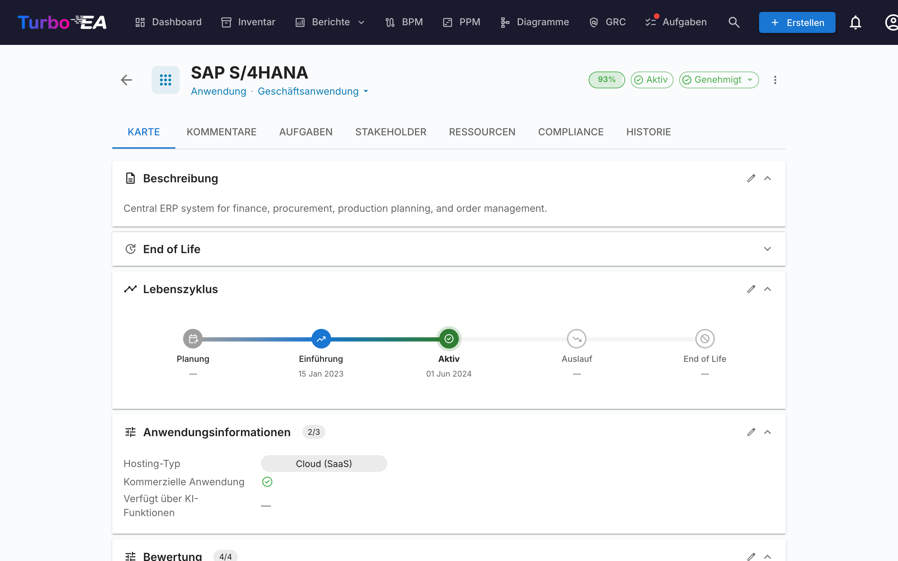
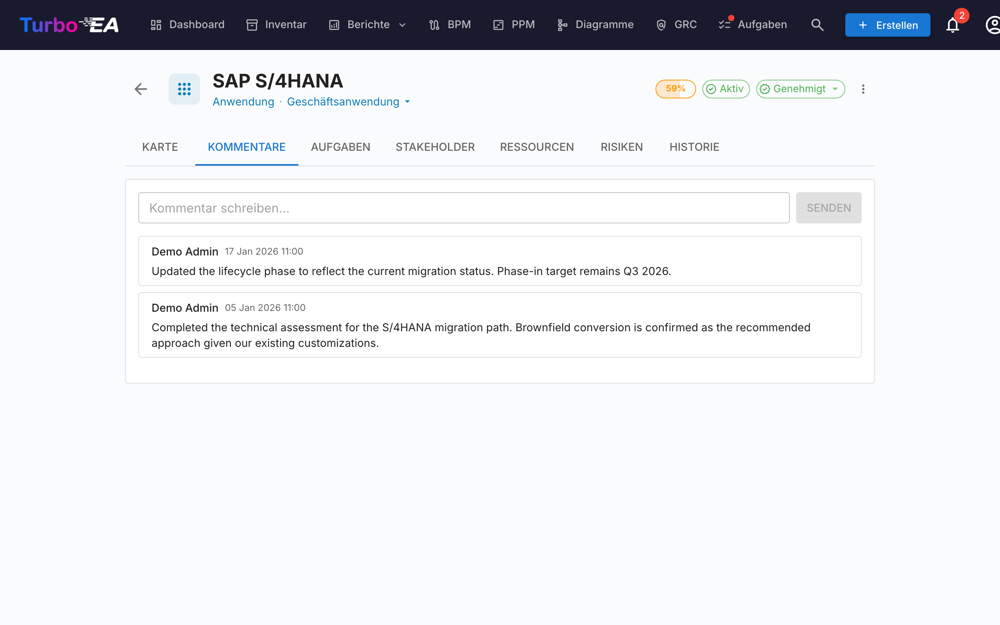
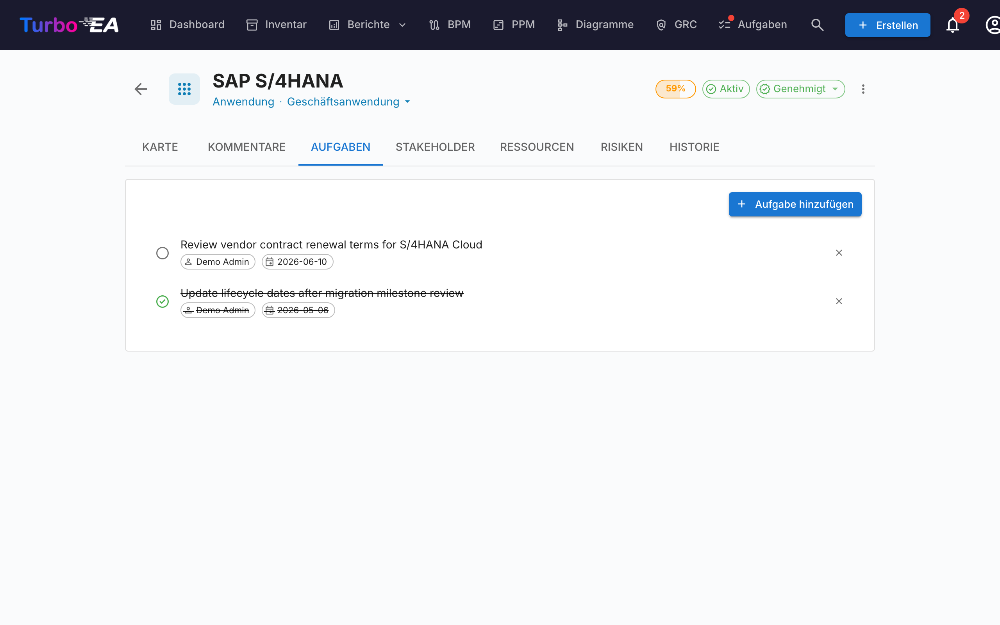
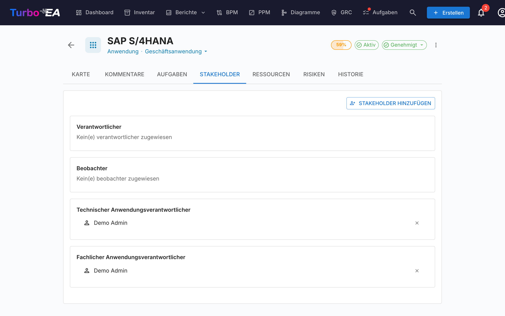
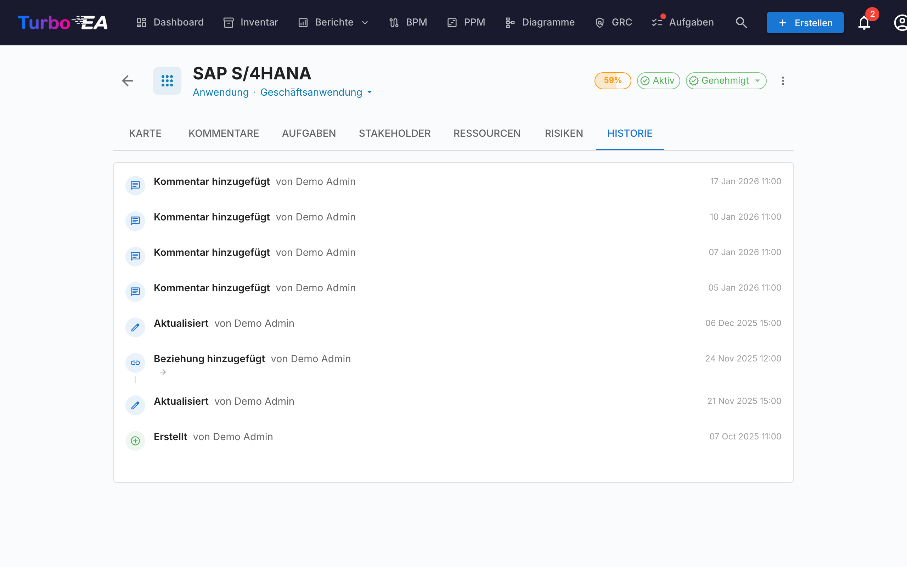

# Kartendetails

Ein Klick auf eine beliebige Karte im Inventar öffnet die **Detailansicht**, in der Sie alle Informationen über die Komponente anzeigen und bearbeiten können.

## Kartenkopf

Der obere Bereich der Karte zeigt:

- **Typsymbol und -bezeichnung** — Farbcodierter Kartentyp-Indikator
- **Kartenname** — Inline bearbeitbar
- **Subtyp** — Sekundäre Klassifizierung (falls zutreffend)
- **Genehmigungsstatus-Badge** — Entwurf, Genehmigt, Ungültig oder Abgelehnt
- **KI-Vorschlags-Schaltfläche** — Klicken, um eine Beschreibung mit KI zu generieren (sichtbar, wenn KI für diesen Kartentyp aktiviert ist und der Benutzer Bearbeitungsrechte hat)
- **Datenqualitätsring** — Visueller Indikator der Informationsvollständigkeit (0–100%)
- **Aktionsmenü** — Archivieren, Löschen und Genehmigungsaktionen. Enthält außerdem eine Ein-Klick-Aktion **Diese Karte beobachten** (sofern der Kartentyp eine Beobachter-Rolle definiert), mit der jeder Benutzer mit Leserechten der Karte folgen kann, ohne den Stakeholder-Tab zu öffnen.

### Genehmigungsworkflow

Karten können einen Genehmigungszyklus durchlaufen:

| Status | Bedeutung |
|--------|-----------|
| **Entwurf** | Standardstatus, noch nicht überprüft |
| **Genehmigt** | Überprüft und von einer verantwortlichen Person akzeptiert |
| **Ungültig** | War genehmigt, wurde aber seitdem bearbeitet — erneute Überprüfung nötig |
| **Abgelehnt** | Überprüft und abgelehnt, Korrekturen erforderlich |

Wenn eine genehmigte Karte bearbeitet wird, ändert sich ihr Status automatisch auf **Ungültig**, um anzuzeigen, dass eine erneute Überprüfung erforderlich ist.

## Detail-Tab (Hauptansicht)

Der Detail-Tab ist in **Abschnitte** gegliedert, die pro Kartentyp von einem Administrator neu angeordnet und konfiguriert werden können (siehe [Karten-Layout-Editor](../admin/metamodel.md#card-layout-editor)).

### Beschreibungsabschnitt

- **Beschreibung** — Rich-Text-Beschreibung der Komponente. Unterstützt die KI-Vorschlagsfunktion zur automatischen Generierung
- **Zusätzliche Beschreibungsfelder** — Einige Kartentypen enthalten zusätzliche Felder im Beschreibungsabschnitt (z.B. Alias, externe ID)

### Lebenszyklusabschnitt

Das Lebenszyklusmodell verfolgt eine Komponente durch fünf Phasen:

| Phase | Beschreibung |
|-------|-------------|
| **Planung** | In Erwägung, noch nicht begonnen |
| **Einführung** | Wird implementiert oder bereitgestellt |
| **Aktiv** | Derzeit in Betrieb |
| **Auslauf** | Wird außer Betrieb genommen |
| **Lebensende** | Nicht mehr in Gebrauch oder unterstützt |

Jede Phase verfügt über eine **Datumsauswahl**, damit Sie festhalten können, wann die Komponente in diese Phase eingetreten ist oder eintreten wird. Ein visueller Zeitleistenbalken zeigt die Position der Komponente in ihrem Lebenszyklus.

### Benutzerdefinierte Attributabschnitte

Abhängig vom Kartentyp werden Sie zusätzliche Abschnitte mit **benutzerdefinierten Feldern** sehen, die im Metamodell konfiguriert sind. Feldtypen umfassen:

- **Text** — Freitexteingabe
- **Mehrzeiliger Text** — Freitexteingabe, die Zeilenumbrüche beibehält und als automatisch wachsendes Textfeld dargestellt wird
- **Zahl** — Numerischer Wert
- **Kosten** — Numerischer Wert, angezeigt mit der konfigurierten Währung der Plattform
- **Boolean** — Ein/Aus-Umschalter
- **Datum** — Datumsauswahl
- **URL** — Klickbarer Link (validiert für http/https/mailto)
- **Einfachauswahl** — Dropdown mit vordefinierten Optionen
- **Mehrfachauswahl** — Mehrfachauswahl mit Chip-Anzeige

Als **berechnet** markierte Felder zeigen ein Badge und können nicht manuell bearbeitet werden — ihre Werte werden durch [vom Administrator definierte Formeln](../admin/calculations.md) berechnet.

### Hierarchieabschnitt

Für Kartentypen, die Hierarchie unterstützen (z.B. Organisation, Geschäftsfähigkeit, Anwendung):

- **Übergeordnete Karte** — Die übergeordnete Karte in der Hierarchie (klicken zum Navigieren)
- **Untergeordnete Karten** — Liste der untergeordneten Karten (klicken zum Navigieren)
- **Hierarchie-Brotkrumen** — Zeigt den vollständigen Pfad von der Wurzel zur aktuellen Karte

### Beziehungsabschnitt

Zeigt alle Verbindungen zu anderen Karten, gruppiert nach Beziehungstyp. Für jede Beziehung:

- **Name der verwandten Karte** — Klicken zum Navigieren zur verwandten Karte
- **Beziehungstyp** — Die Art der Verbindung (z.B. «nutzt», «läuft auf», «hängt ab von»)
- **Beziehung hinzufügen** — Klicken Sie auf **+**, um eine neue Beziehung zu erstellen; die Auswahlliste zeigt passende Karten bereits beim Öffnen an (nach Name sortiert, weitere werden beim Scrollen geladen), und durch Tippen wird die Liste gefiltert
- **Beziehung entfernen** — Klicken Sie auf das Löschsymbol, um eine Beziehung zu entfernen
- **Nach Untertyp gruppieren** — Enthält ein Beziehungsabschnitt viele verwandte Karten, werden sie automatisch in aufklappbare Untertyp-Gruppen (jeweils mit Anzahl) gruppiert, mit einer abschließenden Gruppe **Kein Untertyp** für nicht klassifizierte Karten. Über den Umschalter in der Abschnittsüberschrift wechseln Sie zwischen gruppierter und flacher Ansicht.

### Tags-Abschnitt

Wenden Sie Tags aus den konfigurierten [Tag-Gruppen](../admin/tags.md) an. Je nach Gruppenmodus können Sie ein Tag (Einfachauswahl) oder mehrere Tags (Mehrfachauswahl) auswählen.

### Registerkarte Ressourcen

Die **Ressourcen**-Registerkarte bündelt alle unterstützenden Materialien einer Karte:

- **Architekturentscheidungen** — mit dieser Karte verknüpfte ADRs, dargestellt als farbige Pillen, die den Kartentypfarben entsprechen (z.B. Blau für Anwendung, Lila für Datenobjekt). Sie können bestehende ADRs verknüpfen oder ein neues ADR direkt über die Ressourcen-Registerkarte erstellen — das neue ADR wird automatisch mit der Karte verknüpft.
- **Dateianhänge** — Dateien hochladen und verwalten (PDF, DOCX, XLSX, Bilder, bis zu 10 MB). Beim Hochladen wählen Sie eine **Dokumentenkategorie** aus: Architektur, Sicherheit, Compliance, Betrieb, Besprechungsnotizen, Design oder Sonstiges. Die Kategorie wird als Chip neben jeder Datei angezeigt.
- **Dokumentenlinks** — URL-basierte Dokumentenverweise. Beim Hinzufügen eines Links wählen Sie einen **Linktyp** aus: Dokumentation, Sicherheit, Compliance, Architektur, Betrieb, Support oder Sonstiges. Der Linktyp wird als Chip neben jedem Link angezeigt, und das Symbol ändert sich je nach ausgewähltem Typ.
- **Diagramme** — Verknüpfen Sie bestehende [Diagramme](diagrams.de.md) mit dieser Karte. Verknüpfte Diagramme werden als Miniaturvorschauen angezeigt, die Sie anklicken können, um sie im Diagramm-Editor zu öffnen. Verwenden Sie die Schaltfläche **Diagramm verknüpfen**, um ein vorhandenes Diagramm zu suchen und anzuhängen, oder klicken Sie auf das Entknüpfungssymbol, um die Zuordnung zu entfernen.

### EOL-Abschnitt

Wenn die Karte mit einem [endoflife.date](https://endoflife.date/)-Produkt verknüpft ist (über die [EOL-Administration](../admin/eol.md)):

- **Produktname und Version**
- **Supportstatus** — Farbcodiert: Unterstützt, EOL nähert sich, Lebensende
- **Wichtige Daten** — Veröffentlichungsdatum, Ende des aktiven Supports, Ende des Sicherheitssupports, EOL-Datum

## Kommentare-Tab

- **Kommentare hinzufügen** — Notizen, Fragen oder Entscheidungen über die Komponente hinterlassen
- **Verschachtelte Antworten** — Auf bestimmte Kommentare antworten, um Gesprächsfäden zu erstellen
- **Zeitstempel** — Sehen, wann jeder Kommentar gepostet wurde und von wem

## Aufgaben-Tab

- **Aufgaben erstellen** — Aufgaben erstellen, die mit dieser bestimmten Karte verknüpft sind
- **Zuweisen** — Einen verantwortlichen Benutzer für jede Aufgabe festlegen
- **Fälligkeitsdatum** — Fristen setzen
- **Status** — Zwischen Offen und Erledigt umschalten
- **Wiederkehrend** — Aktivieren Sie **Wiederholen**, damit ein Todo nach einem Zeitplan wiederkehrt (alle N Tage, Wochen, Monate oder Jahre); beim Abschließen wird automatisch das nächste Vorkommen erstellt

## Stakeholder-Tab

Stakeholder sind Personen mit einer bestimmten **Rolle** auf dieser Karte. Die verfügbaren Rollen hängen vom Kartentyp ab (konfiguriert im [Metamodell](../admin/metamodel.md)). Häufige Rollen umfassen:

- **Anwendungseigner** — Verantwortlich für geschäftliche Entscheidungen
- **Technischer Eigner** — Verantwortlich für technische Entscheidungen
- **Benutzerdefinierte Rollen** — Zusätzliche Rollen, wie von Ihrem Administrator definiert

Stakeholder-Zuweisungen beeinflussen **Berechtigungen**: Die effektiven Berechtigungen eines Benutzers auf einer Karte sind die Kombination aus seiner anwendungsweiten Rolle und allen Stakeholder-Rollen, die er auf dieser Karte innehat.

### Suchen und einladen

Wähle einen Stakeholder über das **durchsuchbare Autocomplete** — beginne zu tippen und das Dropdown filtert sowohl nach Name als auch nach E-Mail (die E-Mail erscheint als sekundäre Zeile, sodass zwei Nutzer mit demselben Namen auf einen Blick unterschieden werden können).

Wenn die eingegebene E-Mail keinem bestehenden Nutzer entspricht, erscheint am Ende des Dropdowns eine Option **«Einladen «email» als neuen Nutzer»**. Bei Auswahl klappt direkt im Picker ein Inline-Mini-Formular auf — wähle eine Rolle (standardmäßig Member oder Viewer), bearbeite optional den Anzeigenamen und sende ab. Der neue Nutzer wird über die Standard-Einladungs-E-Mail eingeladen **und** in einem einzigen Schritt mit der gewählten Stakeholder-Rolle auf der Karte zugewiesen, sodass du die Karte nie verlassen musst, um einen Mitwirkenden zu onboarden.

Der Einladungspfad erfordert die **`users.invite`**-Berechtigung, eine delegierte Form von `admin.users`, die Admins an vertrauenswürdige Mitglieder vergeben können. Eine Schutzmechanik gegen Privilege-Escalation verhindert, dass Nicht-Admins Nutzer in Admin-Rollen einladen — das Rollen-Dropdown filtert stillschweigend auf Rollen, die der Einladende delegieren darf.

## Verlauf-Tab

Zeigt die **vollständige Historie** der an der Karte vorgenommenen Änderungen: **Wer** hat die Änderung vorgenommen, **wann** wurde sie durchgeführt und **was** wurde geändert (vorheriger Wert vs. neuer Wert). Dies ermöglicht die vollständige Nachverfolgbarkeit aller Änderungen über die Zeit.

## Risiken-Tab (GRC aktiviert, falls vorhanden)

Wenn das [GRC-Modul](grc.md) aktiviert ist **und** die Karte mindestens ein verknüpftes Risiko hat, erscheint ein **Risiken**-Tab, der jedes mit der Karte verknüpfte Risiko mit einem Ein-Klick-Pfad zurück zum [Risikoregister](risks.md) auflistet. Der Tab wird automatisch ausgeblendet, wenn kein Risiko verknüpft ist, sodass Karten ohne GRC-Aktivität keinen leeren Tab mitschleppen.

## Compliance-Tab (GRC aktiviert, falls vorhanden)

Wenn das [GRC-Modul](grc.md) aktiviert ist **und** die Karte mindestens einen verknüpften Compliance-Befund hat, erscheint ein **Compliance**-Tab, der jeden derzeit mit der Karte verknüpften Befund auflistet. Dieselben Aktionen Acknowledge / Accept / **Risiko erstellen** / **Risiko öffnen** wie im [GRC-Compliance-Grid](compliance.md) sind verfügbar, sodass der Karteneigentümer seine eigenen Befunde triagieren kann, ohne die Karte zu verlassen. Automatisch ausgeblendet, wenn kein Befund verknüpft ist.

## Prozessfluss-Tab (nur für Geschäftsprozess-Karten)

Für **Geschäftsprozess**-Karten erscheint ein zusätzlicher **Prozessfluss**-Tab mit einem eingebetteten BPMN-Diagramm-Betrachter/-Editor. Siehe [BPM](bpm.md) für Details zum Prozessflussmanagement.

## PPM-Tab (nur für Initiativ-Karten)

Wenn das [PPM-Modul](ppm.md) aktiviert ist, zeigen **Initiativ**-Karten einen zusätzlichen **PPM**-Tab als letzten Tab an. Ein Klick auf diesen Tab navigiert zur PPM-Initiativ-Detailansicht, in der Sie Statusberichte, Budgets, Risiken, Aufgaben und Gantt-Zeitpläne verwalten können.

## Archivierung

Karten können über das Aktionsmenü **archiviert** (weich gelöscht) werden. Archivierte Karten:

- Werden in der Standard-Inventaransicht ausgeblendet (nur sichtbar mit dem Filter «Archivierte anzeigen»)
- Werden automatisch **nach 30 Tagen endgültig gelöscht**
- Können vor Ablauf des 30-Tage-Fensters wiederhergestellt werden
