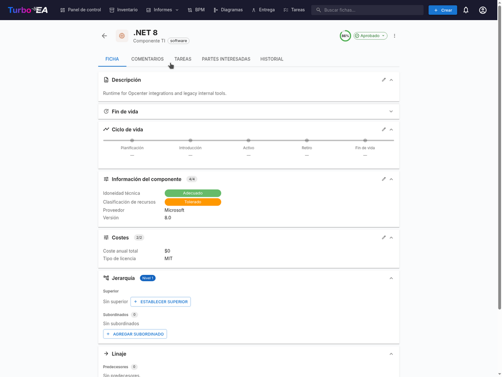
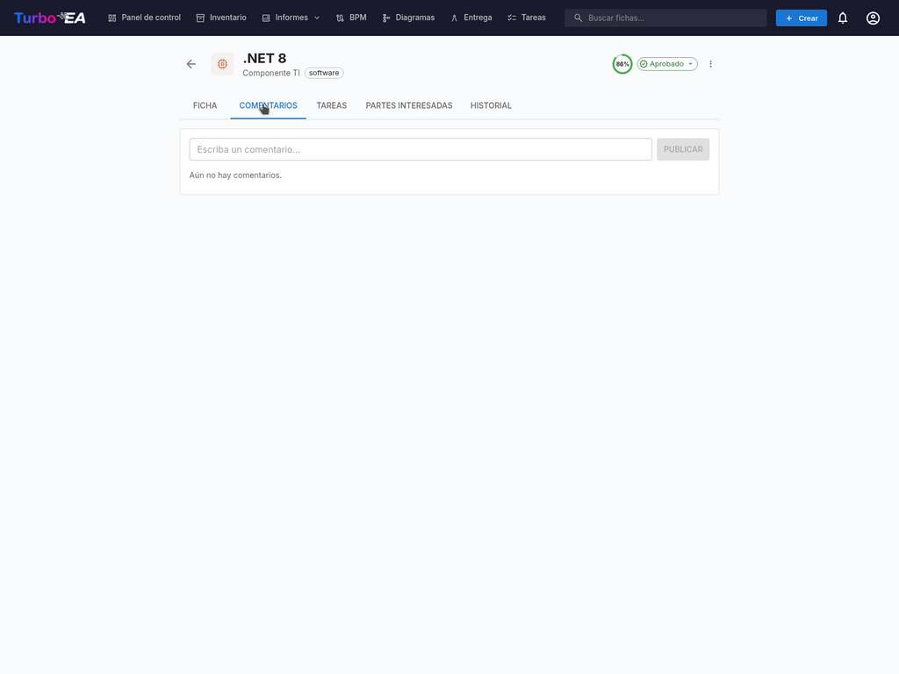
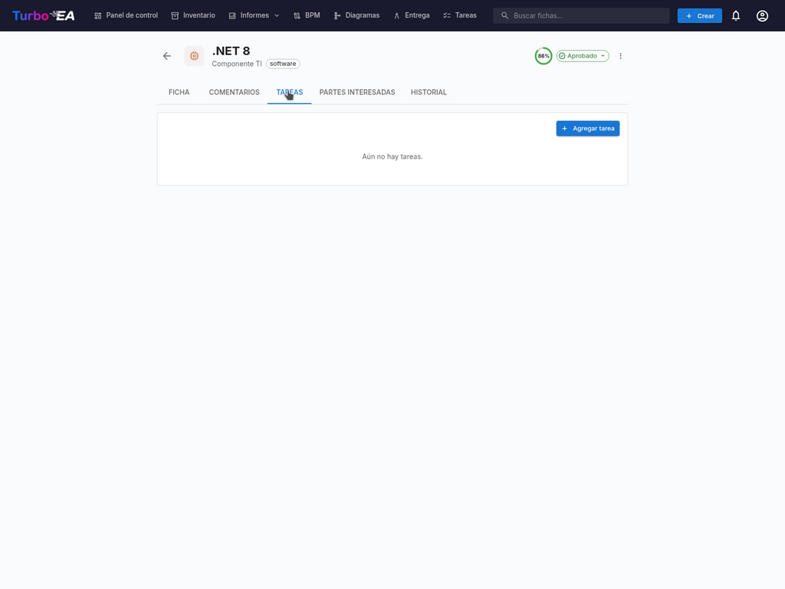
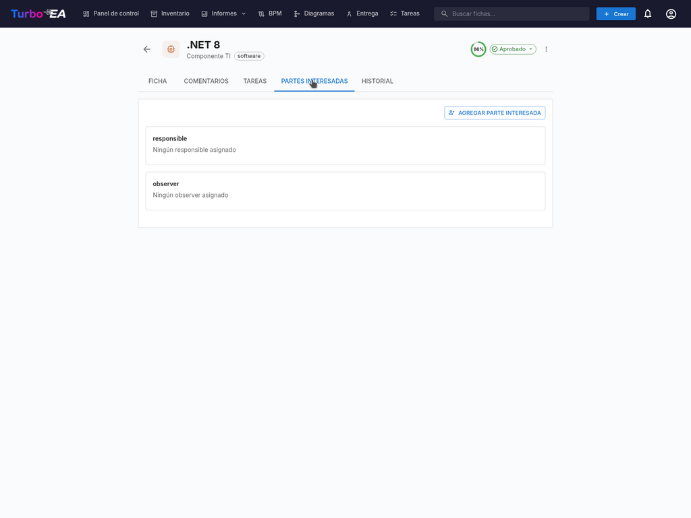
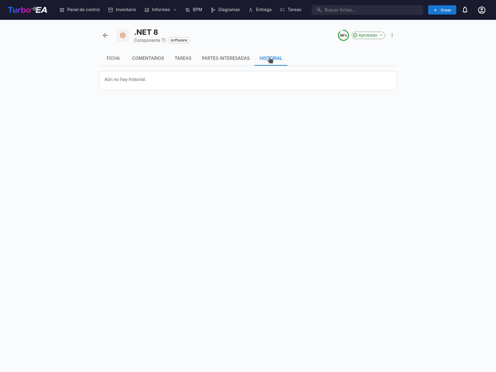

# Detalle de Fichas

Al hacer clic en cualquier ficha del inventario, se abre la **vista de detalle** donde puede ver y editar toda la información del componente.

### Pestañas Disponibles en el Detalle de Ficha

#### Pestaña "Detalle" (Principal)

- **Nombre y tipo** de la ficha (esquina superior izquierda)
- **Botón de sugerencia IA** (✨): Haga clic para generar una descripción con IA (visible cuando la IA está habilitada y el usuario tiene permiso de edición)
- **Estado de aprobación**: Insignia verde "Aprobado" o estado pendiente
- **Descripción**: Texto descriptivo sobre el componente
- **Atributos personalizados**: Campos específicos según el tipo de ficha
- **Relaciones**: Lista de conexiones con otras fichas
- **Ciclo de vida**: Estado temporal del componente
- **Etiquetas**: Clasificaciones adicionales asignadas

#### Pestaña "Comentarios"

- **Agregar comentarios**: Cualquier usuario puede dejar notas o preguntas sobre el componente
- **Discusión en equipo**: Los comentarios crean un hilo de conversación
- **Historial de decisiones**: Documente el razonamiento detrás de cambios importantes

#### Pestaña "Tareas"

- **Crear nueva tarea**: Asigne tareas a miembros del equipo
- **Estado de la tarea**: Pendiente, En Progreso, Completada
- **Asignado a**: Persona responsable de completar la tarea
- **Fecha límite**: Fecha máxima para completar la tarea

#### Pestaña "Partes Interesadas"

- **Propietario de Negocio**: Responsable de las decisiones de negocio
- **Propietario Técnico**: Responsable de las decisiones técnicas
- **Otros roles**: Según la configuración del metamodelo

#### Pestaña "Historial"

Muestra el **registro completo de cambios** realizados en la ficha: **Quién** hizo el cambio, **Cuándo** se realizó, **Qué** se modificó (valor anterior vs. valor nuevo). Esto permite una **auditoría completa** de todas las modificaciones.
