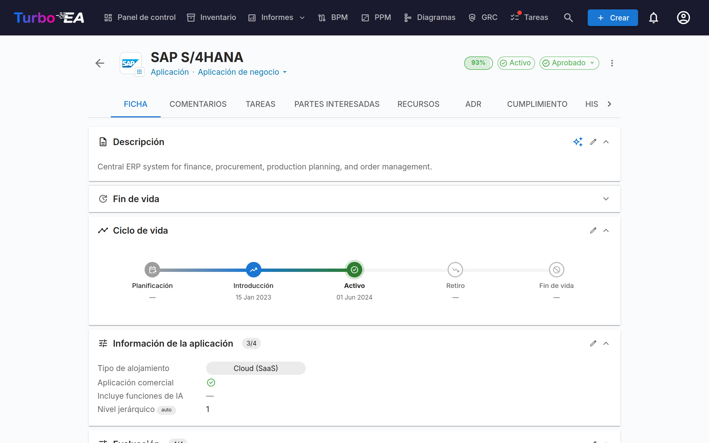
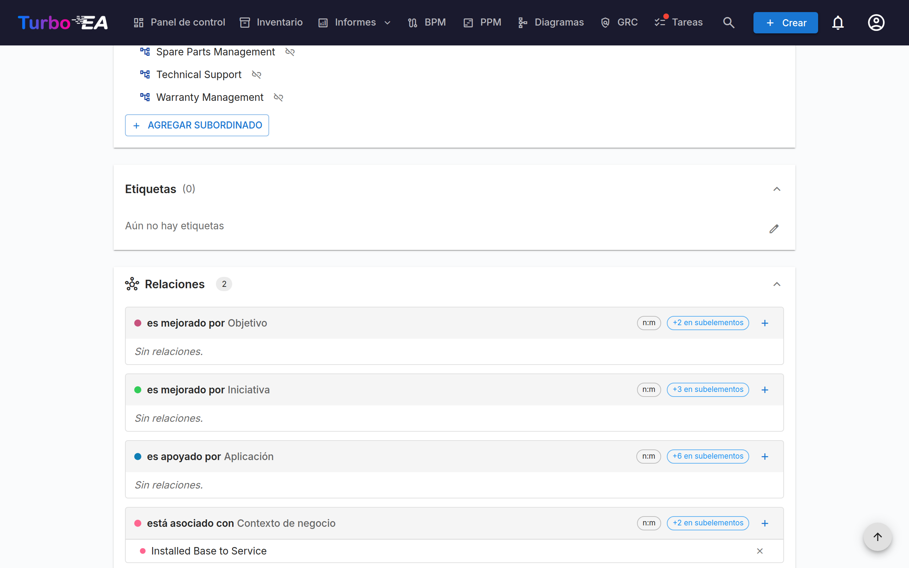
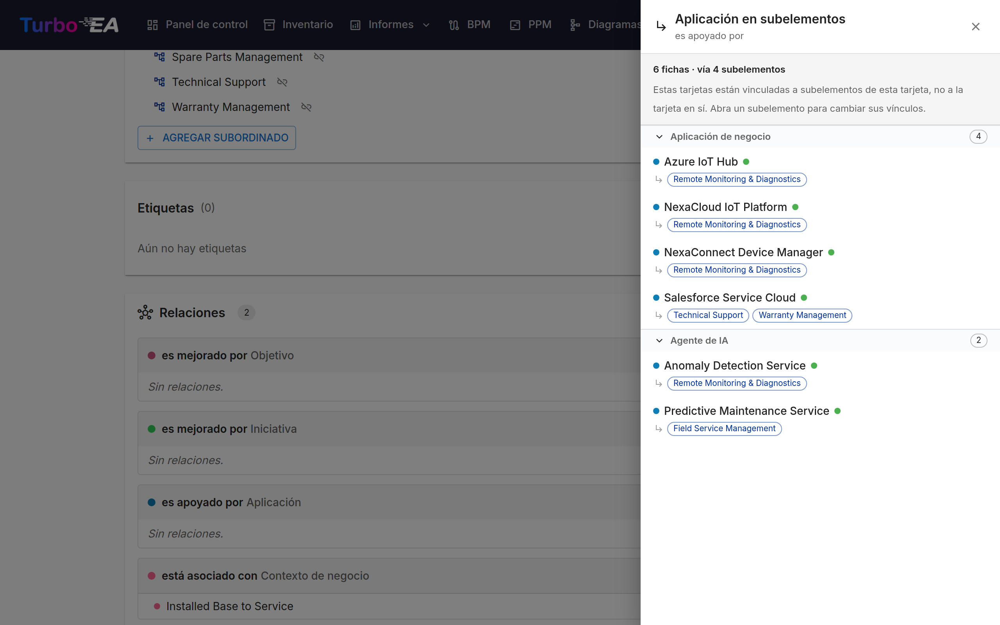
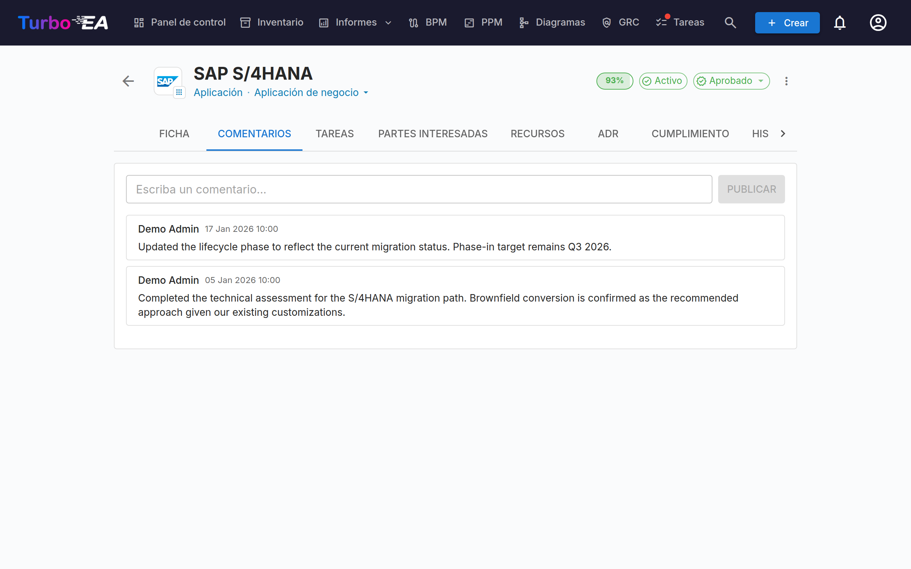
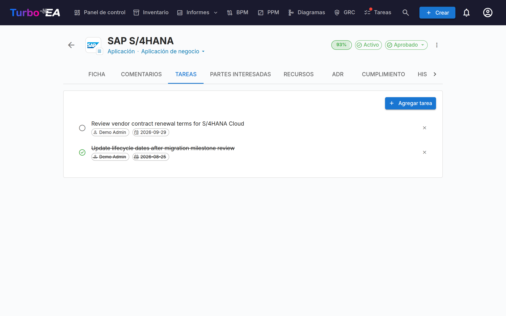
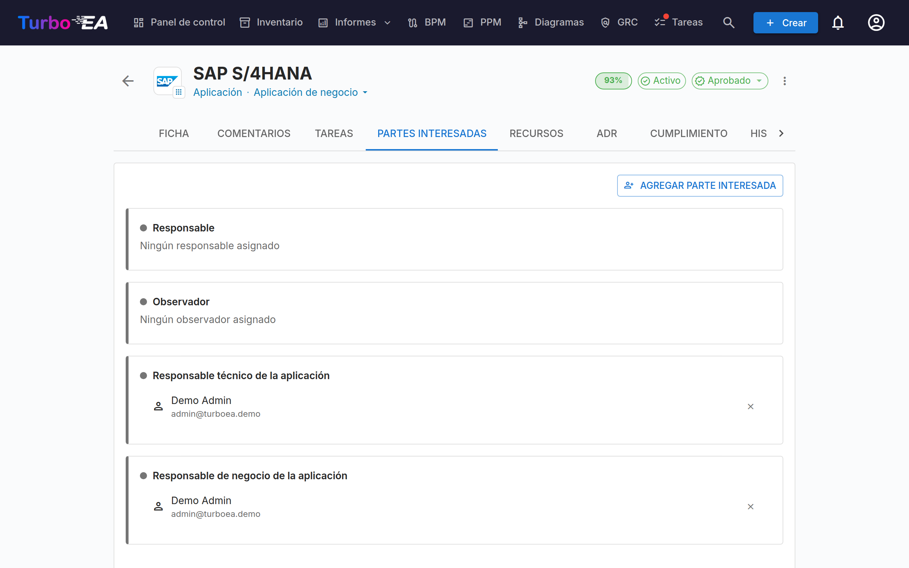
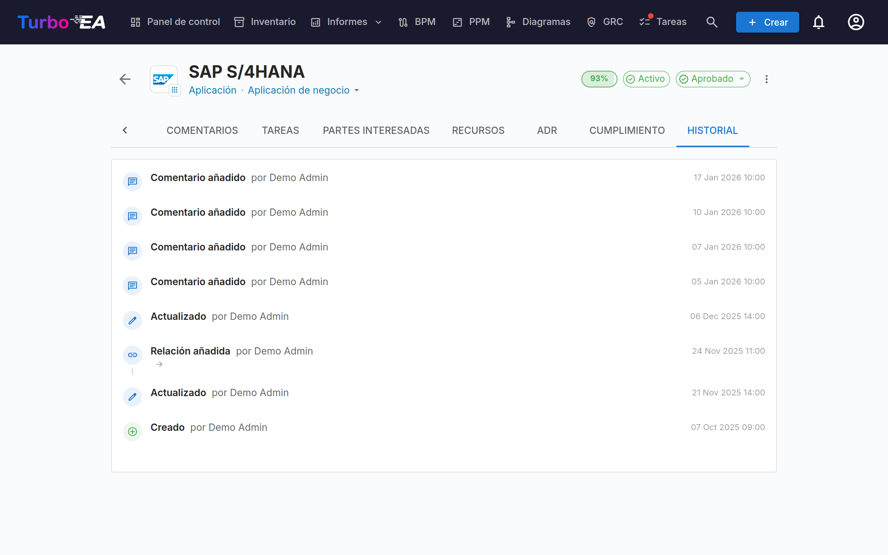

# Detalle de Fichas

Al hacer clic en cualquier ficha del inventario, se abre la **vista de detalle** donde puede ver y editar toda la información del componente.

## Encabezado de la Ficha

La parte superior de la ficha muestra:

- **Icono y etiqueta del tipo** — Indicador del tipo de ficha con código de color
- **Nombre de la ficha** — Editable en línea
- **Subtipo** — Clasificación secundaria (si aplica)
- **Insignia de estado de aprobación** — Borrador, Aprobado, Roto o Rechazado
- **Botón de sugerencia IA** — Haga clic para generar una descripción con IA (visible cuando la IA está habilitada para este tipo de ficha y el usuario tiene permiso de edición)
- **Anillo de calidad de datos** — Indicador visual de la completitud de la información (0–100%)
- **Menú de acciones** — Archivar, eliminar y acciones de aprobación. También incluye una acción de un clic **Observar esta ficha** (cuando el tipo de ficha define un rol Observador), para que cualquier usuario con permiso de lectura pueda seguir la ficha sin pasar por la pestaña de Partes interesadas.

### Logotipo personalizado

Las tarjetas de un tipo que lo permita pueden llevar su propio **logotipo** en
lugar del icono genérico del tipo, de modo que una Aplicación de SAP, Kafka o
Jira muestre la marca del propio producto. Los logotipos reconocibles hacen que
un inventario se explore mucho más rápido, sobre todo para quienes lo consultan
sin mantenerlo.

Pase el ratón sobre el icono de la esquina superior izquierda de la tarjeta y
haga clic para **subir**, **reemplazar** o **eliminar** la imagen. El icono del
tipo no desaparece: se traslada como una pequeña insignia a la esquina del
logotipo, así que sigue viéndose de un vistazo qué clase de tarjeta se está
consultando.

- **Formatos admitidos** — PNG, JPEG, WebP o GIF, hasta 1 MB. No se admite SVG,
  porque puede contener scripts.
- **Dónde aparece** — en la cabecera de la tarjeta, en la columna
  **Logotipo** opcional del [Inventario](inventory.md) y en cualquier portal
  web publicado sobre ese tipo de tarjeta.
- **Si no hay logotipo** — la tarjeta vuelve a su icono de tipo, igual que
  antes.

Los logotipos están disponibles en los tipos de tarjeta que un administrador
haya activado; de fábrica son Aplicación y Componente de TI. Consulte
[Metamodelo](../admin/metamodel.md).

Haga clic en el logotipo y elija **Elegir un icono de marca…** para seleccionar
de un conjunto integrado de varios miles de marcas: busque el producto por su
nombre y selecciónelo; no hace falta ningún archivo de imagen. **Subir** permite
usar su propio archivo. Un asistente de IA conectado por [MCP](../admin/mcp.md)
puede asignar logotipos del mismo modo de forma masiva y, si un producto no está
en el conjunto, obtiene la marca por su cuenta.

El mismo menú está disponible desde la columna **Logotipo** del
[Inventario](inventory.md) — pase el ratón sobre una celda de logotipo y haga
clic —, de modo que se pueden poner marcas en un paisaje recién importado sin
abrir cada ficha. Es ficha a ficha a propósito: el logotipo no se ofrece ni en
el rellenado hacia abajo ni en la edición masiva.

### Flujo de Aprobación

Las fichas pueden pasar por un ciclo de aprobación:

| Estado | Significado |
|--------|-------------|
| **Borrador** | Estado predeterminado, aún no revisado |
| **Aprobado** | Revisado y aceptado por una parte responsable |
| **Roto** | Fue aprobado, pero ha sido editado desde entonces — necesita re-revisión |
| **Rechazado** | Revisado y rechazado, necesita correcciones |

Cuando una ficha aprobada es editada, su estado cambia automáticamente a **Roto** para indicar que necesita re-revisión.

## Pestaña Detalle (Principal)

La pestaña de detalle está organizada en **secciones** que pueden ser reordenadas y configuradas por un administrador para cada tipo de ficha (consulte [Editor de Disposición de Fichas](../admin/metamodel.es.md#editor-de-disposicion-de-fichas)).

### Sección de Descripción

- **Descripción** — Descripción en texto enriquecido del componente. Soporta la función de sugerencia con IA para generación automática
- **Campos de descripción adicionales** — Algunos tipos de ficha incluyen campos extra en la sección de descripción (por ejemplo, alias, ID externo)

### Sección de Ciclo de Vida

El modelo de ciclo de vida rastrea un componente a través de cinco fases:

| Fase | Descripción |
|------|-------------|
| **Plan** | En consideración, aún no iniciado |
| **Fase de Entrada** | En proceso de implementación o despliegue |
| **Activo** | Actualmente operativo |
| **Fase de Salida** | En proceso de retirada |
| **Fin de Vida** | Ya no está en uso ni tiene soporte |

Cada fase tiene un **selector de fecha** para registrar cuándo el componente entró o entrará en esa fase. Una barra de línea temporal visual muestra la posición del componente en su ciclo de vida.

### Secciones de Atributos Personalizados

Dependiendo del tipo de ficha, verá secciones adicionales con **campos personalizados** configurados en el metamodelo. Los tipos de campo incluyen:

- **Texto** — Entrada de texto libre
- **Texto multilínea** — Entrada de texto libre que preserva los saltos de línea, mostrada como un área de texto que crece automáticamente
- **Número** — Valor numérico
- **Costo** — Valor numérico mostrado con la moneda configurada en la plataforma
- **Booleano** — Interruptor de activar/desactivar
- **Fecha** — Selector de fecha
- **URL** — Enlace interactivo (validado para http/https/mailto)
- **Selección única** — Desplegable con opciones predefinidas
- **Selección múltiple** — Selección múltiple con visualización de chips

Los campos marcados como **calculados** muestran una insignia y no pueden editarse manualmente — sus valores son calculados por [fórmulas definidas por el administrador](../admin/calculations.es.md).

### Sección de Jerarquía

Para tipos de ficha que soportan jerarquía (por ejemplo, Organización, Capacidad de Negocio, Aplicación):

- **Padre** — La ficha padre en la jerarquía (haga clic para navegar)
- **Hijos** — Lista de fichas hijas (haga clic en cualquiera para navegar)
- **Ruta jerárquica** — Muestra la ruta completa desde la raíz hasta la ficha actual

### Sección de Relaciones

Muestra todas las conexiones con otras fichas, agrupadas por tipo de relación. Para cada relación:

- **Nombre de la ficha relacionada** — Haga clic para navegar a la ficha relacionada
- **Tipo de relación** — La naturaleza de la conexión (por ejemplo, «utiliza», «se ejecuta en», «depende de»)
- **Agregar relación** — Haga clic en **+** para abrir el diálogo de esa relación. Lista las tarjetas coincidentes mientras escribe (las mejores coincidencias primero, y se cargan más al desplazarse) y oculta las ya vinculadas, con un texto que indica cuántas son. Al hacer clic en una tarjeta se vincula de inmediato y aparece como una etiqueta arriba: haga clic en la **×** de una etiqueta para deshacer esa adición. El diálogo permanece abierto para añadir tantas como quiera, y en el móvil se abre a pantalla completa. Las relaciones sin sección propia se alcanzan desde el botón **Agregar relación** al final de la sección. Cuando el tipo vinculado es jerárquico (capacidad de negocio, organización, etc.), el diálogo lo muestra como un árbol indentado en lugar de una lista alfabética, de modo que puede elegir una subcapacidad por su rama. La búsqueda mantiene visibles los padres de cada coincidencia como contexto, y las tarjetas que no se pueden elegir (ya vinculadas, recién añadidas o la propia tarjeta) permanecen en su sitio en gris para que los niveles a su alrededor sigan leyéndose bien.
- **Orden** — Las tarjetas relacionadas se listan alfabéticamente por nombre
- **Eliminar relación** — Haga clic en el icono de eliminar para quitar una relación
- **Agrupar por subtipo** — Cuando una sección de relaciones tiene muchas fichas relacionadas, se agrupan automáticamente en grupos de subtipo plegables (cada uno con un recuento), con un grupo final **Sin subtipo** para las fichas sin clasificar. Utilice el botón de alternancia en el encabezado de la sección para cambiar entre la vista agrupada y la vista de lista.
- **Fichas vinculadas a subelementos** — Cuando una ficha tiene subelementos, cada grupo de relaciones muestra una etiqueta **+N en subelementos** que cuenta las fichas vinculadas más abajo en la jerarquía — por ejemplo, las aplicaciones asociadas a las subcapacidades de una capacidad. Al hacer clic se abre una lista de solo lectura en la que cada fila nombra el subelemento que contiene el vínculo (una ficha alcanzada a través de varios subelementos aparece una sola vez, con todos ellos indicados). El recuento solo incluye fichas que no figuran ya en el grupo superior. Para cambiar un vínculo, abra el subelemento que lo contiene. La lista se organiza en secciones de subtipo plegables, de modo que el subtipo se indica una vez por sección en lugar de en cada fila. Dentro de una sección aparecen primero las fichas cuya fase de ciclo de vida requiere atención (fin de vida, luego retirada progresiva), y la fase de cada ficha se muestra como un punto de color junto a su nombre; pase el ratón por encima para ver el nombre de la fase.

### Sección de Dependencias

Una [Layered Dependency View](reports.md) de la ficha y de todo lo que está a un salto de distancia, agrupado en las cuatro capas de arquitectura. Mayús-clic en una ficha para volver a centrar la vista y recorrer el panorama sin salir de la página.

El icono **abrir en una pestaña nueva** de la barra de herramientas abre el [informe de dependencias](reports.md) completo en una pestaña nueva, centrado en la ficha en la que la vista esté centrada en ese momento — es decir, la ficha a la que ha navegado, no necesariamente la de partida. Útil cuando necesita lo que el informe añade alrededor de la misma imagen: el viaje en el tiempo, las marcas de transición, la vista de tabla y guardar la vista como informe.

### Sección de Etiquetas

Aplique etiquetas de los [grupos de etiquetas](../admin/tags.es.md) configurados. Dependiendo del modo del grupo, puede seleccionar una etiqueta (selección única) o múltiples etiquetas (selección múltiple).

### Pestaña de Recursos

La pestaña de **Recursos** consolida todos los materiales de apoyo de una ficha:

- **Archivos Adjuntos** — Cargue y gestione archivos (PDF, DOCX, XLSX, imágenes, hasta 10 MB). Al cargar, seleccione una **categoría de documento** entre: Arquitectura, Seguridad, Compliance, Operaciones, Notas de Reunión, Diseño u Otro. La categoría aparece como un chip junto a cada archivo.
- **Enlaces de Documentos** — Referencias de documentos basadas en URL. Al agregar un enlace, seleccione un **tipo de enlace** entre: Documentación, Seguridad, Compliance, Arquitectura, Operaciones, Soporte u Otro. El tipo de enlace aparece como un chip junto a cada enlace, y el icono cambia según el tipo seleccionado.
- **Diagramas** — Vincule [diagramas](diagrams.es.md) existentes a esta ficha. Los diagramas vinculados se muestran como vistas previas en miniatura que puede hacer clic para abrir en el editor de diagramas. Use el botón **Vincular Diagrama** para buscar y adjuntar un diagrama existente, o haga clic en el icono de desvincular para eliminar la asociación.

### Sección EOL

Si la ficha está vinculada a un producto de [endoflife.date](https://endoflife.date/) (a través de la [Administración de EOL](../admin/eol.es.md)):

- **Nombre del producto y versión**
- **Estado de soporte** — Codificado por colores: Con Soporte, Próximo a EOL, Fin de Vida
- **Fechas clave** — Fecha de lanzamiento, fin de soporte activo, fin de soporte de seguridad, fecha EOL

## Pestaña de Comentarios

- **Agregar comentarios** — Deje notas, preguntas o decisiones sobre el componente
- **Respuestas en hilo** — Responda a comentarios específicos para crear hilos de conversación
- **Marcas de tiempo** — Vea cuándo se publicó cada comentario y por quién

## Pestaña de Tareas

- **Crear tareas** — Agregue tareas vinculadas a esta ficha específica
- **Asignar** — Establezca una persona responsable para cada tarea
- **Fecha límite** — Establezca plazos
- **Estado** — Alterne entre Abierta y Completada
- **Recurrente** — Active **Repetir** para que una tarea se repita según un calendario (cada N días, semanas, meses o años); al completarla se crea automáticamente la siguiente repetición

## Pestaña de Partes Interesadas

Las partes interesadas son personas con un **rol** específico en esta ficha. Los roles disponibles dependen del tipo de ficha (configurados en el [metamodelo](../admin/metamodel.es.md)). Los roles comunes incluyen:

- **Propietario de Aplicación** — Responsable de las decisiones de negocio
- **Propietario Técnico** — Responsable de las decisiones técnicas
- **Roles personalizados** — Roles adicionales definidos por su administrador

Las asignaciones de partes interesadas afectan los **permisos**: los permisos efectivos de un usuario en una ficha son la combinación de su rol a nivel de aplicación y cualquier rol de parte interesada que tenga en esa ficha.

Cuando un rol tiene un **color** definido en el metamodelo, su grupo se marca con él, de modo que puede distinguir un propietario de un observador de un vistazo.

### Búsqueda e invitación

Elige a una parte interesada mediante el **autocompletar buscable** — empieza a escribir y el desplegable filtra tanto por nombre como por correo (el correo aparece como línea secundaria, de modo que dos usuarios con el mismo nombre puedan distinguirse de un vistazo).

Si el correo que escribes no coincide con un usuario existente, aparece una opción **«Invitar a «email» como nuevo usuario»** al final del desplegable. Al seleccionarla se expande un mini-formulario en línea dentro del propio selector — elige un rol (Miembro o Visualizador por defecto), edita opcionalmente el nombre mostrado y envía. El nuevo usuario es invitado mediante el correo de invitación estándar **y** asignado al rol de parte interesada elegido en la ficha en una sola acción, así nunca tienes que abandonar la ficha para incorporar a un colaborador.

La ruta de invitación requiere el permiso **`users.invite`**, una forma delegada de `admin.users` que los administradores pueden conceder a miembros de confianza. Un guardián anti-escalada de privilegios impide que los no administradores inviten usuarios a roles de administrador — el desplegable de roles filtra silenciosamente a los roles que el invitador tiene permitido delegar.

## Pestaña de Historial

Muestra el **registro completo de auditoría** de los cambios realizados en la ficha: **quién** hizo el cambio, **cuándo** se realizó y **qué** se modificó (valor anterior vs. valor nuevo). Esto permite la trazabilidad completa de todas las modificaciones a lo largo del tiempo.

Todo lo que mueve la fecha **Modificado** de la ficha aparece aquí: una edición manual, una importación desde hoja de cálculo, una migración de plataforma o sincronización con ServiceNow, un cambio de etiqueta, una edición masiva, o un movimiento jerárquico que arrastró esta ficha. El mantenimiento del sistema no cambia ninguno de los dos: recalcular las puntuaciones de calidad de datos, volver a ejecutar los campos calculados y rellenar niveles jerárquicos o identificadores de ficha dejan intactos el historial y la fecha **Modificado**.

## Pestaña de ADR

Cada ficha cuenta con una pestaña **ADR** que enumera las [decisiones de arquitectura](delivery.md) vinculadas a ella, mostrando la referencia, el título, el estado, todas sus fichas vinculadas y la fecha de la última modificación. Haga clic en una fila para abrir la decisión.

Si tiene permiso para gestionar vínculos de ADR, la pestaña también ofrece **Vincular ADR** para adjuntar una decisión existente y **Crear ADR** para crear una nueva ya vinculada a esta ficha, además de una acción de desvinculación en cada fila. En las fichas sin decisiones vinculadas la pestaña permanece oculta salvo que tenga ese permiso, de modo que los usuarios de solo lectura nunca ven una pestaña vacía.

## Pestaña de Riesgos (GRC activado, cuando aplique)

Cuando el [módulo GRC](grc.md) está habilitado **y** la ficha tiene al menos un riesgo vinculado, aparece una pestaña **Riesgos** que lista todos los riesgos vinculados a la ficha con una ruta de un clic de vuelta al [Registro de riesgos](risks.md). La pestaña se oculta automáticamente cuando no hay riesgos vinculados, de modo que las fichas sin actividad GRC no arrastran una pestaña vacía.

## Pestaña de Cumplimiento (GRC activado, cuando aplique)

Cuando el [módulo GRC](grc.md) está habilitado **y** la ficha tiene al menos un hallazgo de cumplimiento vinculado, aparece una pestaña **Cumplimiento** que lista cada hallazgo actualmente vinculado a la ficha. Las mismas acciones Reconocer / Aceptar / **Crear riesgo** / **Abrir riesgo** que en la [cuadrícula de Cumplimiento GRC](compliance.md) están disponibles, de modo que el propietario de la ficha pueda triagiar sus propios hallazgos sin salir de la ficha. Auto-ocultada cuando no hay hallazgos vinculados.

## Pestaña de Flujo de Proceso (solo para fichas de Proceso de Negocio)

Para las fichas de **Proceso de Negocio**, aparece una pestaña adicional de **Flujo de Proceso** con un visor/editor de diagramas BPMN integrado. Consulte [BPM](bpm.es.md) para más detalles sobre la gestión de flujos de proceso.

## Pestaña PPM (solo para fichas de Iniciativa)

Cuando el [módulo PPM](ppm.md) está activado, las fichas de **Iniciativa** muestran una pestaña **PPM** adicional como última pestaña. Al hacer clic en esta pestaña, se navega a la vista detallada PPM de la iniciativa, donde puede gestionar informes de estado, presupuestos, riesgos, tareas y diagramas de Gantt.

## Archivado

Las fichas pueden ser **archivadas** (eliminación temporal) a través del menú de acciones. Las fichas archivadas:

- Se ocultan de la vista predeterminada del inventario (visibles solo con el filtro «Mostrar archivados»)
- Se **eliminan permanentemente de forma automática después de 30 días**
- Pueden ser restauradas antes de que expire el período de 30 días
