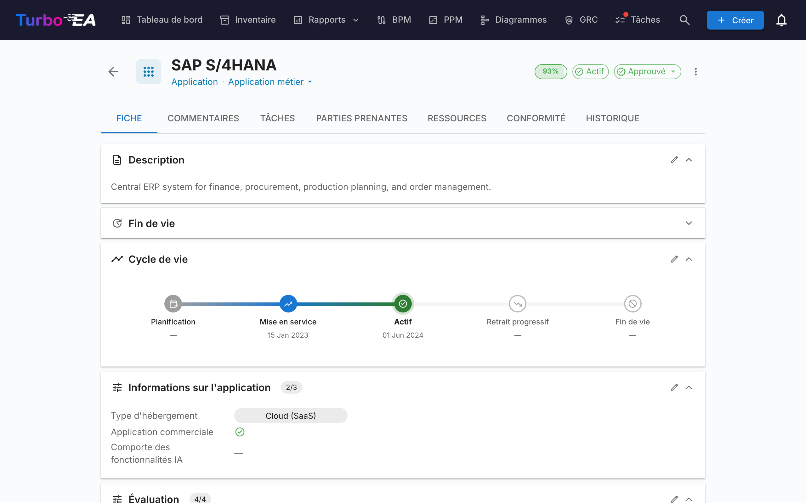
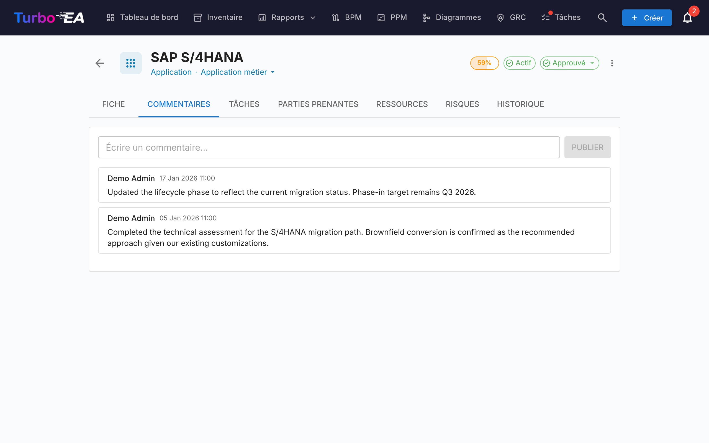
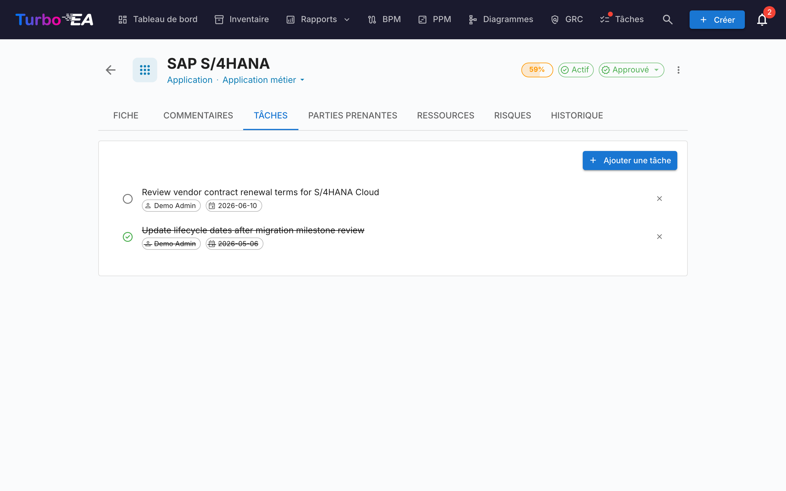
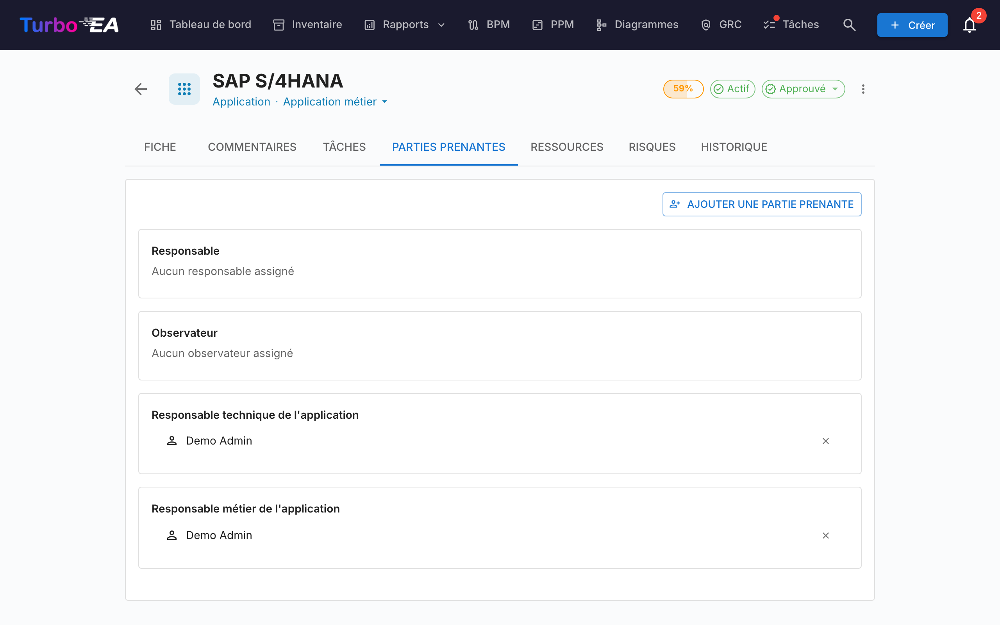
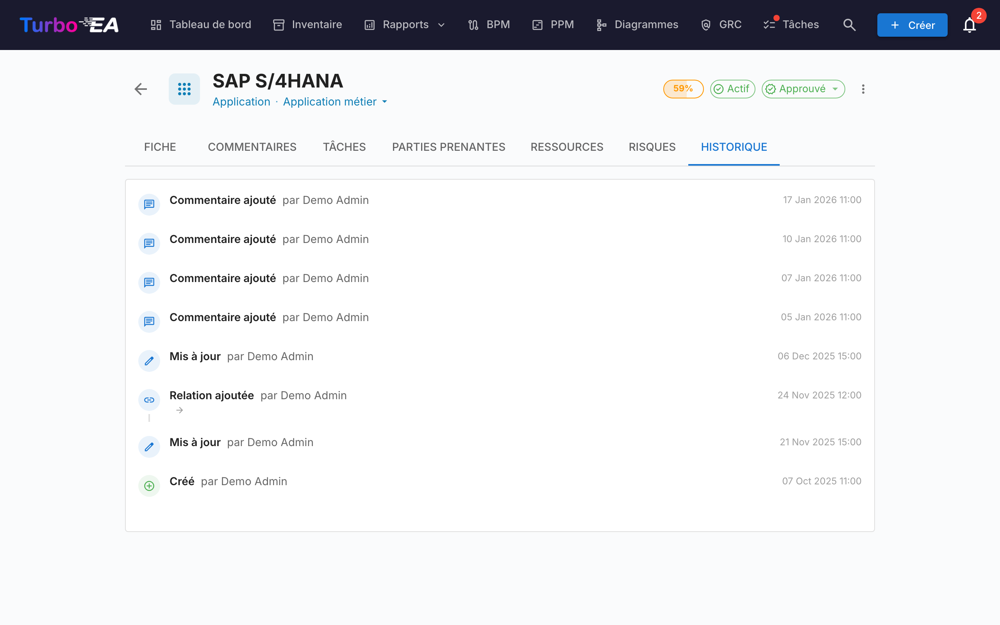

# Détail des fiches

Cliquer sur n'importe quelle fiche dans l'inventaire ouvre la **vue détaillée** où vous pouvez consulter et modifier toutes les informations sur le composant.

## En-tête de la fiche

Le haut de la fiche affiche :

- **Icône et libellé du type** -- Indicateur du type de fiche codé par couleur
- **Nom de la fiche** -- Modifiable en ligne
- **Sous-type** -- Classification secondaire (le cas échéant)
- **Badge de statut d'approbation** -- Brouillon, Approuvé, Cassé ou Rejeté
- **Bouton de suggestion IA** -- Cliquez pour générer une description avec l'IA (visible lorsque l'IA est activée pour ce type de fiche et que l'utilisateur a la permission de modification)
- **Anneau de qualité des données** -- Indicateur visuel de complétude des informations (0-100%)
- **Menu d'actions** -- Archiver, supprimer et actions d'approbation. Contient aussi une option en un clic **Observer cette fiche** (lorsque le type de fiche définit un rôle Observateur) qui permet à tout utilisateur disposant d'un accès en lecture de suivre la fiche sans passer par l'onglet Parties prenantes.

### Workflow d'approbation

Les fiches peuvent passer par un cycle d'approbation :

| Statut | Signification |
|--------|---------------|
| **Brouillon** | État par défaut, pas encore examiné |
| **Approuvé** | Examiné et accepté par un responsable |
| **Cassé** | Était approuvé, mais a été modifié depuis -- nécessite un réexamen |
| **Rejeté** | Examiné et rejeté, nécessite des corrections |

Lorsqu'une fiche approuvée est modifiée, son statut passe automatiquement à **Cassé** pour indiquer qu'elle nécessite un réexamen.

## Onglet Détail (Principal)

L'onglet détail est organisé en **sections** qui peuvent être réorganisées et configurées par un administrateur par type de fiche (voir [Éditeur de mise en page des fiches](../admin/metamodel.md#card-layout-editor)).

### Section Description

- **Description** -- Description en texte riche du composant. Prend en charge la fonctionnalité de suggestion IA pour la génération automatique
- **Champs de description supplémentaires** -- Certains types de fiches incluent des champs supplémentaires dans la section description (par ex. alias, identifiant externe)

### Section Cycle de vie

Le modèle de cycle de vie suit un composant à travers cinq phases :

| Phase | Description |
|-------|-------------|
| **Planification** | En cours d'évaluation, pas encore démarré |
| **Mise en service** | En cours d'implémentation ou de déploiement |
| **Actif** | Actuellement opérationnel |
| **Retrait progressif** | En cours de mise hors service |
| **Fin de vie** | Plus utilisé ni supporté |

Chaque phase dispose d'un **sélecteur de date** pour enregistrer quand le composant est entré ou entrera dans cette phase. Une barre chronologique visuelle montre la position du composant dans son cycle de vie.

### Sections d'attributs personnalisés

Selon le type de fiche, vous verrez des sections supplémentaires avec des **champs personnalisés** configurés dans le métamodèle. Les types de champs incluent :

- **Texte** -- Saisie de texte libre
- **Texte multiligne** -- Saisie de texte libre qui préserve les retours à la ligne, affichée comme une zone de texte à hauteur automatique
- **Nombre** -- Valeur numérique
- **Coût** -- Valeur numérique affichée avec la devise configurée de la plateforme
- **Booléen** -- Interrupteur marche/arrêt
- **Date** -- Sélecteur de date
- **URL** -- Lien cliquable (validé pour http/https/mailto)
- **Sélection unique** -- Liste déroulante avec options prédéfinies
- **Sélection multiple** -- Multi-sélection avec affichage en puces

Les champs marqués comme **calculés** affichent un badge et ne peuvent pas être modifiés manuellement -- leurs valeurs sont calculées par des [formules définies par l'administrateur](../admin/calculations.md).

### Section Hiérarchie

Pour les types de fiches qui prennent en charge la hiérarchie (par ex. Organisation, Capacité Métier, Application) :

- **Parent** -- Le parent de la fiche dans la hiérarchie (cliquer pour naviguer)
- **Enfants** -- Liste des fiches enfants (cliquer sur l'une d'elles pour naviguer)
- **Fil d'Ariane hiérarchique** -- Affiche le chemin complet de la racine à la fiche actuelle

### Section Relations

Affiche toutes les connexions avec d'autres fiches, groupées par type de relation. Pour chaque relation :

- **Nom de la fiche liée** -- Cliquer pour naviguer vers la fiche liée
- **Type de relation** -- La nature de la connexion (par ex. « utilise », « s'exécute sur », « dépend de »)
- **Ajouter une relation** -- Cliquez sur **+** pour créer une nouvelle relation ; le sélecteur affiche les fiches correspondantes dès son ouverture (triées par nom, d'autres se chargent au défilement), et la saisie filtre la liste
- **Supprimer une relation** -- Cliquez sur l'icône de suppression pour retirer une relation

### Section Tags

Appliquez des tags à partir des [groupes de tags](../admin/tags.md) configurés. Selon le mode du groupe, vous pouvez sélectionner un tag (sélection unique) ou plusieurs tags (sélection multiple).

### Onglet Ressources

L'onglet **Ressources** regroupe tous les documents de support d'une fiche :

- **Décisions d'architecture** -- ADR liés à cette fiche, affichés sous forme de pilules colorées correspondant aux couleurs du type de carte (par ex. bleu pour Application, violet pour Objet de données). Vous pouvez lier des ADR existants ou en créer un nouveau directement depuis l'onglet Ressources -- le nouvel ADR est automatiquement lié à la fiche.
- **Pièces jointes** -- Téléchargez et gérez des fichiers (PDF, DOCX, XLSX, images, jusqu'à 10 Mo). Lors du téléchargement, sélectionnez une **catégorie de document** parmi : Architecture, Sécurité, Conformité, Opérations, Notes de réunion, Design ou Autre. La catégorie s'affiche sous forme de puce à côté de chaque fichier.
- **Liens de documents** -- Références de documents basées sur des URL. Lors de l'ajout d'un lien, sélectionnez un **type de lien** parmi : Documentation, Sécurité, Conformité, Architecture, Opérations, Support ou Autre. Le type de lien s'affiche sous forme de puce à côté de chaque lien, et l'icône change en fonction du type sélectionné.
- **Diagrammes** -- Liez des [diagrammes](diagrams.fr.md) existants à cette fiche. Les diagrammes liés s'affichent sous forme de miniatures que vous pouvez cliquer pour ouvrir dans l'éditeur de diagrammes. Utilisez le bouton **Lier un diagramme** pour rechercher et attacher un diagramme existant, ou cliquez sur l'icône de déliaison pour supprimer l'association.

### Section EOL

Si la fiche est liée à un produit [endoflife.date]( (via [Administration EOL](../admin/eol.md)) :

- **Nom du produit et version**
- **Statut de support** -- Code couleur : Supporté, Approchant la fin de vie, Fin de vie
- **Dates clés** -- Date de sortie, fin du support actif, fin du support sécurité, date de fin de vie

## Onglet Commentaires

- **Ajouter des commentaires** -- Laissez des notes, questions ou décisions concernant le composant
- **Réponses en fil** -- Répondez à des commentaires spécifiques pour créer des fils de conversation
- **Horodatages** -- Voyez quand chaque commentaire a été publié et par qui

## Onglet Tâches

- **Créer des tâches** -- Ajoutez des tâches liées à cette fiche spécifique
- **Assigner** -- Définissez un responsable pour chaque tâche
- **Date d'échéance** -- Fixez des délais
- **Statut** -- Basculer entre Ouvert et Terminé
- **Récurrent** -- Activez **Répéter** pour qu'une tâche se répète selon un calendrier (tous les N jours, semaines, mois ou années) ; sa réalisation crée automatiquement la prochaine occurrence

## Onglet Parties prenantes

Les parties prenantes sont des personnes ayant un **rôle** spécifique sur cette fiche. Les rôles disponibles dépendent du type de fiche (configurés dans le [métamodèle](../admin/metamodel.md)). Les rôles courants incluent :

- **Responsable applicatif** -- Responsable des décisions métier
- **Responsable technique** -- Responsable des décisions techniques
- **Rôles personnalisés** -- Rôles supplémentaires définis par votre administrateur

Les affectations de parties prenantes affectent les **permissions** : les permissions effectives d'un utilisateur sur une fiche sont la combinaison de son rôle au niveau de l'application et de tous les rôles de parties prenantes qu'il détient sur cette fiche.

### Recherche et invitation

Choisissez une partie prenante via l'**autocomplétion recherchable** — commencez à taper et la liste déroulante filtre à la fois sur le nom et sur l'e-mail (l'e-mail apparaît sur une ligne secondaire, pour que deux utilisateurs portant le même nom soient distinguables d'un coup d'œil).

Si l'e-mail que vous tapez ne correspond à aucun utilisateur existant, une option **« Inviter «email» comme nouvel utilisateur »** apparaît à la fin du menu déroulant. La sélectionner développe un mini-formulaire en ligne directement dans le sélecteur — choisissez un rôle (Membre ou Visualiseur par défaut), modifiez éventuellement le nom affiché et soumettez. Le nouvel utilisateur est invité via l'e-mail d'invitation standard **et** assigné au rôle de partie prenante choisi sur la fiche en une seule action, vous n'avez donc jamais besoin de quitter la fiche pour intégrer un contributeur.

Le chemin d'invitation nécessite la permission **`users.invite`**, une forme déléguée de `admin.users` que les administrateurs peuvent accorder aux membres de confiance. Un garde-fou anti-élévation de privilèges empêche les non-administrateurs d'inviter des utilisateurs dans des rôles d'administrateur — le menu déroulant des rôles filtre silencieusement sur les rôles que l'inviteur est autorisé à déléguer.

## Onglet Historique

Affiche la **piste d'audit complète** des modifications apportées à la fiche : **qui** a effectué la modification, **quand** elle a été effectuée, et **ce qui** a été modifié (valeur précédente vs nouvelle valeur). Cela permet une traçabilité complète de toutes les modifications au fil du temps.

## Onglet Risques (GRC activé, le cas échéant)

Quand le [module GRC](grc.md) est activé **et** que la fiche a au moins un risque lié, un onglet **Risques** apparaît, listant chaque risque lié à la fiche avec un chemin en un clic vers le [Registre des risques](risks.md). L'onglet est masqué automatiquement quand aucun risque n'est lié, de sorte que les fiches sans activité GRC ne traînent pas d'onglet vide.

## Onglet Conformité (GRC activé, le cas échéant)

Quand le [module GRC](grc.md) est activé **et** que la fiche a au moins un constat de conformité lié, un onglet **Conformité** apparaît, listant chaque constat actuellement lié à la fiche. Les mêmes actions Acquitter / Accepter / **Créer un risque** / **Ouvrir le risque** que dans la [grille de Conformité GRC](compliance.md) sont disponibles, de sorte que le propriétaire de la fiche peut trier ses propres constats sans quitter la fiche. Auto-masqué quand aucun constat n'est lié.

## Onglet Flux de processus (fiches Processus Métier uniquement)

Pour les fiches **Processus Métier**, un onglet supplémentaire **Flux de processus** apparaît avec un visualiseur/éditeur de diagramme BPMN intégré. Voir [BPM](bpm.md) pour les détails sur la gestion des flux de processus.

## Onglet PPM (fiches Initiative uniquement)

Lorsque le [module PPM](ppm.md) est activé, les fiches **Initiative** affichent un onglet **PPM** supplémentaire en dernière position. Cliquer sur cet onglet ouvre la vue détaillée PPM de l'initiative, où vous pouvez gérer les rapports de statut, budgets, risques, tâches et diagrammes de Gantt.

## Archivage

Les fiches peuvent être **archivées** (supprimées de manière logique) via le menu d'actions. Les fiches archivées :

- Sont masquées de la vue d'inventaire par défaut (visibles uniquement avec le filtre « Afficher les archives »)
- Sont automatiquement **supprimées définitivement après 30 jours**
- Peuvent être restaurées avant l'expiration du délai de 30 jours
