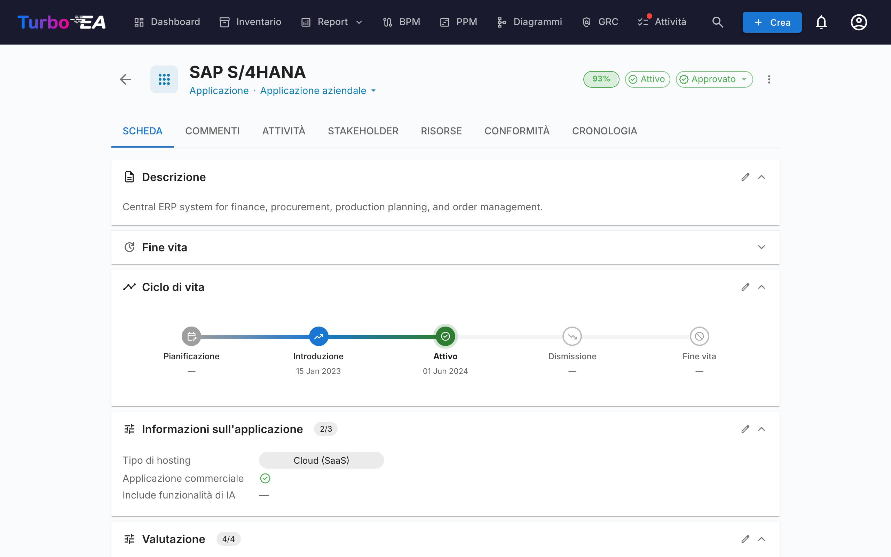
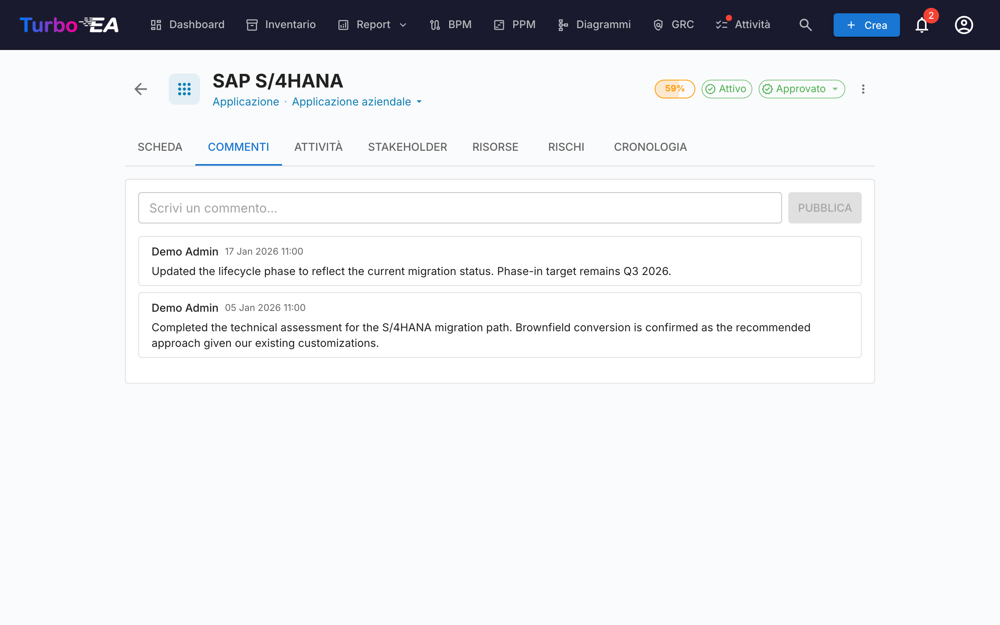
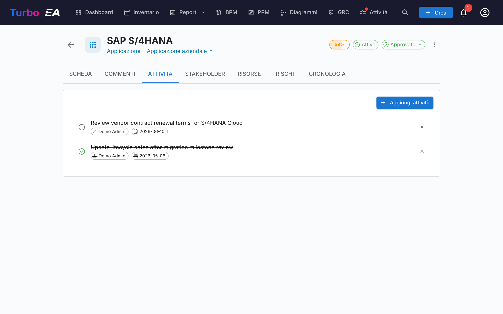
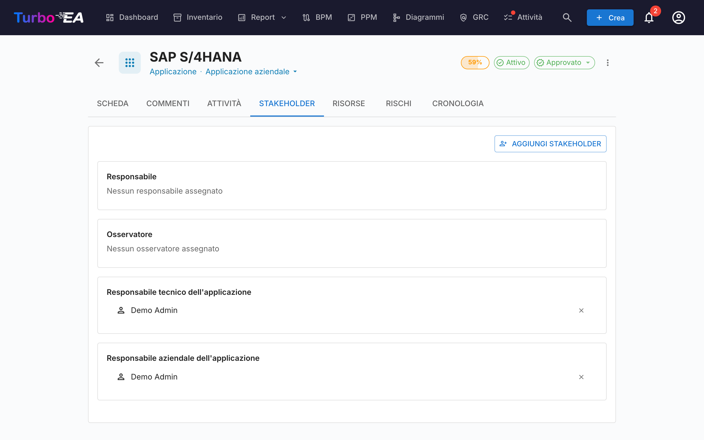
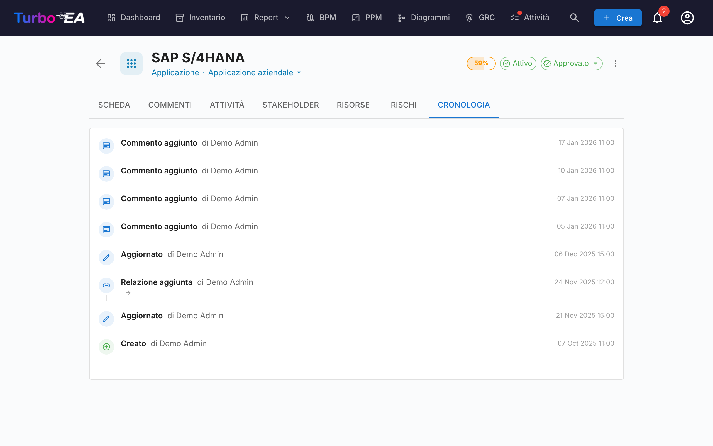

# Dettaglio card

Cliccando su qualsiasi card nell'inventario si apre la **vista dettagliata** dove è possibile visualizzare e modificare tutte le informazioni sul componente.

## Intestazione della card

La parte superiore della card mostra:

- **Icona e etichetta del tipo** — Indicatore del tipo di card con codice colore
- **Nome della card** — Modificabile in linea
- **Sottotipo** — Classificazione secondaria (se applicabile)
- **Badge dello stato di approvazione** — Draft, Approved, Broken o Rejected
- **Pulsante suggerimento AI** — Cliccate per generare una descrizione con AI (visibile quando l'AI è abilitata per questo tipo di card e l'utente ha il permesso di modifica)
- **Anello della qualità dei dati** — Indicatore visivo della completezza delle informazioni (0-100%)
- **Menu azioni** — Archiviazione, eliminazione e azioni di approvazione. Include anche un'azione con un clic **Osserva questa scheda** (quando il tipo di scheda definisce un ruolo Osservatore) che consente a qualsiasi utente con permessi di lettura di seguire la scheda senza passare dalla scheda Stakeholder.

### Workflow di approvazione

Le card possono attraversare un ciclo di approvazione:

| Stato | Significato |
|-------|-------------|
| **Draft** | Stato predefinito, non ancora revisionato |
| **Approved** | Revisionato e accettato da un responsabile |
| **Broken** | Era approvato, ma è stato modificato da allora — necessita una nuova revisione |
| **Rejected** | Revisionato e rifiutato, necessita correzioni |

Quando una card approvata viene modificata, il suo stato cambia automaticamente in **Broken** per indicare che necessita una nuova revisione.

## Scheda Dettaglio (Principale)

La scheda dettaglio è organizzata in **sezioni** che possono essere riordinate e configurate da un amministratore per ogni tipo di card (vedi [Editor layout card](../admin/metamodel.md#card-layout-editor)).

### Sezione Descrizione

- **Descrizione** — Descrizione in testo ricco del componente. Supporta la funzionalità di suggerimento AI per la generazione automatica
- **Campi descrizione aggiuntivi** — Alcuni tipi di card includono campi extra nella sezione descrizione (es. alias, ID esterno)

### Sezione Ciclo di vita

Il modello del ciclo di vita traccia un componente attraverso cinque fasi:

| Fase | Descrizione |
|------|-------------|
| **Plan** | In fase di valutazione, non ancora avviato |
| **Phase In** | In fase di implementazione o distribuzione |
| **Active** | Attualmente operativo |
| **Phase Out** | In fase di dismissione |
| **End of Life** | Non più in uso o supportato |

Ogni fase ha un **selettore di data** per registrare quando il componente è entrato o entrerà in quella fase. Una barra temporale visiva mostra la posizione del componente nel suo ciclo di vita.

### Sezioni attributi personalizzati

A seconda del tipo di card, vedrete sezioni aggiuntive con **campi personalizzati** configurati nel metamodello. I tipi di campo includono:

- **Testo** — Input di testo libero
- **Testo multilinea** — Input di testo libero che preserva le interruzioni di riga, visualizzato come un'area di testo a crescita automatica
- **Numero** — Valore numerico
- **Costo** — Valore numerico visualizzato con la valuta configurata della piattaforma
- **Booleano** — Interruttore on/off
- **Data** — Selettore di data
- **URL** — Link cliccabile (validato per http/https/mailto)
- **Selezione singola** — Menu a tendina con opzioni predefinite
- **Selezione multipla** — Selezione multipla con visualizzazione a chip

I campi contrassegnati come **calcolati** mostrano un badge e non possono essere modificati manualmente — i loro valori sono calcolati da [formule definite dall'amministratore](../admin/calculations.md).

### Sezione Gerarchia

Per i tipi di card che supportano la gerarchia (es. Organization, Business Capability, Application):

- **Genitore** — Il genitore della card nella gerarchia (cliccate per navigare)
- **Figli** — Elenco delle card figlie (cliccate su qualsiasi per navigare)
- **Breadcrumb gerarchico** — Mostra il percorso completo dalla radice alla card corrente

### Sezione Relazioni

Mostra tutte le connessioni con altre card, raggruppate per tipo di relazione. Per ogni relazione:

- **Nome della card correlata** — Cliccate per navigare alla card correlata
- **Tipo di relazione** — La natura della connessione (es. "utilizza", "funziona su", "dipende da")
- **Aggiungi relazione** — Cliccate su **+** per creare una nuova relazione; il selettore mostra le card corrispondenti non appena viene aperto (ordinate per nome, altre si caricano scorrendo) e digitando si filtra l'elenco
- **Rimuovi relazione** — Cliccate sull'icona di eliminazione per rimuovere una relazione
- **Raggruppa per sottotipo** — Quando una sezione di relazioni contiene molte card correlate, vengono raggruppate automaticamente in gruppi di sottotipo comprimibili (ciascuno con un conteggio), con un gruppo finale **Nessun sottotipo** per le card non classificate. Usate il pulsante di attivazione nell'intestazione della sezione per passare dalla vista raggruppata all'elenco semplice.

### Sezione Tag

Applicate tag dai [gruppi di tag](../admin/tags.md) configurati. A seconda della modalità del gruppo, potete selezionare un tag (selezione singola) o più tag (selezione multipla).

### Scheda Risorse

La scheda **Risorse** consolida tutti i materiali di supporto per una card:

- **Decisioni architetturali** — ADR collegati a questa card, visualizzati come pillole colorate corrispondenti ai colori del tipo di card (es. blu per Applicazione, viola per Oggetto Dati). È possibile collegare ADR esistenti o crearne uno nuovo direttamente dalla scheda Risorse — il nuovo ADR viene collegato automaticamente alla card.
- **Allegati file** — Caricate e gestite file (PDF, DOCX, XLSX, immagini, fino a 10 MB). Durante il caricamento, selezionate una **categoria documento** tra: Architettura, Sicurezza, Conformità, Operazioni, Note di riunione, Design o Altro. La categoria viene visualizzata come chip accanto a ogni file.
- **Link ai documenti** — Riferimenti a documenti basati su URL. Quando aggiungete un link, selezionate un **tipo di link** tra: Documentazione, Sicurezza, Conformità, Architettura, Operazioni, Supporto o Altro. Il tipo di link viene visualizzato come chip accanto a ogni link e l'icona cambia in base al tipo selezionato.
- **Diagrammi** — Collegate [diagrammi](diagrams.it.md) esistenti a questa card. I diagrammi collegati vengono visualizzati come anteprime in miniatura che potete cliccare per aprire nell'editor di diagrammi. Usate il pulsante **Collega diagramma** per cercare e allegare un diagramma esistente, oppure cliccate sull'icona di scollegamento per rimuovere l'associazione.

### Sezione EOL

Se la card è collegata a un prodotto [endoflife.date]( (tramite [Amministrazione EOL](../admin/eol.md)):

- **Nome del prodotto e versione**
- **Stato del supporto** — Con codice colore: Supportato, In avvicinamento a EOL, End of Life
- **Date chiave** — Data di rilascio, fine supporto attivo, fine supporto di sicurezza, data EOL

## Scheda Commenti

- **Aggiungi commenti** — Lasciate note, domande o decisioni sul componente
- **Risposte con thread** — Rispondete a commenti specifici per creare conversazioni con thread
- **Timestamp** — Visualizzate quando ogni commento è stato pubblicato e da chi

## Scheda Todo

- **Crea todo** — Aggiungete attività collegate a questa card specifica
- **Assegna** — Impostate un responsabile per ogni attività
- **Data di scadenza** — Impostate scadenze
- **Stato** — Alternate tra Aperto e Completato
- **Ricorrente** — Attivate **Ripeti** per far ripetere un todo secondo un calendario (ogni N giorni, settimane, mesi o anni); completandolo viene creata automaticamente la prossima occorrenza

## Scheda Stakeholder

Gli stakeholder sono persone con un **ruolo** specifico su questa card. I ruoli disponibili dipendono dal tipo di card (configurati nel [metamodello](../admin/metamodel.md)). I ruoli comuni includono:

- **Application Owner** — Responsabile delle decisioni aziendali
- **Technical Owner** — Responsabile delle decisioni tecniche
- **Ruoli personalizzati** — Ruoli aggiuntivi definiti dal vostro amministratore

Le assegnazioni degli stakeholder influenzano i **permessi**: i permessi effettivi di un utente su una card sono la combinazione del suo ruolo a livello di applicazione e di qualsiasi ruolo di stakeholder che detiene su quella card.

### Ricerca e invito

Scegli uno stakeholder tramite l'**autocomplete ricercabile** — inizia a digitare e il menu a tendina filtra sia per nome che per e-mail (l'e-mail appare come riga secondaria, così due utenti con lo stesso nome possono essere distinti a colpo d'occhio).

Se l'e-mail che digiti non corrisponde a un utente esistente, alla fine del menu a tendina appare un'opzione **«Invita «email» come nuovo utente»**. Selezionandola si espande un mini-modulo inline proprio dentro il selettore — scegli un ruolo (Member o Viewer per default), modifica facoltativamente il nome visualizzato e invia. Il nuovo utente viene invitato tramite l'e-mail di invito standard **e** assegnato al ruolo di stakeholder scelto sulla card in un'unica azione, così non devi mai lasciare la card per onboardare un collaboratore.

Il percorso di invito richiede il permesso **`users.invite`**, una forma delegata di `admin.users` che gli admin possono concedere a membri di fiducia. Una salvaguardia anti-escalation di privilegi impedisce ai non-admin di invitare utenti in ruoli admin — il menu a tendina dei ruoli filtra silenziosamente sui ruoli che l'invitante è autorizzato a delegare.

## Scheda Cronologia

Mostra il **registro di audit completo** delle modifiche apportate alla card: **chi** ha effettuato la modifica, **quando** è stata fatta e **cosa** è stato modificato (valore precedente vs. nuovo valore). Questo consente la completa tracciabilità di tutte le modifiche nel tempo.

## Scheda Rischi (GRC abilitato, quando presente)

Quando il [modulo GRC](grc.md) è abilitato **e** la card ha almeno un rischio collegato, appare una scheda **Rischi** che elenca ogni rischio collegato alla card con un percorso a un clic verso il [Registro dei rischi](risks.md). La scheda viene nascosta automaticamente quando non ci sono rischi collegati, così le card senza attività GRC non si portano dietro una scheda vuota.

## Scheda Conformità (GRC abilitato, quando presente)

Quando il [modulo GRC](grc.md) è abilitato **e** la card ha almeno una rilevazione di conformità collegata, appare una scheda **Conformità** che elenca ogni rilevazione attualmente collegata alla card. Le stesse azioni Riconosci / Accetta / **Crea rischio** / **Apri rischio** della [griglia Conformità GRC](compliance.md) sono disponibili, così il proprietario della card può triagiare le proprie rilevazioni senza lasciare la card. Auto-nascosta quando non ci sono rilevazioni collegate.

## Scheda Flusso di processo (solo card Business Process)

Per le card **Business Process**, appare una scheda aggiuntiva **Flusso di processo** con un visualizzatore/editor di diagrammi BPMN integrato. Vedi [BPM](bpm.md) per i dettagli sulla gestione dei flussi di processo.

## Scheda PPM (solo card Iniziativa)

Quando il [modulo PPM](ppm.md) è attivato, le card **Iniziativa** mostrano una scheda **PPM** aggiuntiva come ultima scheda. Cliccando su questa scheda si accede alla vista dettagliata PPM dell'iniziativa, dove è possibile gestire report di stato, budget, rischi, attività e diagrammi di Gantt.

## Archiviazione

Le card possono essere **archiviate** (eliminate temporaneamente) tramite il menu azioni. Le card archiviate:

- Sono nascoste dalla vista predefinita dell'inventario (visibili solo con il filtro "Mostra archiviate")
- Vengono automaticamente **eliminate definitivamente dopo 30 giorni**
- Possono essere ripristinate prima della scadenza dei 30 giorni
