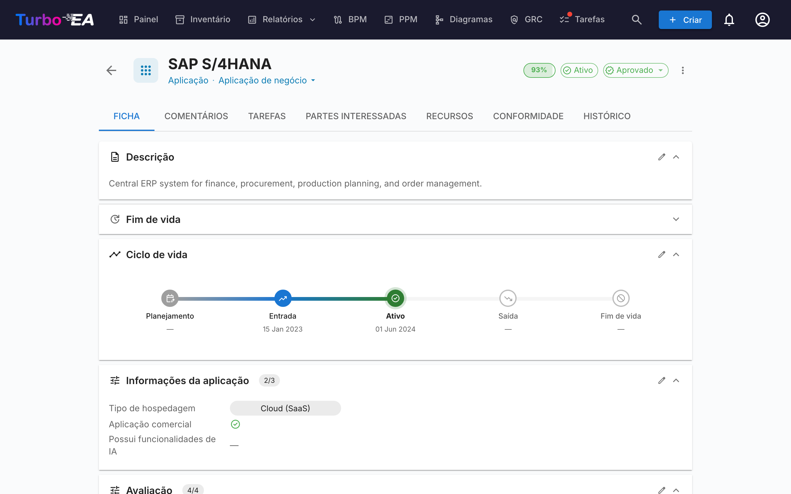
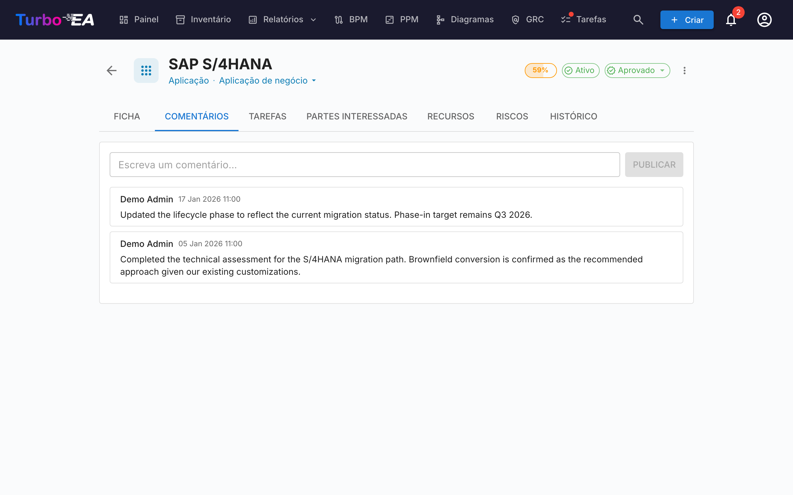
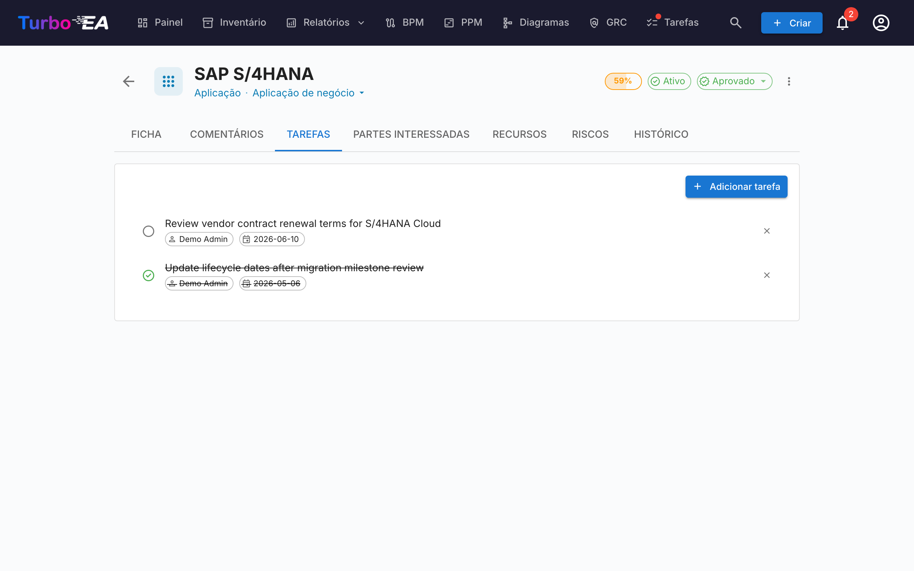
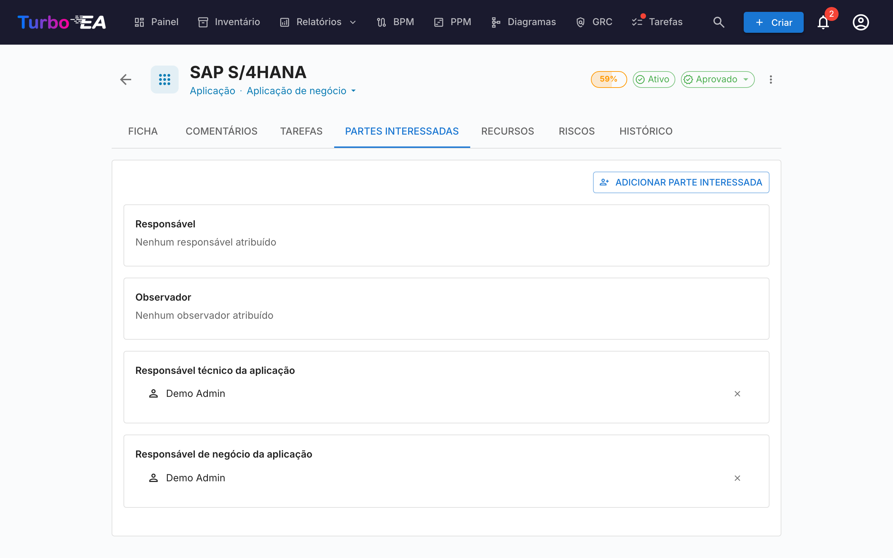
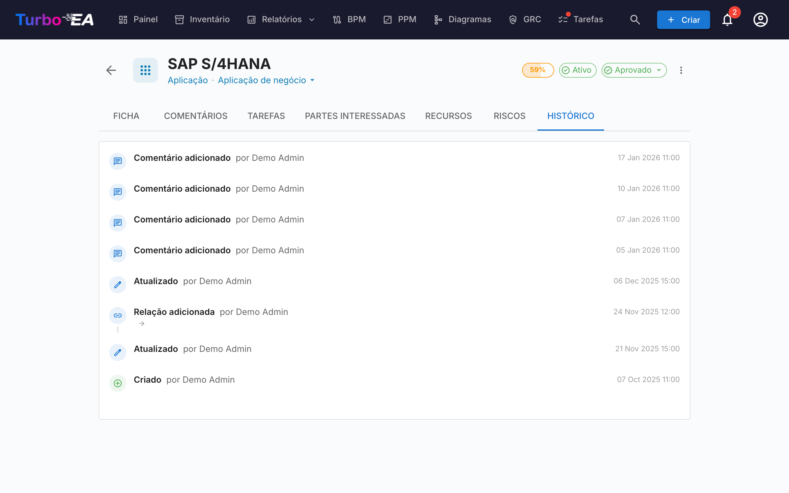

# Detalhes do Card

Clicar em qualquer card no inventário abre a **visualização de detalhe** onde você pode ver e editar todas as informações sobre o componente.

## Cabeçalho do Card

A parte superior do card mostra:

- **Ícone e rótulo do tipo** — Indicador colorido do tipo de card
- **Nome do card** — Editável inline
- **Subtipo** — Classificação secundária (se aplicável)
- **Badge de status de aprovação** — Rascunho, Aprovado, Quebrado ou Rejeitado
- **Botão de sugestão IA** — Clique para gerar uma descrição com IA (visível quando a IA está habilitada para este tipo de card e o usuário tem permissão de edição)
- **Anel de qualidade dos dados** — Indicador visual da completude das informações (0-100%)
- **Menu de ações** — Arquivar, excluir e ações de aprovação. Também inclui uma ação de um clique **Observar este cartão** (quando o tipo de card define um papel de Observador), permitindo que qualquer usuário com permissão de leitura siga o card sem precisar abrir a aba Partes interessadas.

### Fluxo de Aprovação

Os cards podem passar por um ciclo de aprovação:

| Status | Significado |
|--------|-------------|
| **Rascunho** | Estado padrão, ainda não revisado |
| **Aprovado** | Revisado e aceito por uma parte responsável |
| **Quebrado** | Estava aprovado, mas foi editado desde então — precisa de nova revisão |
| **Rejeitado** | Revisado e rejeitado, precisa de correções |

Quando um card aprovado é editado, seu status muda automaticamente para **Quebrado** para indicar que precisa de nova revisão.

## Aba de Detalhe (Principal)

A aba de detalhe é organizada em **seções** que podem ser reordenadas e configuradas por um administrador por tipo de card (veja [Editor de Layout de Card](../admin/metamodel.md#card-layout-editor)).

### Seção de Descrição

- **Descrição** — Descrição em texto rico do componente. Suporta o recurso de sugestão de IA para geração automática
- **Campos adicionais de descrição** — Alguns tipos de card incluem campos extras na seção de descrição (ex.: alias, ID externo)

### Seção de Ciclo de Vida

O modelo de ciclo de vida acompanha um componente através de cinco fases:

| Fase | Descrição |
|------|-----------|
| **Planejamento** | Em consideração, ainda não iniciado |
| **Implantação** | Sendo implementado ou implantado |
| **Ativo** | Atualmente operacional |
| **Desativação** | Sendo descomissionado |
| **Fim de Vida** | Não mais em uso ou com suporte |

Cada fase tem um **seletor de data** para que você possa registrar quando o componente entrou ou entrará nessa fase. Uma barra de linha do tempo visual mostra a posição do componente em seu ciclo de vida.

### Seções de Atributos Personalizados

Dependendo do tipo de card, você verá seções adicionais com **campos personalizados** configurados no metamodelo. Os tipos de campo incluem:

- **Texto** — Entrada de texto livre
- **Texto multilinha** — Entrada de texto livre que preserva quebras de linha, exibida como uma área de texto que cresce automaticamente
- **Número** — Valor numérico
- **Custo** — Valor numérico exibido com a moeda configurada na plataforma
- **Booleano** — Alternância liga/desliga
- **Data** — Seletor de data
- **URL** — Link clicável (validado para http/https/mailto)
- **Seleção única** — Menu suspenso com opções predefinidas
- **Seleção múltipla** — Multi-seleção com exibição de chips

Campos marcados como **calculados** mostram um badge e não podem ser editados manualmente — seus valores são computados por [fórmulas definidas pelo administrador](../admin/calculations.md).

### Seção de Hierarquia

Para tipos de card que suportam hierarquia (ex.: Organização, Capacidade de Negócio, Aplicação):

- **Pai** — O card pai na hierarquia (clique para navegar)
- **Filhos** — Lista de cards filhos (clique em qualquer um para navegar)
- **Breadcrumb de hierarquia** — Mostra o caminho completo da raiz até o card atual

### Seção de Relacionamentos

Mostra todas as conexões com outros cards, agrupadas por tipo de relacionamento. Para cada relacionamento:

- **Nome do card relacionado** — Clique para navegar até o card relacionado
- **Tipo de relacionamento** — A natureza da conexão (ex.: "utiliza", "roda em", "depende de")
- **Adicionar relacionamento** — Clique em **+** para criar um novo relacionamento; o seletor lista os cards correspondentes assim que é aberto (ordenados por nome, mais são carregados ao rolar) e digitar filtra a lista
- **Remover relacionamento** — Clique no ícone de exclusão para remover um relacionamento

### Seção de Tags

Aplique tags dos [grupos de tags](../admin/tags.md) configurados. Dependendo do modo do grupo, você pode selecionar uma tag (seleção única) ou múltiplas tags (seleção múltipla).

### Aba de Recursos

A aba de **Recursos** consolida todos os materiais de apoio de um card:

- **Decisões de Arquitetura** — ADR vinculados a este card, exibidos como pílulas coloridas correspondentes às cores do tipo de card (ex.: azul para Aplicação, roxo para Objeto de Dados). Você pode vincular ADRs existentes ou criar um novo diretamente a partir da aba Recursos — o novo ADR é vinculado automaticamente ao card.
- **Anexos de Arquivos** — Carregue e gerencie arquivos (PDF, DOCX, XLSX, imagens, até 10 MB). Ao carregar, selecione uma **categoria de documento** entre: Arquitetura, Segurança, Conformidade, Operações, Notas de Reunião, Design ou Outro. A categoria aparece como um chip ao lado de cada arquivo.
- **Links de Documentos** — Referências de documentos baseadas em URL. Ao adicionar um link, selecione um **tipo de link** entre: Documentação, Segurança, Conformidade, Arquitetura, Operações, Suporte ou Outro. O tipo de link aparece como um chip ao lado de cada link, e o ícone muda de acordo com o tipo selecionado.
- **Diagramas** — Vincule [diagramas](diagrams.pt.md) existentes a este card. Os diagramas vinculados são exibidos como pré-visualizações em miniatura que você pode clicar para abrir no editor de diagramas. Use o botão **Vincular Diagrama** para pesquisar e anexar um diagrama existente, ou clique no ícone de desvincular para remover a associação.

### Seção EOL

Se o card estiver vinculado a um produto do [endoflife.date](https://endoflife.date/) (via [Administração de EOL](../admin/eol.md)):

- **Nome do produto e versão**
- **Status de suporte** — Com código de cores: Suportado, Aproximando-se do EOL, Fim de Vida
- **Datas importantes** — Data de lançamento, fim do suporte ativo, fim do suporte de segurança, data de EOL

## Aba de Comentários

- **Adicionar comentários** — Deixe notas, perguntas ou decisões sobre o componente
- **Respostas em thread** — Responda a comentários específicos para criar conversações encadeadas
- **Timestamps** — Veja quando cada comentário foi postado e por quem

## Aba de Tarefas

- **Criar tarefas** — Adicione tarefas vinculadas a este card específico
- **Atribuir** — Defina uma pessoa responsável para cada tarefa
- **Data de vencimento** — Defina prazos
- **Status** — Alterne entre Aberto e Concluído
- **Recorrente** — Ative **Repetir** para que uma tarefa se repita conforme um cronograma (a cada N dias, semanas, meses ou anos); ao concluí-la, a próxima ocorrência é criada automaticamente

## Aba de Partes Interessadas

Partes interessadas são pessoas com um **papel** específico neste card. Os papéis disponíveis dependem do tipo de card (configurado no [metamodelo](../admin/metamodel.md)). Papéis comuns incluem:

- **Proprietário da Aplicação** — Responsável por decisões de negócio
- **Proprietário Técnico** — Responsável por decisões técnicas
- **Papéis personalizados** — Papéis adicionais conforme definido pelo seu administrador

Atribuições de partes interessadas afetam **permissões**: as permissões efetivas de um usuário em um card são a combinação do seu papel em nível de aplicação e quaisquer papéis de parte interessada que ele possua naquele card.

### Pesquisar e convidar

Escolha uma parte interessada via o **autocompletar pesquisável** — comece a digitar e o menu suspenso filtra tanto por nome quanto por e-mail (o e-mail aparece como linha secundária, para que dois usuários com o mesmo nome possam ser distinguidos num relance).

Se o e-mail que você digita não corresponder a um usuário existente, uma opção **«Convidar «email» como novo usuário»** aparece no final do menu suspenso. Selecioná-la expande um mini-formulário inline dentro do próprio seletor — escolha um papel (Membro ou Visualizador por padrão), edite opcionalmente o nome exibido e envie. O novo usuário é convidado via o e-mail de convite padrão **e** atribuído ao papel de parte interessada escolhido no card numa única ação, assim você nunca precisa deixar o card para integrar um colaborador.

O caminho de convite requer a permissão **`users.invite`**, uma forma delegada de `admin.users` que administradores podem conceder a membros confiáveis. Uma proteção contra escalada de privilégios impede que não-admins convidem usuários para papéis de admin — o menu suspenso de papéis filtra silenciosamente para os papéis que o convidante tem permissão para delegar.

## Aba de Histórico

Mostra a **trilha de auditoria completa** das alterações feitas no card: **quem** fez a alteração, **quando** foi feita e **o que** foi modificado (valor anterior vs. novo valor). Isso permite total rastreabilidade de todas as modificações ao longo do tempo.

## Aba de Riscos (GRC habilitado, quando presente)

Quando o [módulo GRC](grc.md) está habilitado **e** o card tem pelo menos um risco vinculado, aparece uma aba **Riscos** que lista cada risco vinculado ao card com um caminho de um clique de volta ao [Registro de Riscos](risks.md). A aba é auto-ocultada quando não há risco vinculado, de modo que cards sem atividade GRC não carregam uma aba vazia.

## Aba de Conformidade (GRC habilitado, quando presente)

Quando o [módulo GRC](grc.md) está habilitado **e** o card tem pelo menos uma descoberta de conformidade vinculada, aparece uma aba **Conformidade** que lista cada descoberta atualmente vinculada ao card. As mesmas ações Reconhecer / Aceitar / **Criar risco** / **Abrir risco** que na [grade de Conformidade GRC](compliance.md) estão disponíveis, de modo que o proprietário do card possa triar suas próprias descobertas sem deixar o card. Auto-ocultada quando não há descoberta vinculada.

## Aba de Fluxo de Processo (apenas cards de Processo de Negócio)

Para cards de **Processo de Negócio**, uma aba adicional de **Fluxo de Processo** aparece com um visualizador/editor de diagrama BPMN integrado. Veja [BPM](bpm.md) para detalhes sobre gerenciamento de fluxos de processo.

## Aba PPM (apenas cards de Iniciativa)

Quando o [módulo PPM](ppm.md) está ativado, os cards de **Iniciativa** exibem uma aba **PPM** adicional como última aba. Ao clicar nesta aba, você é direcionado à visualização detalhada PPM da iniciativa, onde pode gerenciar relatórios de status, orçamentos, riscos, tarefas e cronogramas Gantt.

## Arquivamento

Cards podem ser **arquivados** (exclusão temporária) através do menu de ações. Cards arquivados:

- São ocultados da visualização padrão do inventário (visíveis apenas com o filtro "Mostrar arquivados")
- São automaticamente **excluídos permanentemente após 30 dias**
- Podem ser restaurados antes que a janela de 30 dias expire
