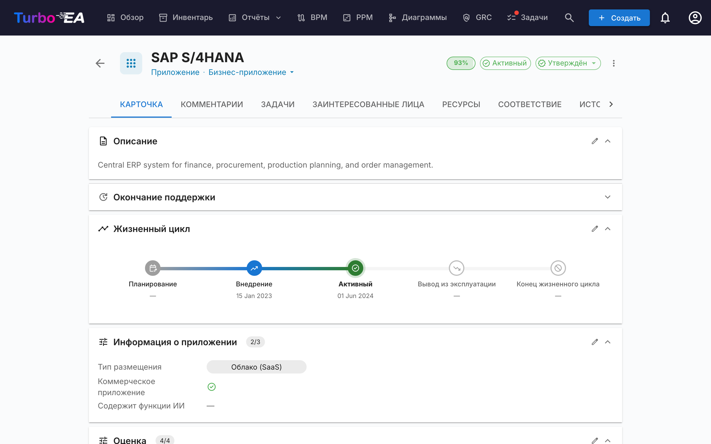
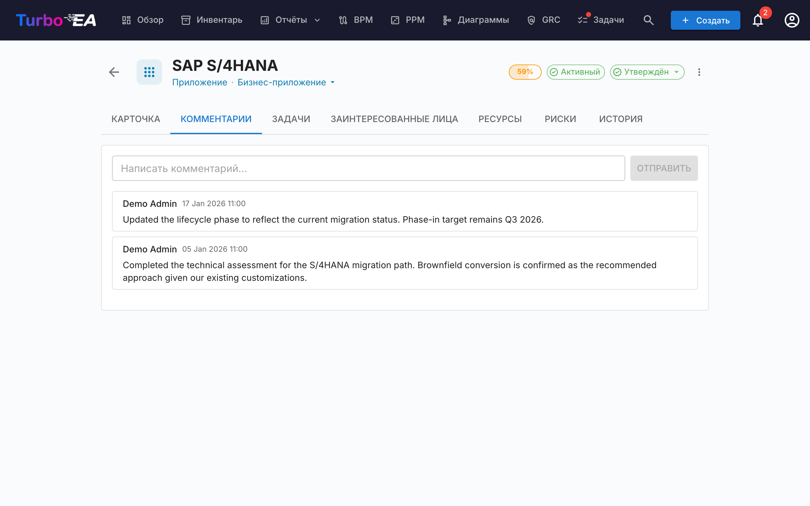
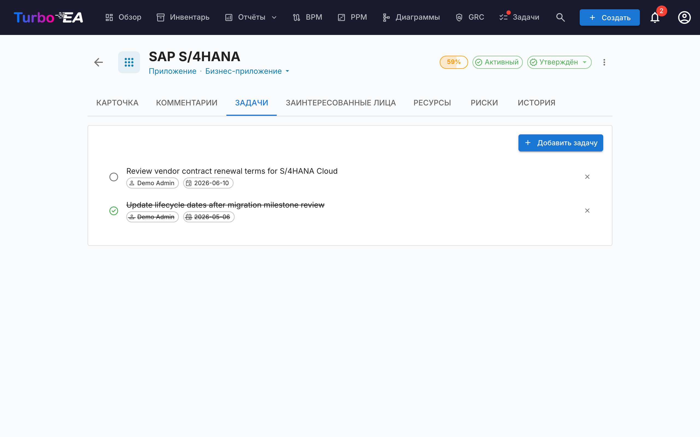
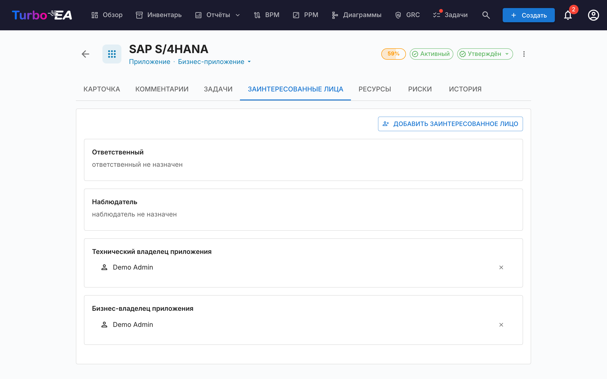
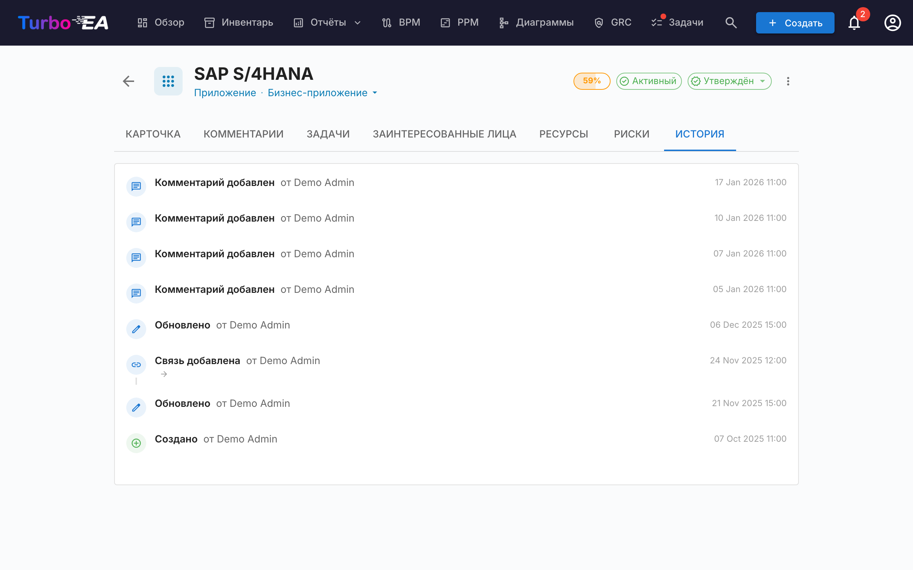

# Детали карточки

Нажатие на любую карточку в инвентаре открывает **детальное представление**, где можно просмотреть и отредактировать всю информацию о компоненте.

## Заголовок карточки

В верхней части карточки отображается:

- **Иконка и метка типа** — цветовой индикатор типа карточки
- **Название карточки** — редактируется инлайн
- **Подтип** — вторичная классификация (если применимо)
- **Значок статуса утверждения** — Черновик, Утверждено, Нарушено или Отклонено
- **Кнопка ИИ-подсказки** — нажмите для генерации описания с помощью ИИ (видна, когда ИИ включён для данного типа карточки и пользователь имеет права на редактирование)
- **Кольцо качества данных** — визуальный индикатор полноты информации (0–100%)
- **Меню действий** — архивирование, удаление и действия по утверждению. Также содержит действие в один клик **Наблюдать за этой карточкой** (если для типа карточки определена роль Наблюдатель), позволяющее любому пользователю с правом просмотра следить за карточкой без перехода на вкладку Заинтересованные стороны.

### Процесс утверждения

Карточки могут проходить цикл утверждения:

| Статус | Значение |
|--------|----------|
| **Черновик** | Состояние по умолчанию, ещё не проверена |
| **Утверждено** | Проверена и принята ответственным лицом |
| **Нарушено** | Была утверждена, но отредактирована после — требуется повторная проверка |
| **Отклонено** | Проверена и отклонена, необходимы исправления |

Когда утверждённая карточка редактируется, её статус автоматически меняется на **Нарушено**, чтобы указать на необходимость повторной проверки.

## Вкладка «Детали» (основная)

Вкладка «Детали» организована в **секции**, которые могут быть переупорядочены и настроены администратором для каждого типа карточки (см. [Редактор макета карточки](../admin/metamodel.md#card-layout-editor)).

### Секция описания

- **Описание** — текстовое описание компонента в формате rich text. Поддерживает функцию ИИ-подсказок для автоматической генерации
- **Дополнительные поля описания** — некоторые типы карточек включают дополнительные поля в секции описания (например, псевдоним, внешний идентификатор)

### Секция жизненного цикла

Модель жизненного цикла отслеживает компонент через пять фаз:

| Фаза | Описание |
|------|----------|
| **Планирование** | На рассмотрении, ещё не начат |
| **Внедрение** | Реализуется или развёртывается |
| **Активный** | В настоящее время эксплуатируется |
| **Вывод** | Выводится из эксплуатации |
| **Конец жизни** | Больше не используется и не поддерживается |

Для каждой фазы есть **выбор даты**, позволяющий зафиксировать, когда компонент вошёл или войдёт в эту фазу. Визуальная временная шкала показывает положение компонента в его жизненном цикле.

### Секции пользовательских атрибутов

В зависимости от типа карточки вы увидите дополнительные секции с **пользовательскими полями**, настроенными в метамодели. Типы полей включают:

- **Текст** — свободный текстовый ввод
- **Многострочный текст** — свободный текстовый ввод, сохраняющий переносы строк, отображается как автоматически растущая область ввода
- **Число** — числовое значение
- **Стоимость** — числовое значение, отображаемое в настроенной валюте платформы
- **Логическое** — переключатель вкл./выкл.
- **Дата** — выбор даты
- **URL** — кликабельная ссылка (проверяется для http/https/mailto)
- **Одиночный выбор** — выпадающий список с предопределёнными вариантами
- **Множественный выбор** — множественное выделение с отображением в виде чипов

Поля, отмеченные как **вычисляемые**, имеют соответствующий значок и не могут редактироваться вручную — их значения рассчитываются по [формулам, определённым администратором](../admin/calculations.md).

### Секция иерархии

Для типов карточек, поддерживающих иерархию (например, Организация, Бизнес-способность, Приложение):

- **Родитель** — родительская карточка в иерархии (нажмите для перехода)
- **Дочерние элементы** — список дочерних карточек (нажмите на любую для перехода)
- **Цепочка иерархии** — показывает полный путь от корня до текущей карточки

### Секция связей

Показывает все соединения с другими карточками, сгруппированные по типу связи. Для каждой связи:

- **Название связанной карточки** — нажмите для перехода к связанной карточке
- **Тип связи** — характер соединения (например, «использует», «работает на», «зависит от»)
- **Добавить связь** — нажмите **+**, чтобы создать новую связь; список карточек открывается сразу (отсортирован по имени, при прокрутке подгружаются ещё), а ввод текста фильтрует его
- **Удалить связь** — нажмите иконку удаления для удаления связи
- **Группировать по подтипу** — когда в секции связей много связанных карточек, они автоматически объединяются в сворачиваемые группы по подтипу (каждая со счётчиком), а завершает список группа **Без подтипа** для неклассифицированных карточек. Используйте переключатель в заголовке секции для смены сгруппированного и плоского вида.

### Секция тегов

Применяйте теги из настроенных [групп тегов](../admin/tags.md). В зависимости от режима группы можно выбрать один тег (одиночный выбор) или несколько тегов (множественный выбор).

## Вкладка «Ресурсы»

Вкладка **Ресурсы** объединяет все вспомогательные материалы карточки:

- **Архитектурные решения** — записи ADR, привязанные к этой карточке, отображаются в виде цветных меток, соответствующих цветам типов карточек (например, синий для Приложения, фиолетовый для Объекта данных). Вы можете привязать существующие ADR или создать новый ADR прямо из вкладки «Ресурсы» — новый ADR автоматически привязывается к карточке.
- **Вложенные файлы** — загружайте и управляйте файлами (PDF, DOCX, XLSX, изображения, до 10 МБ). При загрузке выберите **категорию документа** из: Архитектура, Безопасность, Соответствие, Операции, Протоколы встреч, Дизайн или Прочее. Категория отображается в виде чипа рядом с каждым файлом.
- **Ссылки на документы** — ссылки на документы по URL. При добавлении ссылки выберите **тип ссылки** из: Документация, Безопасность, Соответствие, Архитектура, Операции, Поддержка или Прочее. Тип ссылки отображается в виде чипа рядом с каждой ссылкой, а иконка меняется в зависимости от выбранного типа.
- **Диаграммы** — привязывайте существующие [диаграммы](diagrams.md) к этой карточке. Привязанные диаграммы отображаются в виде миниатюр, которые можно нажать для открытия в редакторе диаграмм. Используйте кнопку **Привязать диаграмму** для поиска и прикрепления существующей диаграммы или нажмите иконку отвязки для удаления ассоциации.

### Секция EOL

Если карточка привязана к продукту [endoflife.date](https://endoflife.date/) (через [Администрирование EOL](../admin/eol.md)):

- **Название продукта и версия**
- **Статус поддержки** — цветовая кодировка: Поддерживается, Приближается EOL, Конец жизни
- **Ключевые даты** — дата выпуска, окончание активной поддержки, окончание поддержки безопасности, дата EOL

## Вкладка «Комментарии»

- **Добавление комментариев** — оставляйте заметки, вопросы или решения о компоненте
- **Ветки ответов** — отвечайте на конкретные комментарии для создания цепочек обсуждения
- **Временные метки** — отображают, когда каждый комментарий был опубликован и кем

## Вкладка «Задачи»

- **Создание задач** — добавляйте задачи, привязанные к конкретной карточке
- **Назначение** — устанавливайте ответственное лицо для каждой задачи
- **Срок выполнения** — устанавливайте крайние сроки
- **Статус** — переключайте между «Открыта» и «Выполнена»
- **Повторяющаяся** — включите **Повторять**, чтобы задача повторялась по расписанию (каждые N дней, недель, месяцев или лет); при завершении автоматически создаётся следующее вхождение

## Вкладка «Заинтересованные стороны»

Заинтересованные стороны — это люди с определённой **ролью** в данной карточке. Доступные роли зависят от типа карточки (настраиваются в [метамодели](../admin/metamodel.md)). Типичные роли включают:

- **Владелец приложения** — отвечает за бизнес-решения
- **Технический владелец** — отвечает за технические решения
- **Пользовательские роли** — дополнительные роли, определённые вашим администратором

Назначение заинтересованных сторон влияет на **права доступа**: эффективные права пользователя на карточку складываются из прав его роли на уровне приложения и всех ролей заинтересованных сторон, которые он имеет на этой карточке.

### Поиск и приглашение

Выберите заинтересованную сторону через **поисковое автозаполнение** — начните вводить, и выпадающий список фильтрует и по имени, и по e-mail (e-mail отображается как вторичная строка, чтобы двух пользователей с одним именем можно было различить с одного взгляда).

Если введённый e-mail не соответствует существующему пользователю, в конце выпадающего списка появляется опция **«Пригласить «email» как нового пользователя»**. Выбор её раскрывает встроенную мини-форму прямо в селекторе — выберите роль (Member или Viewer по умолчанию), при желании отредактируйте отображаемое имя и отправьте. Новый пользователь приглашается через стандартное письмо-приглашение **и** назначается выбранной ролью заинтересованной стороны на карточке за одно действие, так что никогда не нужно покидать карточку, чтобы привлечь участника.

Путь приглашения требует разрешения **`users.invite`**, делегированной формы `admin.users`, которую администраторы могут предоставлять доверенным участникам. Защита от эскалации привилегий не позволяет не-администраторам приглашать пользователей в роли администратора — выпадающий список ролей молча фильтрует роли, которые приглашающий имеет право делегировать.

## Вкладка «История»

Показывает **полный журнал аудита** изменений, внесённых в карточку: **кто** внёс изменение, **когда** оно было сделано и **что** было изменено (предыдущее значение по сравнению с новым). Это обеспечивает полную прослеживаемость всех модификаций во времени.

## Вкладка «Риски» (GRC включён, при наличии)

Когда [модуль GRC](grc.md) включён **и** карточка имеет хотя бы один связанный риск, появляется вкладка **Риски**, перечисляющая каждый связанный с карточкой риск с одним кликом обратно в [Реестр рисков](risks.md). Вкладка автоматически скрывается, когда нет связанных рисков, чтобы карточки без GRC-активности не тащили за собой пустую вкладку.

## Вкладка «Соответствие» (GRC включён, при наличии)

Когда [модуль GRC](grc.md) включён **и** карточка имеет хотя бы одну связанную находку соответствия, появляется вкладка **Соответствие**, перечисляющая каждую находку, в настоящее время связанную с карточкой. Доступны те же действия Подтвердить / Принять / **Создать риск** / **Открыть риск**, что и в [сетке Соответствия GRC](compliance.md), чтобы владелец карточки мог сортировать свои находки, не покидая карточку. Автоматически скрывается, когда нет связанных находок.

## Вкладка «Процессный поток» (только для карточек «Бизнес-процесс»)

Для карточек **Бизнес-процесс** появляется дополнительная вкладка **Процессный поток** со встроенным средством просмотра/редактирования BPMN-диаграмм. Подробнее об управлении процессными потоками см. в разделе [BPM](bpm.md).

## Вкладка PPM (только для карточек «Инициатива»)

Когда [модуль PPM](ppm.md) включён, карточки **Инициатива** отображают дополнительную вкладку **PPM** в последней позиции. При нажатии на эту вкладку происходит переход к детальному представлению PPM инициативы, где можно управлять отчётами о статусе, бюджетами, рисками, задачами и диаграммами Ганта.

## Архивирование

Карточки могут быть **архивированы** (мягко удалены) через меню действий. Архивированные карточки:

- Скрыты из представления инвентаря по умолчанию (видимы только с фильтром «Показать архивные»)
- Автоматически **удаляются окончательно через 30 дней**
- Могут быть восстановлены до истечения 30-дневного срока
