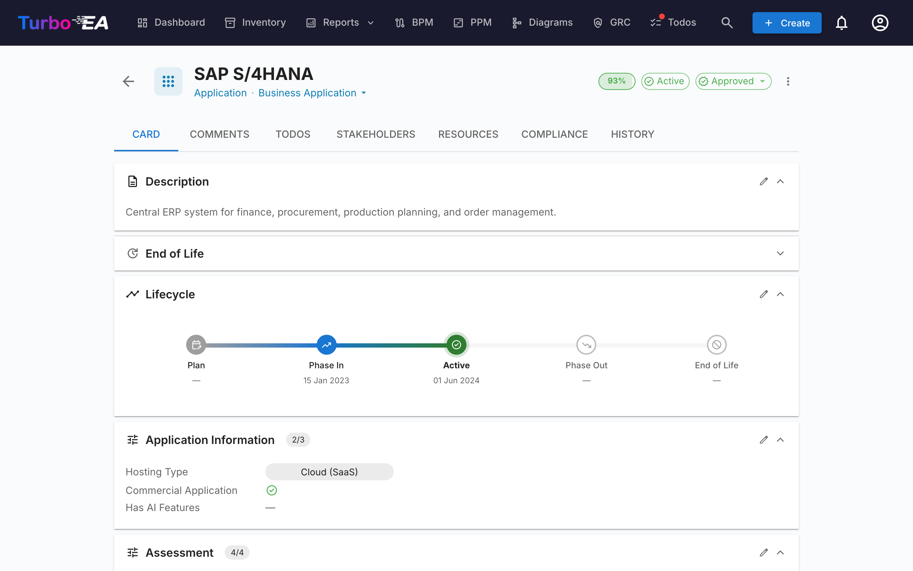
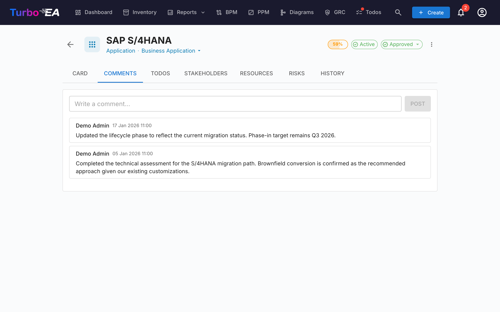
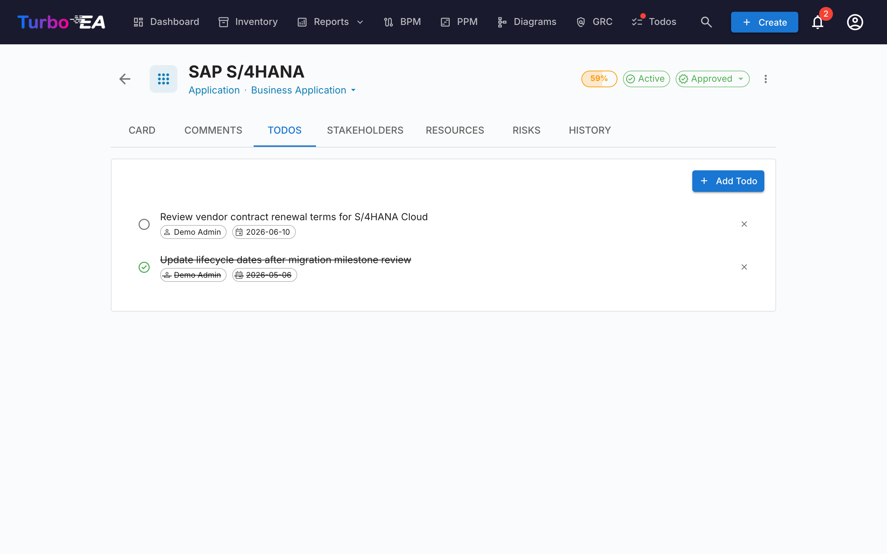
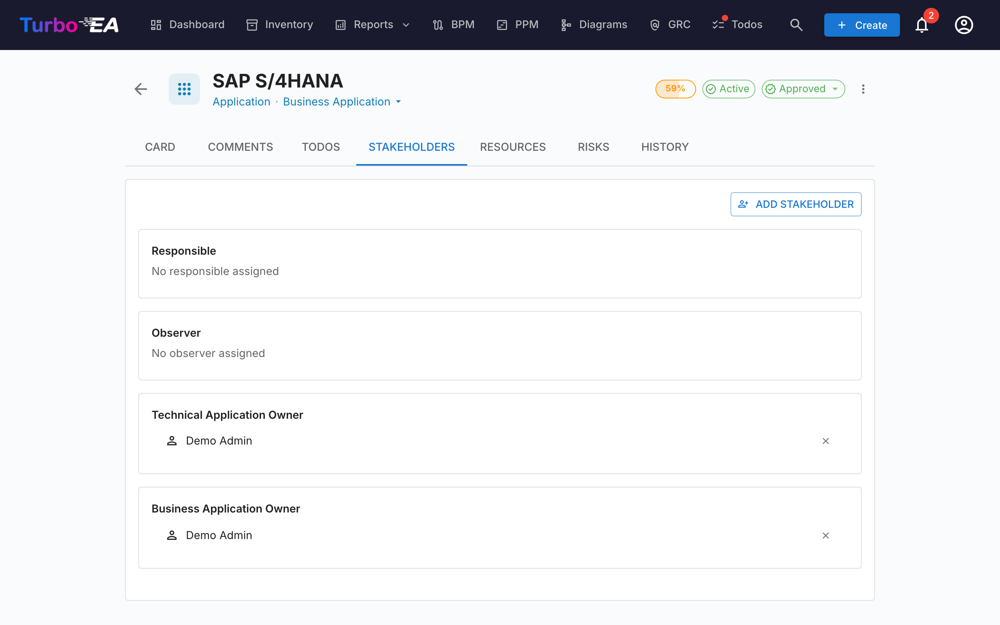
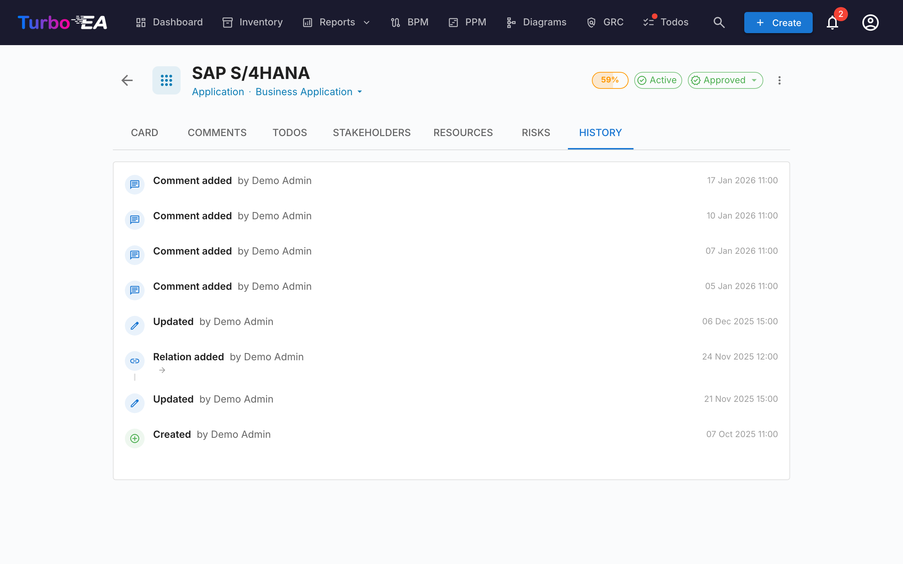

# 卡片详情

在清单中点击任何卡片将打开**详情视图**，您可以在此查看和编辑组件的所有信息。

## 卡片标题

卡片顶部显示：

- **类型图标和标签** —— 颜色编码的卡片类型指示器
- **卡片名称** —— 支持行内编辑
- **子类型** —— 次级分类（如适用）
- **审批状态徽章** —— 草稿、已批准、已变更或已拒绝
- **AI 建议按钮** —— 点击使用 AI 生成描述（当该卡片类型已启用 AI 且用户有编辑权限时可见）
- **数据质量圆环** —— 信息完整度的可视化指示器（0-100%）
- **操作菜单** —— 归档、删除和审批操作

### 审批工作流

卡片可以经历审批流程：

| 状态 | 含义 |
|------|------|
| **草稿** | 默认状态，尚未审核 |
| **已批准** | 已由负责人审核并接受 |
| **已变更** | 曾被批准，但此后已被编辑 —— 需要重新审核 |
| **已拒绝** | 已审核并被拒绝，需要修改 |

当已批准的卡片被编辑时，其状态会自动变为**已变更**，表示需要重新审核。

## 详情标签页（主页面）

详情标签页按**分区**组织，管理员可以按卡片类型重新排序和配置（参见[卡片布局编辑器](../admin/metamodel.md#卡片布局编辑器)）。

### 描述分区

- **描述** —— 组件的富文本描述。支持 AI 建议功能自动生成
- **附加描述字段** —— 某些卡片类型在描述分区包含额外字段（例如别名、外部 ID）

### 生命周期分区

生命周期模型通过五个阶段跟踪组件：

| 阶段 | 描述 |
|------|------|
| **规划** | 正在考虑中，尚未开始 |
| **引入** | 正在实施或部署 |
| **活跃** | 当前正在运行 |
| **淘汰** | 正在停用 |
| **生命周期结束** | 不再使用或不再受支持 |

每个阶段都有一个**日期选择器**，您可以记录组件进入或将进入该阶段的时间。可视化时间线条显示组件在其生命周期中的位置。

### 自定义属性分区

根据卡片类型，您将看到元模型中配置的**自定义字段**的附加分区。字段类型包括：

- **文本** —— 自由文本输入
- **数字** —— 数值
- **成本** —— 以平台配置的货币显示的数值
- **布尔值** —— 开/关切换
- **日期** —— 日期选择器
- **URL** —— 可点击的链接（验证 http/https/mailto）
- **单选** —— 带预定义选项的下拉菜单
- **多选** —— 带标签式选项显示的多选

标记为**计算字段**的字段显示徽章且不能手动编辑 —— 其值由[管理员定义的公式](../admin/calculations.md)计算得出。

### 层级分区

对于支持层级结构的卡片类型（例如组织、业务能力、应用程序）：

- **父级** —— 卡片在层级中的上级（点击导航）
- **子级** —— 子卡片列表（点击任意一个进行导航）
- **层级面包屑** —— 显示从根到当前卡片的完整路径

### 关系分区

显示与其他卡片的所有连接，按关系类型分组。每个关系包含：

- **关联卡片名称** —— 点击导航到关联卡片
- **关系类型** —— 连接的性质（例如「使用」、「运行于」、「依赖于」）
- **添加关系** —— 点击 **+** 通过搜索卡片创建新关系
- **移除关系** —— 点击删除图标移除关系

### 标签分区

从配置的[标签组](../admin/tags.md)中应用标签。根据组模式，您可以选择一个标签（单选）或多个标签（多选）。

### 资源标签页

**资源**标签页整合了卡片的所有支持材料：

- **架构决策** —— 与此卡片关联的 ADR，以与卡片类型颜色匹配的彩色胶囊显示（例如，应用程序为蓝色，数据对象为紫色）。您可以关联现有的 ADR，也可以直接从资源标签页创建新的 ADR —— 新 ADR 会自动关联到该卡片。
- **文件附件** —— 上传和管理文件（PDF、DOCX、XLSX、图片，最大 10 MB）。上传时，从以下选项中选择**文档类别**：架构、安全、合规、运维、会议纪要、设计或其他。类别以标签形式显示在每个文件旁边。
- **文档链接** —— 基于 URL 的文档引用。添加链接时，从以下选项中选择**链接类型**：文档、安全、合规、架构、运维、支持或其他。链接类型以标签形式显示在每个链接旁边，图标会根据所选类型变化。

### EOL 分区

如果卡片已链接到 [endoflife.date](https://endoflife.date/) 产品（通过 [EOL 管理](../admin/eol.md)）：

- **产品名称和版本**
- **支持状态** —— 颜色编码：受支持、即将到期、已到期
- **关键日期** —— 发布日期、主动支持结束日期、安全支持结束日期、EOL 日期

## 评论标签页

- **添加评论** —— 留下关于组件的注释、问题或决策
- **线程回复** —— 回复特定评论以创建对话线程
- **时间戳** —— 查看每条评论的发布时间和发布者

## 待办标签页

- **创建待办** —— 添加与此特定卡片相关的任务
- **分配** —— 为每个任务设置负责人
- **截止日期** —— 设置截止时间
- **状态** —— 在进行中和已完成之间切换

## 干系人标签页

干系人是在此卡片上具有特定**角色**的人员。可用角色取决于卡片类型（在[元模型](../admin/metamodel.md)中配置）。常见角色包括：

- **应用所有者** —— 负责业务决策
- **技术所有者** —— 负责技术决策
- **自定义角色** —— 由管理员定义的其他角色

干系人分配影响**权限**：用户在卡片上的有效权限是其应用级角色和在该卡片上持有的所有干系人角色的组合。

## 历史标签页

显示对卡片所做变更的**完整审计记录**：**谁**做了变更、**何时**做的以及**修改了什么**（旧值与新值）。这使得所有修改都可以追溯。

## 流程图标签页（仅限业务流程卡片）

对于**业务流程**卡片，会出现一个额外的**流程图**标签页，包含嵌入式 BPMN 图表查看器/编辑器。有关流程管理的详细信息，请参阅 [BPM](bpm.md)。

## 归档

可以通过操作菜单**归档**（软删除）卡片。已归档的卡片：

- 在默认清单视图中隐藏（仅通过「显示已归档」筛选可见）
- **30 天后自动永久删除**
- 可在 30 天窗口期到期前恢复
