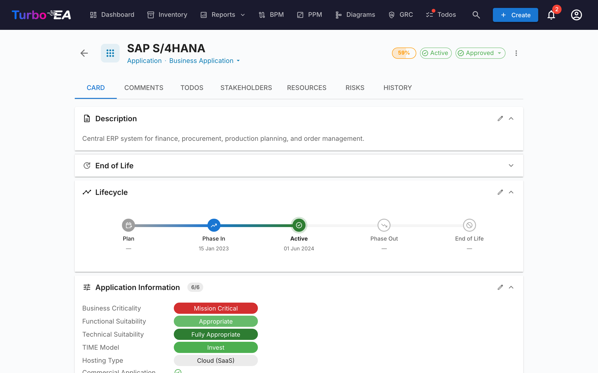

# Compliance

Fanen **Compliance** i [GRC-modulet](grc.md) på `/grc?tab=compliance` er et **dobbelt-kilde-register**: hvert fund er enten forfattet af en reviewer eller produceret af en AI-scanning mod en regulering, og begge typer fund lever og triagéres side om side i samme gitter.


!!! note
    Seks reguleringer leveres aktiveret som standard — **EU AI Act**, **GDPR**, **NIS2**, **DORA**, **SOC 2**, **ISO/IEC 27001**. Administratorer kan aktivere, deaktivere eller tilføje brugerdefinerede reguleringer (f.eks. HIPAA, interne politik­rammer) under [**Administration → Metamodel → Regulations**](../admin/metamodel.md#compliance-regulations).

## To måder hvorpå fund lander i registret

| Kilde | Hvem opretter det | Hvornår skal det bruges |
|-------|-------------------|-------------------------|
| **Manuelt** | En bruger med `compliance.manage` klikker på **+ New finding** i Compliance-gitteret | Audit-drevne forpligtelser, eksternt indrapporterede mangler, tredjeparts-attesteringer, alt du vil have sporet, som en LLM-scanning ikke ville bringe frem |
| **AI-scanning** (TurboLens) | En bruger med `compliance.manage` udløser en scanning fra Compliance-værktøjslinjen | Periodisk landskabsanalyse mod de aktiverede reguleringer |

De to veje deler samme datamodel og livscyklus. En scanning sletter eller overskriver aldrig et manuelt fund, og et manuelt oprettet fund kan promoveres til en risiko, propageres tilbage fra en risikolukning og masse-håndteres præcis som et AI-detekteret.

## Forfatte et fund manuelt

Klik på **+ New finding** i Compliance-værktøjslinjen for at åbne oprettelsesdialogen. Påkrævede felter:

| Felt | Beskrivelse |
|------|-------------|
| **Regulation** | Vælg en af de aktiverede reguleringer. Bestemmer artikel­vælgeren. |
| **Article** | Friform-identifikator (`Art. 6`, `§ 32`, `Annex II`, …). Normaliseres ved gem, så re-scanninger ikke dublerer rækken. |
| **Requirement** | Klausulen eller kontrollen, du sporer. |
| **Status** | `new`, `in_review`, `mitigated`, `verified`, `accepted`, `not_applicable`, `risk_tracked`. Standard er `new`. |
| **Severity** | `low`, `medium`, `high`, `critical`. |
| **Gap** | Beskrivelse af manglen eller observationen. |
| **Evidence** | Understøttende dokumentation, audit-noter, links. |
| **Remediation** | Foreslået afhjælpning. Bruges som udgangspunkt for afhjælpningsopgaven, hvis du senere promoverer fundet til en risiko. |
| **Linked card** | Valgfrit — afgræns fundet til en specifik Application, IT Component eller andet kort. |
| **Linked risk** | Valgfrit — forhåndslink til en eksisterende risiko, hvis en allerede sporer denne mangel. |

`compliance.manage` er påkrævet for at oprette, redigere, tilbagetrække eller masse-håndtere fund. `compliance.view` er nok til at læse registret og triagere fra fanen Compliance på kort-niveau.

## Køre en AI-scanning

!!! info "AI kræves til scanninger, ikke til manuelle fund"
    Manuelle fund virker i enhver deployment. AI-scanninger kræver en kommerciel AI-udbyder (Anthropic Claude, OpenAI, DeepSeek eller Google Gemini) konfigureret i [AI-indstillinger](../admin/ai.md).

Marker de reguleringer, der skal inkluderes, og klik på **Run compliance scan**. Scanningen kører i baggrunden som en [TurboLens-analysekørsel](turbolens.md#analysis-history):

1. **Indlæser kort** — det levende landskabs-øjebliksbillede hentes.
2. **Semantisk AI-detektion** — hvert korts navn, beskrivelse, leverandør og relaterede grænseflader tjekkes for AI- / ML-signaler (LLM'er, anbefalings­motorer, computer vision, svindel- eller kreditscoring, chatbots, prædiktiv analyse, anomalidetektion). Kort, der markeres her, bærer en `AI-detected`-chip i gitteret, selv når deres undertype ikke er `AI Agent` / `AI Model`.
3. **Pr.-regulerings-tjek** — den konfigurerede LLM kører reguleringens tjekliste mod de afgrænsede kort.

Siden viser en live fase-bevidst statuslinje. **Opdatering af siden afbryder ikke scanningen** — baggrundsopgaven fortsætter med at køre på serversiden, og UI'en gen-tilknytter poll-løkken ved montering via `/turbolens/security/active-runs`.

Scanningen erstatter kun fund for de reguleringer, du har afgrænset. Andre reguleringers fund forbliver intakte.

## Hvordan manuelle og AI-fund sameksisterer

Compliance-fund opdateres efter `(scope, card, regulation, normalised_article)`. Den nøgle holder de to kilder fra at kollidere:

- Et **manuelt fund**, som den næste AI-scanning også ville producere, afstemmes mod den eksisterende række — dine evidens-, reviewer-noter og status overlever; kun LLM'ens mangel- / afhjælpningstekst opdateres, hvis den er ændret.
- Et **AI-detekteret fund**, som det næste pass ikke længere rapporterer, **slettes ikke**. Det markeres `auto_resolved=true` og skjules som standard, så dets historik og enhver promoveret risiko-tilbagelink forbliver intakte.
- Brugerens **AI-bedømmelse** på et kort (`hasAiFeatures = true / false`) hænger ved. Hvis du bekræfter eller afviser LLM'ens AI-bærende klassifikation, tilsidesætter den beslutning detektoren ved efterfølgende scanninger — LLM-drift kan ikke stille gen-afgrænse et fund.

## Status­arbejdsproces

Fund har en hovedsti med 4 tilstande og 3 sidegrene, vist som en horisontal fasetidslinje i fund-skuffen:

```
new → in_review → mitigated → verified
                      ↘ accepted          (sidegren, kræver begrundelse)
                      ↘ not_applicable    (sidegren, scope-gennemgang)
                      ↘ risk_tracked      (sættes automatisk ved promote-to-Risk)
```

Overgange er begrænset til brugere med `compliance.manage`. Motoren håndhæver overgange på serversiden og afviser ulovlige flytninger med en klar fejl.

`risk_tracked` sættes aldrig manuelt — den skrives automatisk, når du klikker på **Create risk** på et fund, og ryddes af risiko-tilbagepropageringsmotoren, når den linkede risiko lukkes.

## Promovere et fund til risikoregistret

Hvert fund-kort (manuelt eller AI-detekteret) bærer en primær handling **Create risk**. Klikker du på den, åbnes den fælles opret-risiko-dialog med titel, beskrivelse, kategori, sandsynlighed, virkning og berørt kort **udfyldt fra fundet**. Du kan redigere ethvert felt, før du sender, tildele en **ejer** og vælge en **mål-løsningsdato**.

Ved indsendelse skifter fundets række til **Open risk R-000123**, så linket forbliver synligt. Handlingen er **idempotent** — at klikke igen navigerer til den eksisterende risiko i stedet for at oprette en dublet.

En engangs-afhjælpningsopgave spawnes automatisk på den nye risiko, frø-startet fra fundets **Remediation**-tekst — så mangelanalysen omdannes til handlingsorienteret, ejet arbejde på stedet. Se [Risikoregister → Promovering fra et TurboLens compliance-fund](risks.md#promoting-from-a-turbolens-compliance-finding) for den fulde livscyklus, og hvordan ejertildeling skaber en opfølgende Todo + klokke-notifikation.

Når den linkede risiko senere når `mitigated`, `monitoring`, `closed` eller `accepted` (eller slettes), flytter tilbagepropageringsmotoren automatisk hvert linket compliance-fund til den matchende tilstand (`mitigated`, `verified`, `accepted` eller tilbage til `in_review`). Den accept-begrundelse, der er registreret på risikoen, spejles ind i fundets gennemgangs-note, så audit-sporet forbliver konsistent.

## Gitter, filtrering og masse­handlinger

Compliance-gitteret afspejler [Inventar](inventory.md)-gitteret: filtersidepanel med kolonnesynligheds-til/fra, vedvarende sortering, fuldtekstsøgning og en detaljeskuffe pr. fund.

Når `compliance.manage` er givet, eksponerer gitteret filter-bevidst multi-valg. Marker afkrydsningsfeltet i sidehovedet for at vælge hver række, der matcher de aktive filtre, og brug derefter den fastgjorte værktøjslinje:

- **Edit decision** — batch-overgang af hvert valgt fund til en valgt tilstand (f.eks. markér en bred vifte af fund som `not_applicable` efter en scope-gennemgang). Ulovlige overgange vises pr. række i en delvis-succes-oversigt i stedet for at lade hele batchen fejle.
- **Delete** — fjern fund permanent (bruges til at rydde op i fund fra en regulering, du siden har deaktiveret).

Promovering til risiko forbliver en enkelt-rækkes-handling — masse-promovering tilbydes med vilje ikke for at bevare fanget kontekst pr. fund.

## Overordnede KPI'er

Compliance-fanen viser også en **samlet compliance-KPI** øverst på siden og en kompakt **per-regulering-heatmap**. Klik på en celle i heatmappet for at drille ned i gitteret afgrænset til den regulering × statusbøtte.

## Compliance på et enkelt kort



Kort, der er i scope for et fund, viser også en **Compliance**-fane på deres detaljeside (gated på `compliance.view`). Den viser hvert fund, der aktuelt er linket til kortet, med de samme Acknowledge / Accept / **Create risk** / **Open risk**-handlinger som GRC-visningen, så en Application-ejer kan triagere sine egne fund uden at forlade kortet. Den samme auto-skjul-regel gælder for **Risks**-fanen på Kortdetalje: begge faner vises kun, når kortet faktisk har linkede elementer, så kort uden GRC-aktivitet ikke bærer tomme faner.

## Demo-data

`SEED_DEMO=true` udfylder et håndkurateret sæt eksempel-compliance-fund (på tværs af alle seks indbyggede reguleringer og en blanding af livscyklus­tilstande) mod NexaTech-demo-kortene, så fanen er brugbar ud af kassen uden en AI-udbyder konfigureret.

## Tilladelser

| Tilladelse | Standardroller |
|------------|----------------|
| `compliance.view` | admin, bpm_admin, member, viewer |
| `compliance.manage` | admin |

`compliance.view` gater læseadgang til registret, fanen Compliance pr. kort og oversigt-KPI'erne. `compliance.manage` er nødvendig for at oprette eller redigere fund, ændre deres status, køre scanninger, masse-håndtere, promovere til en risiko eller slette et fund.
