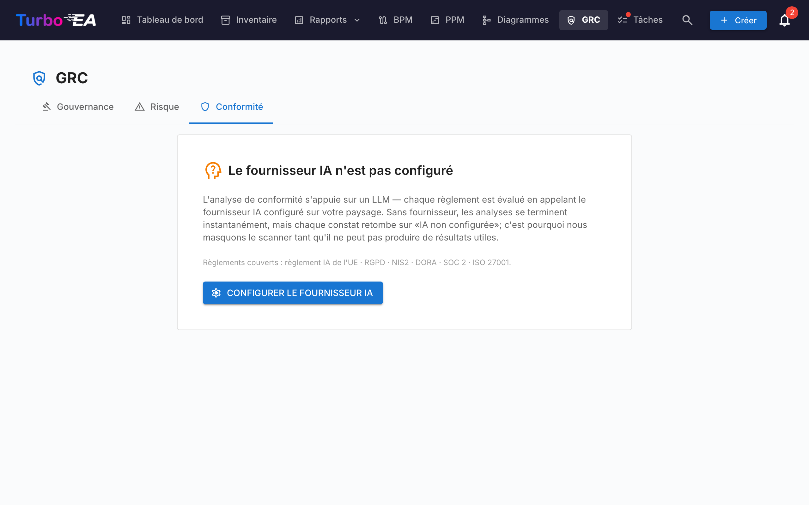

# Conformité

L'onglet **Conformité** du [module GRC](grc.md) à `/grc?tab=compliance` est un **registre à deux sources** : chaque constat a soit été saisi par un examinateur, soit produit par un scan IA contre une réglementation — et les deux types de constats vivent et sont triés côte à côte dans la même grille.




!!! note
    Six réglementations sont activées par défaut — **EU AI Act**, **RGPD**, **NIS2**, **DORA**, **SOC 2**, **ISO/CEI 27001**. Les administrateurs peuvent en activer, désactiver ou ajouter des réglementations personnalisées (p.ex. HIPAA, frameworks de politique interne) sous [**Administration → Métamodèle → Réglementations**](../admin/metamodel.md#compliance-regulations).

## Deux façons dont les constats atterrissent dans le registre

| Source | Qui le crée | Quand utiliser |
|--------|-------------|----------------|
| **Manuel** | Un utilisateur avec `compliance.manage` clique **+ Nouveau constat** dans la grille Conformité | Obligations issues d'audit, lacunes rapportées en externe, attestations de tiers, tout ce que vous voulez suivre qu'un scan LLM ne ferait pas surgir |
| **Scan IA** (TurboLens) | Un utilisateur avec `compliance.manage` déclenche un scan depuis la barre d'outils Conformité | Analyse périodique des lacunes du paysage contre les réglementations activées |

Les deux chemins partagent le même modèle de données et le même cycle de vie. Un scan ne supprime ni ne remplace jamais un constat manuel, et un constat saisi manuellement peut être promu en Risque, propagé en retour depuis la clôture d'un Risque et bulk-actionné exactement comme un constat détecté par IA.

## Saisir un constat manuellement

Cliquez **+ Nouveau constat** dans la barre d'outils Conformité pour ouvrir le dialogue de création. Champs obligatoires :

| Champ | Description |
|-------|-------------|
| **Réglementation** | Choisissez parmi les réglementations activées. Détermine le sélecteur d'article. |
| **Article** | Identifiant en texte libre (`Art. 6`, `§ 32`, `Annexe II`, …). Normalisé à la sauvegarde pour éviter qu'un re-scan duplique la ligne. |
| **Exigence** | La clause ou le contrôle que vous suivez. |
| **Statut** | `new`, `in_review`, `mitigated`, `verified`, `accepted`, `not_applicable`, `risk_tracked`. Défaut `new`. |
| **Sévérité** | `low`, `medium`, `high`, `critical`. |
| **Lacune** | Description de la lacune ou de l'observation. |
| **Preuve** | Preuves justificatives, notes d'audit, liens. |
| **Remédiation** | Remédiation suggérée. Utilisée comme amorce de la tâche de mitigation si le constat est ensuite promu en Risque. |
| **Carte liée** | Optionnel — restreindre le constat à une Application, un Composant IT ou une autre carte spécifique. |
| **Risque lié** | Optionnel — pré-lier à un Risque existant si l'un suit déjà cette lacune. |

`compliance.manage` est requis pour créer, modifier, retirer ou bulk-actionner des constats. `compliance.view` suffit pour lire le registre et trier depuis l'onglet Conformité d'une fiche.

## Exécuter un scan IA

!!! info "IA requise pour les scans, pas pour les constats manuels"
    Les constats manuels fonctionnent dans tout déploiement. Les scans IA nécessitent un fournisseur IA commercial (Anthropic Claude, OpenAI, DeepSeek ou Google Gemini) configuré dans les [Paramètres IA](../admin/ai.md).

Cochez les réglementations à inclure et cliquez **Lancer le scan de conformité**. Le scan tourne en arrière-plan comme une [analyse TurboLens](turbolens.md#analysis-history) :

1. **Chargement des fiches** — l'instantané live du paysage est récupéré.
2. **Détection IA sémantique** — le nom, la description, le fournisseur et les interfaces liées de chaque fiche sont vérifiés à la recherche de signaux IA / ML (LLMs, moteurs de recommandation, vision par ordinateur, scoring de fraude ou de crédit, chatbots, analytique prédictive, détection d'anomalies). Les fiches flaggées ici portent une puce **IA détectée** dans la grille même si leur sous-type n'est pas `AI Agent` / `AI Model`.
3. **Vérification par réglementation** — le LLM configuré exécute la checklist de la réglementation contre les fiches en périmètre.

La page affiche une barre de progression live consciente des phases. **Rafraîchir la page n'interrompt pas le scan** — la tâche d'arrière-plan continue côté serveur et l'UI rattache la boucle de poll au montage via `/turbolens/security/active-runs`.

Le scan ne remplace que les constats des réglementations que vous avez ciblées. Les constats d'autres réglementations restent intacts.

## Comment constats manuels et IA cohabitent

Les constats de conformité sont upserted par `(scope, card, regulation, normalised_article)`. Cette clé évite les collisions entre les deux sources :

- Un **constat manuel** que le prochain scan IA produirait aussi est réconcilié avec la ligne existante — vos preuves, notes de revue et statut survivent ; seul le texte LLM lacune / remédiation est rafraîchi s'il a changé.
- Un **constat détecté par IA** que la prochaine passe ne signale plus n'est **pas supprimé**. Il est marqué `auto_resolved=true` et masqué par défaut, de sorte que son historique et le lien retour vers un Risque promu restent intacts.
- Le **verdict IA de l'utilisateur** sur une fiche (`hasAiFeatures = true / false`) persiste également. Si vous confirmez ou rejetez la classification IA-bearing du LLM, cette décision écrase le détecteur sur les scans suivants — la dérive du LLM ne peut pas re-scoper silencieusement un constat.

## Workflow de statut

Les constats ont un chemin principal à 4 états avec 3 branches secondaires, rendu comme une chronologie horizontale de phases dans le tiroir de détail :

```
new → in_review → mitigated → verified
                      ↘ accepted          (branche secondaire, justification requise)
                      ↘ not_applicable    (branche secondaire, revue de périmètre)
                      ↘ risk_tracked      (positionné automatiquement lors d'une promotion en Risque)
```

Les transitions sont restreintes aux utilisateurs ayant `compliance.manage`. Le moteur impose les transitions côté serveur et rejette les mouvements illégaux avec une erreur claire.

`risk_tracked` n'est jamais positionné à la main — il est écrit automatiquement quand vous cliquez **Créer un risque** sur un constat, et nettoyé par le moteur de rétro-propagation du Risque quand le Risque lié se clôt.

## Promouvoir un constat vers le Registre des risques

Chaque carte de constat (manuel ou détecté par IA) porte une action primaire **Créer un risque**. Y cliquer ouvre le dialogue partagé de création de risque avec le titre, la description, la catégorie, la probabilité, l'impact et la fiche affectée **préremplis depuis le constat**. Vous pouvez modifier tout champ avant de soumettre, assigner un **propriétaire** et choisir une **date cible de résolution**.

À la soumission, la ligne du constat bascule sur **Ouvrir le risque R-000123** pour que le lien reste visible. L'action est **idempotente** — un nouveau clic navigue vers le risque existant au lieu de créer un doublon.

Une tâche de mitigation one-shot est automatiquement spawned sur le nouveau Risque, amorcée depuis le texte de **Remédiation** du constat — l'analyse de lacune se transforme ainsi en travail actionnable et possédé sur-le-champ. Voir [Registre des risques → Promouvoir depuis un constat de conformité TurboLens](risks.md#promoting-from-a-turbolens-compliance-finding) pour le cycle de vie complet et comment l'assignation d'un propriétaire crée un Todo + notification de cloche de suivi.

Lorsque le Risque lié atteint plus tard `mitigated`, `monitoring`, `closed` ou `accepted` (ou est supprimé), le moteur de rétro-propagation déplace automatiquement chaque constat de conformité lié vers l'état correspondant (`mitigated`, `verified`, `accepted` ou retour à `in_review`). La justification d'acceptation capturée sur le Risque est mirroirée dans la note de revue du constat pour garder la piste d'audit cohérente.

## Grille, filtrage et actions en lot

La grille Conformité reflète celle de l'[Inventaire](inventory.md) : barre latérale de filtres avec bascules de visibilité de colonnes, tri persisté, recherche plein texte et un tiroir de détail par constat.

Quand `compliance.manage` est accordé, la grille expose la multi-sélection consciente des filtres. Cochez la case du header pour sélectionner toutes les lignes correspondant aux filtres actifs, puis utilisez la barre d'outils épinglée :

- **Modifier la décision** — transition par lot de chaque constat sélectionné vers un état choisi (p.ex. marquer un lot de constats comme `not_applicable` après une revue de périmètre). Les transitions illégales sont surfacées par-ligne dans un résumé de succès partiel au lieu de faire échouer tout le lot.
- **Supprimer** — supprimer définitivement des constats (utilisé pour nettoyer les constats d'une réglementation depuis désactivée).

La promotion en Risque reste une action sur ligne unique — la promotion en lot n'est volontairement pas offerte pour préserver la capture de contexte par constat.

## KPIs de la vue d'ensemble

L'onglet Conformité affiche aussi un **KPI global de conformité** en haut de page et une **heatmap par réglementation** compacte. Cliquez sur n'importe quelle cellule de la heatmap pour explorer la grille périmétrée à cette combinaison réglementation × statut.

## Conformité sur une seule fiche


Les fiches dans le périmètre de n'importe quel constat exposent aussi un onglet **Conformité** sur leur page de détail (gouverné par `compliance.view`). Il liste chaque constat actuellement lié à la fiche avec les mêmes actions Acquitter / Accepter / **Créer un risque** / **Ouvrir le risque** que la vue GRC — de sorte qu'un Application Owner peut trier ses propres constats sans quitter la fiche. La même règle d'auto-masquage s'applique à l'onglet **Risques** dans le détail de la fiche : les deux onglets n'apparaissent que lorsque la fiche a effectivement des éléments liés, de sorte que les fiches sans activité GRC ne traînent pas d'onglets vides.

## Données de démo

`SEED_DEMO=true` peuple un jeu choisi à la main de constats de conformité d'exemple (sur les six réglementations intégrées et un mix d'états de cycle de vie) contre les fiches de démo NexaTech, de sorte que l'onglet est utilisable d'emblée sans fournisseur IA configuré.

## Permissions

| Permission | Rôles par défaut |
|------------|------------------|
| `compliance.view` | admin, bpm_admin, member, viewer |
| `compliance.manage` | admin |

`compliance.view` régit l'accès en lecture au registre, à l'onglet Conformité par fiche et aux KPIs de la vue d'ensemble. `compliance.manage` est nécessaire pour créer ou modifier des constats, changer leur statut, lancer des scans, bulk-actionner, promouvoir vers un Risque ou supprimer un constat.
