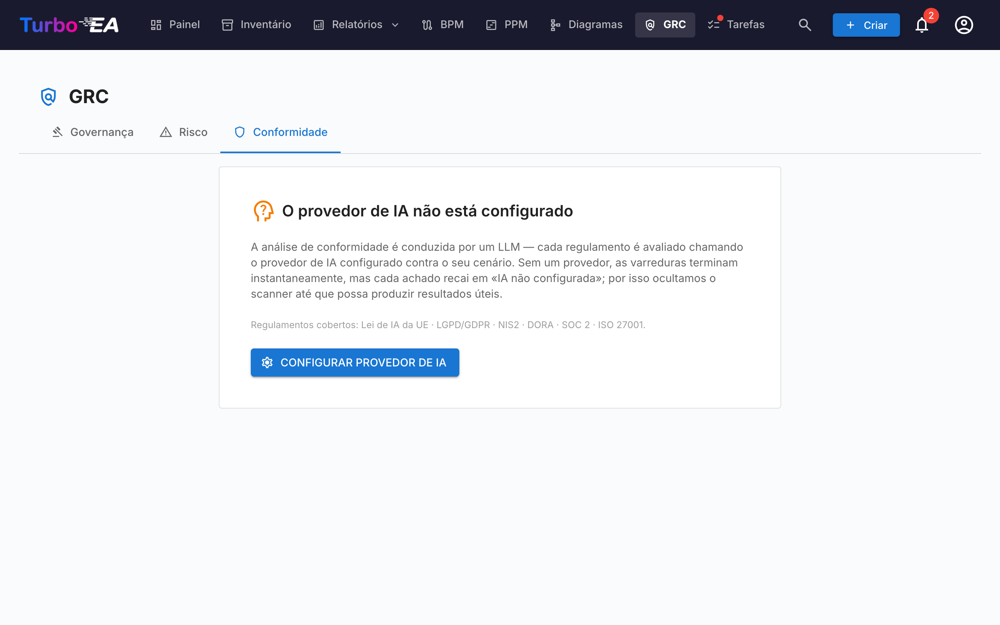

# Conformidade

A aba **Conformidade** do [módulo GRC](grc.md) em `/grc?tab=compliance` é um **registro de fonte dupla**: cada descoberta foi escrita por um revisor ou produzida por uma varredura de IA contra uma regulamentação — e ambos os tipos de descoberta convivem e são triados lado a lado na mesma grade.




!!! note
    Seis regulamentações vêm habilitadas por padrão — **EU AI Act**, **LGPD/GDPR**, **NIS2**, **DORA**, **SOC 2**, **ISO/IEC 27001**. Administradores podem habilitar, desabilitar ou adicionar regulamentações personalizadas (p.ex. HIPAA, frameworks de política interna) em [**Administração → Metamodelo → Regulamentações**](../admin/metamodel.md#compliance-regulations).

## Duas formas como descobertas chegam ao registro

| Fonte | Quem cria | Quando usar |
|-------|-----------|-------------|
| **Manual** | Um usuário com `compliance.manage` clica em **+ Nova descoberta** na grade Conformidade | Obrigações decorrentes de auditoria, lacunas reportadas externamente, atestações de terceiros, qualquer coisa que se queira rastrear que uma varredura LLM não traria à tona |
| **Varredura IA** (TurboLens) | Um usuário com `compliance.manage` dispara uma varredura a partir da barra de ferramentas Conformidade | Análise periódica de lacunas do paisagem contra as regulamentações habilitadas |

Os dois caminhos compartilham o mesmo modelo de dados e ciclo de vida. Uma varredura nunca apaga ou sobrescreve uma descoberta manual, e uma descoberta inserida manualmente pode ser promovida a um Risco, propagada de volta a partir do fechamento de um Risco e bulk-actionada exatamente como uma detectada por IA.

## Criar uma descoberta manualmente

Clique em **+ Nova descoberta** na barra de ferramentas Conformidade para abrir o diálogo de criação. Campos obrigatórios:

| Campo | Descrição |
|-------|-----------|
| **Regulamentação** | Escolha uma das regulamentações habilitadas. Determina o seletor de artigo. |
| **Artigo** | Identificador em texto livre (`Art. 6`, `§ 32`, `Anexo II`, …). Normalizado ao salvar para que re-varreduras não dupliquem a linha. |
| **Requisito** | A cláusula ou controle que está rastreando. |
| **Status** | `new`, `in_review`, `mitigated`, `verified`, `accepted`, `not_applicable`, `risk_tracked`. Padrão `new`. |
| **Severidade** | `low`, `medium`, `high`, `critical`. |
| **Lacuna** | Descrição da lacuna ou observação. |
| **Evidência** | Evidência de respaldo, notas de auditoria, links. |
| **Remediação** | Remediação sugerida. Usada como semente para a tarefa de mitigação se depois promover a descoberta a um Risco. |
| **Card vinculado** | Opcional — restringir a descoberta a uma Aplicação, Componente IT ou outro card específico. |
| **Risco vinculado** | Opcional — pré-vincular a um Risco existente se algum já rastreia essa lacuna. |

`compliance.manage` é requerido para criar, editar, retirar ou bulk-actionar descobertas. `compliance.view` basta para ler o registro e triagiar a partir da aba Conformidade no nível do card.

### Editar uma descoberta

Abra uma descoberta — a partir da grade de Conformidade ou da aba **Conformidade** de um card — e clique em **Editar** no painel para alterar, após a criação, o seu **status** de conformidade (por exemplo Conforme → Parcial), severidade, requisito, lacuna, evidência, remediação, artigo ou card vinculado. Editar o conteúdo não altera a decisão de ciclo de vida da descoberta; use a linha do tempo do ciclo de vida para isso. Requer `compliance.manage`.

## Executar uma varredura IA

!!! info "IA requerida para varreduras, não para descobertas manuais"
    Descobertas manuais funcionam em qualquer implantação. Varreduras IA requerem um provedor de IA comercial (Anthropic Claude, OpenAI, DeepSeek ou Google Gemini) configurado nas [Configurações de IA](../admin/ai.md).

Marque as regulamentações a incluir e clique em **Executar varredura de conformidade**. A varredura roda em segundo plano como uma [execução de análise TurboLens](turbolens.md#analysis-history):

1. **Carregando cards** — o snapshot vivo do paisagem é puxado.
2. **Detecção IA semântica** — nome, descrição, fornecedor e interfaces vinculadas de cada card são verificados por sinais de IA / ML (LLMs, motores de recomendação, visão computacional, scoring de fraude ou crédito, chatbots, analítica preditiva, detecção de anomalias). Cards marcados aqui levam um chip **IA-detectada** na grade mesmo quando seu subtipo não é `AI Agent` / `AI Model`.
3. **Verificação por regulamentação** — o LLM configurado executa a checklist da regulamentação contra os cards no escopo.

A página renderiza uma barra de progresso ao vivo consciente de fases. **Atualizar a página não interrompe a varredura** — a tarefa de fundo continua rodando do lado do servidor e a UI re-conecta o loop de polling no mount via `/turbolens/security/active-runs`.

A varredura só substitui descobertas para as regulamentações que você escopou. Descobertas de outras regulamentações permanecem intactas.

## Como descobertas manuais e IA coexistem

Descobertas de conformidade são upserted por `(scope, card, regulation, normalised_article)`. Essa chave evita colisões entre as duas fontes:

- Uma **descoberta manual** que a próxima varredura IA também produziria é reconciliada com a linha existente — sua evidência, notas de revisão e status sobrevivem; apenas o texto LLM de lacuna / remediação é refrescado se mudou.
- Uma **descoberta detectada por IA** que a próxima passagem não reporta mais **não é deletada**. É marcada como `auto_resolved=true` e escondida por padrão, de modo que seu histórico e qualquer link de volta a um Risco promovido permaneçam intactos.
- O **veredicto IA do usuário** sobre um card (`hasAiFeatures = true / false`) também persiste. Se confirmar ou rejeitar a classificação IA-bearing do LLM, essa decisão sobrescreve o detector em varreduras subsequentes — a deriva do LLM não pode silenciosamente re-escopear uma descoberta.

## Fluxo de status

Descobertas têm um caminho principal de 4 estados com 3 ramos laterais, renderizado como uma linha do tempo horizontal de fases no painel de detalhe:

```
new → in_review → mitigated → verified
                      ↘ accepted          (ramo lateral, justificativa requerida)
                      ↘ not_applicable    (ramo lateral, revisão de escopo)
                      ↘ risk_tracked      (definido automaticamente na promoção a Risco)
```

Transições são restritas a usuários com `compliance.manage`. O motor impõe as transições do lado servidor e rejeita movimentos ilegais com um erro claro.

`risk_tracked` nunca é setado à mão — é escrito automaticamente quando você clica em **Criar risco** numa descoberta, e limpo pelo motor de retro-propagação do Risco quando o Risco vinculado fecha.

## Promover uma descoberta ao Registro de Riscos

Cada card de descoberta (manual ou detectada por IA) carrega uma ação primária **Criar risco**. Clicar abre o diálogo compartilhado de criação de risco com título, descrição, categoria, probabilidade, impacto e card afetado **pré-preenchidos a partir da descoberta**. Você pode editar qualquer campo antes de enviar, atribuir um **proprietário** e escolher uma **data alvo de resolução**.

Ao enviar, a linha da descoberta muda para **Abrir risco R-000123** para que o link permaneça visível. A ação é **idempotente** — um novo clique navega ao risco existente em vez de criar um duplicado.

Uma tarefa de mitigação one-shot é automaticamente spawnada no novo Risco, semeada a partir do texto **Remediação** da descoberta — a análise de lacuna se transforma assim diretamente em trabalho acionável e com dono. Veja [Registro de Riscos → Promoção a partir de uma descoberta de conformidade TurboLens](risks.md#promoting-from-a-turbolens-compliance-finding) para o ciclo de vida completo e como a atribuição de proprietário cria um Todo + notificação de sino de acompanhamento.

Quando o Risco vinculado depois alcança `mitigated`, `monitoring`, `closed` ou `accepted` (ou é deletado), o motor de retro-propagação move automaticamente cada descoberta de conformidade vinculada ao estado correspondente (`mitigated`, `verified`, `accepted` ou de volta a `in_review`). A justificativa de aceitação capturada no Risco é espelhada na nota de revisão da descoberta para manter a trilha de auditoria consistente.

## Grade, filtragem e ações em lote

A grade Conformidade espelha a do [Inventário](inventory.md): barra lateral de filtros com chaves de visibilidade de colunas, ordenação persistida, busca de texto completo e um painel de detalhe por descoberta.

Quando `compliance.manage` é concedido, a grade expõe seleção múltipla consciente de filtros. Marque a caixa do cabeçalho para selecionar todas as linhas que correspondem aos filtros ativos e então use a barra de ferramentas fixa:

- **Editar decisão** — transição em lote de cada descoberta selecionada para um estado escolhido (p.ex. marcar um grupo de descobertas como `not_applicable` após uma revisão de escopo). Transições ilegais são superficiadas por linha em um resumo de sucesso parcial em vez de fazer o lote inteiro falhar.
- **Excluir** — remover descobertas permanentemente (usado para limpar descobertas de uma regulamentação que você desabilitou desde então).

A promoção a Risco continua sendo uma ação de linha única — a promoção em lote intencionalmente não é oferecida para preservar a captura de contexto por descoberta.

## KPIs da visão geral

A aba Conformidade também mostra um **KPI geral de conformidade** no topo da página e uma **heatmap por regulamentação** compacta. Clique em qualquer célula da heatmap para drillar na grade escopada a essa combinação regulamentação × status.

## Conformidade num único card


Cards no escopo de qualquer descoberta também expõem uma aba **Conformidade** na sua página de detalhe (governada por `compliance.view`). Lista cada descoberta atualmente vinculada ao card com as mesmas ações Reconhecer / Aceitar / **Criar risco** / **Abrir risco** da visão GRC — de modo que um Application Owner possa triagiar suas próprias descobertas sem deixar o card. A mesma regra de auto-ocultação se aplica à aba **Riscos** no detalhe do card: ambas as abas só aparecem quando o card realmente tem itens vinculados, de modo que cards sem atividade GRC não arrastam abas vazias.

## Dados de demo

`SEED_DEMO=true` povoa um conjunto curado à mão de descobertas de conformidade de exemplo (através de todas as seis regulamentações integradas e um mix de estados de ciclo de vida) contra os cards de demo NexaTech, de modo que a aba seja utilizável de imediato sem um provedor IA configurado.

## Permissões

| Permissão | Papéis padrão |
|-----------|----------------|
| `compliance.view` | admin, bpm_admin, member, viewer |
| `compliance.manage` | admin |

`compliance.view` rege o acesso de leitura ao registro, à aba Conformidade por card e aos KPIs da visão geral. `compliance.manage` é necessário para criar ou editar descobertas, mudar seu status, executar varreduras, bulk-actionar, promover a um Risco ou deletar uma descoberta.
