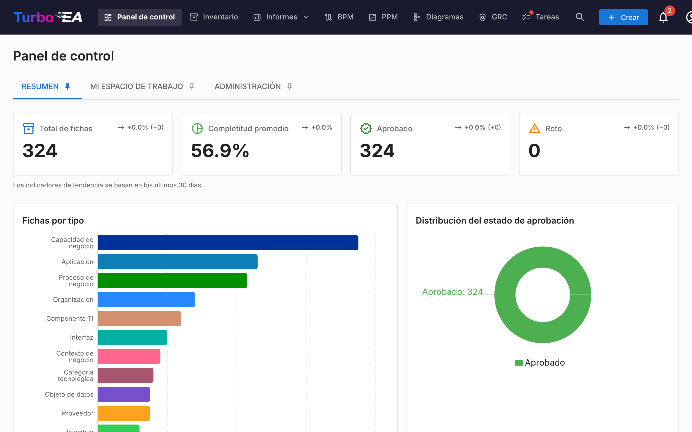
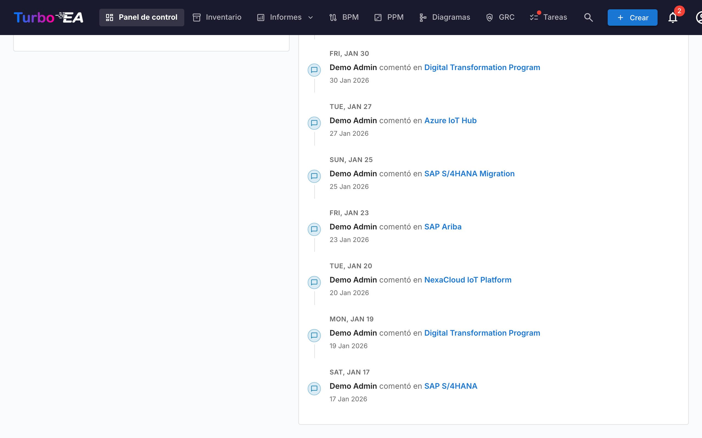

# Panel de Control

El Panel de Control es la primera pantalla que ve después de iniciar sesión. Proporciona una **visión rápida** del estado general de toda la arquitectura empresarial.

## Barra de Navegación Superior

En la parte superior de la pantalla encontrará la **barra de navegación principal** con los siguientes elementos:

- **Turbo EA** (logo): Haga clic para volver al Panel de Control desde cualquier sección
- **Panel de control**: Vista general del estado de la arquitectura
- **Inventario**: Listado completo de todas las fichas
- **Informes**: Informes visuales y analíticos
- **BPM**: Gestión de Procesos de Negocio (si está habilitado)
- **Diagramas**: Editor visual de diagramas de arquitectura
- **Entrega EA**: Gestión de iniciativas de arquitectura
- **Tareas**: Tareas pendientes y encuestas asignadas
- **Buscar fichas**: Barra de búsqueda rápida con autocompletado
- **+ Crear**: Botón para crear nuevas fichas rápidamente
- **Campana de notificaciones**: Alertas del sistema y [notificaciones](notifications.es.md)
- **Icono de perfil**: Selección de idioma, cambio de tema, preferencias de notificaciones y acceso a administración

## Tarjetas de Resumen

La sección principal del Panel de Control muestra **tarjetas de resumen** que indican:

- **Número total de fichas**: Cantidad total de componentes registrados en la plataforma
- **Distribución por tipo**: Cuántos elementos de cada tipo existen (Aplicaciones, Organizaciones, Objetivos, Capacidades, etc.)
- **Vista general de estado**: Visualizaciones rápidas del estado general

Al hacer clic en una tarjeta de tipo, se navega al [Inventario](inventory.es.md) pre-filtrado por ese tipo.

## Gráficos y Estadísticas

En la parte inferior del Panel de Control encontrará:

- **Gráfico de distribución por tipo**: Muestra la proporción de cada tipo de ficha en su panorama
- **Estado de aprobación**: Indica cuántas fichas están aprobadas, pendientes, rotas o rechazadas
- **Calidad de datos**: Porcentaje general de completitud de la información en todas las fichas
- **Actividad reciente**: Un historial de los últimos cambios — quién editó qué y cuándo
