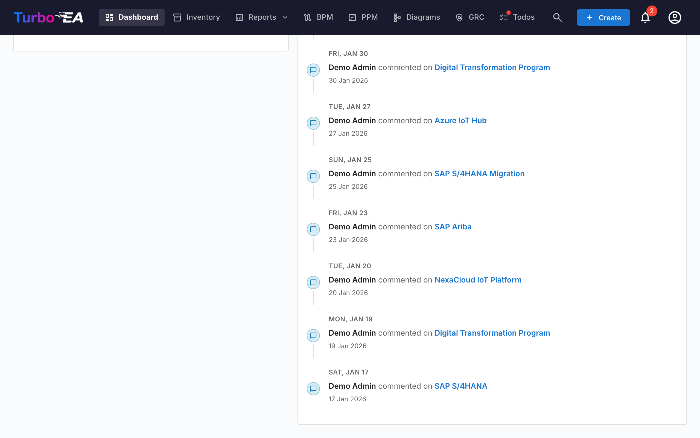

# Dashboard

La Dashboard è la prima schermata visualizzata dopo il login. Fornisce una **panoramica rapida** dell'intero stato dell'enterprise architecture.

## Barra di navigazione superiore

Nella parte superiore dello schermo si trova la **barra di navigazione principale** con i seguenti elementi:

- **Turbo EA** (logo): Cliccate per tornare alla Dashboard da qualsiasi sezione
- **Dashboard**: Panoramica dello stato dell'architettura
- **Inventario**: Elenco completo di tutte le card
- **Report**: Report visivi e analitici
- **BPM**: Business Process Management (se abilitato)
- **Diagrammi**: Editor visivo di diagrammi architetturali
- **EA Delivery**: Gestione delle iniziative architetturali
- **Todo**: Attività in sospeso e sondaggi assegnati
- **Cerca card**: Barra di ricerca rapida con autocompletamento
- **+ Crea**: Pulsante per creare rapidamente nuove card
- **Campanella delle notifiche**: Avvisi di sistema e [notifiche](notifications.md)
- **Icona profilo**: Selezione della lingua, cambio tema, preferenze di notifica e accesso all'amministrazione

## Schede riepilogative

La sezione principale della Dashboard mostra **schede riepilogative** che indicano:

- **Numero totale di card**: Conteggio di tutti i componenti registrati nella piattaforma
- **Distribuzione per tipo**: Quanti elementi di ciascun tipo esistono (Application, Organization, Objective, Capability, ecc.)
- **Panoramica degli stati**: Visualizzazioni rapide dello stato generale

Cliccando su una scheda di tipo si naviga all'[Inventario](inventory.md) pre-filtrato per quel tipo.

## Grafici e statistiche

Nella sezione inferiore della Dashboard troverete:

- **Grafico di distribuzione per tipo**: Mostra la proporzione di ciascun tipo di card nel vostro panorama
- **Stato di approvazione**: Indica quante card sono approvate, in attesa, interrotte o rifiutate
- **Qualità dei dati**: Percentuale complessiva di completezza delle informazioni su tutte le card
- **Attività recente**: Un feed delle ultime modifiche — chi ha modificato cosa e quando
