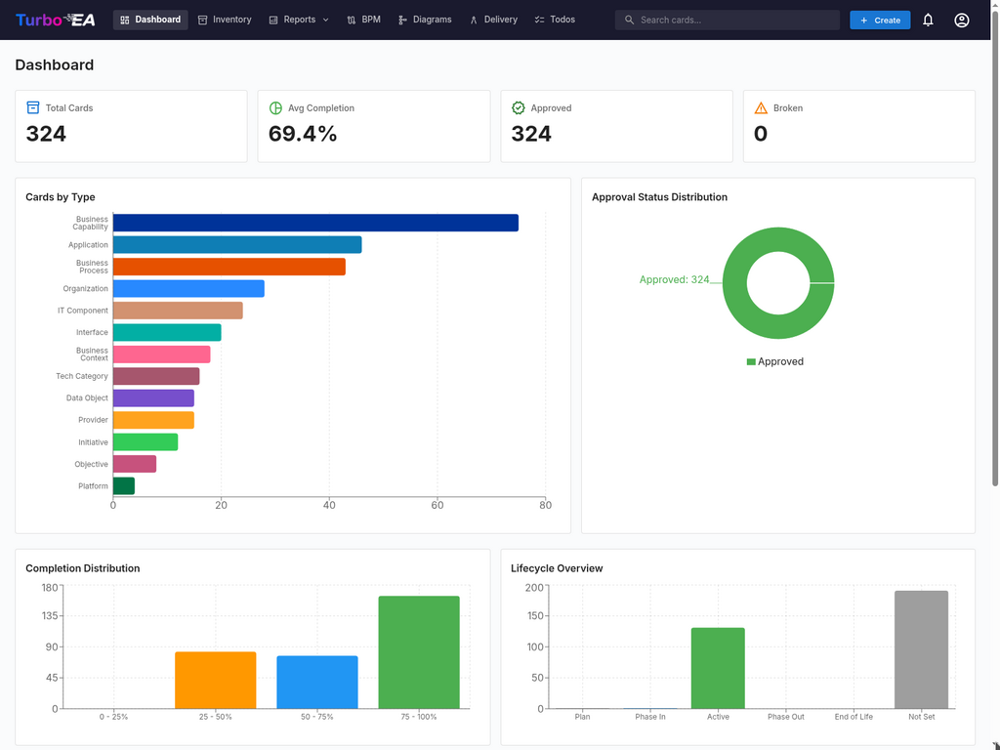
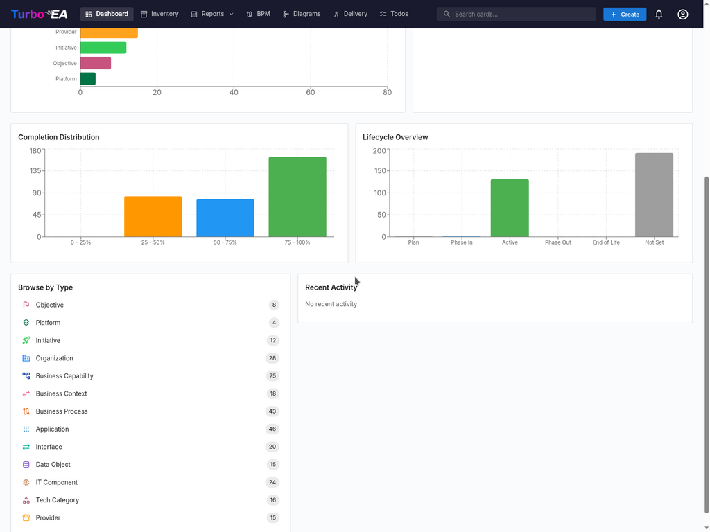

# Панель управления

Панель управления — это первый экран, который вы видите после входа в систему. Она предоставляет **краткий обзор** состояния всей корпоративной архитектуры.

## Верхняя панель навигации

В верхней части экрана расположена **основная панель навигации** со следующими элементами:

- **Turbo EA** (логотип): Нажмите, чтобы вернуться на панель управления из любого раздела
- **Панель управления**: Обзор состояния архитектуры
- **Реестр**: Полный перечень всех карточек
- **Отчёты**: Визуальные и аналитические отчёты
- **BPM**: Управление бизнес-процессами (если включено)
- **Диаграммы**: Редактор визуальных архитектурных диаграмм
- **Поставка EA**: Управление архитектурными инициативами
- **Задачи**: Ожидающие задачи и назначенные опросы
- **Поиск карточек**: Панель быстрого поиска с автодополнением
- **+ Создать**: Кнопка быстрого создания новых карточек
- **Колокольчик уведомлений**: Системные оповещения и [уведомления](notifications.md)
- **Значок профиля**: Выбор языка, переключение темы, настройки уведомлений и доступ к администрированию

## Сводные карточки

Основной раздел панели управления отображает **сводные карточки**, которые показывают:

- **Общее количество карточек**: Количество всех компонентов, зарегистрированных на платформе
- **Распределение по типам**: Сколько элементов каждого типа существует (Приложения, Организации, Цели, Бизнес-способности и т.д.)
- **Обзор статусов**: Быстрая визуализация общего состояния

Нажатие на карточку типа переводит в [Реестр](inventory.md) с предустановленным фильтром по данному типу.

## Диаграммы и статистика

В нижней части панели управления вы найдёте:

- **Диаграмма распределения по типам**: Показывает долю каждого типа карточек в вашем ландшафте
- **Статус утверждения**: Показывает, сколько карточек утверждено, ожидает утверждения, требует повторной проверки или отклонено
- **Качество данных**: Общий процент полноты информации по всем карточкам
- **Последняя активность**: Лента последних изменений — кто что редактировал и когда
