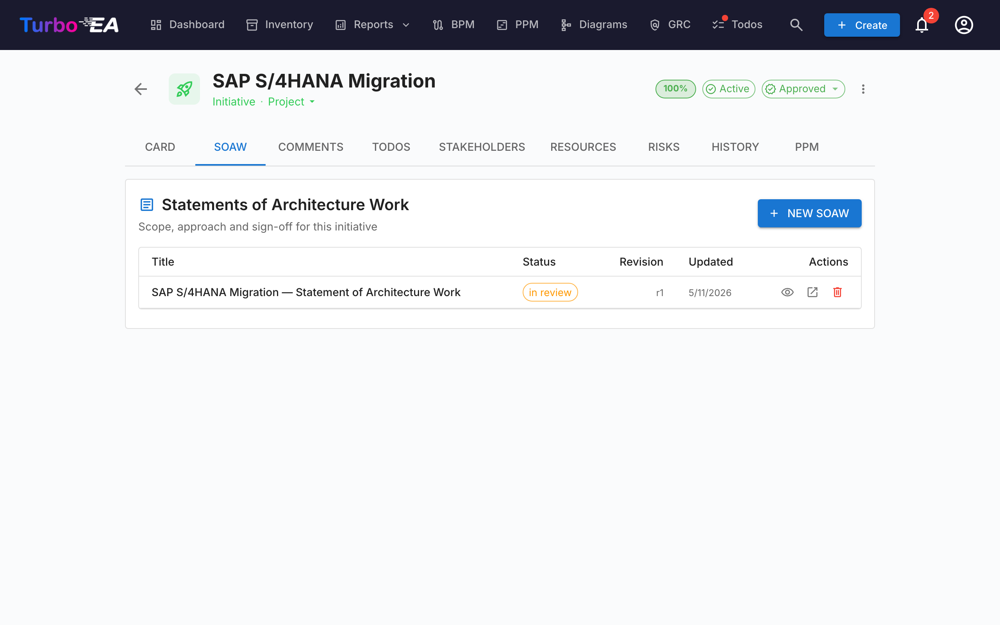
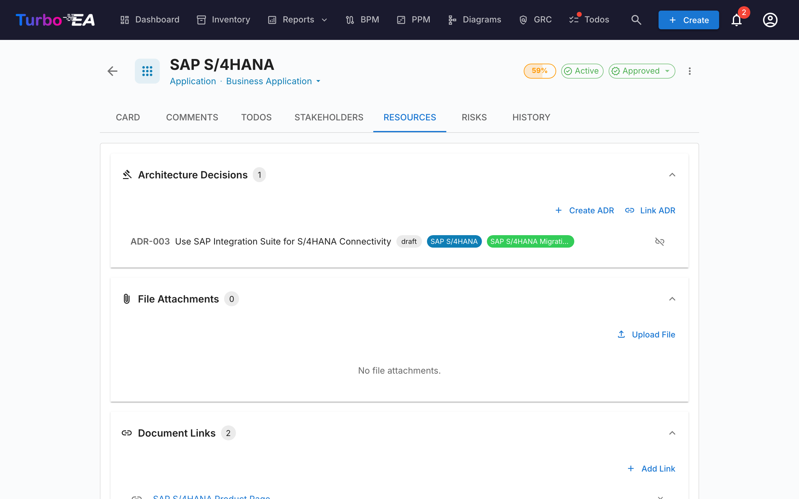

# EA Delivery

**EA Delivery**-modulet håndterer **arkitekturinitiativer og deres artefakter** — diagrammer, Statements of Architecture Work (SoAW) og Architecture Decision Records (ADR). Det giver et samlet overblik over alle igangværende arkitekturprojekter og deres leverancer.

Når PPM er aktiveret — den typiske konfiguration — lever EA Delivery **inde i PPM-modulet**: åbn **PPM** i topnavigationen, og skift til fanen **EA Delivery** (`/ppm?tab=ea-delivery`). Når PPM er deaktiveret, vises **EA Delivery** som et dedikeret topniveau-nav-element, der linker til `/reports/ea-delivery`. Den ældre URL `/ea-delivery` virker fortsat som en omdirigering uanset, så eksisterende bogmærker stadig fungerer.

## Initiativ-arbejdsområde

EA Delivery er et **to-rude-arbejdsområde** (ingen interne faner):

- **Venstre sidepanel** — et indrykket, filterbart træ over hvert initiativ (med deres underordnede initiativer indlejret nedenfor). Søg efter navn, filtrer efter Status / Subtype / Artefacts, eller fastgør favoritter.
- **Højre arbejdsområde** — leverancerne, underordnede initiativer og detaljer for det initiativ, du vælger til venstre. Vælg en anden række, og arbejdsområdet gengives.

Valget er en del af URL'en (`?initiative=<id>`), så du kan deep-linke til et specifikt initiativ eller opdatere siden uden at miste din placering.

En enkelt primær knap **+ New artefact ▾** øverst på siden lader dig oprette en ny SoAW, et diagram eller en ADR — på forhånd linket til det valgte initiativ (eller ulinket, hvis du endnu ikke har et valg). Tomme leverancegrupper inde i arbejdsområdet eksponerer også en **+ Add …**-knap, så oprettelse altid er ét klik væk.

Hver trærække viser:

| Element | Betydning |
|---------|-----------|
| **Navn** | Initiativnavn |
| **Tæller-chip** | Samlet antal linkede artefakter (SoAW + diagrammer + ADR'er) |
| **Status-prik** | Farvet prik for On Track / At Risk / Off Track / On Hold / Completed |
| **Stjerne** | Favorit-til/fra — favoritter bobler til toppen |

Den syntetiske række **Unlinked artefacts** øverst i træet vises, når der er SoAW'er, diagrammer eller ADR'er, som endnu ikke er linket til et initiativ. Åbn den for at gen-linke dem.

## Statement of Architecture Work (SoAW)

En **Statement of Architecture Work (SoAW)** er et formelt dokument defineret af [TOGAF-standarden](https://pubs.opengroup.org/togaf-standard/) (The Open Group Architecture Framework). Den fastlægger omfanget, tilgangen, leverancerne og styringen for et arkitekturengagement. I TOGAF produceres SoAW'en under **Preliminary Phase** og **Phase A (Architecture Vision)** og fungerer som en aftale mellem arkitekturteamet og dets interessenter.

Turbo EA tilbyder en indbygget SoAW-editor med TOGAF-tilpassede sektions­skabeloner, rich text-redigering og eksportmuligheder — så du kan forfatte og administrere SoAW-dokumenter direkte sammen med dine arkitekturdata.

### Oprettelse af en SoAW

1. Vælg initiativet til venstre (valgfrit — du kan også oprette en ulinket SoAW).
2. Klik på **+ New artefact ▾** øverst på siden (eller knappen **+ Add** inde i sektionen *Deliverables*), og vælg **New Statement of Architecture Work**.
3. Indtast dokumentets titel.
4. Editoren åbnes med **forudbyggede sektions­skabeloner** baseret på TOGAF-standarden.

### SoAW-editoren

Editoren tilbyder:

- **Rich text-redigering** — Komplet formateringsværktøjslinje (overskrifter, fed, kursiv, lister, links) drevet af TipTap-editoren
- **Sektions­skabeloner** — Foruddefinerede sektioner, der følger TOGAF-standarder (f.eks. Problembeskrivelse, Mål, Tilgang, Interessenter, Begrænsninger, Arbejdsplan)
- **Indlejret redigerbare tabeller** — Tilføj og rediger tabeller inden for en sektion
- **Status­arbejdsproces** — Dokumenter bevæger sig gennem definerede stadier:

| Status | Betydning |
|--------|-----------|
| **Draft** | Under skrivning, endnu ikke klar til gennemgang |
| **In Review** | Indsendt til interessent­gennemgang |
| **Approved** | Gennemgået og accepteret |
| **Signed** | Formelt underskrevet |

### Underskrifts­arbejdsproces

Når en SoAW er godkendt, kan du anmode om underskrifter fra interessenter. Klik på **Request Signatures**, og brug derefter søgefeltet til at finde og tilføje underskrivere efter navn eller e-mail. Systemet sporer, hvem der har underskrevet, og sender notifikationer til afventende underskrivere.

### Preview og eksport

- **Preview-tilstand** — Skrivebeskyttet visning af det komplette SoAW-dokument
- **DOCX-eksport** — Download SoAW'en som et formateret Word-dokument til offline-deling eller udskrift

### SoAW-fane på initiativkort

Initiativer eksponerer også en dedikeret **SoAW**-fane direkte på deres kortdetaljeside. Fanen viser hver SoAW linket til det initiativ (titel, statuschip, revisionsnummer, sidst-ændret-dato) med en **+ New SoAW**-knap, der på forhånd vælger det aktuelle initiativ — så du kan forfatte eller hoppe til en SoAW uden at forlade det kort, du arbejder på. Oprettelse genbruger den samme dialog som EA Delivery-siden, og det nye dokument vises begge steder. Synligheden af fanen følger de almindelige kort-tilladelsesregler.

## Architecture Decision Records (ADR)

En **Architecture Decision Record (ADR)** fanger en vigtig arkitekturbeslutning sammen med dens kontekst, konsekvenser og overvejede alternativer. EA Delivery-arbejdsområdet viser ADR'er, der er **linket til det valgte initiativ** inline, under leverancesektionen *Architecture Decisions*, så du kan læse og åbne dem uden at forlade initiativvisningen. Brug split-knappen **+ New artefact ▾** (eller knappen **+ Add** på sektionen) til at oprette en ny ADR på forhånd linket til det valgte initiativ.

Det **centrale ADR-register** — hvor hver ADR på tværs af landskabet filtreres, søges, underskrives, revideres og forhåndsvises — bor i GRC-modulet under **GRC → Governance → [Decisions](grc.md#governance)**. Se GRC-guiden for hele ADR-livscyklussen (gitterkolonner, filtersidepanel, underskrifts­arbejdsproces, revisioner, forhåndsvisning).

## Resources-fane

Kort indeholder nu en **Resources**-fane, der konsoliderer:

- **Architecture Decisions** — ADR'er linket til dette kort, vist som farvede piller, der matcher deres korttypefarver. Du kan linke eksisterende ADR'er eller oprette en ny ADR direkte fra Resources-fanen — den nye ADR linkes automatisk til kortet.
- **Filvedhæftninger** — Upload og administrer filer (PDF, DOCX, XLSX, billeder, op til 10 MB). Når du uploader, skal du vælge en **dokumentkategori** fra: Architecture, Security, Compliance, Operations, Meeting Notes, Design eller Other. Kategorien vises som en chip ved siden af hver fil.
- **Dokumentlinks** — URL-baserede dokumentreferencer. Når du tilføjer et link, skal du vælge en **linktype** fra: Documentation, Security, Compliance, Architecture, Operations, Support eller Other. Linktypen vises som en chip ved siden af hvert link, og ikonet skifter baseret på den valgte type.
