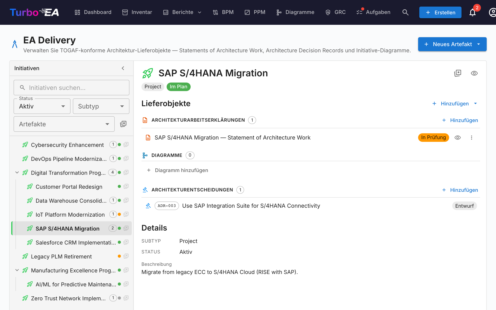
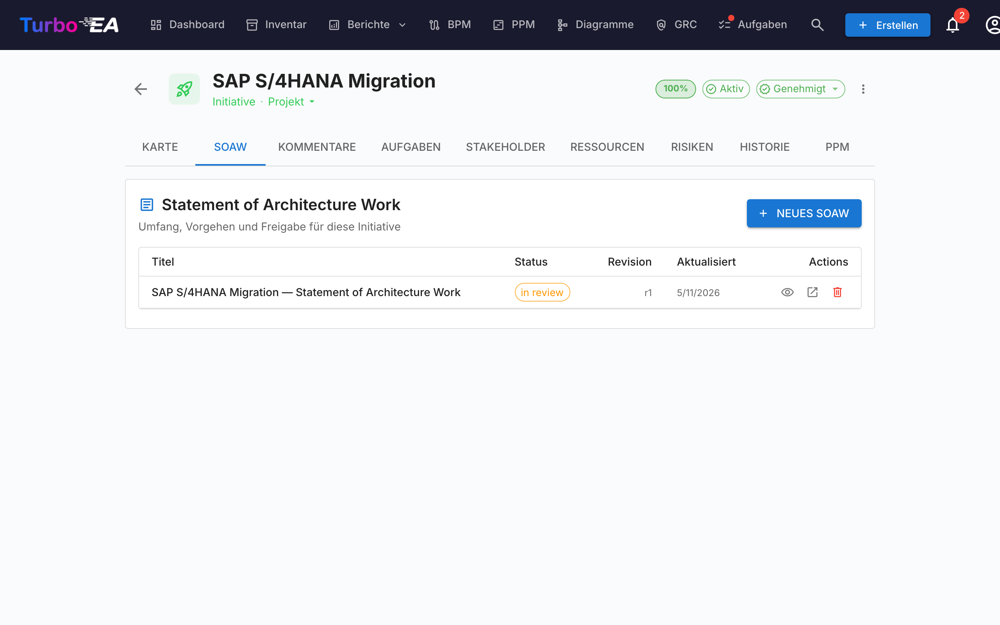
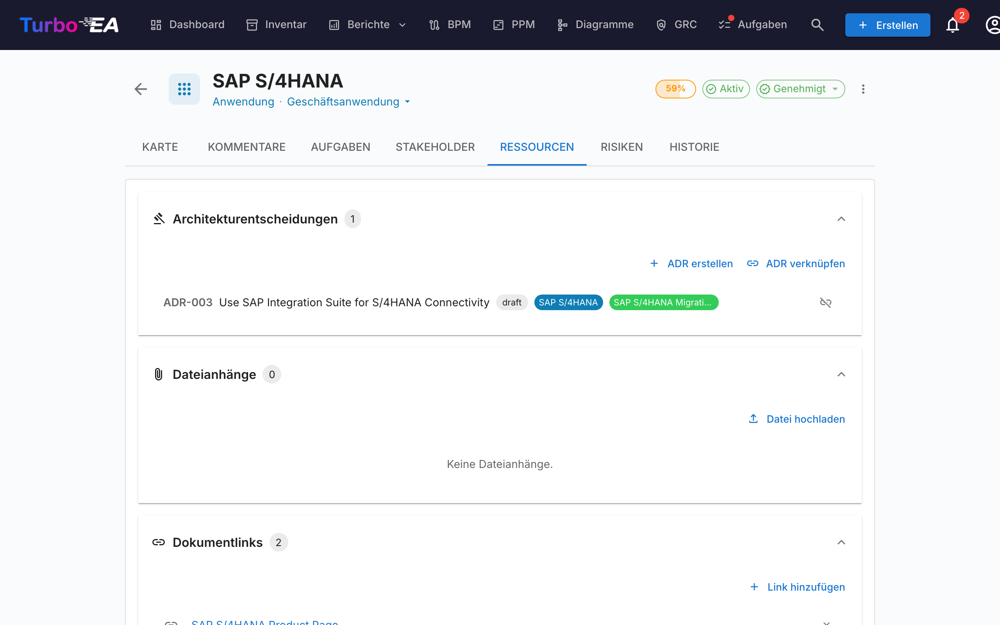

# EA Delivery

Das **EA Delivery**-Modul verwaltet **Architekturinitiativen und deren Artefakte** — Diagramme, Statements of Architecture Work (SoAW) und Architecture Decision Records (ADR). Es bietet eine einheitliche Ansicht aller laufenden Architekturprojekte und ihrer Ergebnisse.

Wenn PPM aktiviert ist — die übliche Konfiguration — lebt EA Delivery **innerhalb des PPM-Moduls**: Öffnen Sie **PPM** in der Top-Navigation und wechseln Sie auf den Reiter **EA Delivery** (`/ppm?tab=ea-delivery`). Wenn PPM deaktiviert ist, erscheint **EA Delivery** als eigener Top-Level-Eintrag mit Link zu `/reports/ea-delivery`. Die alte URL `/ea-delivery` funktioniert in beiden Fällen weiterhin als Weiterleitung, sodass bestehende Lesezeichen erhalten bleiben.

!!! tip
    Sie planen eine Landschaftsänderung (Anwendung ersetzen, System stilllegen, Plattform einführen)? Das Werkzeug [Architekturplanung](architecture-planning.md) erzeugt eine Vorher-Nachher-Ansicht, die Sie an eine Initiative anhängen und in einem Schritt übernehmen können.

## Initiativen-Arbeitsbereich

EA Delivery ist ein **Zwei-Spalten-Arbeitsbereich** (ohne interne Reiter):

- **Linke Seitenleiste** — ein eingerückter, filterbarer Baum aller Initiativen (mit verschachtelten Unterinitiativen). Suchen Sie nach Namen, filtern Sie nach Status / Subtyp / Artefakten oder markieren Sie Favoriten.
- **Rechter Arbeitsbereich** — die Lieferobjekte, untergeordneten Initiativen und Details der links ausgewählten Initiative. Bei der Auswahl einer anderen Zeile wird der Arbeitsbereich neu aufgebaut.

Die Auswahl ist Teil der URL (`?initiative=<id>`), sodass Sie eine bestimmte Initiative direkt verlinken oder die Seite neu laden können, ohne den Kontext zu verlieren.

Eine zentrale primäre Schaltfläche **+ Neues Artefakt ▾** oben auf der Seite erlaubt es, ein neues SoAW, Diagramm oder ADR anzulegen — automatisch mit der ausgewählten Initiative verknüpft (oder unverknüpft, wenn keine Auswahl getroffen wurde). Leere Lieferobjekt-Gruppen im Arbeitsbereich bieten zudem eine **+ Hinzufügen …**-Schaltfläche, sodass das Anlegen immer nur einen Klick entfernt ist.

Jede Baumzeile zeigt:

| Element | Bedeutung |
|---------|-----------|
| **Name** | Name der Initiative |
| **Anzahl-Chip** | Gesamtzahl verknüpfter Artefakte (SoAW + Diagramme + ADRs) |
| **Status-Punkt** | Farbpunkt für Im Plan / Gefährdet / Aus dem Plan / Pausiert / Abgeschlossen |
| **Stern** | Favoriten-Umschalter — Favoriten erscheinen oben |

Die synthetische Zeile **Nicht verknüpfte Artefakte** oben im Baum erscheint, wenn es SoAWs, Diagramme oder ADRs gibt, die noch keiner Initiative zugeordnet sind. Öffnen Sie sie, um sie wieder zu verknüpfen.

## Statement of Architecture Work (SoAW)

Ein **Statement of Architecture Work (SoAW)** ist ein formales Dokument, das durch den [TOGAF-Standard](https://pubs.opengroup.org/togaf-standard/) (The Open Group Architecture Framework) definiert wird. Es legt den Umfang, Ansatz, die Ergebnisse und die Governance für ein Architekturvorhaben fest. In TOGAF wird das SoAW während der **Vorbereitungsphase** und **Phase A (Architekturvision)** erstellt und dient als Vereinbarung zwischen dem Architekturteam und seinen Stakeholdern.

Turbo EA bietet einen integrierten SoAW-Editor mit TOGAF-konformen Abschnittsvorlagen, Rich-Text-Bearbeitung und Exportfunktionen — so können Sie SoAW-Dokumente direkt neben Ihren Architekturdaten erstellen und verwalten.

### Ein SoAW erstellen

1. Wählen Sie die Initiative links aus (optional — Sie können auch ein nicht verknüpftes SoAW erstellen).
2. Klicken Sie oben auf der Seite auf **+ Neues Artefakt ▾** (oder auf die **+ Hinzufügen**-Schaltfläche im Abschnitt *Lieferobjekte*) und wählen Sie **Neues Statement of Architecture Work**.
3. Geben Sie den Dokumenttitel ein.
4. Der Editor öffnet sich mit **vorgefertigten Abschnittsvorlagen** basierend auf dem TOGAF-Standard.

### Der SoAW-Editor

Der Editor bietet:

- **Rich-Text-Bearbeitung** — Vollständige Formatierungswerkzeugleiste (Überschriften, Fett, Kursiv, Listen, Links) unterstützt durch den TipTap-Editor
- **Abschnittsvorlagen** — Vordefinierte Abschnitte gemäß TOGAF-Standards (z.B. Problembeschreibung, Ziele, Ansatz, Stakeholder, Einschränkungen, Arbeitsplan)
- **Inline bearbeitbare Tabellen** — Tabellen in jedem Abschnitt hinzufügen und bearbeiten
- **Status-Workflow** — Dokumente durchlaufen definierte Phasen:

| Status | Bedeutung |
|--------|-----------|
| **Entwurf** | Wird geschrieben, noch nicht bereit zur Überprüfung |
| **In Überprüfung** | Zur Stakeholder-Überprüfung eingereicht |
| **Genehmigt** | Überprüft und akzeptiert |
| **Unterschrieben** | Formal abgezeichnet |

### Abzeichnungsworkflow

Sobald ein SoAW genehmigt ist, können Sie Abzeichnungen von Stakeholdern anfordern. Klicken Sie auf **Unterschriften anfordern** und verwenden Sie das Suchfeld, um Unterzeichner nach Name oder E-Mail zu finden und hinzuzufügen. Das System verfolgt, wer unterschrieben hat, und sendet Benachrichtigungen an ausstehende Unterzeichner.

### Vorschau und Export

- **Vorschaumodus** — Schreibgeschützte Ansicht des vollständigen SoAW-Dokuments
- **DOCX-Export** — Das SoAW als formatiertes Word-Dokument zum Offline-Teilen oder Drucken herunterladen

### SoAW-Reiter auf Initiative-Karten

Initiativen zeigen außerdem direkt auf ihrer Karten-Detailseite einen eigenen **SoAW**-Reiter. Der Reiter listet jedes mit dieser Initiative verknüpfte SoAW auf (Titel, Status-Chip, Revisionsnummer, Datum der letzten Änderung) mit einer **+ Neues SoAW**-Schaltfläche, die die aktuelle Initiative vorauswählt — so kannst du SoAWs erstellen oder öffnen, ohne die Karte zu verlassen. Die Erstellung verwendet denselben Dialog wie die EA-Delivery-Seite, und das neue Dokument erscheint an beiden Stellen. Die Sichtbarkeit des Reiters folgt den Standard-Karten-Berechtigungsregeln.

## Architecture Decision Records (ADR)

Ein **Architecture Decision Record (ADR)** hält eine wichtige Architekturentscheidung samt Kontext, Konsequenzen und erwogenen Alternativen fest. Der EA-Delivery-Arbeitsbereich zeigt ADRs, die **mit der gewählten Initiative verknüpft** sind, inline unter dem Deliverable-Abschnitt *Architekturentscheidungen* — so können Sie sie lesen und öffnen, ohne die Initiative-Ansicht zu verlassen. Mit der Split-Schaltfläche **+ Neues Artefakt ▾** (oder **+ Hinzufügen** im Abschnitt) legen Sie ein neues ADR an, das automatisch mit der gewählten Initiative verknüpft wird.

Das **zentrale ADR-Register** — wo alle ADRs landschaftsweit gefiltert, durchsucht, abgezeichnet, revidiert und in der Vorschau betrachtet werden — liegt im GRC-Modul unter **GRC → Governance → [Entscheidungen](grc.md#governance)**. Den vollständigen ADR-Lebenszyklus (Spalten, Filtersidebar, Abzeichnungs-Workflow, Revisionen, Vorschau) finden Sie im GRC-Leitfaden.

## Registerkarte Ressourcen

Karten enthalten jetzt eine **Ressourcen**-Registerkarte, die Folgendes zusammenfasst:

- **Architekturentscheidungen** — mit dieser Karte verknüpfte ADRs, dargestellt als farbige Pillen, die den Kartentypfarben entsprechen. Sie können bestehende ADRs verknüpfen oder ein neues ADR direkt über die Ressourcen-Registerkarte erstellen — das neue ADR wird automatisch mit der Karte verknüpft.
- **Dateianhänge** — Dateien hochladen und verwalten (PDF, DOCX, XLSX, Bilder, bis zu 10 MB). Beim Hochladen wählen Sie eine **Dokumentenkategorie** aus: Architektur, Sicherheit, Compliance, Betrieb, Besprechungsnotizen, Design oder Sonstiges. Die Kategorie wird als Chip neben jeder Datei angezeigt.
- **Dokumentenlinks** — URL-basierte Dokumentenverweise. Beim Hinzufügen eines Links wählen Sie einen **Linktyp** aus: Dokumentation, Sicherheit, Compliance, Architektur, Betrieb, Support oder Sonstiges. Der Linktyp wird als Chip neben jedem Link angezeigt, und das Symbol ändert sich je nach ausgewähltem Typ.
