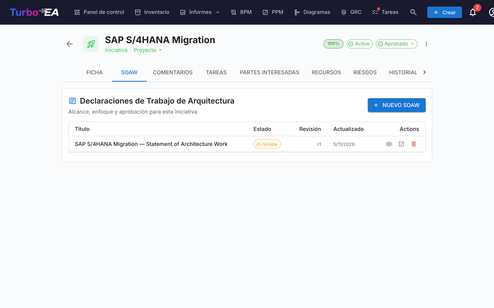
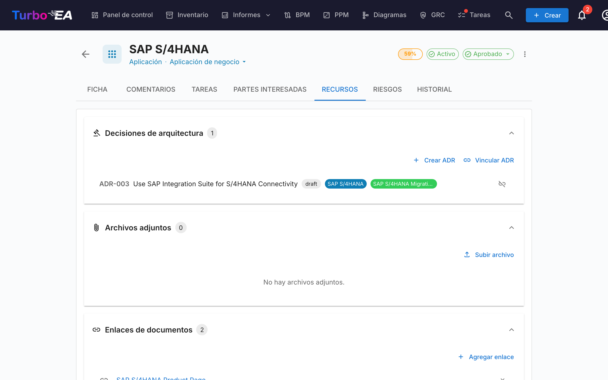

# Entrega EA

El módulo de **Entrega EA** gestiona las **iniciativas de arquitectura y sus artefactos** — diagramas, Declaraciones de Trabajo de Arquitectura (SoAW) y Registros de Decisiones de Arquitectura (ADR). Proporciona una vista única de todos los proyectos de arquitectura en curso y sus entregables.

Cuando PPM está habilitado — la configuración habitual — Entrega EA vive **dentro del módulo PPM**: abra **PPM** en la navegación superior y cambie a la pestaña **EA Delivery** (`/ppm?tab=ea-delivery`). Cuando PPM está deshabilitado, **Entrega EA** aparece como un elemento de navegación de nivel superior dedicado, enlazando a `/reports/ea-delivery`. La URL legada `/ea-delivery` sigue funcionando como redirección en ambos casos, de modo que los marcadores existentes se resuelven.

!!! tip
    ¿Planifica un cambio del panorama (reemplazar una aplicación, retirar un sistema, introducir una plataforma)? La herramienta de [planificación de arquitectura](architecture-planning.md) produce una vista antes/después que puede adjuntar a una iniciativa y confirmar en un solo paso.

## Espacio de trabajo de Iniciativas

Entrega EA es un **espacio de trabajo en dos paneles** (sin pestañas internas):

- **Barra lateral izquierda** — un árbol indentado y filtrable de todas las iniciativas (con sus iniciativas hijas anidadas). Busque por nombre, filtre por Estado / Subtipo / Artefactos o marque sus favoritos.
- **Espacio de trabajo a la derecha** — los entregables, iniciativas hijas y detalles de la iniciativa que seleccione a la izquierda. Al elegir otra fila, el espacio de trabajo se redibuja.

La selección forma parte de la URL (`?initiative=<id>`), por lo que puede compartir un enlace directo a una iniciativa o recargar la página sin perder el contexto.

Un único botón principal **+ Nuevo artefacto ▾** en la parte superior de la página permite crear un nuevo SoAW, diagrama o ADR — automáticamente vinculado a la iniciativa seleccionada (o sin vincular si no hay selección). Los grupos de entregables vacíos en el espacio de trabajo también muestran un botón **+ Añadir …**, de modo que la creación siempre está a un clic.

Cada fila del árbol muestra:

| Elemento | Significado |
|----------|-------------|
| **Nombre** | Nombre de la iniciativa |
| **Chip de recuento** | Total de artefactos vinculados (SoAW + diagramas + ADRs) |
| **Punto de estado** | Punto coloreado para En Curso / En Riesgo / Fuera de Curso / En Espera / Completado |
| **Estrella** | Conmutador de favorito — los favoritos suben al principio |

La fila sintética **Artefactos no vinculados** en la parte superior del árbol aparece cuando hay SoAWs, diagramas o ADRs aún no vinculados a una iniciativa. Ábrala para volver a vincularlos.

## Declaración de Trabajo de Arquitectura (SoAW)

Una **Declaración de Trabajo de Arquitectura (SoAW)** es un documento formal definido por el [estándar TOGAF](https://pubs.opengroup.org/togaf-standard/) (The Open Group Architecture Framework). Establece el alcance, enfoque, entregables y gobernanza para un compromiso de arquitectura. En TOGAF, el SoAW se produce durante la **Fase Preliminar** y la **Fase A (Visión de Arquitectura)** y sirve como acuerdo entre el equipo de arquitectura y sus partes interesadas.

Turbo EA proporciona un editor SoAW integrado con plantillas de secciones alineadas con TOGAF, edición de texto enriquecido y capacidades de exportación — para que pueda crear y gestionar documentos SoAW directamente junto con sus datos de arquitectura.

### Crear un SoAW

1. Seleccione la iniciativa a la izquierda (opcional — también puede crear un SoAW no vinculado).
2. Haga clic en **+ Nuevo artefacto ▾** en la parte superior de la página (o en el botón **+ Añadir** dentro de la sección *Entregables*) y elija **Nuevo Statement of Architecture Work**.
3. Ingrese el título del documento.
4. El editor se abre con **plantillas de secciones predefinidas** basadas en el estándar TOGAF.

### El Editor de SoAW

El editor proporciona:

- **Edición de texto enriquecido** — Barra de herramientas completa de formato (encabezados, negrita, cursiva, listas, enlaces) impulsada por el editor TipTap
- **Plantillas de secciones** — Secciones predefinidas siguiendo estándares TOGAF (ej., Descripción del Problema, Objetivos, Enfoque, Partes Interesadas, Restricciones, Plan de Trabajo)
- **Tablas editables en línea** — Agregue y edite tablas dentro de cualquier sección
- **Flujo de estados** — Los documentos progresan a través de etapas definidas:

| Estado | Significado |
|--------|-------------|
| **Borrador** | En redacción, aún no listo para revisión |
| **En Revisión** | Enviado para revisión de partes interesadas |
| **Aprobado** | Revisado y aceptado |
| **Firmado** | Firmado formalmente |

### Flujo de Firma

Una vez que un SoAW es aprobado, puede solicitar firmas de las partes interesadas. Haga clic en **Solicitar Firmas** y use el campo de búsqueda para encontrar y agregar firmantes por nombre o correo electrónico. El sistema rastrea quién ha firmado y envía notificaciones a los firmantes pendientes.

### Vista Previa y Exportación

- **Modo de vista previa** — Vista de solo lectura del documento SoAW completo
- **Exportación DOCX** — Descargue el SoAW como un documento Word formateado para compartir o imprimir sin conexión

### Pestaña SoAW en las fichas de Iniciativa

Las iniciativas también exponen una pestaña **SoAW** dedicada directamente en su página de detalle. La pestaña lista cada SoAW vinculado a esa iniciativa (título, chip de estado, número de revisión, fecha de última modificación) con un botón **+ Nuevo SoAW** que preselecciona la iniciativa actual — para que puedas redactar o saltar a un SoAW sin salir de la ficha en la que estás trabajando. La creación reutiliza el mismo diálogo que la página de Entrega EA, y el nuevo documento aparece en ambos lugares. La visibilidad de la pestaña sigue las reglas de permisos estándar de las fichas.

## Registros de Decisiones de Arquitectura (ADR)

Un **Registro de Decisión de Arquitectura (ADR)** captura una decisión de arquitectura importante junto con su contexto, consecuencias y alternativas consideradas. El espacio de trabajo de Entrega EA muestra los ADR **vinculados a la iniciativa seleccionada** en línea, bajo la sección de entregables *Decisiones de Arquitectura* — así puede leerlos y abrirlos sin salir de la vista de la iniciativa. Use el split-button **+ Nuevo artefacto ▾** (o **+ Añadir** en la sección) para crear un nuevo ADR pre-vinculado a la iniciativa seleccionada.

El **registro maestro de ADR** — donde cada ADR del paisaje se filtra, busca, firma, revisa y previsualiza — vive en el módulo GRC en **GRC → Gobernanza → [Decisiones](grc.md#governance)**. Consulte la guía de GRC para el ciclo de vida completo del ADR (columnas de la cuadrícula, barra lateral de filtros, flujo de firma, revisiones, vista previa).

## Pestaña de Recursos

Las tarjetas ahora incluyen una pestaña de **Recursos** que consolida:

- **Decisiones de Arquitectura** — ADR vinculados a esta tarjeta, mostrados como píldoras de color que coinciden con los colores del tipo de tarjeta. Puede vincular ADR existentes o crear uno nuevo directamente desde la pestaña de Recursos — el nuevo ADR se vincula automáticamente a la tarjeta.
- **Archivos Adjuntos** — Cargue y gestione archivos (PDF, DOCX, XLSX, imágenes, hasta 10 MB). Al cargar, seleccione una **categoría de documento** entre: Arquitectura, Seguridad, Compliance, Operaciones, Notas de Reunión, Diseño u Otro. La categoría aparece como un chip junto a cada archivo.
- **Enlaces de Documentos** — Referencias de documentos basadas en URL. Al agregar un enlace, seleccione un **tipo de enlace** entre: Documentación, Seguridad, Compliance, Arquitectura, Operaciones, Soporte u Otro. El tipo de enlace aparece como un chip junto a cada enlace, y el icono cambia según el tipo seleccionado.
