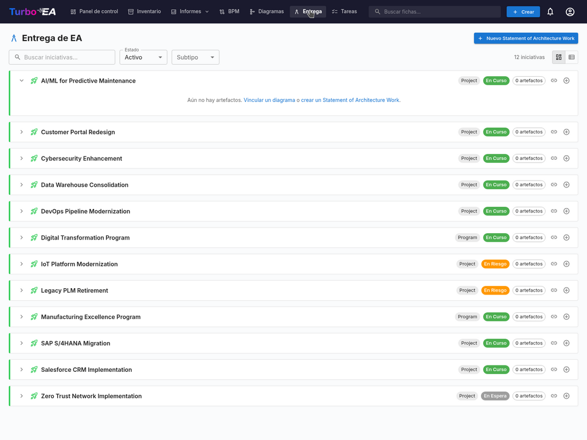

# Entrega EA

El módulo de **Entrega** gestiona las **iniciativas y proyectos** relacionados con la arquitectura empresarial.

| Campo | Descripción |
|-------|-------------|
| **Nombre** | Nombre descriptivo del proyecto o programa |
| **Tipo** | Proyecto o Programa |
| **Estado** | En Curso (verde), En Riesgo (naranja), Completado, etc. |
| **Artefactos** | Número de documentos y diagramas asociados |

Incluye la posibilidad de crear un **Documento de Trabajo de Arquitectura (SoAW)** para cada iniciativa.
