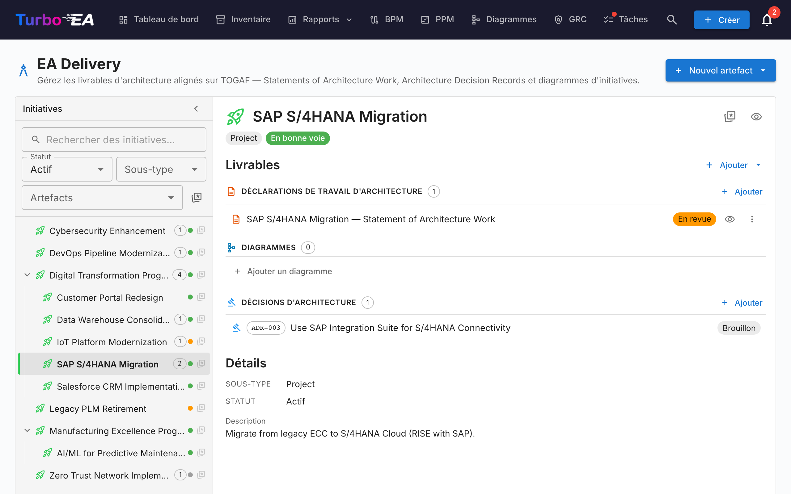
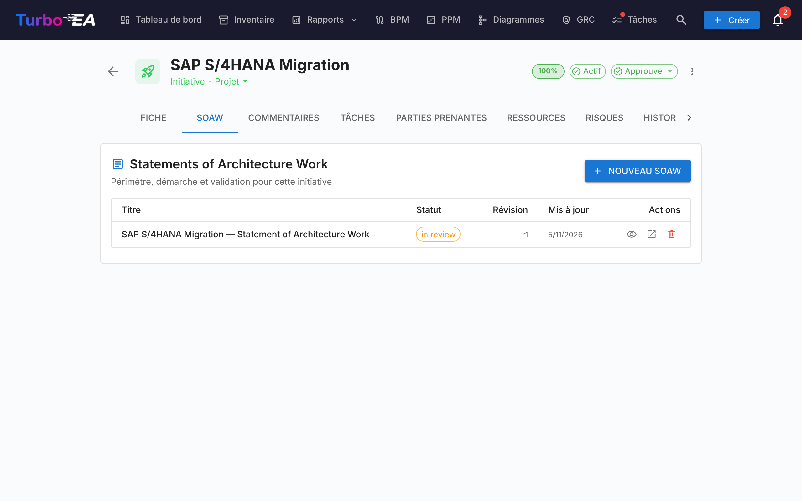
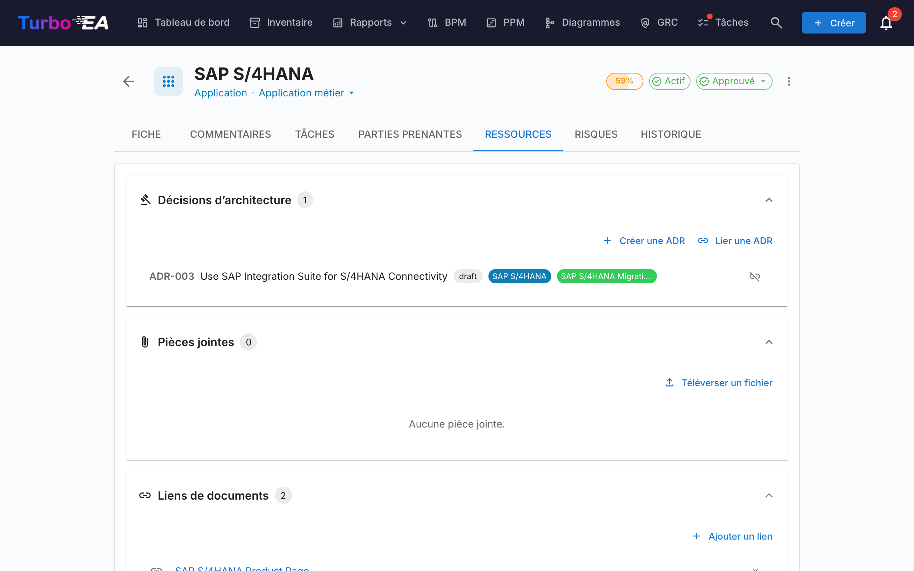

# EA Delivery

Le module **EA Delivery** gère les **initiatives d'architecture et leurs artefacts** — diagrammes, Statements of Architecture Work (SoAW) et Architecture Decision Records (ADR). Il fournit une vue unique de tous les projets d'architecture en cours et de leurs livrables.

Lorsque PPM est activé — la configuration habituelle — EA Delivery vit **à l'intérieur du module PPM** : ouvrez **PPM** dans la barre de navigation et basculez sur l'onglet **EA Delivery** (`/ppm?tab=ea-delivery`). Lorsque PPM est désactivé, **EA Delivery** apparaît comme un élément de navigation de premier niveau dédié, liant à `/reports/ea-delivery`. L'ancienne URL `/ea-delivery` continue à fonctionner comme redirection dans les deux cas, de sorte que les marque-pages existants restent valides.

!!! tip
    Vous planifiez un changement du paysage (remplacer une application, décommissionner un système, introduire une plateforme) ? L’outil de [planification de transition](transition-planning.md) produit une vue avant/après que vous pouvez rattacher à une initiative et valider en une étape.

## Espace de travail des initiatives

EA Delivery est un **espace de travail à deux volets** (sans onglets internes) :

- **Barre latérale gauche** — un arbre indenté et filtrable de toutes les initiatives (avec les initiatives enfants imbriquées). Recherchez par nom, filtrez par Statut / Sous-type / Artefacts ou marquez vos favoris.
- **Espace de travail à droite** — les livrables, initiatives enfants et détails de l'initiative sélectionnée à gauche. Sélectionner une autre ligne actualise l'espace de travail.

La sélection fait partie de l'URL (`?initiative=<id>`), ce qui permet de partager un lien direct vers une initiative ou de rafraîchir la page sans perdre le contexte.

Un bouton primaire **+ Nouvel artefact ▾** en haut de la page permet de créer un nouveau SoAW, diagramme ou ADR — automatiquement lié à l'initiative sélectionnée (ou non lié si aucune sélection n'est active). Les groupes de livrables vides dans l'espace de travail exposent également un bouton **+ Ajouter …**, pour que la création soit toujours à un clic.

Chaque ligne de l'arbre affiche :

| Élément | Signification |
|---------|---------------|
| **Nom** | Nom de l'initiative |
| **Pastille de comptage** | Nombre total d'artefacts liés (SoAW + diagrammes + ADRs) |
| **Point de statut** | Pastille colorée pour En bonne voie / À risque / Hors piste / En attente / Terminé |
| **Étoile** | Bascule "favori" — les favoris remontent en haut |

La ligne synthétique **Artefacts non liés** en haut de l'arbre apparaît s'il existe des SoAWs, diagrammes ou ADRs qui ne sont pas encore liés à une initiative. Ouvrez-la pour les rattacher.

## Statement of Architecture Work (SoAW)

Un **Statement of Architecture Work (SoAW)** est un document formel défini par le [standard TOGAF](https://pubs.opengroup.org/togaf-standard/) (The Open Group Architecture Framework). Il établit la portée, l'approche, les livrables et la gouvernance d'un engagement d'architecture. Dans TOGAF, le SoAW est produit pendant la **Phase préliminaire** et la **Phase A (Vision de l'architecture)** et sert d'accord entre l'équipe d'architecture et ses parties prenantes.

Turbo EA fournit un éditeur SoAW intégré avec des modèles de sections alignés sur TOGAF, l'édition de texte riche et des capacités d'export -- vous permettant de rédiger et gérer des documents SoAW directement aux côtés de vos données d'architecture.

### Création d'un SoAW

1. Sélectionnez l'initiative à gauche (facultatif — vous pouvez aussi créer un SoAW non lié).
2. Cliquez sur **+ Nouvel artefact ▾** en haut de la page (ou sur **+ Ajouter** dans la section *Livrables*) et choisissez **Nouveau Statement of Architecture Work**.
3. Entrez le titre du document.
4. L'éditeur s'ouvre avec des **modèles de sections préconstruits** basés sur le standard TOGAF.

### L'éditeur SoAW

L'éditeur offre :

- **Édition de texte riche** -- Barre d'outils de mise en forme complète (titres, gras, italique, listes, liens) propulsée par l'éditeur TipTap
- **Modèles de sections** -- Sections prédéfinies suivant les standards TOGAF (par ex. Description du problème, Objectifs, Approche, Parties prenantes, Contraintes, Plan de travail)
- **Tableaux éditables en ligne** -- Ajoutez et éditez des tableaux dans n'importe quelle section
- **Workflow de statut** -- Les documents progressent à travers des étapes définies :

| Statut | Signification |
|--------|---------------|
| **Brouillon** | En cours de rédaction, pas encore prêt pour examen |
| **En revue** | Soumis pour examen par les parties prenantes |
| **Approuvé** | Examiné et accepté |
| **Signé** | Formellement validé |

### Workflow de signature

Une fois qu'un SoAW est approuvé, vous pouvez demander des signatures aux parties prenantes. Cliquez sur **Demander des signatures** puis utilisez le champ de recherche pour trouver et ajouter des signataires par nom ou e-mail. Le système suit qui a signé et envoie des notifications aux signataires en attente.

### Aperçu et export

- **Mode aperçu** -- Vue en lecture seule du document SoAW complet
- **Export DOCX** -- Téléchargez le SoAW sous forme de document Word formaté pour le partage hors ligne ou l'impression

### Onglet SoAW sur les fiches d'initiative

Les initiatives exposent également un onglet **SoAW** dédié directement sur leur page de détail. L'onglet liste chaque SoAW lié à cette initiative (titre, puce de statut, numéro de révision, date de dernière modification) avec un bouton **+ Nouveau SoAW** qui pré-sélectionne l'initiative en cours — vous pouvez ainsi rédiger ou ouvrir un SoAW sans quitter la fiche sur laquelle vous travaillez. La création réutilise le même dialogue que la page EA Delivery, et le nouveau document apparaît aux deux endroits. La visibilité de l'onglet suit les règles de permission standard des fiches.

## Architecture Decision Records (ADR)

Un **Architecture Decision Record (ADR)** consigne une décision d'architecture importante, accompagnée de son contexte, de ses conséquences et des alternatives envisagées. L'espace de travail EA Delivery affiche les ADR **liés à l'initiative sélectionnée** en ligne, sous la section de livrables *Décisions d'Architecture* — vous pouvez ainsi les lire et les ouvrir sans quitter la vue de l'initiative. Utilisez la split-button **+ Nouvel artefact ▾** (ou **+ Ajouter** dans la section) pour créer un nouvel ADR pré-lié à l'initiative sélectionnée.

Le **registre principal des ADR** — où chaque ADR à l'échelle du paysage est filtré, recherché, signé, révisé et prévisualisé — vit dans le module GRC sous **GRC → Gouvernance → [Décisions](grc.md#governance)**. Consultez le guide GRC pour le cycle de vie complet des ADR (colonnes de la grille, barre latérale de filtres, workflow de signature, révisions, aperçu).

## Onglet Ressources

Les cartes incluent désormais un onglet **Ressources** qui regroupe :

- **Décisions d'architecture** -- ADR liés à cette carte, affichés sous forme de pilules colorées correspondant aux couleurs du type de carte. Vous pouvez lier des ADR existants ou en créer un nouveau directement depuis l'onglet Ressources -- le nouvel ADR est automatiquement lié à la carte.
- **Pièces jointes** -- Téléchargez et gérez des fichiers (PDF, DOCX, XLSX, images, jusqu'à 10 Mo). Lors du téléchargement, sélectionnez une **catégorie de document** parmi : Architecture, Sécurité, Conformité, Opérations, Notes de réunion, Design ou Autre. La catégorie s'affiche sous forme de puce à côté de chaque fichier.
- **Liens de documents** -- Références de documents basées sur des URL. Lors de l'ajout d'un lien, sélectionnez un **type de lien** parmi : Documentation, Sécurité, Conformité, Architecture, Opérations, Support ou Autre. Le type de lien s'affiche sous forme de puce à côté de chaque lien, et l'icône change en fonction du type sélectionné.
