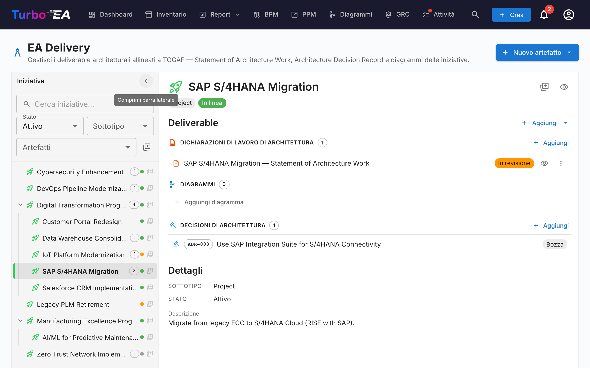
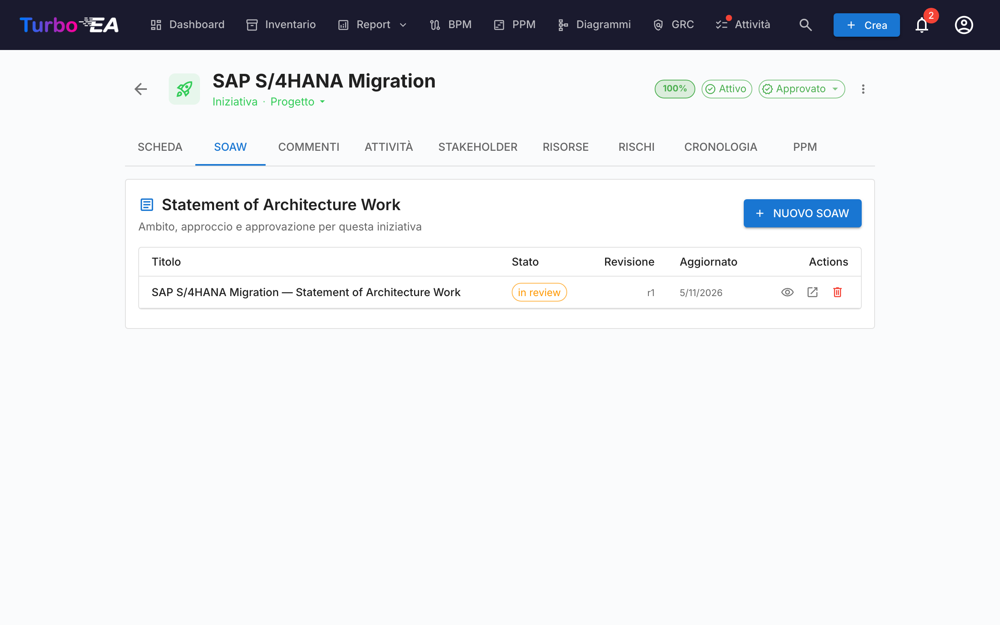
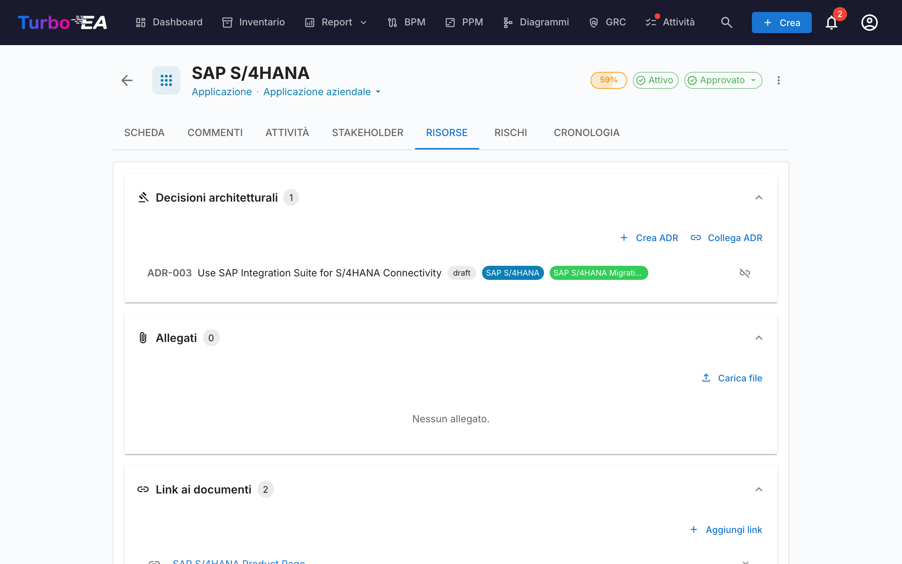

# EA Delivery

Il modulo **EA Delivery** gestisce le **iniziative architetturali e i relativi artefatti** — diagrammi, Statement of Architecture Work (SoAW) e Architecture Decision Records (ADR). Fornisce una vista unica di tutti i progetti architetturali in corso e i loro deliverable.

Quando PPM è abilitato — la configurazione tipica — EA Delivery vive **dentro il modulo PPM**: aprite **PPM** nella navigazione in alto e passate alla scheda **EA Delivery** (`/ppm?tab=ea-delivery`). Quando PPM è disabilitato, **EA Delivery** appare come voce di navigazione di primo livello dedicata che punta a `/reports/ea-delivery`. L'URL legacy `/ea-delivery` continua a funzionare come redirect in entrambi i casi, così i segnalibri esistenti restano risolvibili.

!!! tip
    State pianificando un cambiamento del panorama (sostituire un’applicazione, dismettere un sistema, introdurre una piattaforma)? Lo strumento di [pianificazione dell’architettura](architecture-planning.md) produce una vista prima/dopo che potete collegare a un’iniziativa e confermare in un solo passo.

## Spazio di lavoro delle iniziative

EA Delivery è uno **spazio di lavoro a due pannelli** (senza schede interne):

- **Barra laterale a sinistra** — un albero indentato e filtrabile di tutte le iniziative (con le iniziative figlie nidificate). Cerca per nome, filtra per Stato / Sottotipo / Artefatti o segna i preferiti.
- **Spazio di lavoro a destra** — i deliverable, le iniziative figlie e i dettagli dell'iniziativa selezionata a sinistra. Selezionando un'altra riga, lo spazio di lavoro si aggiorna.

La selezione fa parte dell'URL (`?initiative=<id>`), quindi è possibile condividere un link diretto a un'iniziativa o aggiornare la pagina senza perdere il contesto.

Un pulsante principale **+ Nuovo artefatto ▾** in alto nella pagina permette di creare un nuovo SoAW, diagramma o ADR — automaticamente collegato all'iniziativa selezionata (o non collegato se nessuna selezione è attiva). I gruppi di deliverable vuoti nello spazio di lavoro mostrano anche un pulsante **+ Aggiungi …**, in modo che la creazione sia sempre a un solo clic.

Ogni riga dell'albero mostra:

| Elemento | Significato |
|----------|-------------|
| **Nome** | Nome dell'iniziativa |
| **Chip di conteggio** | Totale degli artefatti collegati (SoAW + diagrammi + ADR) |
| **Punto di stato** | Pallino colorato per On Track / At Risk / Off Track / On Hold / Completed |
| **Stella** | Toggle dei preferiti — i preferiti risalgono in cima |

La riga sintetica **Artefatti non collegati** in cima all'albero compare quando ci sono SoAW, diagrammi o ADR non ancora collegati a un'iniziativa. Aprila per ricollegarli.

## Statement of Architecture Work (SoAW)

Uno **Statement of Architecture Work (SoAW)** è un documento formale definito dallo [standard TOGAF](https://pubs.opengroup.org/togaf-standard/) (The Open Group Architecture Framework). Stabilisce l'ambito, l'approccio, i deliverable e la governance per un impegno architetturale. In TOGAF, il SoAW viene prodotto durante la **Fase preliminare** e la **Fase A (Visione dell'architettura)** e serve come accordo tra il team di architettura e i suoi stakeholder.

Turbo EA fornisce un editor SoAW integrato con template di sezioni allineati a TOGAF, editing di testo ricco e funzionalità di esportazione — così potete creare e gestire documenti SoAW direttamente insieme ai vostri dati architetturali.

### Creazione di un SoAW

1. Selezionate l'iniziativa a sinistra (facoltativo — potete anche creare un SoAW non collegato).
2. Cliccate su **+ Nuovo artefatto ▾** in alto nella pagina (oppure sul pulsante **+ Aggiungi** nella sezione *Deliverable*) e scegliete **Nuovo Statement of Architecture Work**.
3. Inserite il titolo del documento.
4. L'editor si apre con **template di sezioni predefiniti** basati sullo standard TOGAF.

### L'editor SoAW

L'editor fornisce:

- **Editing di testo ricco** — Barra degli strumenti di formattazione completa (intestazioni, grassetto, corsivo, elenchi, link) alimentata dall'editor TipTap
- **Template di sezioni** — Sezioni predefinite seguendo gli standard TOGAF (es. Descrizione del problema, Obiettivi, Approccio, Stakeholder, Vincoli, Piano di lavoro)
- **Tabelle modificabili in linea** — Aggiungete e modificate tabelle all'interno di qualsiasi sezione
- **Workflow degli stati** — I documenti progrediscono attraverso fasi definite:

| Stato | Significato |
|-------|-------------|
| **Draft** | In fase di scrittura, non ancora pronto per la revisione |
| **In Review** | Inviato per la revisione degli stakeholder |
| **Approved** | Revisionato e accettato |
| **Signed** | Formalmente firmato |

### Workflow di firma

Una volta approvato un SoAW, potete richiedere le firme dagli stakeholder. Cliccate su **Richiedi firme** e utilizzate il campo di ricerca per trovare e aggiungere firmatari per nome o e-mail. Il sistema traccia chi ha firmato e invia notifiche ai firmatari in attesa.

### Anteprima ed esportazione

- **Modalità anteprima** — Vista di sola lettura del documento SoAW completo
- **Esportazione DOCX** — Scaricate il SoAW come documento Word formattato per la condivisione offline o la stampa

### Scheda SoAW sulle card di Iniziativa

Le iniziative espongono inoltre una scheda **SoAW** dedicata direttamente nella loro pagina di dettaglio. La scheda elenca ogni SoAW collegato a quell'iniziativa (titolo, chip di stato, numero di revisione, data dell'ultima modifica) con un pulsante **+ Nuovo SoAW** che preseleziona l'iniziativa corrente — così è possibile redigere o saltare a un SoAW senza lasciare la card su cui si sta lavorando. La creazione riutilizza lo stesso dialogo della pagina EA Delivery, e il nuovo documento compare in entrambi i posti. La visibilità della scheda segue le regole standard di permesso sulle card.

## Architecture Decision Records (ADR)

Un **Architecture Decision Record (ADR)** registra un'importante decisione architetturale insieme al suo contesto, alle conseguenze e alle alternative considerate. Lo spazio di lavoro EA Delivery mostra gli ADR **collegati all'iniziativa selezionata** in linea, sotto la sezione di deliverable *Decisioni di Architettura* — così potete leggerli e aprirli senza lasciare la vista dell'iniziativa. Usate la split-button **+ Nuovo artefatto ▾** (oppure **+ Aggiungi** nella sezione) per creare un nuovo ADR pre-collegato all'iniziativa selezionata.

Il **registro principale degli ADR** — dove ogni ADR a livello di landscape viene filtrato, cercato, firmato, revisionato e visualizzato in anteprima — vive nel modulo GRC sotto **GRC → Governance → [Decisioni](grc.md#governance)**. Consultate la guida GRC per il ciclo di vita completo dell'ADR (colonne della griglia, barra laterale di filtri, workflow di firma, revisioni, anteprima).

## Scheda Risorse

Le card ora includono una scheda **Risorse** che consolida:

- **Decisioni architetturali** — ADR collegati a questa card, visualizzati come pillole colorate corrispondenti ai colori del tipo di card. È possibile collegare ADR esistenti o crearne uno nuovo direttamente dalla scheda Risorse — il nuovo ADR viene collegato automaticamente alla card.
- **Allegati file** — Caricate e gestite file (PDF, DOCX, XLSX, immagini, fino a 10 MB). Durante il caricamento, selezionate una **categoria documento** tra: Architettura, Sicurezza, Conformità, Operazioni, Note di riunione, Design o Altro. La categoria viene visualizzata come chip accanto a ogni file.
- **Link ai documenti** — Riferimenti a documenti basati su URL. Quando aggiungete un link, selezionate un **tipo di link** tra: Documentazione, Sicurezza, Conformità, Architettura, Operazioni, Supporto o Altro. Il tipo di link viene visualizzato come chip accanto a ogni link e l'icona cambia in base al tipo selezionato.
