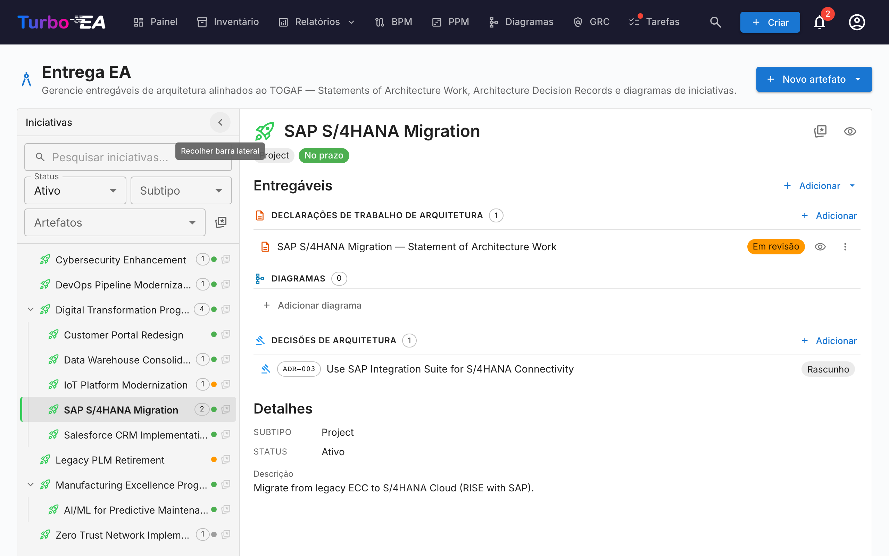
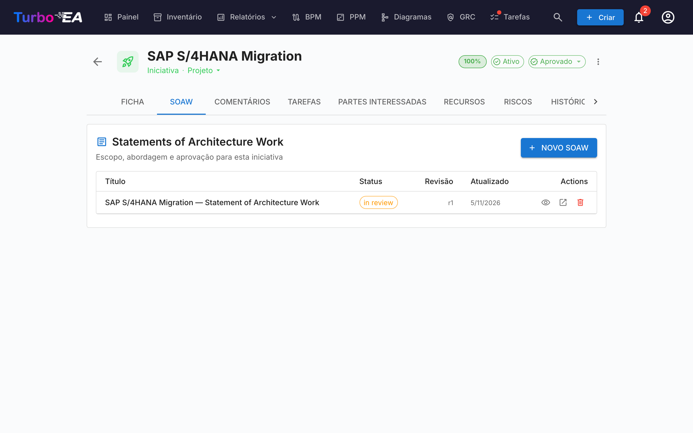
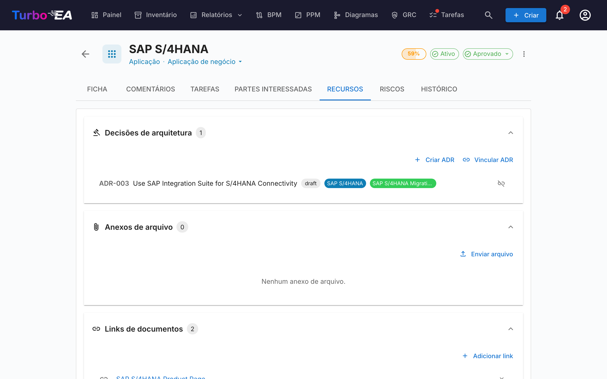

# Entregas de EA

O módulo de **Entregas de EA** gerencia **iniciativas de arquitetura e seus artefatos** — diagramas, Statements of Architecture Work (SoAW) e Architecture Decision Records (ADR). Ele fornece uma visão única de todos os projetos de arquitetura em andamento e seus entregáveis.

Quando o PPM está habilitado — a configuração típica — Entregas de EA vive **dentro do módulo PPM**: abra **PPM** na navegação superior e mude para a aba **EA Delivery** (`/ppm?tab=ea-delivery`). Quando o PPM está desabilitado, **Entregas de EA** aparece como um item de navegação de nível superior dedicado, apontando para `/reports/ea-delivery`. A URL legada `/ea-delivery` continua funcionando como redirecionamento em ambos os casos, para que os favoritos existentes ainda resolvam.

!!! tip
    Está a planear uma alteração do panorama (substituir uma aplicação, descontinuar um sistema, introduzir uma plataforma)? A ferramenta de [planeamento de transição](transition-planning.md) produz uma vista antes/depois que pode associar a uma iniciativa e confirmar num só passo.

## Espaço de trabalho de Iniciativas

Entregas de EA é um **espaço de trabalho de dois painéis** (sem separadores internos):

- **Barra lateral à esquerda** — uma árvore indentada e filtrável de todas as iniciativas (com as iniciativas filhas aninhadas). Pesquise por nome, filtre por Status / Subtipo / Artefatos ou marque favoritos.
- **Espaço de trabalho à direita** — os entregáveis, iniciativas filhas e detalhes da iniciativa selecionada à esquerda. Selecionar outra linha atualiza o espaço de trabalho.

A seleção faz parte do URL (`?initiative=<id>`), pelo que pode partilhar um link direto para uma iniciativa ou recarregar a página sem perder o contexto.

Um único botão principal **+ Novo artefato ▾** no topo da página permite criar um novo SoAW, diagrama ou ADR — automaticamente vinculado à iniciativa selecionada (ou não vinculado se nada estiver selecionado). Os grupos de entregáveis vazios no espaço de trabalho também expõem um botão **+ Adicionar …**, para que a criação esteja sempre a um clique.

Cada linha da árvore mostra:

| Elemento | Significado |
|----------|-------------|
| **Nome** | Nome da iniciativa |
| **Chip de contagem** | Total de artefatos vinculados (SoAW + diagramas + ADRs) |
| **Ponto de status** | Ponto colorido para No Prazo / Em Risco / Fora do Prazo / Em Espera / Concluído |
| **Estrela** | Botão de favorito — os favoritos sobem ao topo |

A linha sintética **Artefatos não vinculados** no topo da árvore aparece quando há SoAWs, diagramas ou ADRs ainda não vinculados a uma iniciativa. Abra-a para os religar.

## Statement of Architecture Work (SoAW)

Um **Statement of Architecture Work (SoAW)** é um documento formal definido pelo [padrão TOGAF](https://pubs.opengroup.org/togaf-standard/) (The Open Group Architecture Framework). Ele estabelece o escopo, abordagem, entregáveis e governança para um engajamento de arquitetura. No TOGAF, o SoAW é produzido durante a **Fase Preliminar** e **Fase A (Visão de Arquitetura)** e serve como um acordo entre a equipe de arquitetura e suas partes interessadas.

O Turbo EA fornece um editor de SoAW integrado com templates de seções alinhados ao TOGAF, edição de texto rico e capacidades de exportação — para que você possa criar e gerenciar documentos SoAW diretamente junto com seus dados de arquitetura.

### Criando um SoAW

1. Selecione a iniciativa à esquerda (opcional — também pode criar um SoAW sem vinculação).
2. Clique em **+ Novo artefato ▾** no topo da página (ou no botão **+ Adicionar** dentro da secção *Entregáveis*) e escolha **Novo Statement of Architecture Work**.
3. Insira o título do documento.
4. O editor abre com **templates de seções pré-construídos** baseados no padrão TOGAF.

### O Editor de SoAW

O editor oferece:

- **Edição de texto rico** — Barra de ferramentas completa de formatação (títulos, negrito, itálico, listas, links) alimentada pelo editor TipTap
- **Templates de seções** — Seções predefinidas seguindo os padrões TOGAF (ex.: Descrição do Problema, Objetivos, Abordagem, Partes Interessadas, Restrições, Plano de Trabalho)
- **Tabelas editáveis inline** — Adicione e edite tabelas dentro de qualquer seção
- **Fluxo de status** — Documentos progridem através de estágios definidos:

| Status | Significado |
|--------|-------------|
| **Rascunho** | Sendo escrito, ainda não pronto para revisão |
| **Em Revisão** | Submetido para revisão das partes interessadas |
| **Aprovado** | Revisado e aceito |
| **Assinado** | Formalmente assinado |

### Fluxo de Assinatura

Uma vez que um SoAW é aprovado, você pode solicitar assinaturas das partes interessadas. Clique em **Solicitar Assinaturas** e use o campo de pesquisa para encontrar e adicionar signatários por nome ou e-mail. O sistema rastreia quem assinou e envia notificações para os signatários pendentes.

### Pré-visualização e Exportação

- **Modo de pré-visualização** — Visualização somente leitura do documento SoAW completo
- **Exportação DOCX** — Baixe o SoAW como um documento Word formatado para compartilhamento offline ou impressão

### Aba SoAW nos cards de Iniciativa

As iniciativas também expõem uma aba **SoAW** dedicada diretamente na sua página de detalhe. A aba lista cada SoAW vinculado àquela iniciativa (título, chip de status, número de revisão, data da última modificação) com um botão **+ Novo SoAW** que pré-seleciona a iniciativa atual — para que você possa redigir ou abrir um SoAW sem sair do card no qual está trabalhando. A criação reutiliza o mesmo diálogo da página Entregas de EA, e o novo documento aparece em ambos os lugares. A visibilidade da aba segue as regras padrão de permissão dos cards.

## Registros de Decisões de Arquitetura (ADR)

Um **Registro de Decisão de Arquitetura (ADR)** captura uma decisão de arquitetura importante junto com seu contexto, consequências e alternativas consideradas. O espaço de trabalho de Entregas de EA mostra os ADR **vinculados à iniciativa selecionada** em linha, sob a secção de entregáveis *Decisões de Arquitetura* — assim você pode lê-los e abri-los sem sair da visualização da iniciativa. Use o split-button **+ Novo artefato ▾** (ou **+ Adicionar** na secção) para criar um novo ADR pré-vinculado à iniciativa selecionada.

O **registo principal de ADR** — onde cada ADR a nível do panorama é filtrado, pesquisado, assinado, revisado e visualizado — vive no módulo GRC em **GRC → Governação → [Decisões](grc.md#governance)**. Consulte o guia GRC para o ciclo de vida completo do ADR (colunas da grelha, barra lateral de filtros, fluxo de assinatura, revisões, pré-visualização).

## Aba de Recursos

Os cards agora incluem uma aba de **Recursos** que consolida:

- **Decisões de Arquitetura** — ADR vinculados a este card, exibidos como pílulas coloridas correspondentes às cores do tipo de card. Você pode vincular ADRs existentes ou criar um novo diretamente a partir da aba Recursos — o novo ADR é vinculado automaticamente ao card.
- **Anexos de Arquivos** — Carregue e gerencie arquivos (PDF, DOCX, XLSX, imagens, até 10 MB). Ao carregar, selecione uma **categoria de documento** entre: Arquitetura, Segurança, Conformidade, Operações, Notas de Reunião, Design ou Outro. A categoria aparece como um chip ao lado de cada arquivo.
- **Links de Documentos** — Referências de documentos baseadas em URL. Ao adicionar um link, selecione um **tipo de link** entre: Documentação, Segurança, Conformidade, Arquitetura, Operações, Suporte ou Outro. O tipo de link aparece como um chip ao lado de cada link, e o ícone muda de acordo com o tipo selecionado.
