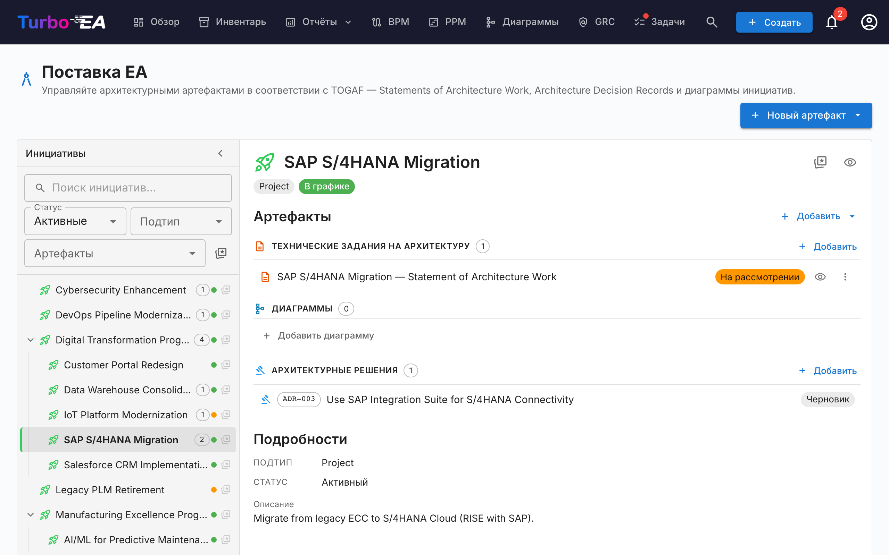
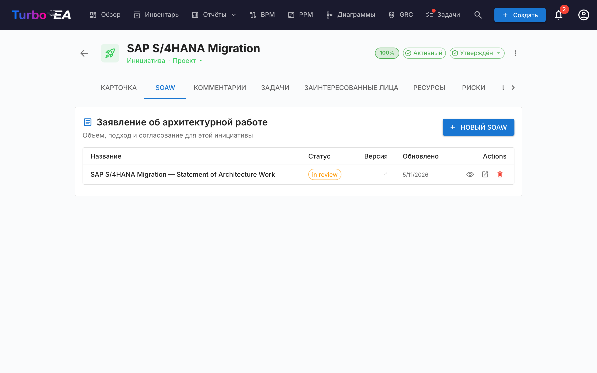
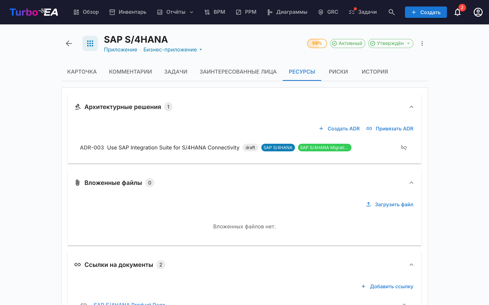

# Поставка EA

Модуль **Поставка EA** управляет **архитектурными инициативами и их артефактами** — диаграммами, Заявлениями об архитектурной работе (SoAW) и Записями об архитектурных решениях (ADR). Он предоставляет единое представление всех текущих архитектурных проектов и их результатов.

Когда PPM включён — обычная конфигурация — Поставка EA живёт **внутри модуля PPM**: откройте **PPM** в верхней навигации и переключитесь на вкладку **EA Delivery** (`/ppm?tab=ea-delivery`). Когда PPM отключён, **Поставка EA** появляется как отдельный пункт верхней навигации, ведущий на `/reports/ea-delivery`. Унаследованный URL `/ea-delivery` в обоих случаях по-прежнему работает как перенаправление, поэтому существующие закладки продолжают резолвиться.

!!! tip
    Планируете изменение ландшафта (замену приложения, вывод системы из эксплуатации, внедрение платформы)? Инструмент [архитектурного планирования](architecture-planning.md) создаёт представление «до/после», которое можно привязать к инициативе и зафиксировать одним шагом.

## Рабочее пространство инициатив

Поставка EA — это **двухпанельное рабочее пространство** (без внутренних вкладок):

- **Левая боковая панель** — отступная, фильтруемая иерархия всех инициатив (с дочерними инициативами во вложенных уровнях). Поиск по имени, фильтры по Статусу / Подтипу / Артефактам, отметка избранных.
- **Правая рабочая область** — артефакты, дочерние инициативы и подробности выбранной слева инициативы. При выборе другой строки рабочая область перерисовывается.

Выбор отражается в URL (`?initiative=<id>`), поэтому можно поделиться прямой ссылкой на инициативу или перезагрузить страницу, не теряя контекста.

Единственная основная кнопка **+ Новый артефакт ▾** в верхней части страницы позволяет создать новый SoAW, диаграмму или ADR — автоматически связанные с выбранной инициативой (или несвязанные, если ничего не выбрано). Пустые группы артефактов в рабочей области также показывают кнопку **+ Добавить …**, чтобы создание было доступно одним щелчком.

Каждая строка дерева отображает:

| Элемент | Значение |
|---------|----------|
| **Название** | Название инициативы |
| **Чип-счётчик** | Общее число связанных артефактов (SoAW + диаграммы + ADR) |
| **Точка статуса** | Цветная точка для В графике / Под угрозой / Не в графике / Приостановлено / Завершено |
| **Звезда** | Переключатель «избранное» — избранные поднимаются наверх |

Синтетическая строка **Несвязанные артефакты** в верхней части дерева появляется, когда есть SoAW, диаграммы или ADR, ещё не связанные с инициативой. Откройте её, чтобы привязать их снова.

## Заявление об архитектурной работе (SoAW)

**Заявление об архитектурной работе (SoAW)** — это формальный документ, определённый стандартом [TOGAF](https://pubs.opengroup.org/togaf-standard/) (The Open Group Architecture Framework). Оно устанавливает объём, подход, результаты и управление для архитектурного проекта. В TOGAF документ SoAW создаётся на **Предварительной фазе** и **Фазе A (Архитектурное видение)** и служит соглашением между командой архитекторов и заинтересованными сторонами.

Turbo EA предоставляет встроенный редактор SoAW с шаблонами секций, соответствующими TOGAF, редактированием форматированного текста и возможностями экспорта — чтобы вы могли создавать и управлять документами SoAW непосредственно рядом с вашими архитектурными данными.

### Создание SoAW

1. Выберите инициативу слева (необязательно — можно создать и несвязанный SoAW).
2. Нажмите **+ Новый артефакт ▾** в верхней части страницы (или кнопку **+ Добавить** в разделе *Артефакты*) и выберите **Новое Statement of Architecture Work**.
3. Введите заголовок документа.
4. Откроется редактор с **готовыми шаблонами секций** на основе стандарта TOGAF.

### Редактор SoAW

Редактор предоставляет:

- **Редактирование форматированного текста** — полная панель форматирования (заголовки, жирный, курсив, списки, ссылки) на базе редактора TipTap
- **Шаблоны секций** — предопределённые секции в соответствии со стандартами TOGAF (например, Описание проблемы, Цели, Подход, Заинтересованные стороны, Ограничения, План работ)
- **Редактируемые таблицы** — добавление и редактирование таблиц в любой секции
- **Рабочий процесс статусов** — документы проходят через определённые стадии:

| Статус | Значение |
|--------|----------|
| **Черновик** | Составляется, ещё не готов к проверке |
| **На рассмотрении** | Отправлен на проверку заинтересованным сторонам |
| **Утверждён** | Проверен и принят |
| **Подписан** | Формально подписан |

### Процесс подписания

После утверждения SoAW вы можете запросить подписи у заинтересованных сторон. Нажмите **Запросить подписи**, затем используйте поле поиска для нахождения и добавления подписантов по имени или электронной почте. Система отслеживает, кто подписал, и отправляет уведомления ожидающим подписантам.

### Предварительный просмотр и экспорт

- **Режим предварительного просмотра** — представление документа SoAW только для чтения
- **Экспорт в DOCX** — скачайте SoAW в виде форматированного документа Word для офлайн-распространения или печати

### Вкладка SoAW на карточках инициатив

Инициативы также показывают отдельную вкладку **SoAW** прямо на странице деталей карточки. Вкладка перечисляет каждый SoAW, связанный с этой инициативой (название, чип статуса, номер ревизии, дата последнего изменения), и содержит кнопку **+ Новый SoAW**, которая предварительно выбирает текущую инициативу — так вы можете создавать SoAW или переходить к нему, не покидая карточку, с которой работаете. Создание использует тот же диалог, что и страница Поставка EA, и новый документ появляется в обоих местах. Видимость вкладки подчиняется стандартным правилам прав на карточки.

## Записи об архитектурных решениях (ADR)

**Запись об архитектурном решении (ADR)** фиксирует важное архитектурное решение вместе с его контекстом, последствиями и рассмотренными альтернативами. Рабочее пространство «Поставка EA» показывает ADR, **привязанные к выбранной инициативе**, прямо в разделе результатов *Архитектурные решения* — поэтому вы можете читать и открывать их, не покидая вид инициативы. Используйте сплит-кнопку **+ Новый артефакт ▾** (или **+ Добавить** в разделе), чтобы создать новый ADR, предварительно привязанный к выбранной инициативе.

**Главный реестр ADR** — где все ADR в ландшафте фильтруются, ищутся, подписываются, ревизируются и просматриваются — живёт в модуле GRC: **GRC → Управление → [Решения](grc.md#governance)**. Полный жизненный цикл ADR (столбцы сетки, боковая панель фильтров, процесс подписания, ревизии, предварительный просмотр) описан в руководстве по GRC.

## Вкладка «Ресурсы»

Карточки включают вкладку **Ресурсы**, которая объединяет:

- **Архитектурные решения** — записи ADR, привязанные к этой карточке, отображаются в виде цветных меток, соответствующих цветам типов карточек. Вы можете привязать существующие ADR или создать новый ADR прямо из вкладки «Ресурсы» — новый ADR автоматически привязывается к карточке.
- **Вложенные файлы** — загружайте и управляйте файлами (PDF, DOCX, XLSX, изображения, до 10 МБ). При загрузке выберите **категорию документа** из: Архитектура, Безопасность, Соответствие, Операции, Протоколы встреч, Дизайн или Прочее. Категория отображается в виде чипа рядом с каждым файлом.
- **Ссылки на документы** — ссылки на документы по URL. При добавлении ссылки выберите **тип ссылки** из: Документация, Безопасность, Соответствие, Архитектура, Операции, Поддержка или Прочее. Тип ссылки отображается в виде чипа рядом с каждой ссылкой, а иконка меняется в зависимости от выбранного типа.
