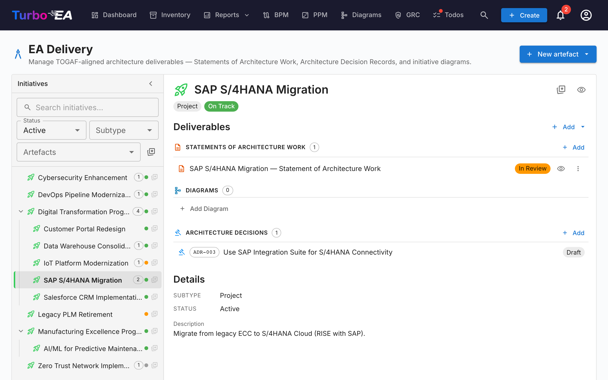

# EA 交付

**EA 交付**模块管理**架构项目及其工件** —— 图表和架构工作说明书（SoAW）。它提供所有正在进行的架构项目及其交付物的统一视图。

## 项目概览

页面围绕**项目**卡片组织。每个项目显示：

| 字段 | 描述 |
|------|------|
| **名称** | 项目名称 |
| **子类型** | 创意、计划、项目或史诗 |
| **状态** | 正常、有风险、偏离、暂停或已完成 |
| **工件** | 关联的图表和 SoAW 文档数量 |

您可以在**卡片库**视图和**列表**视图之间切换，并按状态（活跃或已归档）筛选项目。

点击项目可展开显示其所有关联的**图表**和 **SoAW 文档**。

## 架构工作说明书（SoAW）

**架构工作说明书（SoAW）** 是 [TOGAF 标准](https://pubs.opengroup.org/togaf-standard/)（开放组架构框架）定义的正式文档。它确定了架构参与的范围、方法、交付物和治理。在 TOGAF 中，SoAW 在**准备阶段**和**阶段 A（架构愿景）** 期间产生，作为架构团队与其干系人之间的协议。

Turbo EA 提供内置的 SoAW 编辑器，具有 TOGAF 对齐的章节模板、富文本编辑和导出功能 —— 因此您可以直接在架构数据旁边编写和管理 SoAW 文档。

### 创建 SoAW

1. 在项目中点击 **+ 新建 SoAW**
2. 输入文档标题
3. 编辑器打开并显示基于 TOGAF 标准的**预构建章节模板**

### SoAW 编辑器

编辑器提供：

- **富文本编辑** —— 完整的格式工具栏（标题、粗体、斜体、列表、链接）由 TipTap 编辑器驱动
- **章节模板** —— 遵循 TOGAF 标准的预定义章节（例如问题描述、目标、方法、干系人、约束、工作计划）
- **行内可编辑表格** —— 在任何章节中添加和编辑表格
- **状态工作流** —— 文档通过定义的阶段进展：

| 状态 | 含义 |
|------|------|
| **草稿** | 正在编写，尚未准备好审核 |
| **审核中** | 已提交供干系人审核 |
| **已批准** | 已审核并接受 |
| **已签署** | 正式签署确认 |

### 签署工作流

SoAW 被批准后，您可以请求干系人签署。系统跟踪谁已签署并向待签署人发送通知。

### 预览和导出

- **预览模式** —— 完整 SoAW 文档的只读视图
- **DOCX 导出** —— 将 SoAW 下载为格式化的 Word 文档，用于离线共享或打印

## 架构决策记录（ADR）

**架构决策记录（ADR）** 记录重要的架构决策及其背景、后果和考虑过的替代方案。ADR 提供了关键设计选择背后原因的可追溯历史。

### ADR 概览

EA 交付页面有一个专用的**决策**选项卡，列出所有 ADR。每个 ADR 显示：

- 参考编号（自动生成：ADR-001、ADR-002 等）
- 标题
- 状态（草稿、审核中、已签署）
- 关联的项目
- 签署人及其状态

您可以按状态筛选，并按标题或参考编号搜索。

### 创建 ADR

1. 导航到 **EA 交付** → **决策**选项卡
2. 点击 **+ 新建 ADR**
3. 填写标题并可选择关联一个项目
4. 编辑器打开并显示背景、决策、后果和考虑的替代方案等章节

### ADR 编辑器

编辑器提供：

- 每个章节的富文本编辑（背景、决策、后果、考虑的替代方案）
- 项目关联
- 卡片关联 —— 将 ADR 连接到相关卡片（应用程序、IT 组件等）
- 相关决策 —— 引用其他 ADR

### 签署工作流

ADR 支持正式的签署流程：

1. 以**草稿**状态创建 ADR
2. 点击**请求签名**并选择签署人
3. ADR 转为**审核中** —— 每位签署人收到通知和任务
4. 签署人审核并点击**签署**
5. 当所有签署人都已签署后，ADR 自动转为**已签署**状态

已签署的 ADR 被锁定，无法编辑。要进行更改，请创建**新修订版**。

### 修订

已签署的 ADR 可以修订：

1. 打开已签署的 ADR
2. 点击**修订**以基于已签署版本创建新草稿
3. 新修订继承内容和卡片关联
4. 每次修订都有递增的修订编号

### ADR 预览

点击预览图标查看 ADR 的只读格式化版本 —— 在签署前进行审查时非常有用。

## 资源选项卡

卡片现在包含一个**资源**选项卡，整合了以下内容：

- **架构决策** —— 与此卡片关联的 ADR
- **文件附件** —— 上传和管理文件（PDF、DOCX、XLSX、图片，最大 10 MB）
- **文档链接** —— 基于 URL 的文档引用
